# 线性回归 A-Z(使用汽车价格预测数据集)

> 原文：<https://medium.com/analytics-vidhya/linear-regression-a-z-using-car-price-prediction-dataset-e32b50c7a561?source=collection_archive---------2----------------------->

线性回归是一种用直线解释因变量(Y)和一个或多个解释变量(X)之间关系的方法。这是回归分析的一个特例。线性回归是第一种被严格研究的回归分析。

如果用于正确的问题，这是一个最简单但非常强大的算法。

我们会看看这个算法的方方面面:
1。**使用线性回归的条件**
2。**假设**
3。**目标**目标
4。**方程**为线性回归
5。**推断**不同型号**输出**
6。**评估**模型

我们将使用“**汽车价格预测**”数据集来研究所有这些概念**(实际上是**)。

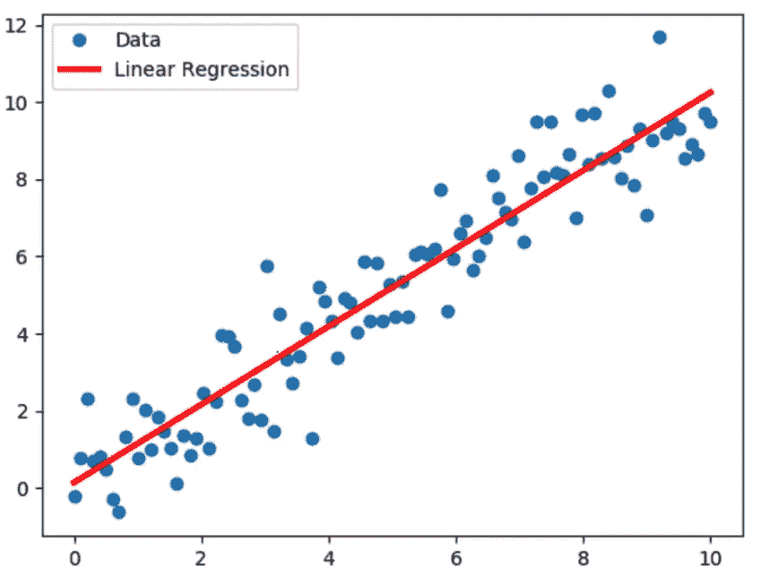

线性回归

> 1.**使用线性回归的强制条件**。

*   目标变量“Y”应该是连续的数字。

> 2.**假设**为线性回归。
> * **注意** *:这些并不是硬性的规则，只是一些假设，这些假设将表明模型的一切都很好。

*   **假设 1 :** 自变量“X”与因变量“Y”之间存在线性关系。
*   **假设 2 :** 自变量“X”之间的最小共线性。
*   **假设 3 :** 误差项呈正态分布，它们之间没有模式。
*   **假设 4 :** 同方差:-回归线周围的方差对于所有自变量“X”都是相同的。

一旦我们根据我们的数据建立了模型，我们将检查所有这些假设。现在让我们从数据集开始。

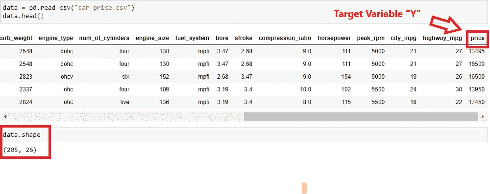

*   正如我们所见，数据集由 205 行和 26 列组成。
    列“**价格**”是我们的**目标变量(Y)** 和 25 列，如燃料类型、轴距、发动机类型等，它们给出了汽车各种属性的信息。

> **这样我们的初始条件就满足了，因为我们的目标变量是数值型的、连续的**我们可以向前推进，对它进行线性回归。

> **准备数据**

执行数据清理和准备，为线性回归准备数据。数据有一些问题，例如:有过一些**古怪的性格“？”**在某些栏目中，需要查找和删除。
2。处理**缺失值** :-使用中位数估算数字列，使用 Mode 估算分类列。
3。**将**列转换为**正确的数据类型** :-具有“？”的列最初是 int，但是由于这个奇怪的字符，它们被作为 Object 出现。
4。**标记编码器** :-使数据数值化。
5。**训练和测试中的取样**

**我不会在这里解释它们，我们将只关注线性回归。但是，请找到该笔记本的链接，其中解释了所有这些步骤。**

由于我们的数据已经过预处理并为模型做好了准备，让我们检查一些**假设**:

> **假设 1** :自变量“ **X** ”与因变量“ **Y** ”之间存在**线性关系**。我们将使用 Python 提供的 Corr()方法来检查这一点。

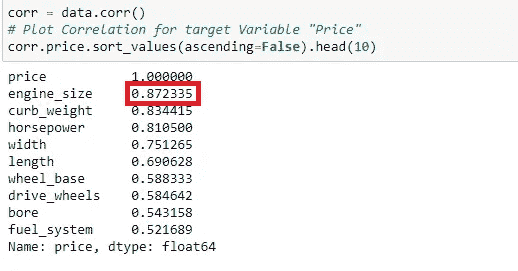

X 和 Y 之间的相关性

这里突出显示的单元格显示了引擎大小和价格之间的关系。同样，我们可以看到不同 X 变量与 Y 变量之间的相关性，即价格。我们可以看到，大部分 X 与 Y 相关，即它们具有线性关系，所以我们可以认为这个假设是满足的。

> **假设 2** :自变量“X”间最小**多重共线性**。

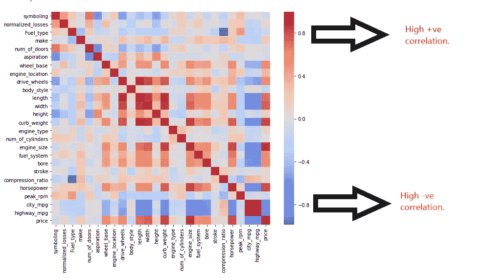

所有变量的相关矩阵。

从图中我们可以得出结论，在我们的 X 变量中不存在多重共线性的问题。所以这个假设也成立。

**假设 3 和 4 可以在我们建立模型后检查，所以让我们继续建立模型。现在让我们只计算误差并检查假设。在此之后，我们将研究模型性能验证。**

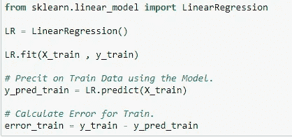

训练模型、预测和计算误差的标准步骤。

> **假设 3** : **错误项呈正态分布**且其中没有**模式**。

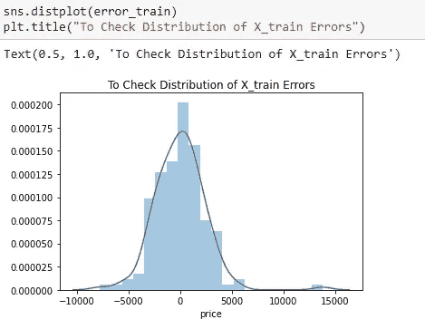

检查误差分布。

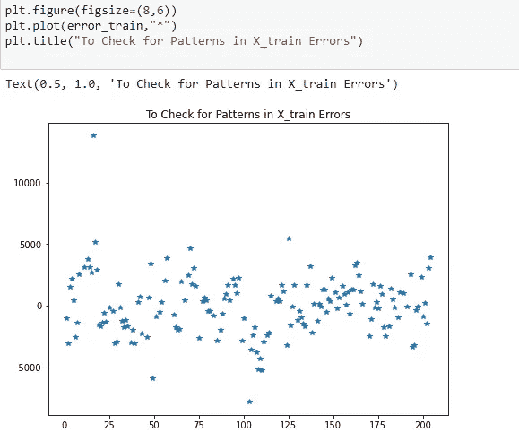

检查错误中的任何模式。

这个分布看起来是正态的，不完美，但是足够好了。
错误中似乎也没有任何模式。有一些异常值，但我已经在笔记本中处理了它们，如果有兴趣，请参考相同的内容。
所以我们可以说**假设 3 是满足的。**

> **假设 4** : **同方差**:回归线周围的方差对所有自变量“X”都相同。

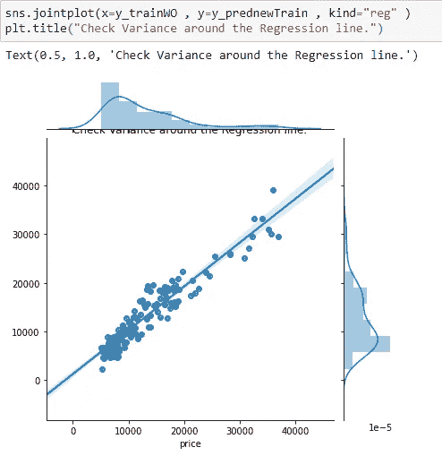

检查回归线周围的方差。

蓝色高亮显示的是线周围的差异，有一些差异，但这是很好的，因为模型不会是完美的。所以，我们可以说**假设 4** 得到了满足。

由于所有的假设现在都是真的，我们可以自信地说，线性回归将在给定的数据集上表现良好！！

> 现在，让我们后退一步，看看线性回归到底是什么，方程**、**目标**以及如何推断模型输出。**

**我一直等到现在，而不是更早，因为现在我们的模型已经准备好了，我们可以研究我们模型的理论和实际输出，并真正理解正在发生的事情。**

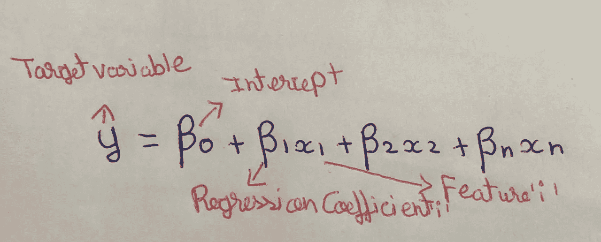

多元线性回归方程

*   **- Y** :目标变量。
    -**0**:线的截距。
    -**0**:回归系数。
    - **Xi** :输入特征。
*   **“I”表示“Xi”的 1 个单位的变化对目标变量“Y”的影响有多大。**

主要**目标**如果找到**0，i** 即**最佳拟合回归线**。
最佳拟合回归线就是误差最小的**线**。

这里使用的**误差函数**是 **MSE(均方误差):** -
(误差=实际-预测)

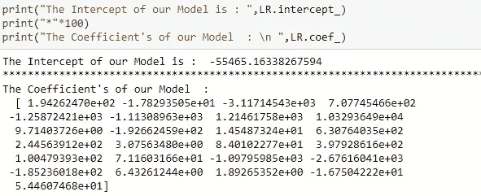

从模型中查找**0，i** 。

我们已经使用了我们的模型，并得到了最佳拟合线。并且从中可以看出:-
**0**:-55465.16338267594
**1**:1.94262470 e+02σ2:-1.78293505 e+01σ3:-3.11714543 e+03…n

我们可以用这条回归线:
**y =-55465.16338267594+1.94262470 e+02 * x1+-1.78293505 e+01 * x2**预测**新值**..+ 5.44607468e+01*xn。**
同:**y = 0+1 . x1+2 . x2+…..+n . xn****

> 我们现在处于最后一步，即**评估**模型。
> 
> **R** - **平方:-** 评价车型最重要的一个方面**。**

**R** - **平方:**它度量的是一个线性回归模型中你的因变量(Y) **由你的自变量(X)解释**的变化比例。

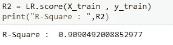

**R** - **广场为我们的模型。**

这里的**R**-**square =**0.9090492008852977。我们这样理解是因为我们的模型能够解释“Y”变量引起的 90%的变化。

**关于 R-square 的问题**:即使我们在模型中加入无关紧要的“X”变量，R-square 的得分也会增加。
**举例**:如果增加一个变量“ **Colour_of_car** ”，预测一辆车的**里程**。理想情况下，这不会对**里程**产生任何影响，但在添加该变量后，R 平方得分仍会增加。使用**调整后的 R** - **平方**来克服这个问题。

> **调整后的 R** - **平方:-** 基于模型中自变量数量的得分。

**调整后的 R** - **方形**与 **R** - **方形**讲述的是同样的事情，但是会对模型进行惩罚，如果有无关紧要的特征添加到模型中。因此克服了 **R** - **方面临的问题。**

```
Adjusted R-Square :  0.8920807682146443
```

由于 **R** - **正方形和调整后的 R** - **正方形**非常接近，这意味着我们的模型实际上没有任何无关紧要的特征。所以这是一件好事。

> **结论**

*   我在这里的主要目的是解释线性回归的不同方面，从模型构建的角度来看，还涉及到更多的步骤。你可以在这里的笔记本上查阅它们。
*   如有任何疑问/反馈，请给我写信:darekarabhishek@gmail.com

