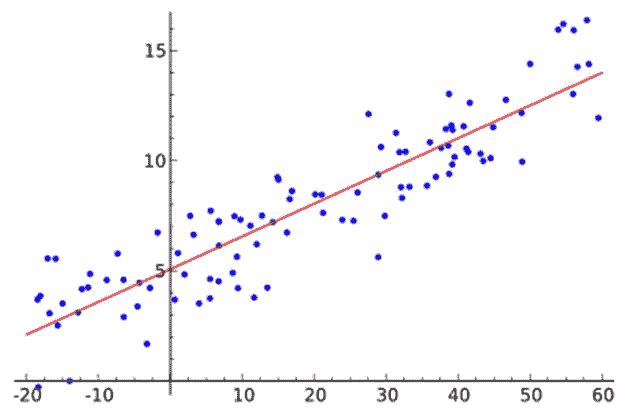
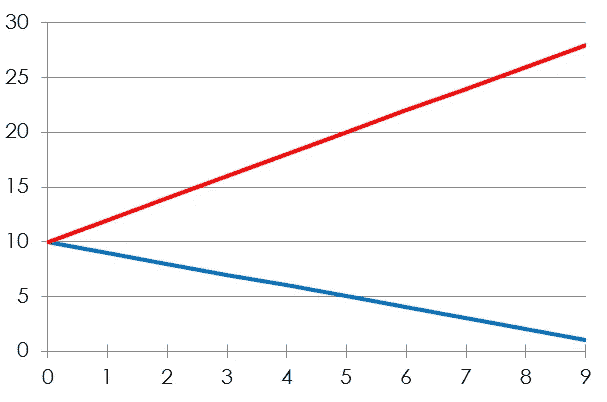
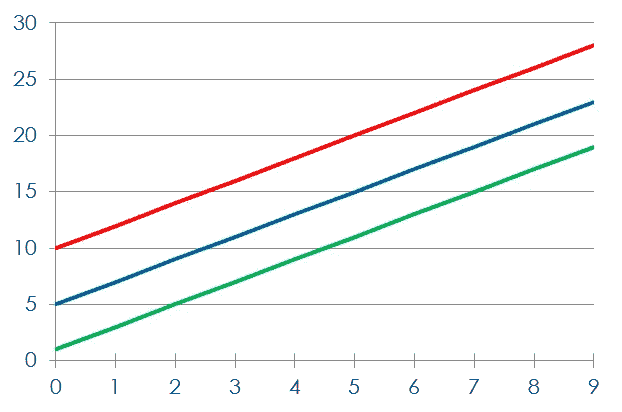
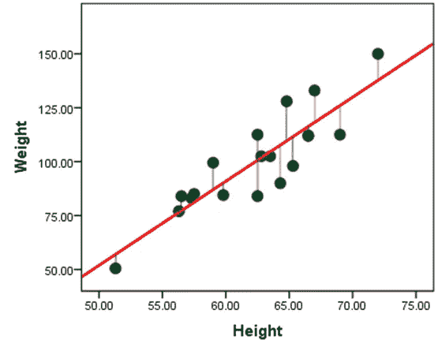
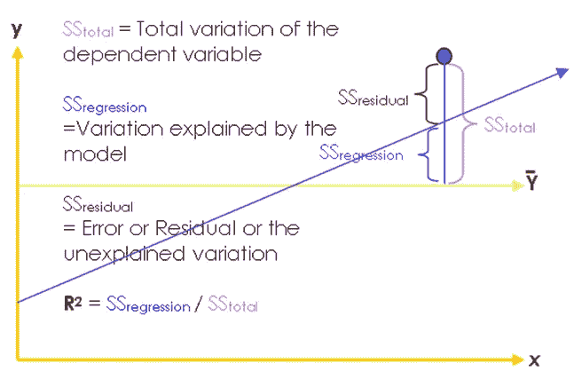
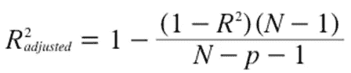
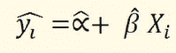
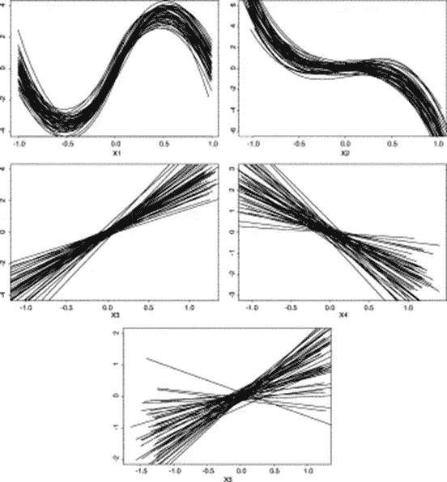
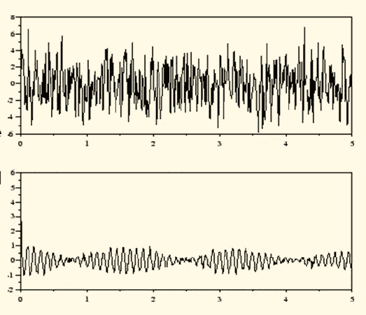

# 线性回归

> 原文：<https://medium.com/analytics-vidhya/linear-regression-b0d533614f5c?source=collection_archive---------7----------------------->

在回归分析中，我们用一个预测模型来拟合我们的数据，并使用该模型从一个或多个自变量中预测因变量的值。

简单回归寻求从单个预测变量预测结果变量，而多重回归寻求从几个预测变量预测结果。我们可以使用下面的通用等式来预测任何数据:

(结果)i =(模型)i +(误差)I

我们这里适合的模型是线性模型。线性模型只是指基于直线的模型。你可以把它想象成试图用一条直线来概括一个数据集。

直线的一些重要特征

直线可以由两个东西来定义:

1)线(b1)的斜率或梯度

2)直线与图形纵轴相交的点，也称为直线的截距(b0)。所以我们的一般方程变成:Yi = (b0 + b1Xi) + εi

这里易是我们要预测的结果，是预测变量的第 I 个分数。截距 b0 和斜率 b1 是模型中的参数，称为回归系数。有一个剩余项εi，它代表由直线预测的分数与因变量的第 I 个实际分数之间的差值。这个术语证明了这样一个事实，即我们的模型不会完全符合收集到的数据。通过回归，我们努力找到最能描述数据的直线。

相同的截距，但不同的斜率

相同的斜率，但不同的截距

**相关和回归之间的差异**

相关性分析关注的是了解变量之间是否存在关系以及这种关系有多强。回归分析关注的是找到一个表示变量之间关系的公式，以便从一个变量的值中找到另一个变量的近似值。

简单线性回归的假设

1.自变量和因变量之间的单线性可以用线性回归来表示。

2.独立变量本质上必须是非随机的，即变量没有任何相关的分布。

3.模型的参数必须是线性的。

4.独立变量不应与误差项相关。

5.误差项必须相互独立，即一个误差项的出现不应影响其他误差项的出现。

**最小二乘法**

最小二乘法是找到最符合数据的直线的一种方法。在所有可能画出的线中，最佳拟合的线是观察到的数据点和线之间差异最小的线。

该图显示，当任何一条线与一组数据拟合时，该线与实际数据之间会有微小的差异。我们对直线和实际数据之间的垂直差异感兴趣，因为我们使用直线从 x 的值预测 Y 的值。这些差异中有些是正的(它们在线上，表明模型低估了它们的值)，有些是负的(它们在线下，表明模型高估了它们的值)。

**了解拟合优度**

统计模型的拟合优度描述了它与一组观察值的拟合程度。拟合优度的测量值通常总结了观察值和模型预期值之间的差异。

在线性回归中，拟合是通过 R2 表示的，除了 R2，还有另一种拟合优度的衡量标准，称为调整后的 R 平方。简单地通过在模型中包括越来越多的预测值，可以使回归的 R2 值任意高。调整后的 R2 考虑了模型中独立变量的数量。

**从样本到人群**

像其他统计方法一样，使用回归，我们试图从样本中发现因变量和自变量之间的关系，并试图对总体进行推断。这就是线性回归中的显著性检验。

估计线的等式为:

这里α和β分别是截距和斜率的估计值。显著性检验与这两个估计值相关。

**估计参数的显著性检验**

**全局测试**

H0: 所有参数同时等于零

**H1:** 至少有一个非零值

这个测试是通过使用与我们在 ANOVA 中看到的相似的 F 统计来进行的。

**本地测试**

对于每个单独的参数，

**H0:** 参数值为零

**H1:** 该值不为零

该测试通过使用类似于单样本 t 检验的 t 统计来进行。

对于简单的线性回归，全局测试和局部测试没有区别，因为只有一个独立变量。

**多元线性回归**

多元线性回归(MLR)基本上是简单线性回归的扩展。一元线性回归只有一个解释变量，而多元回归考虑一个以上的自变量来解释因变量。所以从现实的角度来看，MLR 比简单的线性回归更有吸引力。举个例子，

(工资)i = a + b1(学历)i + b2(经验)i + b3(生产力)i + b4(工作经验)i + (e)i

**假设**

1.因变量和自变量之间的关系是线性的。散点图应作为回归分析中的探索步骤进行检查，以确定可能偏离线性的情况。

2.误差与独立变量无关。在残差分析中，用残差与单个预测值的散点图来检验这一假设。

3.残差的期望值为零。这不是问题，因为估计回归方程的最小二乘法保证平均值为零。

4.残差的方差是常数。违反的一个例子是其分散(方差)随时间增加的残差模式。这种假设的另一个方面是，误差方差不应该随着预测值的大小而系统地变化。例如，预测值较大时的误差方差不应大于预测值较小时的误差方差。

5.残差是随机的或在时间上不相关的。

6.误差项是正态分布的。要使回归方程的系数和其他统计数据的显著性的常规检验有效，必须满足这一假设。

**多重共线性的概念**

回归模型中的预测因子通常被称为“独立变量”,但这个术语并不意味着预测因子本身在统计上是相互独立的。事实上，对于自然系统来说，预测因子可能是高度相关的。――多重共线性是一个术语，用于描述预测变量间相关性较高的情况。已经注意到，估计的回归系数的方差取决于预测值的相互关系。

然而，多重共线性不会使回归模型无效，因为只要预测是基于用于校准方程的同一多元空间内的预测因子组合，方程的预测值可能仍然是好的。但是多重共线性也有一些负面影响。首先，回归系数的方差可能被夸大得太多，以至于单个系数在统计上不显著，即使总的回归方程很强，预测能力也很好。第二，系数的相对大小甚至符号都可能无法解释。第三，单个回归系数的值可能会随着方程中预测变量的删除或添加而彻底改变。事实上，系数的符号甚至可能改变。

**多重共线性的迹象**

1.预测变量对之间的高度相关

2.回归系数，其符号或数值没有很好的物理意义

3.重要预测因子的统计非显著回归系数

4.回归系数的符号或大小对预测变量的插入或删除的极端敏感性

什么是 VIF？

方差膨胀因子(VIF)是一种统计数据，可用于识别预测变量矩阵中的多重共线性。――方差膨胀‖这里指的是上述多重共线性对估计回归系数方差的影响。多重共线性不仅取决于预测因子对之间的二元相关性，还取决于任何一个预测因子相对于其他预测因子的多元可预测性。因此，VIF 基于所有其他预测因子的多元线性回归中每个预测因子的多重决定系数:

VIFi = 1/(1 — Ri2)

其中 Ri2 是第 I 个预测因子对所有其他预测因子的回归中的多重决定系数，VIFi 是与第 I 个预测因子相关的方差膨胀因子。请注意，如果第 I 个预测值独立于其他预测值，则方差膨胀因子为 1，而如果第 I 个预测值可以从其他预测值中几乎完美地预测出来，则方差膨胀因子接近无穷大。在这种情况下，估计回归系数的方差是无界的。当一个或多个预测值的方差膨胀因子变大时，多重共线性被认为是一个问题。它看起来有多大是一个主观判断。一些研究者使用 VIF 5，其他人使用 VIF 10 作为临界阈值。VIF 与一个叫做公差的统计密切相关，公差是 1/VIF。

**残差分析**

残差分析包括检查回归残差的图表和统计数据，以检查模型假设是否得到满足。下面列出了一些常用的残差检验。所有这些都是为了检验误差项是否同分布。

1.  **残差时间序列图:**残差时间序列图可以表示残差的非常方差、残差的趋势或自相关等问题。
2.  **残差与预测值的散点图:**假设残差与预测值不相关。散点图中一些明显的相关性模式表明了违规。
3.  **残差与单个预测值的散点图:**残差被假定为与单个预测值不相关。散点图中的一些明显的相关性模式将表明这些假设的违反，并可能表明预测值的转换。
4.  **残差直方图:**残差假设为正态分布。因此，残差直方图应该类似于正态概率密度函数曲线。
5.  **残差的滞后-1 散点图:**该图也涉及残差独立性的假设。时间 t 的残差应该独立于时间 t-1 的残差。因此，散点图应该类似于一个无形的点群。

**自相关的观念**

自相关是给定时间序列与其自身在连续时间间隔内的滞后版本之间相似程度的数学表示。这与计算两个不同时间序列之间的相关性是一样的，只是同一时间序列会被使用两次，一次是以其原始形式，另一次是滞后一个或多个时间段。

计算自相关以检测数据中的模式。在图表中，第一个系列是随机的，而第二个系列显示了模式。

**德宾-沃森(D-W)统计**

Durbin-Watson (D-W)统计测试残差的自相关，特别是滞后 1 自相关。D-W 统计根据正一阶自相关的替代假设检验无一阶自相关的零假设。替代假说也可能是负一阶自相关。假设残差遵循一阶自回归过程

et = pet-1+ nt

其中 nt 是随机的，p 是残差的一阶自相关系数。如果检验的是残差的正自相关，那么 D-W 检验的假设可以写成 H0: p = 0 对 H1: p > 0

D-W 统计量由 D =σ(ei—ei-1)2/σei2 给出

可以看出，如果残差遵循一阶自回归过程，则 d 与一阶自相关系数 p 相关，因为 d = 2 (1 — p)。

上述等式意味着

如果没有自相关(p = 0 ), d = 2

如果一阶自相关为 1，d = 0

如果一阶自相关为-1，d = 4

# 参考

# 学术文献

*   [博什纳科夫，2011 年] G .博什纳科夫。 [*关于随机系数模型的一阶和二阶平稳性*](http://www.maths.manchester.ac.uk/~goran/research-reports/psrr03-2009.pdf) 。线性代数应用 434，415–423。2011.
*   [Breitung，2002 年] [*单位根与协整的非参数检验。*](https://pdfs.semanticscholar.org/e31b/c65824cc156d43d25b6ece0e9613b398233d.pdf) 《计量经济学杂志》，108 卷 2 期，第 343–363 页。
*   [达尔豪斯，2012 年]达尔豪斯河(2012 年)局部平稳过程。在*统计手册*(第 30 卷，第 351-413 页)中。爱思唯尔。
*   【Nason，2006】[Nason，GP](https://research-information.bristol.ac.uk/en/persons/guy-p-nason(c22adede-c5fc-4692-9b91-24afa15868b6).html) 2006，[平稳与非平稳时间序列](https://research-information.bristol.ac.uk/en/publications/stationary-and-nonstationary-time-series(c0005c54-b407-414e-944c-92fca5df2a2b).html)。在 H Mader & SC Coles(编)*火山学中的统计学。*地质学会，第 129–142 页。
*   [Vogt，2012 年] Vogt，M. (2012 年)。局部平稳时间序列的非参数回归。*统计年鉴*， *40* (5)，2601–2633。
*   古吉拉特语，基本计量经济学，第 5 版，塔塔麦格劳-希尔
*   使用 SPSS 发现统计数据，第二版，Sage 出版物
*   Hair，j .，Anderson，r .，巴宾，b.《多元数据分析》,第 7 版，普伦蒂斯霍尔
*   n . k . malhotra，Dash，s,《营销研究:应用导向》,第 5 版，培生教育
*   Rud，O. P,《数据挖掘食谱:营销、风险和客户关系管理的建模数据》, John Wiley & Sons，2000 年