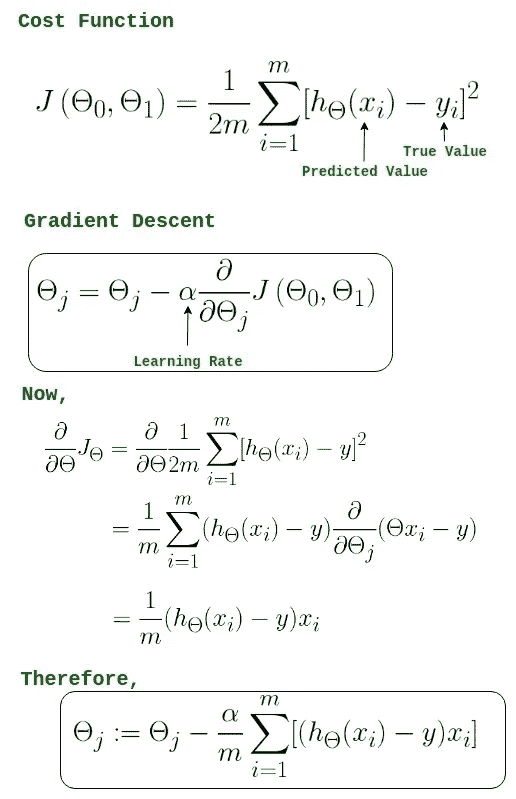

# 线性回归

> 原文：<https://medium.com/analytics-vidhya/linear-regression-c6625caf9e8e?source=collection_archive---------22----------------------->

> 单个和多个因变量


回归基本上意味着当你想预测一个连续的数据。回归分析是预测建模技术的一种形式，它研究因变量和自变量之间的关系。


当对自变量集合𝐱 = (𝑥₁，…，𝑥ᵣ)上的某个因变量𝑦实施线性回归时，其中𝑟是预测值的数量，您假设𝑦和𝐱: 𝑦之间存在线性关系=θ₀+θ+θ。这个方程就是**回归方程**。θ₀、θ₁、…、θᵣ为**回归系数**，𝜀为**随机误差**。

这是一种监督学习的形式，因为出于训练目的，我们将得到 x 和 y。

> 例如，我们希望在给定学生学习时间(单一特征)的情况下预测他们的分数，或者在给定许多特征(如面积、离市场的远近、医院和许多其他特征)的情况下预测房价。


我们的任务是在给定大量数据点的情况下找到最佳拟合线。等式 ***y=mx+c*** 其中 **y 是我们的因变量**，它将借助于**自变量即 x 进行预测**这里，我们的梯度/斜率表示为 m - *是 x 沿直线单位变化的 y 变化，截距表示为 c* *是直线与 y 轴相交点处的 y 值。*

我们如何学习参数？

*   我们使用训练数据来训练我们的模型
*   然后我们学习一种算法或假设
*   利用这个假设，我们完成了预测的目标。

How 可以是选择最佳路线吗？

**可能有许多可能的线，并且每条线将具有不同的θ。**

> θ=[ θ₀ θ₁ ……θᵣ]其中，θ₀为 c(截距)，θ₁为 m(斜率)，其他θ值用于其他要素。

最佳拟合可以通过减少误差(损失)来获得，误差可以通过预测点和实际点之间的差异来测量。


我们可以用均方差来求成本函数。

所以，我们的任务将是减少这个误差(损失)函数。我们用 J(θ)来表示。

# 梯度下降

我们将使用梯度下降法来最小化 J(θ)。一般来说，当我们想找到最小点时，我们会找到函数的导数。所以用简单的语言来说，梯度下降就是寻找最小值的迭代方法。

> **梯度下降**是一种寻找可微函数局部极小值的一阶迭代优化算法。其思路是在当前点的函数的**梯度**(或近似**梯度**)的反方向重复步进，因为这是**最陡下降**的方向。


所以我们将取一个*学习率，它是步长* **α** (它是一个常数)，并继续减去它，直到我们达到最小值。在我们达到最小值之后，偏导数将变为零。当函数是凸的时，初值无关紧要。而在非凸函数中，初值也会起作用。



来源:GeeksForGeeks

程序:

1.  随机初始化θ，或者我们可以用 0 来初始化
2.  不断更新θ，直到我们得到最佳拟合。
3.  应用梯度下降，得到θ
4.  应用假设获得预测值。

```
def hypothesis(x,theta):
    y_ = 0.0
    n = x.shape[0]
    for i in range(n):
        y_ += (theta[i]*x[i])
    return y_def error(X,y,theta):
    e=0.0
    m = X.shape[0]

    for i in range(m):
        y_ = hypothesis(X[i],theta)
        e += (y[i] - y_)**2
    return e/mdef gradient(X,y,theta):
    m,n = X.shape
    grad = np.zeros((n,))
    # for all values of j
    for j in range(n):
        # sum over all examples
        for i in range(m):
            y_ = hypothesis(X[i],theta)
            grad[j] += (y_ - y[i])*X[i][j]
    # out of loops
    return grad/mdef gradient_descent(X,y,learning_rate=0.1,max_epochs=300):
    m,n = X.shape
    theta = np.zeros((n,))
    error_list = []

    for i in range(max_epochs):
        e = error(X,y,theta)
        error_list.append(e)

        # Gradient Descent
        grad = gradient(X,y,theta)
        for j in range(n):
            theta[j] = theta[j] - learning_rate*grad[j]
    return theta,error_list
```

> 这个方法相当慢！！我们可以通过在代码中进行矢量化来改善这一点。

```
def hypothesis(X,theta):
    return np.dot(X,theta)def error(X,y,theta):
    error =0.0
    y_ = hypothesis(X,theta)
    m = X.shape[0]
    error = np.sum((y-y_)**2)

    return error/m
def gradient(X,y,theta):
    y_ = hypothesis(X,theta)
    grad = np.dot(X.T,(y_-y))
    m = X.shape[0]

    return grad/mdef gradient_descent(X,y,learning_rate=0.1,max_iter=300):
    n = X.shape[1]
    theta = np.zeros((n,))
    error_list = []

    for i in range(max_iter):
        e = error(X,y,theta)
        error_list.append(e)

        # Gradient Descent
        grad = gradient(X,y,theta)
        theta = theta - learning_rate*grad

    return theta,error_list
```

这里我们执行相同的操作，但是使用 numpy 函数来提高代码的速度。

# R2 分数

> 什么是线性模型的拟合优度？— R2Score

r 平方是数据与拟合回归线接近程度的统计度量。它也被称为决定系数，或多元回归的多重决定系数。


r 平方始终介于 0 和 100%之间:

*   0%表示该模型不能解释响应数据在其平均值附近的任何可变性。
*   100%表示模型解释了响应数据围绕其平均值的所有可变性。

```
def r2Score(y,y_):
 num = np.sum((y-y_)**2)
 deno = np.sum((y-y.mean())**2)
 score = (1-num/deno)
 return score*100
```

一般来说，R 平方越高，模型就越符合您的数据。

希望这篇文章给你解释了大部分的线性回归。