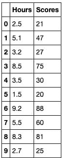
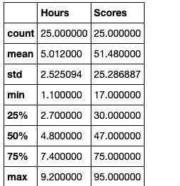
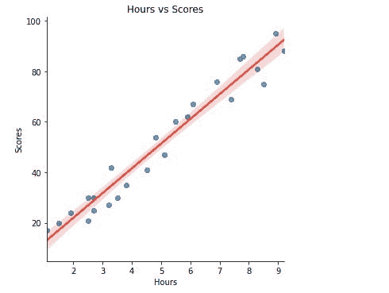
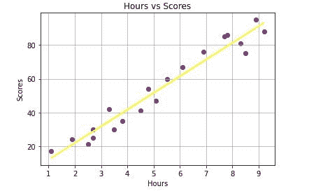
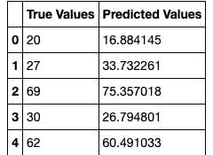
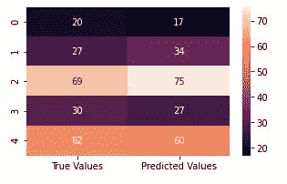
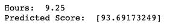

# 线性回归

> 原文：<https://medium.com/analytics-vidhya/linear-regression-ea7d1ad22a86?source=collection_archive---------10----------------------->

线性回归是一种算法，用于可视化两个变量之间的关系。该算法中使用的两个变量是自变量和因变量。

**自变量**是不受其他变量影响的变量。当对这一变量进行调整时，因变量的水平将会波动。

**因变量**是正在研究的变量，也是回归模型试图预测的变量。

作为因变量的输入变量(X)和作为自变量的目标变量(Y)之间的关系通过穿过图中的点画一条线来描绘。该线表示最佳描述 X 和 Y 之间关系的函数，最终目标是找到最佳“回归线”，或最佳拟合线。

y(x) = w0 + w1 * x

**其中:**

w =模型参数。

我将在这个项目中演示一个简单的线性回归。

# 背景:

通过学生学习的小时数来确定学生成绩的相关性。

**相关方:**

对本项目感兴趣的股东包括:学校管理者、教育部和学生。

# 数据:

数据包含每个学生的学习小时数和他们各自的分数。

根据统计资料，平均工作时间为 5 小时。0，平均得分为 51.5 分

**可视化:**

使用 lm plot(seaborn 的一种可视化风格)来显示数据集的外观。

# 模型构建:

使用来自 scikit-learn 的线性回归来建立和训练该模型，该模型使用 80%训练和 20%测试的参数分割数据集，随机状态为 0。

训练之后，我将模型的预测可视化

在实际值和预测值之间进行比较并检查它们的相关性。

用一个学习了 9.25 小时的学生的分数来测试我的模型的预测。

**平均绝对误差:**

这是测量两个连续变量之差的结果。这种测量是通过取每个误差的绝对值并得到其平均值来完成的。

对于我的项目，MAE 是 4.183

**均方误差:**

这是估计值和实际值之差的平均值。这是通过取数据的原始值和预测值之差的平方的平均值来计算的。

对于我的项目，MSE 是 21.60，这是相当高的。

**均方根误差:**

这是对数据集进行预测时出现的误差的标准偏差。

我的项目有 2.05 的 RMSE

最后，我的模型的预测准确率为 95%。

# 结论:

这是我参与的一个项目。这个项目的代码可以在[我的回购](https://github.com/Nwosu-Ihueze/Score_prediction_by_hour/blob/main/hour_vs_score.ipynb)中找到，你可以在 [LinkedIn](https://www.linkedin.com/in/rosemary-nwosu-ihueze/) 上与我联系。非常感谢所有的建议、更正和推荐。感谢您的阅读。