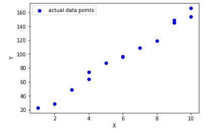

# 线性回归—您需要知道的一切

> 原文：<https://medium.com/analytics-vidhya/linear-regression-everything-you-need-to-know-b4b7a1f8a409?source=collection_archive---------5----------------------->

每当我们谈论线性回归时，我们总是谈论找到数据的最佳拟合线，这正是线性回归的目标，但它不仅仅是拟合直线，所以让我们谈谈为什么以及如何找到最佳拟合线。

# **为什么需要找到最佳拟合线？**

顾名思义，该算法对遵循线性趋势的数据进行处理，因此，如果我们可以找到一条可以正确定义数据趋势的线，我们就很可能使用同一条线来定义整个数据集，因此，使用同一条线，我们甚至可以获得数据集中不存在的点的值，这称为预测。

# **下一个问题是，我们如何找到这条最佳拟合线？**

看看下面的数据集，很明显，它遵循一个线性趋势。
因此，仅仅通过查看数据集，我们就可以找到任何一点的输出，是的，我们可以，但现实世界的数据并不容易解释，在这些情况下，我们可以依靠算法的底层数学来找到可以理解数据趋势并适应它的线。

**图 1**

让我们看一下图 1 所示的数据。X 和 Y 之间有线性关系，如果这种关系是线性的，那么一定有一条线来定义这种关系。众所周知，直线的方程是 Y = M*X + C，我们可以很容易地将这个方程与我们的图 1 联系起来，其中 X 是数据集，Y 是目标变量(我们必须找到它的值)，但什么是 M 和 C 呢？这些是用于创建直线的参数，其中 M 是直线的斜率，即直线与 X 轴的倾斜度，C 是截距，即直线与 Y 轴相交的点。

**我们的目标是找到最能描述数据的直线，**这可以使用我们手头的数据来完成，我们使用这些数据来找到趋势，然后使用直线来概括这个趋势，并使用这条直线来预测 x 的未知值。

**先来了解一下算法是怎么开始的。**
该算法做的第一件事是输出一条随机生成的线，即输出 M 和 C 的一些随机值，并使用这些值创建一条线。

现在，我们来衡量这条线定义数据或拟合数据的程度。

结果是，它在描述 X 和 y 之间的关系时表现得很差，但是这条线表现得有多好呢？为了测量这一点，我们需要一个数值来告诉我们这条线与数据拟合的好坏。

假设我们找到了实际数据点之间的距离，以及对于某个 X 值，直线距离该数据点有多远，简单地说，计算它们之间的距离，如果距离更小，那么我们可以说直线很好地定义了数据。

但是我们需要用什么条件来找到这个距离，我们的目标是能够预测 X 的某个值，让我们用同样的方法，找到直线和数据点的 Y 坐标，然后找到这两者之间的距离。基于这一逻辑，我们可以将等式写成如下:

其中 Y-Hat 是线上的点，Y 是某个 X 值的实际数据点，这个等式也可以称为误差。

但这只是描述了一个数据点，如果另一个数据点的线非常远，假设我们对所有数据点进行相同的计算，然后对输出求和并取该值的平均值，我们就可以得到一个数字来描述我们定义的系统的综合误差。从而获得下面的等式，其中 n 是数据点的数量:

现在，如我们所见，目标是将直线与数据拟合，因此直线将穿过数据，在这种情况下，许多数据点将位于直线下方，这将为(Y-Yhat)计算提供负值，如果我们将所有正值和负值相加，结果有可能非常接近 0，等等，什么！这意味着误差很小，线条很好，但事实并非如此。我们需要处理这件事。

让我们做一件事，在添加单个误差值之前，我们取它们的平方。因此，我们的等式将变成:

现在我们不会得到任何负值，但为什么我们要取一个平方，而不仅仅是误差的模，因为这样当数据点离线非常远时，我们会得到更高的误差项值，因此如果线离点非常远，会增加更多的惩罚。

所以，我们现在有一个完美的术语来描述系统的综合误差，我们可以称这个术语为损失函数。

现在，非常清楚的是，如果直线与数据吻合，误差项将会非常小，因此，如果我们以某种方式找到减少误差的方法，我们可能会找到完美的直线。这正是我们的下一个目标。

但是我们如何找到，误差项和直线的关系。我们是否可以说这条线完全依赖于 M 和 C，如果我们减少或增加 M 和 C，这条线就会改变，如果是这样，那么一定存在 M 和 C 的某个值，对于这个值，我们将得到一条误差最小的线。但是我们如何知道 M 和 C 的值是最优的，为了回答这个问题，让我们画出损失函数 w . r . t . M。

我们可以清楚地看到，在点 A，对于 M 的某个值，误差最小，所以我们需要某种方法来找到 M 的这个特定值，但是怎么做呢？

在这里，微分开始起作用，我们知道，对二阶曲线在任意点进行微分，将得到该曲线的切线，使用切线，我们可以发现该曲线在该点是增加还是减少，也就是说，如果切线的斜率为负，我们将在曲线上向下移动，如果切线的斜率为正，我们将在曲线上向上移动。

我们的目标是朝着这条曲线上的最小点移动，这将最终使我们达到 M 的最佳值，换句话说，如果我们根据我们在曲线上的位置相应地改变 M 的值，我们将最终朝着这个最小误差点移动。

很好，我们能够找到误差和斜率 m 之间的关系。

所以我们先求误差方程关于 M 的偏导数，在此之前，先写出误差项 w.r.t M 和 c。

我们可以在损失函数中使用 Yhat 的值。

如果我们找到上述方程的偏导数，我们将得到:

可以重写为:

Tada！！我们找到了导数，现在让我们用这个导数值来增加或减少 m 的值。

我们知道负微分(正切)值意味着我们在正确的路径上到达曲线上的最小点，我们需要在曲线上向下移动，而正微分值意味着我们远离最小值，在曲线上向上移动，因此我们需要在曲线上向左和向下移动。这意味着，如果我们使用 M 的某个值生成了一条线，并且获得的损耗的相应微分值为负，这意味着我们在正确的路径上，我们只需要增加 M，以便在曲线中向右和向下移动，类似地，如果我们获得损耗微分的正值，我们需要减小 M 的值，以便在曲线上向左和向下移动。记住这一点，让我们建立下面的等式，它可以帮助我们改变 m 的值。

这里您可以看到一个额外的项——α，我们为什么需要它，结果是导数值会相当大，因此，如果我们减去或加上 M，我们可能会得到一个远离最佳 M 的值，也就是说，M 的值会有很大的变化，而不是这样，让我们非常缓慢地改变 M 的值，或者通过将一些非常小的值α乘以导数值来限制 M 的快速变化。

这里的 **Alpha** 指的是学习率。

类似地，我们也会找到 C 的值，只是导数方程有一点点变化，如下所示。

C 的值将以与我们更新 M 的值相同的方式更新，即，使用下面的等式:

上述寻找误差函数的导数并在此基础上改变参数值的过程称为**梯度下降**。

如果我们重复上述过程几次，我们可以慢慢地改变 M 和 C 的值，最终将获得一个最佳值。使用这些值创建的线误差最小，称为最佳拟合线。现在我们可以用这条线来做预测。

**最佳拟合线**

太好了，我们现在知道线性回归算法是如何工作的了。

**总结算法:**
1 .随机初始化 M 和 C
2。使用 M 和 c 的这些值创建一条随机线。
3 .计算该行的误差(损失)。
4。使用误差项 w.r.t. M 和 C 的导数并分别从 M 和 C 中减去它，使用 Alpha(学习率)来控制这种变化。
5。使用 M 和 c 的新值创建一条新线。重复第 3 步到第 5 步，直到误差最小。

查看 [***代码***](https://github.com/Modojojo/ML_ALGOS_from_scratch/blob/master/regression_univariate.ipynb) 用 Python 实现线性回归算法。