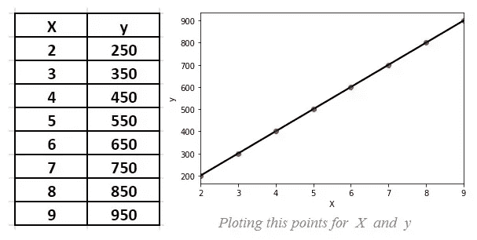
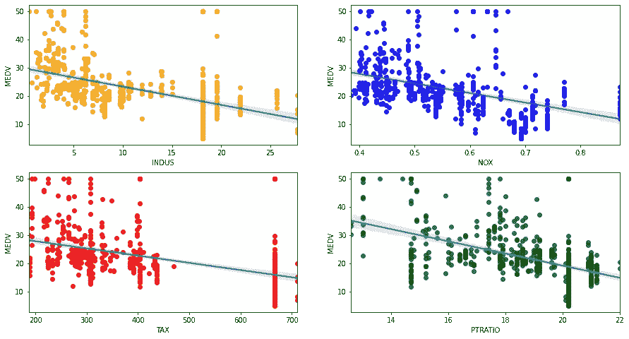
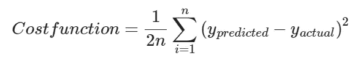
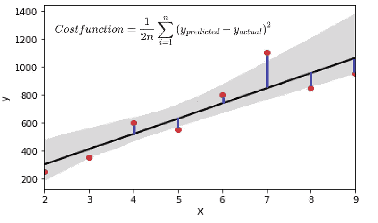
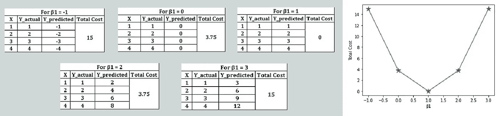

# 线性回归—用简单的术语解释！！

> 原文：<https://medium.com/analytics-vidhya/linear-regression-explained-in-simple-terms-yagnik-8f9eccb680ec?source=collection_archive---------1----------------------->

> 在本文中，我们将通过一些基本的例子用简单的术语来理解线性回归，并尝试了解它背后的数学原理。
> 
> *回归是一种解释因变量(Y)和一个或多个解释变量(X)之间关系的方法。当这个术语由线性组成时，我们显然会想到一条线。* ***基本意义上的线性回归可以认为是用一条直线来寻找两个事物之间的关系，即因变量(y)和自变量(X)。***
> 
> 一些例子是商店的销售预测、某些财产价格的增加等。

 [## 机器学习导论

### 我们已经看到，机器学习是当今市场上最受欢迎的技术。其原因可能是高…

medium.com](/@mahadev.pandya3/introduction-to-machine-learning-2316e048ade3) 

> ***简单线性回归*** *—在简单线性回归中，只有一个自变量(X)，并基于该因变量(y)进行预测。*
> 
> ***多元线性回归*** *—多元线性回归中有多个自变量(X)，并基于该因变量(y)进行预测。*
> 
> *在下面的数据中，有一个自变量(X ), y 是因变量。任务是识别，用 X 的未来值，什么可以是 y 的值*

> *在上面的图中，红点是数据点，因为我们需要找到线性关系，所以我们用一条线将它们连接起来。众所周知，一条直线的方程是 y = mX + c，也可以写成* ***Y=β0+β1X1。*** 其中*，* β0 是原始方程中的 C——即截距 *，* β1 是原始方程中的 m——即斜率
> 
> *如果完成这条线的方程，就可以预测未来 X 的 Y，这里从过去的几个数据中，X 和 Y 是已知的。目的是找到β0 和β1 的值来完成我们的方程。*
> 
> 对于上述数据，线性方程为 Y=100X+50。这就是线性回归算法试图得到的结果。现在，对于 X 的任何值，我们都可以预测 y。
> 但是，真实世界的数据会这么简单吗？显然不是。它会像下面这样，甚至更复杂。

> *在上面的图中，不可能有一条简单的线穿过所有点。因此，我们的目标是找到“最佳拟合线”,它给出了最接近该点的良好值，如上图所示。*
> 
> *可以有各种最佳拟合线，但是线性回归模型试图使线和数据点之间的垂直距离(即残差)尽可能小。这被称为“将线拟合到数据”，并将成为我们的* ***【最佳拟合线】*** *。*
> 
> **成本函数:** *实际点和最佳拟合线给出的预测会有变化，这就是该点发生的成本(损失)。发生的成本是实际点和预测点之间的差异(即垂直距离)。所有点的总成本函数由*给出

> *此最佳拟合线的方程将是线性回归的最终方程。在上例中，很容易得到公式 Y=β0+β1X1，但这里我们需要找到β0 和β1 的最佳值。*
> 
> *此处，β0 为截距，假设最佳拟合线穿过原点，其值为 0，等式为 y=β1X1。(然而，β0 可以是任何值，但为了便于理解，我们取 0)。
> 现在β1 的值应该是我们获得最小成本的值。检查低于 4 点的β1(斜率)和 X 的不同值的成本函数值。*
> 
> *(1，1)，(2，2)，(3，3)，(4，4)*
> 
> 对于每个点，我们有 X 和 y(实际值)。使用公式 y=β1X1，将为β1 的不同值计算 y(预测),以获得β1 的每个值发生的成本。

> *从上可知，β1 = 1 是最佳值，因为预测点与实际点相同。简而言之，对于成本函数的最小值，可以获得β1 的最优值。为了得到代价函数的最低值* ***梯度下降*** *算法可以用来得到全局最小值。*
> 
> *最后，我们都准备好了用梯度下降法来寻找两个变量之间的关系的线性方程。*
> 
> 当有一个以上的独立变量时，同样的数学方法也适用。即多于一个 x。这将是多元线性回归，其方程为:
> 
> ***Y=β0+β1X1+β2X2+…+βnXn。***
> 
> *这里，X 的所有系数将通过使用梯度下降获得，与简单线性回归相同。该系数值通常是该特征的权重。通俗地说，它显示了该特征对于预测因变量(y)的重要性。*

# **线性回归的假设:**

很明显，线性回归是一种基于遵循线性趋势的数据进行预测的简单方法。如果有弯曲的数据集，我们就会失败。对于何时可以使用线性回归，也有一些假设。他们就像:

1.  线性关系
2.  多元正态性
3.  无多重共线性
4.  同方差性

最后，几乎所有的回归算法都有一些类似的数学，如线性回归。对于初学者来说，线性回归总是很好的第一步(如果数据在视觉上是线性的)。这绝对是一个很好的第一个学习目标！

我希望这篇文章有助于对线性回归及其背后的数学有一个基本的了解。如果您有任何疑问，请在下面留下。