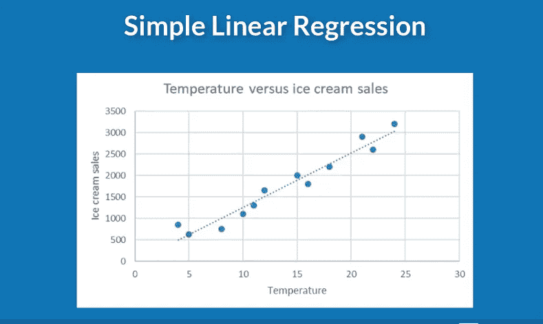
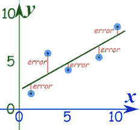
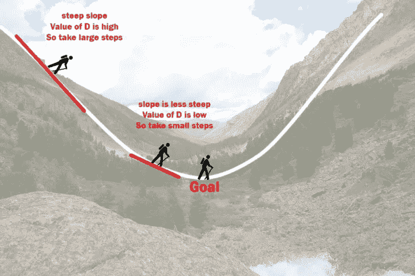

# 10 岁孩子的线性回归

> 原文：<https://medium.com/analytics-vidhya/linear-regression-for-a-10-year-old-a211dc162256?source=collection_archive---------12----------------------->

注意:*这篇文章完全是为不了解线性回归的新手(没有数学)写的。这只是为了基本的概念理解。*

在我们[之前的](/analytics-vidhya/types-of-machine-learning-algorithms-in-depth-fb5a61bb431f)帖子中，我们了解了机器学习算法的类型。在这篇文章中，我们将采用一种特殊的监督学习算法，并尽可能简单地探究细节。

线性回归是机器学习中最简单的算法，并没有广泛使用，但学习它是强制性的。

如果我们采用这个算法，我有两种方法来解释它。

**例子:**这里我会用非常简单的外行话来解释这个算法，这样即使是 10 岁的孩子也能理解。

技术术语:在这里，我将解释技术术语，以及你将如何在现实世界中应用它们，以及它们如何与我给出的例子联系起来。

**举例:**

让我们假设有一家冰淇淋店。在冬季，销售额急剧下降，而在夏季，销售额则有所增加。这里我们看到温度越高(即天气越热),冰淇淋的销量越多。

回归分析用于发现数据之间的关系。这里的温度和冰淇淋销售是我们正在谈论的数据。所以在线性回归这个词里，你现在清楚回归是什么意思了。这里我们看到温度越高(即天气越热),冰淇淋的销量就越大。温度和冰淇淋销售额之间似乎有一种线性关系(即温度上升导致销售额增加)。这就是为什么它被称为线性回归。

因此，我们使用线性回归算法根据气温水平来预测今天的销售额。

温度与冰淇淋销售

在上图中，直线代表了温度和冰淇淋销售额之间的关系。所以为了让你预测特定温度下当天的销售额，你需要这条直线。该线性线称为最佳拟合线。

那么，如何得出最佳拟合呢？这就是算法的全部内容。

所以你不能就这样在图上画一条直线。你当然可以。但是如果你想让你的算法准确地预测它，这不是最好的方法。通过计算误差可以找到最佳拟合线。看这个图表

x-温度和 Y-冰淇淋销售

在上面的图表中

当创建一组数据的最佳拟合线时，目标是创建一条拟合线，使得数据上的点与其在最佳拟合线上的相应位置之间的距离(的绝对值)最小。

我们想找到一条直线，在这条直线上，所有点到这条直线的距离的平方之和是最小的。因此这种方法被称为最小二乘法。

例如，如果从点到线的距离的平方是 43，而另一个距离的平方是 48，我们选择最小值，这样我们就可以最小化误差。并且具有最小误差的线被称为最佳拟合线。

假设你在图表上有 10 亿个数据点。想象一下，计算机画出随机的最佳拟合线，并为几乎有十亿个数据点的图中所有可能的线计算最小二乘。这真的很难。因此，即使对于计算机来说，得到最佳拟合线也是计算成本高、耗时的。这就是为什么我们有**梯度下降**

**梯度下降:**

d 代表用最小二乘法计算的值

想象你站在山上的某个地方。你想尽可能快、尽可能低，所以你决定遵循以下步骤:

*   你检查你现在的高度，你的高度向北一步，向南一步，向东一步，向西一步。利用这一点，你弄清楚你应该朝哪个方向走，以便在这一步中尽可能降低你的高度。
*   重复这个过程，直到向任何方向迈步都会让你再次上升。

这是一个非常简单的方法。你只需要弄清楚你所在的地方山是向哪个方向倾斜的(这是坡度)，然后迈出一步(这是你的下降)。在某一点上，无论在任何方向或任何路径上迈出的任何一步都会导致高度的增加，这就是它停止的地方。这个算法很棒，因为它会很快让你陷入低谷。

我们应用完全相同的方法以有效的方式找到最佳拟合线。你刚刚理解了线性回归是如何工作的。

**专业术语**:

在线性回归中，我们有两种变量

*   自变量
*   因变量

让我们看看包含温度和销售数据的数据集

这里冰淇淋销售数据被称为因变量，因为它的值取决于温度。

温度数据被称为独立变量，因为它独立于其他变量。

我们推导最佳拟合线的方法叫做梯度下降法。

我们用来计算直线误差的方法叫做最小二乘法

所以你得到了一个最佳的拟合，它本质上给了你算法。但是算法靠谱吗？

**训练测试分割**:当你得到数据集时，你有两种类型的变量:因变量和自变量。所以当你应用算法的时候，你实际上是在教或者让算法学习。因此，出于学习的目的，你在训练或应用算法时给出答案。但是当算法完成后，你要测试它，看看它有多好。因此，您给它一个仅包含温度的数据集(您有销售数据，但您选择不提供)，并要求它预测当天的销售额。你可以这样检查算法的准确性。那么你测试的时候精度很差怎么办？哪里出了问题？

**域和统计理解:**

因此，在处理数据集时，会有气温非常低但销售额却很高的日子。这些被称为离群值。可能是因为店主拿到了附近学校 2000 名学生的巨额订单。那只是一个随机事件。如果您允许这样的数据进入您的数据集，您的结果可能会受到影响。这只是一个例子。

有各种这样的场景(谷歌 it)要考虑，以获得一个高效的算法运行良好的准确性。这就是为什么领域和统计理解是重要的。

那么，如果我们的数据集包含更多的数据。例如，我们还有一个包含星期几的列。另一栏包含当天的库存风味。所以在这些情况下，我们有更多的自变量来预测销售额(因变量)。在这些情况下，我们使用所谓的多元线性回归。

我将在我们的下一篇文章中讨论这一点，并深入探讨如何使用领域和统计知识来提高模型的准确性。希望你喜欢这篇文章

如果你喜欢这个帖子，请表明你的支持，让中等算法完成它的工作。祝你有愉快的一天。