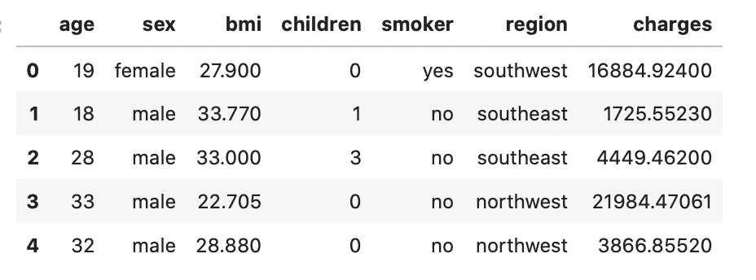
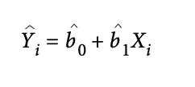
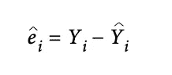
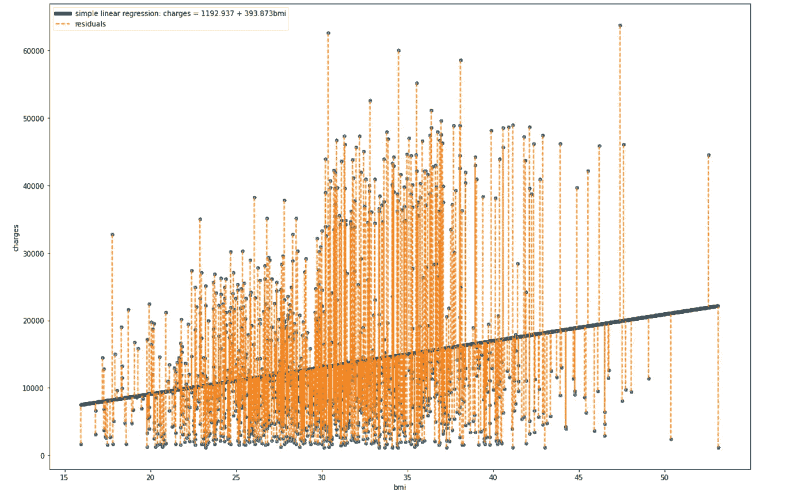
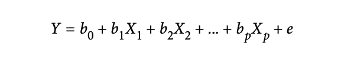

# 数据科学的线性回归—使用 Python

> 原文：<https://medium.com/analytics-vidhya/linear-regression-for-data-science-with-python-eeb3407abf9d?source=collection_archive---------21----------------------->

线性回归是数据科学中数据驱动的决策过程的基石。

数据科学家和统计学家共同承担一项任务，即根据一个或一组变量(称为预测器)来预测一个输出变量(称为目标变量)。统计学和数据科学之间最紧密的联系莫过于预测领域。线性回归被证明是提取目标输出和预测值之间关联的有力工具。使用线性回归，我们的目的不仅在于量化关系的强度，还在于量化这种关系的性质。换句话说，通过使用线性回归，我们可以预测一组给定预测因子的未知输出。在大数据领域，线性回归既用于预测，也用于解释(剖析)。


预测([来源](https://www.amazon.com/Prediction-Machines-Economics-Artificial-Intelligence/dp/1633695670))

在本文中，我们旨在阐明线性回归及其在数据科学领域的应用。为了展示实用性，我们采用 python 语言对给定的数据集进行线性回归。用于此目的的数据集是*医疗费用个人数据集。*你可以从 Kaggle 网站找到数据集，[这里](https://www.kaggle.com/mirichoi0218/insurance)。为了更好地解释数据集，它由六个不同的预测值和一个名为`charges`的目标结果组成。这是每个人需要支付的医疗保险金额。每一行都包含贡献者端的数据。`age`、`sex`和`bmi`(身体质量函数)不言自明。`children`是每个贡献者所拥有的家属人数。最后，`smoker`和`region`分别表示吸烟状态和居住地点。下图显示了前五条记录的数据快照。



数据集的前五行

预测器有`age`、`sex`、`bmi`、`children`、`smoker`和`region`。目标值是费用。预测任务的目的是根据预测值预测费用。你可以找到一些连续型和一些离散型或分类型的预测因子。目标变量是连续类型。这就是为什么我们试图利用线性回归来预测费用。在电荷是分类类型的情况下，我们应该使用分类算法来预测目标值。

# 简单线性回归

我们从简单的线性回归开始。简单线性回归估计如果单个预测值改变一定的量，目标变量将改变多少。简单线性回归的公式如下



简单线性回归

符号“ *b^* 0”称为*截距*(或常数)，符号“ *b^* 1”为 *X* 的*斜率*。符号“Y^i”是估计值，称为拟合值。真实值“Yi”和拟合值“Y^i”之间的差异称为残差或预测误差。



残差

检查残差揭示了模型评估中的重要措施。下面将介绍用于简单线性回归的 python 代码。

```
#Simple Linear regression of charges V.S. bmipredictors = ['bmi']
outcome = 'charges'model = LinearRegression()
model.fit(df[predictors], df[outcome])print(f'Intercept: {model.intercept_:.3f}')
print(f'Coefficient Exposure: {model.coef_[0]:.3f}')fitted = model.predict(df[predictors])
residuals = df[outcome] - fittedax = df.plot.scatter(x='bmi', y='charges', figsize=(15, 10))
ax.plot(df.bmi, fitted, linewidth=5, color='k', label=f'simple linear regression: charges = {model.intercept_:.3f} + {model.coef_[0]:.3f}bmi')
for x, yactual, yfitted in zip(df.bmi, df.charges, fitted): 
    ax.plot((x, x), (yactual, yfitted), '--', color='C1')plt.tight_layout()
plt.legend()
plt.show()
```



简单线性回归

在简单的线性回归中，要看电荷和`bmi`的关系是什么，可以看到截距分别是 1193，斜率是 394。橙色垂直虚线表示残差，即回归线建议值与实际值之间的差异。通过拟合直线，我们实际上试图最小化这些差异的总和。这就是所谓的最小二乘法。最小二乘简单地定义为残差平方和。采用平方而不是简单差分的原因是不同符号的不同残差不会相互抵消。最后，平方使得理论上推导拟合线比例如差值的绝对值的情况更容易。在解释模型时，我们可以说`bmi`增加一个单位导致费用增加 394 个单位。当考虑`bmi`值时，截距实际上是满足电荷平均值的调整。否则，当`bmi`为零时，说电荷值是没有意义的，因为`bmi` =0 是没有意义的。显然，我们可以将同样的方法扩展到所有预测指标，以分析与目标结果的关系。

# 多元线性回归

与仅使用一个单一预测值的简单线性回归相比，在多元线性回归中，多个预测值可用于预测目标输出。因此，不是一个单一的系数，我们将有多个系数，每个预测值一个。多元线性回归的一般形式如下所示



多元线性回归

其中“p”表示预测值的总数,“e”是残差。在深入多元回归之前，我们需要处理分类预测因子，也就是因子变量。我们需要找到一种方法来转换因子变量，以便在多元回归中得到理解。*因子*变量，也称为*分类*变量，取有限数量的离散值。二元(是/否)变量，也称为*指标*变量，是因子变量的特例。例如，*性别*和*吸烟者*的预测因子都是二元变量。最常见的方法是将一个变量转换成一组二进制的虚拟变量。其他形式的编码方法有

*   **参考编码**:统计学家使用的最常见的编码类型，其中某一因素的某一水平用作参考，其他因素与该水平进行比较[1]。
*   **一个热编码器:**在这种类型的编码器中，所有因子级别都被保留。虽然对某些机器学习算法有用，但这种方法不适用于多元线性回归。
*   **偏差编码:**一种编码类型，将每个水平与总体平均值进行比较，而不是与参考水平进行比较。

在使用任何类型的编码时，尤其是一次性编码，我们应该小心地将所有级别的因素变量包含在编码中。包含所有级别的因子变量会导致被称为**多重共线性**的不利影响，从而导致模型中的错误解释。

> 在回归设置中，具有 *P* 不同水平的因子变量通常由只有 *P-* 1 列的矩阵表示。这是因为回归模型通常包含截距项。使用截距，一旦定义了 *P-* 1 二进制文件的值，那么 *P-* th 的值就是已知的，可以认为是多余的。添加第 *P-* 列将导致多重共线性错误[1]。

为此，在 python 实现中，我们将应用这个建议。在某些情况下，应用编码(如独热编码)可能会生成如此多的伪变量。在这种情况下，您应该决定包含所有级别的因子变量是否有帮助。您可以使用一种方法，例如根据标准(如残差)将不同的级别组合成一个级别。对于顺序起关键作用的有序因子变量，将因子变量转换为数值变量将保留包含在顺序中的信息，如果将其转换为因子，这些信息将会丢失。例如，对于具有诸如*小*、*中*和*大*的值的有序因子变量，这些值可以被编码为 1、2、3 或 1、3、5，这取决于差异的强度。

对于我们的保险数据集的多元线性回归，python 实现如下:

```
predictors = ['age', 'sex', 'bmi', 
              'children', 'smoker', 'region']
outcome = 'charges'
df_encoded = pd.get_dummies(df[predictors], drop_first=True)df_lm_factor = LinearRegression()
df_lm_factor.fit(df_encoded, df[outcome])print(f'Intercept: {df_lm_factor.intercept_:.3f}') 
print('Coefficients:')for name, coef in zip(X.columns, df_lm_factor.coef_):
    print(f' {name}: {coef}')
```

输出将是:

```
[output]:
Intercept: -11938.539
Coefficients:
 age: 256.85635253734864
 bmi: 339.1934536108373
 children: 475.5005451491269
 sex_male: -131.3143593951132
 smoker_yes: 23848.534541912835
 region_northwest: -352.9638994246546
 region_southeast: -1035.0220493878253
 region_southwest: -960.0509913008365
```

解释多元线性回归不像一元线性回归那样简单明了，尤其是因子变量。基于上述代码的输出，系数是预测器与目标的关系的指示。例如，`*age*` 系数为 257 表明年龄增加一个单位，费用增加 257 个单位。对于因子变量，应解释为与参考水平相比。例如,`sex_male`系数为-131，表示男性对目标产量的影响比女性低 131。同样，对于`smoker_yes`来说，吸烟者=是的效果比不吸烟者高 23848 倍。

最后但同样重要的是，回归方程本身并不能证明因果关系的方向。这是从更广泛的理解，如领域知识，引导我们选择因果关系的正确方向。

# 参考

[1]布鲁斯、彼得、安德鲁·布鲁斯和彼得·格德克。*数据科学家实用统计学:使用 R 和 Python 的 50 多个基本概念*。奥莱利媒体，2020。