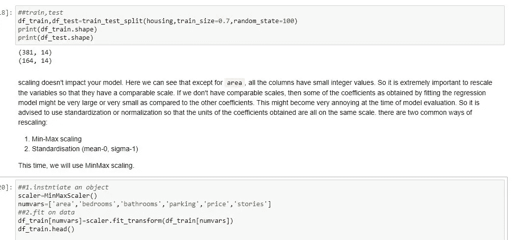

# 用 Python 实现线性回归的友好介绍

> 原文：<https://medium.com/analytics-vidhya/linear-regression-from-scratch-cc97196c014c?source=collection_archive---------6----------------------->

每个 ML 初学者都从线性回归算法开始他们的机器学习之旅，这是最容易理解的算法。

在本文中，让我们从头开始尝试理解线性回归和 python 实现。我将尝试同时涵盖 python 中的理论和实际实现。

# **简介:**

当我第一次学习线性回归时，我很难理解这个简单的算法，我不能理解简单的训练测试分割和许多其他事情，我不希望这种情况发生在你身上，所以，如果你是 ml 的初学者，这篇文章是给你的。我们开始吧

## 什么是线性回归？

线性回归是一种监督学习算法，其中我们有一个或多个自变量，只有一个因变量，即连续的数值变量。迷茫？

这里有一个例子，假设我们想根据一个学生的身高来预测他的体重，这里我们的体重变量是输出变量或因变量，身高变量是自变量，这是一个简单的线性回归算法，因为我们只有一个自变量，假设我们有另一个与他的教育背景相关的自变量，这是一个多元线性回归算法。

http://www.quickmeme.com/meme/3okk37

在这两种算法中，我们的目标是找出自变量和因变量之间的关系，如我的身高变量如何有助于预测学生的体重，以及知道哪个变量对预测学生的体重最重要。

## 我们如何使用线性回归进行预测？

在简单线性回归的情况下，您将有两个变量，我们试图找到通过我们的数据点的最佳拟合线(见下图)，对于多元线性回归，我们拟合超平面。

[https://www . numpyninja . com/post/what-is-line-of-best-fit-in-linear-regression](https://www.numpyninja.com/post/what-is-line-of-best-fit-in-linear-regression)

从学校的数学中，如果你记得我们的直线方程是这样的 **y=mx+c** 这里你可以把 **x** 看作独立变量，把 **y** 看作目标变量，而 **c** 是截距， **m** 是我们需要找出的系数或斜率值，对于好的 **m** 值，我们的误差(实际预测值)将会很低

[https://julienbeaulieu . git book . io/wiki/books/untitled/statistics/regression-and-prediction](https://julienbeaulieu.gitbook.io/wiki/books/untitled/statistics/regression-and-prediction)

如上图所示，我们的 *yi* 值是实际值，yi hat 是预测值，我们对所有数据点的误差进行平方，并计算总误差。让我们暂停一下，想一想。

找到最佳拟合线或最佳斜率值并不容易，这是一个迭代过程。我们使用梯度下降来找出最佳斜率值，梯度下降是一种找出函数(成本函数)最小值的优化算法。我们计算成本函数相对于 **m** 的梯度，或者换句话说，我们尝试不同的 **m** 迭代，并计算每个 **m** 值的损失，一旦我们找到最佳的 **m** (全局最小值)值，我们就停止迭代。简而言之，这就是梯度下降的作用，详细的解释请参考这个精彩的链接。

 [## 梯度下降:机器学习最流行的算法之一介绍

### 梯度下降是迄今为止在机器学习和深度学习中使用的最流行的优化策略

builtin.com](https://builtin.com/data-science/gradient-descent) 

为简单起见，将梯度下降想象成一个神奇的盒子，如果您将数据放入这个神奇的盒子，它会给出最佳拟合线(最佳斜率值)作为输出，从而减少实际值和预测值之间的误差。有了这些知识，您就可以用 python 实现线性回归了。

# **Python 中的线性回归:**

这里，我使用的是一个真实的国有公司数据集，该数据集包含德里地区的房产价格，公司希望使用该数据，根据面积、卧室、停车场等重要因素优化房产的销售价格。公司想要——

*   确定影响房价的变量，如面积、房间数量、浴室等
*   了解模型的准确性，即这些变量对房价的预测能力。

我们将遵循的步骤:

a.阅读和理解数据

b.执行一些预处理步骤(编码、缩放)

c.训练模型(使用 statsmodels)并进行预测。

1.  首先让我们导入所有必要的库

2.读取数据

我们的数据集包括 545 行和 13 列，如价格、卧室、故事等..

3.检查空值

幸运的是，我们的数据集中没有任何空值，如果有空值，我们需要删除它们，或者用适当的值填充它们。

4.让我们做一些绘图来了解变量之间的关系。

这里我使用了简单的 seaborn pairplot sns.pairplot(住房)函数来绘图。

从上面的图中我们可以看出价格和面积是相互关联的。

5.为建模准备数据

在我们的数据集中，我们有分类变量，如主干道、客房等..这表示特定的房子是否有客房(是\否)和主路(是\否)。但是为了拟合回归线，我们需要数值变量，而不是分类变量。因此，让我们使用简单的映射和 lambda 函数将分类变量转换为数值。

我们还有一栏叫做家具状况，它告诉我们房子是半家具还是家具还是没有家具。因此，对于本专栏，我们使用 pandas dummies 函数将其转换为数值。

这里，在第一行(index1)中，我们有(0，0)值，这意味着这个特定的房子是有家具的，在第三行中，我们有(1，0)，这意味着这个特定的房子是半有家具的，我们最后将其连接到原始数据帧，并删除原始 furnishingstatus 变量。

6.训练、测试分割和缩放

我们将数据分为训练和测试两部分，我们使用训练数据来训练模型，使用测试数据来测试模型。这里，我们使用 70%的数据进行训练，30%的数据进行测试

在训练和测试分割之后，重要的是调整我们所有的数据点，使所有的变量达到相同的范围。这里我们使用了最小最大缩放器。

从 df_train 中，我们导出了 X_trian 和相应的标签 y_train

7.模特培训

最后，经过预处理后，我们到达模型训练，这里我们使用 statsmodels 库，它给我们详细的统计数据，如 p 值，F 统计等..但是 statsmodel 没有提供常量，我们需要添加常量。

## **假设检验:**

在训练我们的模型之后，重要的事情是去除多余的变量，如果你知道假设检验和 p 值，你的工作将会非常容易。实际上我们的零假设是自变量对因变量没有显著影响，我们的替代假设是自变量对因变量有显著影响。因此，如果我们的 p 值<0.05 we reject null hypothesis and if p value>为 0.05，我们无法拒绝我们的零假设。所以我们的目标是只保留重要的变量，我们需要删除多余的变量。

但是等等！通过检查 p 值，我们的工作还没有完成，我们还需要研究 vif 值，那么这个 vif 是什么？

基本上，我们的 vif(方差膨胀因子)告诉我们，我们的自变量之间是否相关。你可能想知道为什么我们需要处理独立变量之间的相关性。基本上，在多元线性回归中，我们有不止一个独立变量，这些变量有可能彼此相关(这就是所谓的多重共线性问题)，因为多重共线性问题，独立变量单位的增加也会增加相关变量的系数，所以系数值变化很大，p 值不可靠。

其中我代表第 I 个变量

但是多重共线性不会影响预测和拟合优度。如果您的主要目标是进行预测，并且不想了解每个自变量的作用，则不需要担心多重共线性。对于我们的问题，我们需要注意多重共线性问题。

因此，通过检查 p 和 vif 值，我们需要删除多余的变量。

一条经验法则是，如果 p 值> 0.05，则移除该特定变量，如果 vif 值> 5，则移除该特定变量。

7.检查 VIF

这里我们可以看到半提供变量具有高 p 值(0.93)，因此我们需要移除该变量并再次训练我们的模型。

这一次 p 值是好的，我们还需要看一下 vif，vif 显示卧室变量有多重共线性问题。所以让我们去掉这个变量。

移除卧室后，我们需要再次训练我们的模型，并查看 p 值和 vif 值。

所有值看起来都很好，我们现在可以继续在测试集上进行预测。

我们先对列车组进行预测。

误差项呈正态分布，这是线性回归的假设之一。

8.测验预测和 R2 分数

我们遵循与训练集相同的方法。

最后，我们得到了 67%的 R2 分数，这是不好的，我们可以通过训练其他模型来改善这一点，如 ridge 和 lasso。但是本文的目标是理解 python 中的线性回归实现。所以我就说到这里。

我希望这篇文章能帮助你理解线性回归及其在 python 中的实现，非常感谢你花时间学习新的东西。

如果你喜欢这篇文章，请为下面的这篇文章鼓掌以示支持，这真的激励我写更多有趣的文章，如果你有任何问题，请在下面留下评论，我很乐意听到你的意见。

**关于我:**

我是一个数据科学爱好者，目前正在班加罗尔国际信息技术学院攻读机器学习和人工智能的 pg 文凭。

你也可以在 www.linkedin.com/in/manoj-gadde[找到我](http://www.linkedin.com/in/manoj-gadde)