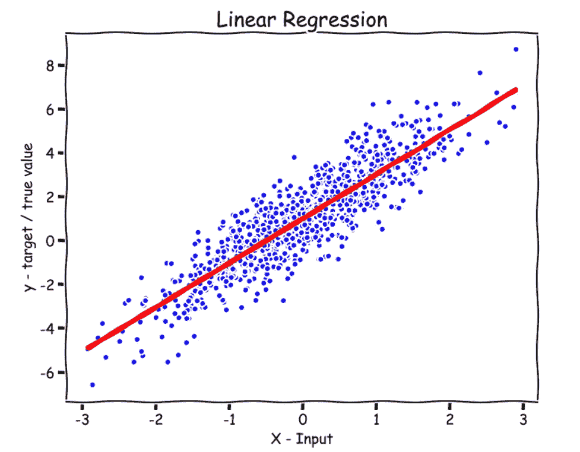

# Python 中从头开始的线性回归

> 原文：<https://medium.com/analytics-vidhya/linear-regression-from-scratch-in-python-b6501f91c82d?source=collection_archive---------3----------------------->

## 从零开始的机器学习:第 1 部分

作者图片

在本文中，我们将构建最基本的机器学习模型，称为线性回归，我们将只使用 python NumPy 来实现它。首先，我们将查看我们的**数据集**，然后谈论一个**通用监督学习算法**过程，接着是**假设表示**、**损失函数**，以及**梯度下降算法**。