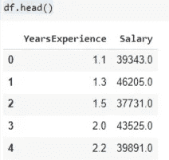
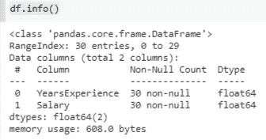
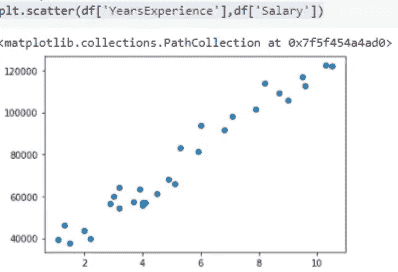
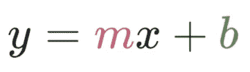
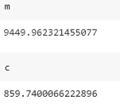
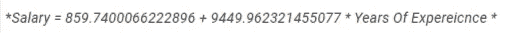
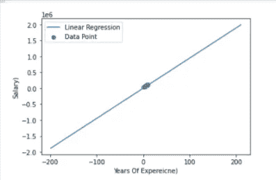
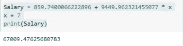

# 使用 Python 从头开始实现线性回归。

> 原文：<https://medium.com/analytics-vidhya/linear-regression-implementation-from-scratch-using-python-7184b89df722?source=collection_archive---------2----------------------->

> 当实现任何算法来训练机器学习模型时，Scikit-Learn 库是一个纯粹的福音。这是一个非常先进的库，我们的工作可以缩短成几行代码。话虽如此，我始终认为从头开始了解任何算法并理解算法工作背后的数学和统计学是至关重要的。

在这篇文章中，我将向您展示如何使用 python 从头开始实现一个简单的线性回归算法。

所以为什么要等，来吧，准备好弄脏你的手！

任何机器学习模型的第一步都是收集数据。
我将使用一个简单的数据集，工资数据集。数据集可以在[这里找到。](https://www.kaggle.com/karthickveerakumar/salary-data-simple-linear-regression)

因此，让我们从导入所有必需的库开始

下一件事是读取和加载我们的数据集，并有关于数据集的基本信息。

从上面的图片中，我们可以对我们的数据集有一个基本的了解。它有 30 行和 2 个特征，即多年的经验和工资。
我们的目标是找出一个有 7 年工作经验的人的工资是多少。

对于任何机器学习问题，我们的第一步都是选择合适的算法。为了测试使用哪种算法，我们必须绘制数据并查看变量之间的关系。

我用散点图来检查两个特征之间的关系。

从上图中，我们得到一个直觉，这些变量之间存在线性关系。所以我决定用简单的线性回归算法来训练这个模型。

在线性回归模型中，我们基本上要做的是尝试找到最佳拟合线**以最小误差拟合数据中的特征。**

当我们决定好算法的类型后，现在我们将继续分配因变量和自变量。

我用 X 和 Y 来表示变量。工作年限是一个独立变量，工资取决于它，因为工资会随着工作年限的增减而增减。

**线性回归的假设:** 我们来定义一下我们对于一条直线的假设函数。众所周知，直线的方程式是:

m 是变量 x 的系数。

b 是截距。

在我们使用的数据集中，我们只有一个特征，所以我将继续使用相同的假设函数。

计算系数和截距的公式如下:
m = x-(x 的平均值)* y-(y 的平均值)/(x-(x 的平均值)
c =(y 的平均值)—m *(x 的平均值)/ n

现在，应用上面的公式，我们得到了 m 和 c 的值

现在用数学术语来说:

让我们将上述信息绘制成图表，并画出最佳拟合线。

太好了，我们已经找到了最佳拟合线，并将其拟合到数据点中。

所以现在如果我想预测一个 7 年的人的工资。

> 线性回归是机器学习模型中首先使用的基本算法之一。信不信由你，这一切都是为了从头开始编写线性回归代码。
> 快乐编码:)