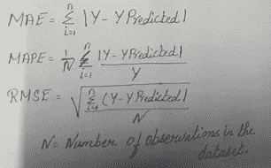

# 机器学习中的线性回归

> 原文：<https://medium.com/analytics-vidhya/linear-regression-in-machine-learning-783bb5e58944?source=collection_archive---------12----------------------->

# 什么是回归？

回归是用于根据独立特征预测目标列中的连续变量或因变量的方法。它属于监督技术。它是一种统计工具，用于找出结果变量、因变量和一个或多个变量(通常称为自变量)之间的关系。

# 什么是线性回归？

线性回归用于寻找目标和一个或多个预测值之间的线性关系。

简单线性回归找出因变量(Y)和自变量(X)之间的关系，并试图通过最小化误差来找到最佳拟合线。此拟合函数表示您的模型有多好，或者您可以定义一个成本函数来衡量它有多差。成本函数测量模型预测和训练数据之间的距离。但是**我们线性回归的目标是最小化距离(or)误差(or)残差**。范围从-inf 到+inf。该算法采用**普通最小二乘(OLS)** 。

**最佳拟合线公式(或预测公式)**

**1)简单线性回归** :- Y= β0+ β1X

**2)多元线性回归** :- Y= β0+ β1X1+ β2X2+ β3X3+…。+ βnXn

βo 和β1 是两个未知常数。β1 是 y 的斜率，β0 是 y 的截距。

P1=给定 X 的原始 Y 数据点

P2=给定 X 的估计 y 值

Y 条= Y 平均值

X 条= X 平均值

# 现在让我们了解一下线性回归模型的性能。

**误差= Y 实际值—预测线**

**1。SSE(残差(或)无法解释的误差):——**误差是 Y 的观测值与 Y 的预测值之差

**2。SSR(回归误差(or)解释误差):——**误差是 Y 的平均值与 Y 的预测值之差

**3。SST(总误差平方和):——**SST 量化 Y 的观测值围绕 Y 的平均值的变化。

**4。MAE(平均绝对误差):—** 实际值与预测值的平均绝对差值。

**5。MAPE(平均绝对百分比误差):——**实际&预测值与实际值的绝对差值之比的平均值。

6。RMSE(均方根误差):— 计算实际值和预测值的平方差之和的平方根平均值。

7 .**。R 平方(R2): —** R 平方值描述了由模型中自变量解释的因变量变化的百分比，也称为决定系数。r 平方的范围在 0 到 1 之间。如果 r 平方接近 1，则模型可预测性高。如果我们在模型中加入更多的变量，不管这个变量是否对模型有贡献，R2 的值都会增加。这就是使用 R2 的缺点。

**8。调整后的 R 方:——**R 方的缺点由调整后的 R 方值来修复。只有当添加的变量对模型有重大贡献时，调整后的 R2 值才会提高。调整后的 R 平方值在模型中增加了惩罚。调整后的 R 平方始终小于 R 平方。

其中，R2 是 R 平方值，n =观测值总数，k =模型中使用的变量总数。如果我们增加变量的数量，分母变小，总体比率就会很高。从 1 中减去将减少整个调整后的 R2。因此，为了增加调整后的 R2，附加特征对模型的贡献应该非常高。

# 线性回归的假设

## 1.多重共线性

两个或两个以上的自变量之间不应该有很高的相关性。**如果我们的模型中存在多重共线性，我们需要逐步删除这些特征**。可以使用相关矩阵、容差和方差影响因子(VIF)来检查多重共线性。

**VIF = 1/1- R 平方**

## 2.常态

当我们的数据以正态分布流动时，我们可以说正态存在。如果我们的数据不正常，我们需要对目标变量应用转换技术。可以使用夏皮罗检验(或)概率图(或)偏差来检查正态性。偏斜度应该用残差来检验。**夏皮罗测试和偏斜**的范围应为-0.5 至+0.5。

## 3.线性

因变量和自变量之间应该是线性关系。如果我们的数据不是线性的，**我们需要对因变量进行变换，使其呈线性形式**。可使用统计库**中的线性彩虹检查线性度。概率值应大于 0.5** 。

## 4.自相关

两个变量之间的关联称为序列相关。当存在重复数据时，我们可以说变量之间存在自相关。不应该有自相关。检查残差的自相关。

这可以通过做 **OLS 总结报告**中的杜宾沃森测试来检查。**如果 Durbin Watson 是 2，那么没有自相关，如果它大约在 1.5 到 2.5 之间，那么优选的是，如果它大于 2.5，那么模型中存在自相关**。

## 5.同方差性

我的模型应该是同方差。它可以被定义为均匀方差。这可以通过统计库的 het_goldfeldquandt 来检查。**概率值应该大于 0.5** 。

> **键**

如果我们有分类数据，我们需要在建立模型之前将其转换为虚拟变量。

无多重共线性

残差应该是正常的

残差应该是线性的

无自相关

同质性的存在。

# 这是下一个调整模型的博客。

## 线性回归链接中的超参数调整[点击此处](https://sruthils22.medium.com/hyperparameter-tuning-in-linear-regression-e0e0f1f968a1)

# 参考

[https://www . ajo . com/article/s 0002-9394(10)00167-4/full text](https://www.ajo.com/article/S0002-9394(10)00167-4/fulltext)

[https://SPH web . bumc . bu . edu/otlt/MPH-Modules/BS/R/R5 _ Correlation-Regression/R5 _ Correlation-Regression 4 . html](https://sphweb.bumc.bu.edu/otlt/MPH-Modules/BS/R/R5_Correlation-Regression/R5_Correlation-Regression4.html)