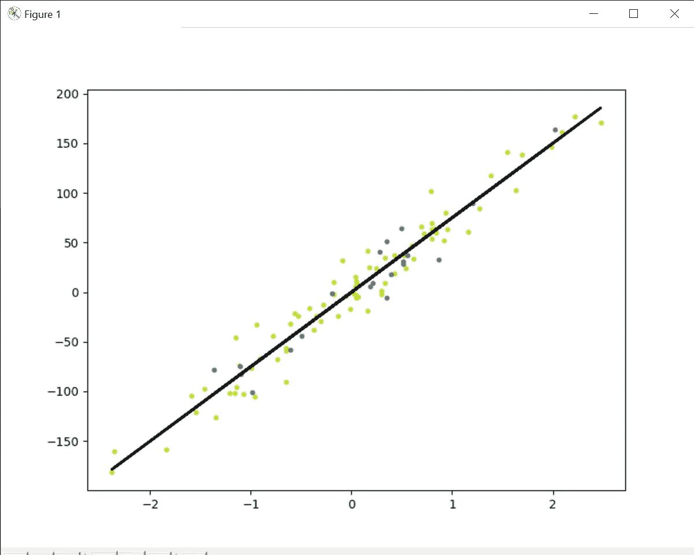
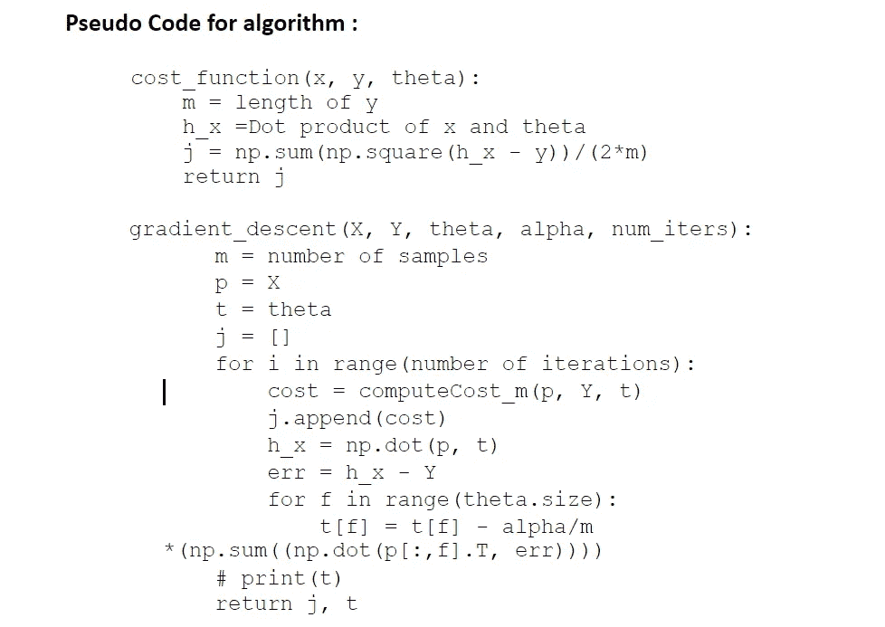
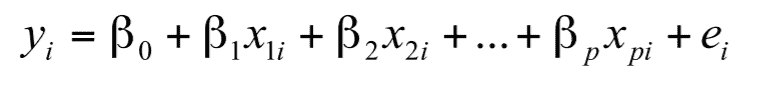
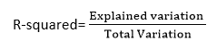

# 线性回归-机器学习

> 原文：<https://medium.com/analytics-vidhya/linear-regression-machine-learning-ef8b8899922a?source=collection_archive---------11----------------------->

*在* [**ml-lab**](https://github.com/kapilbhise/ml-lab/blob/main/LinearRegression.py) 从零开始获得线性回归算法的完整代码

线性回归是最简单和最流行的机器学习算法之一。这是一种用于预测分析的统计方法。线性回归预测连续/真实或数字变量，如**销售额、工资、年龄、产品价格、**等。

线性回归算法显示了因变量(y)和一个或多个自变量(y)之间的线性关系，因此称为线性回归。因为线性回归显示线性关系，这意味着它发现因变量的值如何根据自变量的值而变化。

使用线性回归时，我们的主要目标是找到最佳拟合线，这意味着预测值和实际值之间的误差应该最小化。最佳拟合线的误差最小。

线(a0，a1)的权重或系数的不同值给出了不同的回归线，因此我们需要计算 a0 和 a1 的最佳值来找到最佳拟合线，因此我们使用成本函数来计算。

成本函数-

*   线(a0，a1)的权重或系数的不同值给出了不同的回归线，并且成本函数用于估计最佳拟合线的系数的值。
*   成本函数优化回归系数或权重。它衡量线性回归模型的表现。
*   我们可以用代价函数来求**映射函数**的精度，它把输入变量映射到输出变量。这个映射函数也被称为**假设函数**。

**算法的伪代码:**

**算法讨论:**

在多元线性回归中，有 p 个解释变量，因变量和解释变量之间的关系由以下方程表示:

拟合优度决定了回归线与观察值集的拟合程度。从各种模型中找出最佳模型的过程称为**优化**。这可以通过以下方法实现:

**1。r 平方方法:**

*   r 平方是一种确定拟合优度的统计方法。
*   它在 0-100%的范围内测量因变量和自变量之间的关系强度。
*   R 平方的高值决定了预测值和实际值之间的差异较小，因此代表了一个好的模型。
*   多元回归又称为**决定系数、**或**多重决定系数**。
*   它可以通过下面的公式计算:

你可以在我的 [GitHub](https://github.com/kapilbhise/ml-lab/blob/main/LinearRegression.py) 账户上看到完整的代码实现。

谢谢大家！