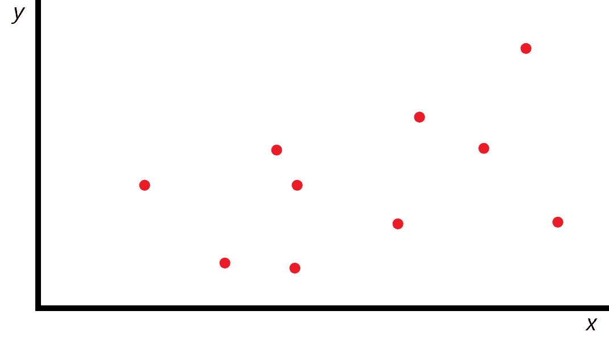
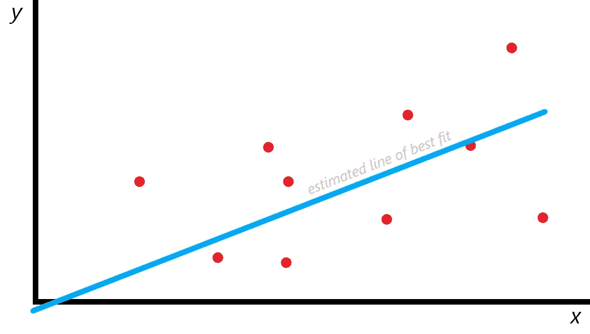
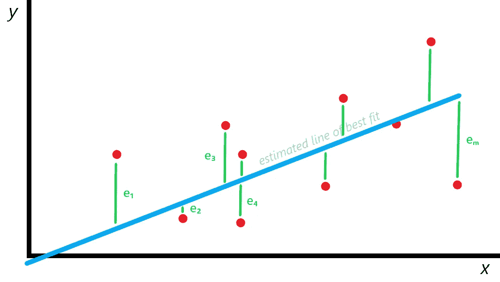
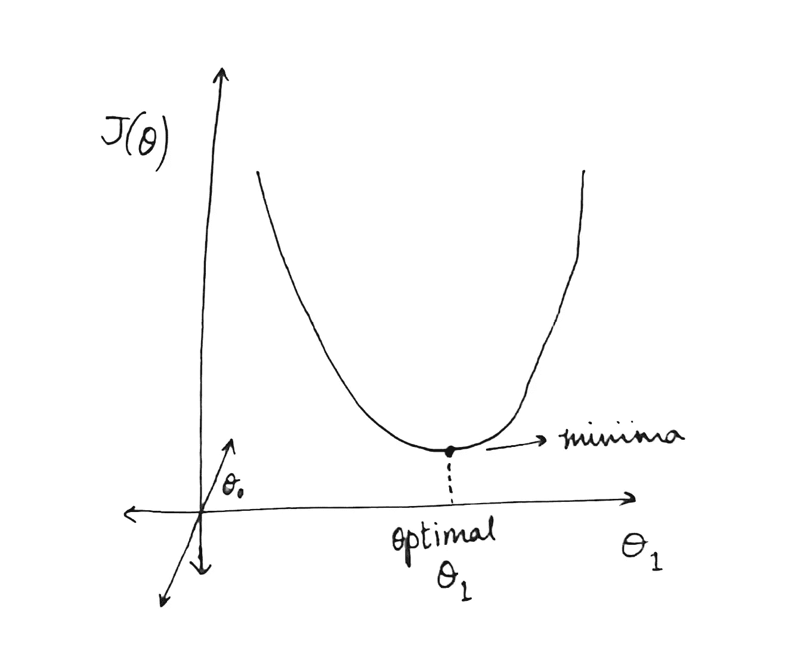
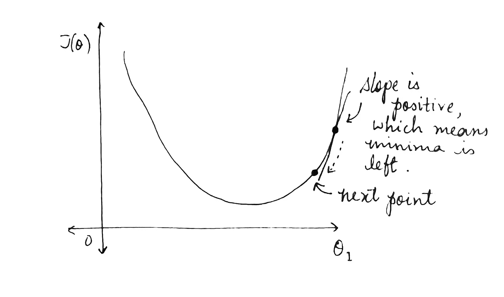

# 线性回归变得简单

> 原文：<https://medium.com/analytics-vidhya/linear-regression-made-simple-d5315db78a14?source=collection_archive---------1----------------------->

## 机器学习背后的基础数学

许多人，尤其是该领域的新手，经常对机器学习领域表现出极大的兴趣，但回避管理它的数学。我希望通过用简单的术语解释机器学习背后的数学来为你揭开它的神秘面纱。线性回归是监督学习中最基本的数学算法之一。

> *你可能会问，*“什么是线性回归？”

在英语中，回归意味着回到欠发达状态。技术定义不会偏离太远。回归是一种分析方法，用于理解两个或多个变量之间的关系。这是预测和优化的一个有价值的工具。

让我们开始用图形来理解线性回归和梯度下降背后的原理。

作者图片

# 简单线性回归

让我们任意假设，我们有如下所示的点分布:

作者图片

线性回归寻找这种分布的近似值——最好地解释给定分布的直线，最好地描述数据模式的直线。让我们称之为*最佳拟合线*。直觉上，线性回归解释了这个确切的事情。

作者图片

我们可以用代数方法将上面的线表示为 *y = h(x)* ，其中:

> *h(x) =* θ₀ + θ₁ *x*

*h* 代表*假设* , *θ* 代表参数， *x* 是特征。对数据集执行线性回归的目的是找到 *θ₀* 和 *θ₁* 的最佳值，使得 *h(x* )最适合解释数据的行为。

上面我们看到了什么叫做*简单线性回归*，只涉及一个*解释变量*。这种线性回归方法有其使用案例，但更多的时候，我们发现自己需要分析不止一个特征。这就引出了*多元线性回归。*

# 多元线性回归

多元线性回归类似于简单线性回归，与只考虑一个不同的特征相比，多元线性回归更加复杂。最佳拟合线(假设函数)的等式现在看起来像这样:

> h(x) = θ₀ + θ₁ x₁ + θ₂ x₂ + θ₃ x₃ + … + θₙ xₙ

*θ* 项代表参数，也称为权重，很容易理解为什么。从等式 *h(x)* 中可以清楚地看出，参数决定了特性对系统行为的影响程度。我们也可以说 *θᵢ* 定义了特定特性 *xᵢ* 在最终输出中的重要性。

为了更好地理解我们如何在现实世界中应用多元线性回归，让我们以著名的房价算法为例。这里，我们使用房子的特征(卧室数量、浴室数量、面积和位置)来确定房子的价格。我们也可以考虑其他特征，但是为了这个例子，让我们考虑这四个。

在上面的图表中，我们可以说位置与基于一些任意标准的星等相关联。

使用我们的方程计算第一座房子的最佳拟合线，我们得到:

> 30 = θ₀ + 1 . θ₁ + 1 . θ₂ + 500 . θ₃ + 3 . θ₄

同样，我们可以为所有房屋创建一个方程，从而找到最佳参数。

## 损失函数

为了简单起见，让我们假设一个只有一个解释变量的系统。两个变量的系统需要我们画一个二维平面，三个解释变量需要一个超平面来表示。超平面是不可能可视化的，所以让我们坚持一个解释变量。

作者图片

我们可以清楚地看到，我们的近似最佳拟合线与许多点相距甚远。我们把一个点到最佳拟合线的垂直偏差叫做 *e* 。这个 *e* 是预测值和实际值之差。然后，我们的目标是最小化σ*e*。为此，让我们引入一个函数:

> j(θ)=σ*e*

*J(θ* )称为损失函数，或误差函数。为了进一步分析和最小化损失函数，让我们展开 *e.*

*e* 等于实际点和最佳拟合估计线上的点之间的垂直距离。因为我们不希望距离在求和时相互抵消，所以我们求这个值的平方。

> *e*₁*=(h(x*₁*)-y*₁)，e₂ = (h(x₂) - y₂)等等…

因此，我们有:

> j(θ)=(1/2m)σ(h(xᵢ)-yᵢ)，其中 I 从 0 到 m，m 是例子的总数。

我们取 *1/m* 的原因是因为我们的求和值会不必要的大，我们取 *1/2* 是为了简化计算，你将在后面看到。这就是我们如何得出损失函数的。这种计算误差的方法叫做*均方误差。*

外推我们的损失函数以考虑多个额外维度，我们有:

> j(θ)=(1/2m)σ(θ₀+θ₁x₁*ᵢ*+θ₂x₂*ᵢ*+θ₃x₃*ᵢ*+…+θₙxₙ*ˇ*-y*ˇ*)，i: 0

为了找到最佳参数，我们采用了一种称为*梯度下降*的方法。

## 寻找曲线上一点的斜率

要使用梯度下降法寻找最优参数，我们需要知道如何找到曲线上每一点的斜率。为了图形化地理解这个过程，让我们再次假设一个简单的线性回归的例子，其中 *h(x) = θ₀ + θ₁ x* 。

> j(θ)=(1/2m)σ(θ₀+θ₁x₁ᵢ-yᵢ)，i: 0 ➡ m

根据 *J(θ)* 的方程，我们可以知道 *J(θ)* 和θ₁之间的曲线将是抛物线，因为抛物线的方程是 *y = ax + bx + c.*

作者图片

再一次，这清楚地说明了为什么我选择仅仅用图形来表示一个简单的线性回归的例子，因为任何更多的东西都需要超越三维。

显而易见，为了最小化 *J(θ)* ，我们必须找到曲线的局部最小值。使用基本微积分，要找到曲线上特定点的切线斜率，我们必须对函数进行微分，并代入对应于该特定点的值。在这里应用这些知识，使用偏导数，因为 *J(θ)* 是 *θ₀* 和 *θ₁* 的函数，我们得到:

> **∂**j(θ)/**∂**θ₀=(1/2m)2σ(θ₀+θ₁x₁ᵢ-yᵢ)(1+0–0)，i: 0 ➡ m
> 
> ∂j(θ)/∂θ₀=(1/m)σ(θ₀+θ₁x₁ᵢ-yᵢ)，i: 0 ➡ m
> 
> ∂j(θ)/∂θ₀=(1/m)σ(h(xᵢ)-yᵢ)，i: 0 ➡ m

现在我们明白为什么我在定义损失函数时在分母中引入了一个 *2* 了。

相对于 *θ₁* 对 *J(θ)* 进行部分微分，我们得到:

> ∂j(θ)/∂θ₁=(1/2m)2σ(θ₀+θ₁x₁ᵢ-yᵢ)(0+x₁ᵢ-0)，i: 0 ➡ m
> 
> ∂j(θ)/∂θ₁=(1/m)σ(θ₀+θ₁x₁ᵢ-yᵢ)(x₁ᵢ)，i: 0 ➡ m
> 
> ∂j(θ)/∂θ₁=(1/m)σ(h(xᵢ)-yᵢ)(x₁ᵢ)，i: 0 ➡ m

我们可以引入一个特征 *x₀* 到 *h(x)* ，其中 *x₀ = 1。*

> h(x)=θ₀x₀+θ₁x₁+θ₂x₂+θ₃x₃+…+θₙxₙ，其中 x₀ = 1

那么我们可以把 *∂J(θ)/∂θ₀* 改写成:

> ∂j(θ)/∂θ₀=(1/m)σ(h(xᵢ)-yᵢ)(x₀ᵢ)，i: 0 ➡ m

观察 *∂J(θ)/∂θ₀和*∂j(θ)/∂θ₁，我们可以做出这样的概括:

> ∂j(θ)/∂θₙ=(1/m)σ(h(xᵢ)-yᵢ)(xₙᵢ)，i: 0 ➡ m

这就是我们如何计算曲线上一点处切线的斜率。

## 梯度下降

梯度下降是一种寻找函数局部极小值的迭代优化算法。让我们通过一步一步的可视化来理解它。

让我们在曲线上选择任意一点，求该点切线的斜率。上面我们已经有了它的方程式。该点的斜率告诉我们最小值在哪个方向。

最小值是 *J(θ)* 的值最小的点，这意味着在这个点我们将找到我们的最佳参数值。

例如，如果这一点的斜率是负的，这就告诉我们，最小值是向右的，如果斜率是正的，最小值是向左的。换句话说，切线的斜率将我们指向局部最小值。

作者图片

从理论上讲，现在我们知道了前进的方向，通过在正确的方向上逐步迭代，我们最终一定会接近最优解。

> *现在你可能会问，*“我们如何知道每次迭代我们必须移动多少？”

这就把我们带到了本文的最后一个主题，即*学习率。*

## 学习率

梯度下降使用一个称为学习率的超参数 *α* ，来控制我们向最优解迈进的每一步的大小。学习率太小将导致达到最优解所需的时期太多，而学习率太大将有超过最小值和发散的风险。

完美的 *α* 将从相对较高的位置开始，并且随着我们接近最小值而逐渐变小，以便在历元数和精度之间找到完美的平衡。这可以通过使α与该点的斜率成比例来实现。斜率越大，我们在最小值的方向上迈出的步伐就越大。

图片由[杰瑞米·乔登](https://www.jeremyjordan.me/nn-learning-rate/)

在数学上，我们将学习率纳入我们的最小值方法，如下所示:

> θₙ:=θₙ-*α(*∂j(θₙ)/∂θₙ*)，或者*
> 
> θₙ := θₙ - α(斜率)

## 梯度下降优化

当误差函数不像抛物线并且具有多个最小值时，梯度下降概念的一个问题出现了。在这种情况下，我们总是希望找到函数的全局极小值。

梯度下降带来了陷入局部极小值的风险，这取决于我们在哪里随机初始化我们的权重(从哪里开始梯度下降过程)。

对此的解决方案之一是用不同的初始化权重运行该算法几次，希望其中一次找到的最小值是全局的。

另一个解决方案是使用动量，这是梯度下降的优化，可以想象为我们把球推下山(函数)。原则上，球会滚过局部最小值(假设它从足够高的点开始)，如果我们加入空气阻力，球最终会到达全局最小值。

如果你一路阅读，并发现这很有用，谢谢！请随意留下建议或评论。