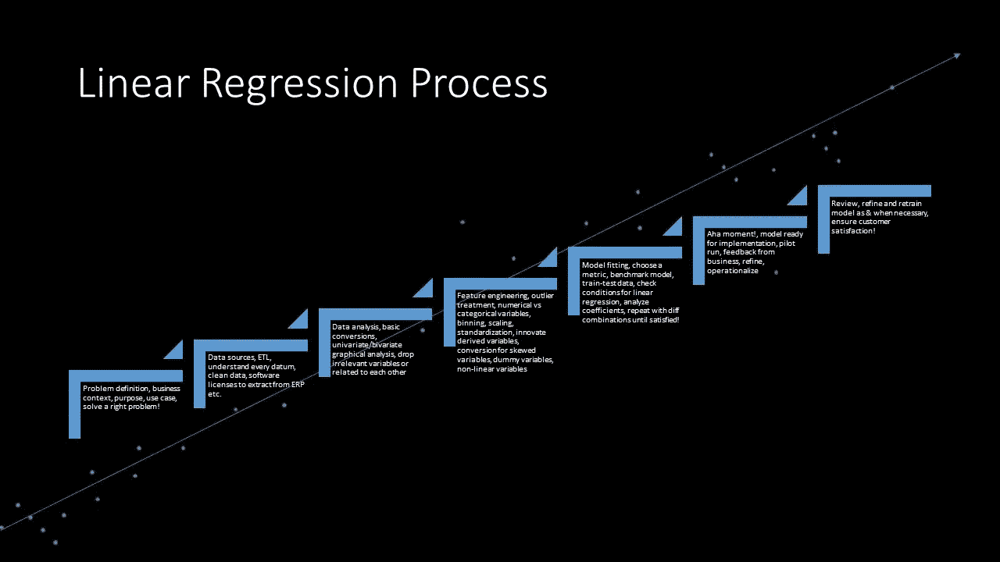

# 线性回归模型——一种系统方法

> 原文：<https://medium.com/analytics-vidhya/linear-regression-modelling-a-systematic-approach-b09db45d25c2?source=collection_archive---------0----------------------->

**1。** **线性回归—简介:**

线性回归是数据科学领域中最简单、最古老、最成熟、也是最复杂的预测技术之一。它用于预测一个目标变量，该变量本质上是连续的，如销售、库存、利润、降雨量等。

线性回归被归类为监督学习和参数算法。

监督学习是一种在输入数据(称为“训练数据”)上训练算法的方法，输入数据已被标记为特定输出(通常称为因变量或目标变量)。参数算法假设函数和估计参数(系数)的特定形式。

例如，线性回归试图拟合以下形式的方程:

Y = b0 + b1*x1 + b2*x2 + b3*x3 + b4*x4 …

此外，要成功拟合线性回归模型，必须满足以下条件:

I)因变量和自变量之间的关系应该是线性的和可加的。

ii)误差(剩余)项之间应该没有相关性。

iii)独立变量不应相关。

iv)误差项应该具有恒定的方差。

v)误差项必须呈正态分布。

线性回归的两个重要用例或目标如下:

I .能够预测未来，即用户主要对目标变量的预测感兴趣。

二。能够解释自变量对因变量的影响，即用户主要对使用自变量的系数来改善目标结果感兴趣。

很多时候，第二个目标比第一个目标更重要，因为它有助于规划业务战略的变化，并以非常科学的方式衡量影响。然而，现实世界过于复杂，无法用模型来描述，因此，由于一个或多个因素，线性回归可能不起作用:

一、可能有一些未知因素影响目标变量。

二。可能知道一些因素，但是收集数据可能不可行

三。目标和自变量之间的真实关系可能超出了线性回归的范围(这是线性回归所允许的)。

还需要提到两个方面:

I)术语“线性”有些误导！可能包括像 x1*x1、x1*x2 等术语。然而方程的基本形式(即 y = B0+B1 * x1+……)应该不会变！然而，所有项的系数必须是线性的！

ii)可能有必要将一些选择变量转换为 sqrt(x)或 log(x ),以便它们的分布接近正态分布。那么线性回归可能会产生好的结果。

iii)线性回归的高级形式，即套索或山脊只是通过使其他变量的系数为零或接近零来帮助保留最重要的变量。它基于一个非常简单但强大的思想，即在误差函数中包含一个惩罚项，以便在优化过程中，使一些(不太重要的)变量为零或接近零。

**2。** **拟合线性回归模型的过程:**

下面列出了实施模型的逐步过程。前几个步骤对于任何建模问题都是常见的:

**2.1** **业务问题:**清楚了解业务问题和建立预测模型的目的(用例)以及在实践中会如何使用，基于模型会做出什么业务决策。否则，一个人可能会花上几天/几周的时间来准确地解决一个错误的问题，这对任何人都没有用！

如果这是一个展示人工智能/数据科学力量的试点项目，那么根据你的判断和哪里有足够的高质量数据，选择一个(或优先选择一个)。

请注意，商业领袖从第一天开始的参与是数据科学项目成功的最重要的先决条件。与企业的持续互动也是必须的。

**2.2** **数据来源:**了解所有数据来源、信息

(变量)可用，以及它们是如何在源系统中被捕获的。通常提取(提取-转换-加载即 ETL 的一部分)也是数据科学项目的一部分，由于系统/数据库的性质，它本身也可以是一个项目。例如，在某些情况下，从 SAP 等 ERP 中提取可能需要采购特定的工具和许可证。几乎在大多数情况下，需要创建事务主数据的副本，因为通常不允许数据科学团队访问运营数据库。

**2.3** **理解数据:**理解每一个数据(变量)

在数据中，其格式(数字、字符、字符串等。)，它的业务环境，目标变量，以及如何获取它。

**2.4** **选择一种算法:**决定是否线性回归

应该作为尝试造型的首选！因变量应该是连续的。

**2.5** **假设列表:** Pl 尽可能多地列出假设。在选择或转换变量或想象/推导新变量时，它们将非常方便。

**2.6** **探索性数据分析(EDA)–**

**2.6.1 基本转换:**此处为基本转换，如将日期时间变量转换为适当的日期时间变量，并提取各种成分，如小时、星期几、月份等。根据问题的上下文来做。类似地，对象变量(如果有的话)被转换成数字或分类变量。(注意:转换为分类变量可以稍后进行，因为它限制了 EDA 过程中需要进行的数学运算)。

**2.6.2 单变量分析:**涉及单独研究所有变量的模式。目的是了解异常值的模式、分布、是否偏斜以及数量。

变量分为数字(整数或浮点)或分类(序数或名义)。

对于连续数值变量，作为图形分析的一部分，绘制“历史图”以可视化分布，无论是否偏斜，“箱线图”以识别异常值(如果有)。

对于数值变量或分类变量(数值数量有限)，绘制“计数图”来分析类别间的变化(如果有)。

**2.6.3 双变量分析:**它涉及关系的图形分析:

自变量(连续或分类)和因变量(在线性回归的情况下为连续),使用条形图、猫图或线图(视情况而定),例如，使用线图是为了显示自变量变化的模式(如小时、月等)。).柱状图或 catplot 用于比较因变量的值和自变量的唯一值。

类似地，使用适当的图(柱状图、猫线图、线图或散点图)等分析独立变量之间的关系。

**2.6.4 统计检验:**自变量之间的进一步关系分析如下:

利用数值连续变量间的皮尔逊相关系数。如果自变量之间有很强的相关性，那么需要去掉其中的一个。

为了确定连续分类变量之间的关系，使用 t 检验或 z 检验。

为了确定分类变量之间的关系，使用卡方检验。

**2.7**

转换，并为实际模型拟合做好准备。这一步对于模型的正确工作非常重要。

不增加建模阶段价值的变量(例如 ID)可以删除。稍后可以删除该字段，因为在特征工程过程中可能需要重新连接所创建的数据子集。

异常值，尤其是极端异常值需要适当处理(删除，如果有的话，应该是最后的选择。)

必须使用 MinMaxScaler、Standardize 或 RobustScaler 对变量进行缩放，算法才能正常工作。

变量，如城市、分行、PIN 码、性别……(基本上是代码:主数据)或变量表示具体数据(高度:高、中、矮等。)或者甚至其他变量，例如一天中的“小时”。

例如，一天中的“小时”可以定义为

数值连续变量

分类变量(24 个值！)

根据上下文(如清晨、早晨、下午、傍晚、夜晚等)在一天中的特定时间进行分类变量

因此，需要根据哪一个将显示与问题相关的模式来决定变量的转换。

偏斜或非正态分布的连续变量需要转换为 log 或 sqrt 或其他适当的函数。转换完成后，请务必检查相应的图。

衍生新变量是特征工程的一个非常重要的部分。例如，在运输问题的情况下，当提供起点和终点的地理坐标时，可以考虑以下选项:

o 使用 Google APIs 或同等工具(如果有)提取该位置的邮政编码/pin 码，并获取最短路线的实际道路距离。

o 如果不可用，则获得两点之间的距离(哈弗森或曼哈顿),依此类推

最后，使用“虚拟变量”函数为所有分类变量生成虚拟变量。有时这可能会导致一个“假陷阱”,在那里这些是共线的，给出荒谬的结果。在这种情况下，删除一个变量(第一个或最后一个)，即，如果分类变量有“n”个值，则删除 1 个变量，留下“n-1”个变量。

现在我们已经准备好安装模型了！

**2.8** **模型拟合:**以上工作完成后的最后一步非常简单。

选择一个度量标准，如“平均绝对误差”、“均方误差”等。

按照所需的百分比(例如 75，25)将数据分为训练和测试数据

开发一个简单的基线基准模型并测量误差。

使用标准选项或套索、岭回归拟合回归模型。

预测测试数据并测量测试数据的误差&与基准模型误差进行比较。有了改良款应该就少了！

检查是否满足线性回归条件(如上所述)。

看看这些变量的系数，以及它们是否有意义！

模型已准备好进行部署。

**3.0 结论:**

对于任何非平凡的预测问题，实现线性回归模型是相当容易的。你需要对 Python、统计学有很好的了解，对业务领域有理解，擅长符号操作，有很多常识，对现实世界的系统建模有热情！