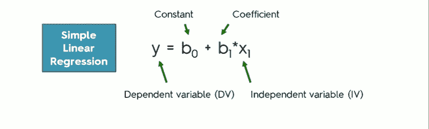
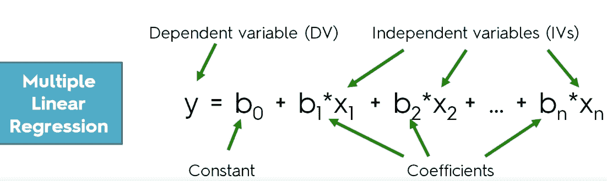
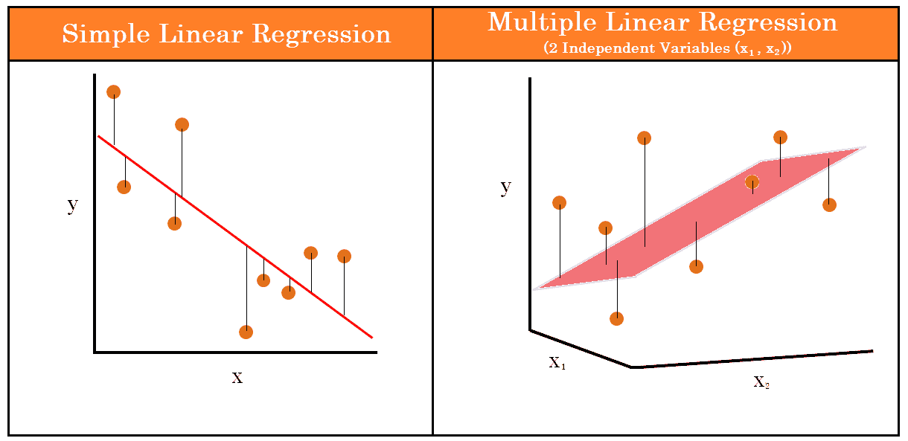

# 线性回归:背后的数学，它是如何工作的，以及一个例子

> 原文：<https://medium.com/analytics-vidhya/linear-regression-the-maths-behind-it-how-it-works-and-an-example-c911a66f02bd?source=collection_archive---------4----------------------->

线性回归可能是您在开始数据科学学习之旅时遇到的第一个算法，猜猜会发生什么？我也是，很可能其他人也是。这是理解和应用起来最简单的算法之一。

现在让我们从数学开始，我知道这不是整个数据科学有趣的部分，但它和其他任何东西一样重要。

让我们把这个等式分解成容易理解的部分:

*   y :否则也可以称为 y-hat(可能看起来像ŷ)是因变量，基本上是我们试图预测的东西。
*   **b0** :这是 y 轴上斜率相交的点，在机器学习术语中，这被称为偏差。
*   **b1:** 称为系数或权重，作为模型参数并赋给 **х** 。系数描述了因变量和自变量之间的关系，所以如果它是负的，那么就有一个反比关系。如果是肯定的，那么就有直接的关系。
*   **x1** :这是自变量，也称为特征。这是直接影响因变量的变量，也是我们试图找到关系的地方。它的范围可以从对因变量的强烈影响到完全没有影响。

还不算太糟，是吧？线性回归是人们用来寻找一个因变量和一个或多个自变量之间的线性(牛津语言将线性定义为沿着一条直线或接近直线排列或延伸的*)的途径。这用一个斜率(一条直线)来表示，以映射变量之间的关系。*

现在，在很大程度上，这是最简单的线性回归形式，但在现实中，如果不是永远，你会在 99.99%的时间里处理多元线性回归。本质上，它们都以同样的方式工作，除了在多元线性回归的情况下，你有不止一个自变量，比如更多。让我们看看它是什么样子的。

对于简单的线性回归，我们有一个偏差，一个系数和一个独立变量。对于多元线性回归，顾名思义，我们有——多元。如上图所示，我们有多个独立变量，每个变量都有自己的偏差。

这里有一张图来形象地说明这两个公式之间的区别。

他们的目标都是一样的——找到所有值的最佳拟合线。在简单线性回归中，这用平面或直线表示，而在多元线性回归中，这用超平面表示。

为了知道我们的最佳拟合线/平面是否可行，我们需要知道预测值和实际值之间的差异有多大，以便尽可能小。为了实现这一点，我们需要找到每个独立变量/特征的权重。Scikit-learn 采用的线性回归使用了一种称为普通最小二乘法的方法，尽管还有其他方法我们不会在本指南中讨论。这是通过四个主要步骤完成的:

1.  首先，我们随机地给权重赋值，这听起来可能有点武断，因为事实就是如此。
2.  我们将随机变量插入线性方程，然后为每个值生成一个预测。
3.  使用残差平方和计算损失，基本上，找出实际产量和预测产量之间的差异，数字应该类似于(实际值-预测值)。然后我们将它们平方，最后将所有的值相加，这将返回我们的剩余平方和。
4.  重复，直到我们达到最小值。

接下来应该会出现一个明显的问题:我们如何得到最小残差平方和呢？为此，我们使用了梯度下降法。

顾名思义，我们要做的是根据权重找到函数的梯度/斜率。重复这个过程，直到我们达到可达到的最小误差。

按说在这之后，我们应该有一个好的模型，我们需要评估它有多好。线性回归有许多可以使用的指标:

1.  r 平方:解释模型产生的方差与实际方差的比较，范围为 0 到 1。越接近 1 越好。
2.  均方误差:这是所有误差的平方根的平均值。这给出了总体平均误差。
3.  均方根误差:与均方误差相同，但在其上加了一个根，以产生一个更可读的误差范围。

线性回归不能用于任何数据集，但尽管如此，它可以用来解决很多问题。因此，从属值必须是连续值，如基于教育程度的工资、基于面积和邮政编码的房价、基于营销预算和价格等因素的销售额，等等。