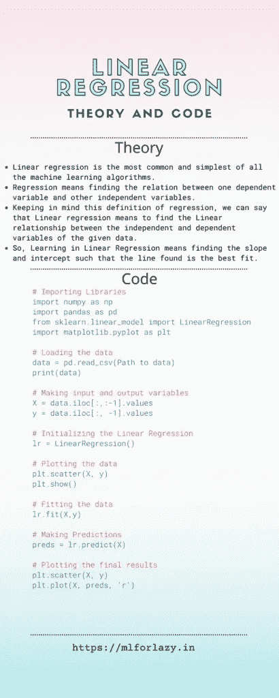
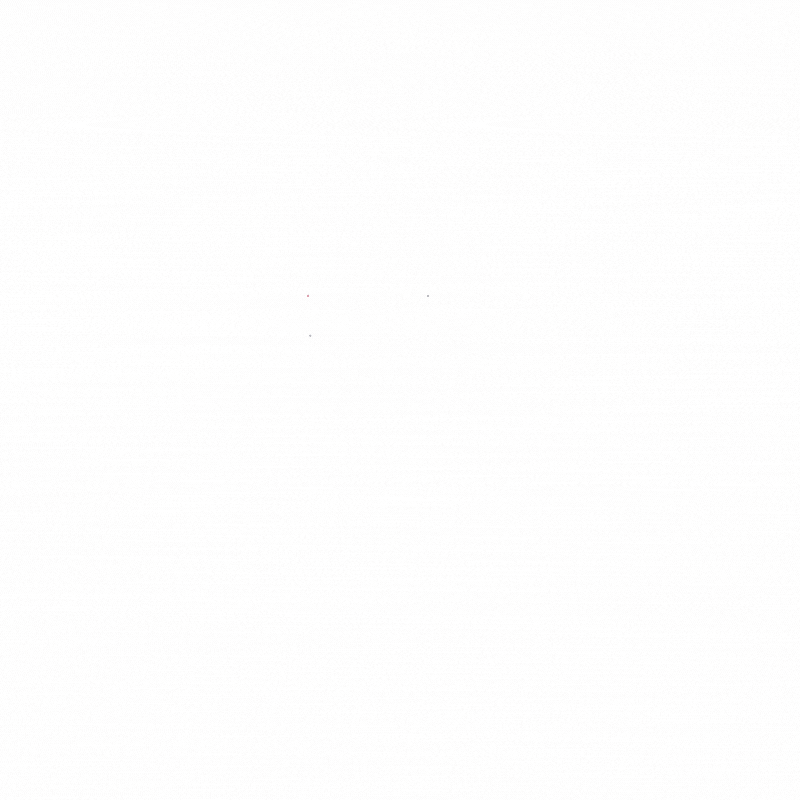
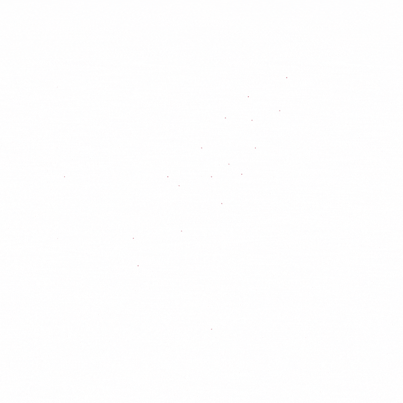
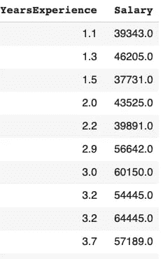
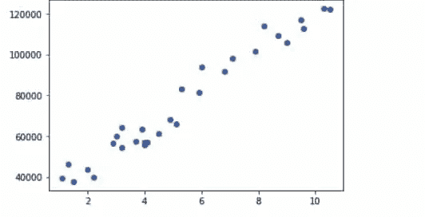
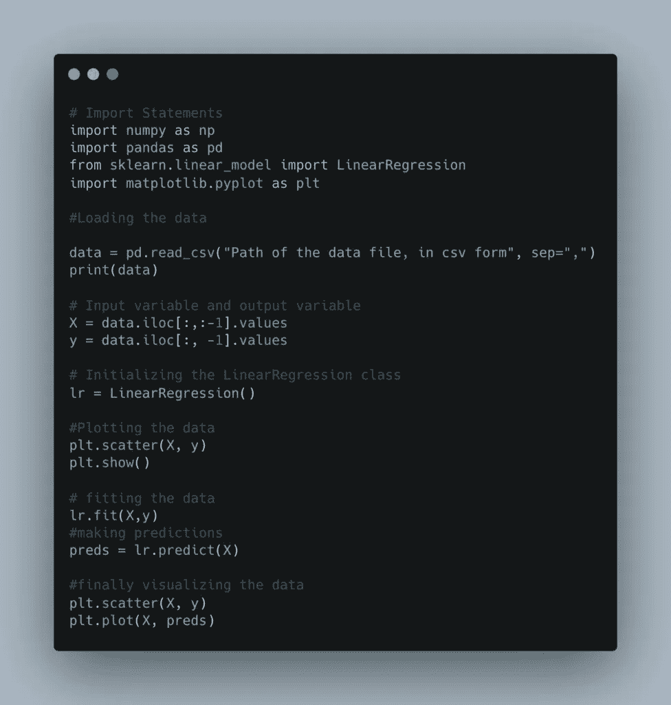

# 线性回归:理论与代码—懒人 2021 的 ML

> 原文：<https://medium.com/analytics-vidhya/linear-regression-theory-and-code-ml-for-lazy-2021-b7b997aa731f?source=collection_archive---------17----------------------->

线性回归是所有机器学习算法中最常见和最简单的。为了理解，这个算法形成了基础，或者我们可以说形成了机器学习算法的基础。

# 线性回归之前。



要理解机器学习，我们需要对高中数学有一些简单的概念。具体来说，坐标几何概念和**直线拟合概念**。坐标几何会让你明白图上的点是怎么表示的？而直线拟合的概念会让你明白，一条直线如何最好地拟合图上所画的点？

## 图表上的点是如何表示的？

让我们来理解这个概念。假设我们有点，比如 X 和 Y 的值如下-

```
X = 1, 2, 3, 4, 5 Y = 9, 3, 2, 5, 6
```

为了在图上绘制这些点(X，Y ),我们分别在 X 轴和 Y 轴上绘制 X 和 Y 点。然后我们在这些点上画垂线，线的交点就是 x 和 y 的点。



## 这条线是如何拟合这些点的？

线条拟合并没有看起来那么复杂。对我来说，一开始我花了一些时间来理解这个概念，但后来，它就成了小菜一碟。我们以这样一种方式画线，通过所有点，使得点到线的距离最小。我们画一条简单的直线，它以这样一种方式穿过集群，它近似于图上的每一个点。

这个近似是什么意思？

简单来说，我们在直线上画一个对应的点，这样直线上的点就是原点的近似值。最后，我们可以取近似值，并在结果中使用该值。

对于给定的数据，可以通过该点画出多条线。我们取那条从点到直线距离最短的直线。

画一条直线，使直线上的原点和近似点之间的距离之和最小，称为画一条最佳拟合直线。因此，最佳拟合线是几乎拟合图上每个点并给我们最小距离的线，也称为机器学习中的错误。



既然我们已经理解了这些概念，现在让我们来理解线性回归实际上意味着什么？

# 什么是线性回归？

[回归](https://www.investopedia.com/terms/r/regression.asp#:~:text=Regression%20is%20a%20statistical%20method,(known%20as%20independent%20variables).)是指找出一个因变量与其他自变量之间的关系。记住回归的这个定义，我们可以说线性回归的意思是找到给定数据的自变量和因变量之间的线性关系。

上面关于直线拟合的解释，其实就是线性回归的意思。因此，当我们说线性回归时，我们指的是与图表上的数据最佳拟合的线，这样，当我们给图表一个新点时，最佳拟合的线也容易且非常有效地逼近该点。这条线以距离最小的方式拟合那个点。

# 线性回归是如何工作的？

这种线性回归是最简单的算法，理解起来非常重要。它的工作是如此重要，一旦理解；你几乎可以解决一半的机器学习问题。

给定点，即图上的数据，线性回归通过数据画几条线。一旦画好线，它就会找到我们之前说过的距离。一旦计算出距离，就进行求和，然后比较这些结果。给出所有线中最小值的线被考虑并被选择作为给定问题的解。

在上面的例子中，蓝线是最佳拟合线，因此是问题的解决方案。

# 线性回归中学习是如何发生的。

让我们看看学习是如何在线性回归中发生的。我们都熟悉下面的方程——直线方程

其中 m =直线的斜率

c 是 Y 轴的截距

当我们得到数据点时，我们应该找到最合适的。那个最佳位有一些斜率和截距值，我们的学习算法试图找到这些值。

因此，学习意味着找到斜率和截距，使得找到的线是最佳拟合的。

## 线性回归误差。

应该有一些性能的衡量标准。在机器学习中，有一个误差的概念用来衡量算法的性能。这个误差意味着我们离实际值有多远。值越大，误差越大。在机器学习中，我们总是以降低误差为目标。为此，我们使用优化算法，如梯度下降等。我们将在接下来的文章中讨论这些。

在线性回归中，我们谈论两种类型的误差(主要是)。

1.  均方差。
2.  均方根误差。

均方误差

当我们利用这个错误时，我们遵循以下步骤:

*   首先，我们计算近似值和实际值之间的差异。
*   然后我们找到差值的平方。
*   之后，我们找到计算值的平均值。
*   这就是均方差。目的是降低这个误差。

取正方形是因为从一点到另一点的距离不应该是负的。

假设我们有不同的值 5，6，7，8

平方并求和后，我们得到— 5 2+ 6 2+ 7 2+ 8 2= 174

除以数值个数，得到计算总和的平均值-174/4 = 43.5。这是获得的均方误差。

均方根误差

当我们利用这个错误时，我们遵循以下步骤:

*   首先，我们计算近似值和实际值之间的差异。
*   然后我们找到差值的平方。
*   之后，我们找到计算值的平均值。
*   这就是均方差。目的是降低这个误差。

取正方形是因为从一点到另一点的距离不应该是负的

假设我们有不同的值 5，6，7，8

平方并求和后，我们得到— 5 2+ 6 2+ 7 2+ 8 2= 174

除以数值的个数，得到计算总和的平均值-174/4 = 43.5。

最后，我们求平均值的平方根，得到最终结果作为 RMSE 误差

所以 RMSE = 6.59，这就是得到的 RMSE。

# Python 中的线性回归代码

在这篇文章中，我将在库的帮助下用 python 实现线性回归，而不是用纯 Python 和 NumPy。

我将在 sci-kit learn、pandas 和 NumPy 的帮助下实现线性回归。在下一篇文章中，我们将只讨论 python 和 NumPy 的代码。为了让您感觉到我们取得了一些成就，我们将从简单的实现开始，而不用担心底层的复杂性和实现。

有两种类型的线性回归-1。简单线性回归 2。多元线性回归。

**简单线性回归** —当我们有一个输入变量和一个输出变量时。

**多元线性回归** —当我们有不止一个输入变量和一个输出变量时。

当我们使用 scikit learn 时，我们不需要担心线性回归的类型，它会为我们处理所有的事情。

所以让我们开始，首先通过导入我们需要的库-

```
import numpy as np import pandas as pd from sklearn.linear_model import LinearRegression
```

Numpy 用于处理矩阵数据。

Pandas 用于处理表格数据，并以美观、格式良好的表格来表示我们的数据。

sklearn 包含学习算法，从中我们会用到，LinearRegression 类。

接下来，我们导入数据。

```
data = pd.read_csv("Path of the data file, in csv form", sep=",") print(data)
```



正如我们所见，有一个输入变量，即经验，和一个输出变量，即工资。现在把输入变量和输出变量分开

```
# Input variable X = data.iloc[:,:-1].values y = data.iloc[:, -1].values
```

*iloc* 是访问*数据帧*(熊猫给我们的)和点值(。值)给我们一个数组中的结果。得到这些 X，y 后，我们初始化 LinearRegression 类。

```
lr = LinearRegression() import matplotlib.pyplot as plt plt.scatter(X, y) plt.show()
```



Matplotlib 是一个库，它让我们可视化数据。

做完这些之后，是时候训练线性回归器了。对此，我们有一个拟合方法，顾名思义，就是拟合数据。拟合允许算法找到最佳 m 和 c。训练后，我们找到预测值，即学习后的近似值。对于这一点，我们有，预测方法并以如下方式使用。

```
preds = lr.predict(X)
```

在找到相同数据的预测后，我们再次绘制数据以及算法找到的最佳拟合线。

```
plt.scatter(X, y) plt.plot(X, preds)
```



# 结论

因此，在这篇文章中，我们学习了线性回归的理论和代码。我们说线性回归是如何工作的，以及它的基本含义。如果你理解了，那么是时候进行下一个话题了。坚持练习，直到你清楚地掌握了这些概念。在下一篇文章中，我们将只使用 NumPy 库来编写相同的回归器，我们将看到它是如何在幕后工作的。

如果你喜欢这篇文章，给它一个大拇指，分享这篇文章，享受机器学习。

想看我[以前的帖子](https://mlforlazy.in)。

谢谢，请慢用:)

找不到帖子


我是一名来自克什米尔的计算机科学研究生。在这些日子里，我转向传播关于机器学习的信息，这是我的激情和未来的研究。目的是让人们了解和理解机器和深度学习本身的基本概念，这些概念对该领域的进一步成功至关重要。

*原载于 2021 年 5 月 16 日*[*https://mlforlazy . in*](https://mlforlazy.in/linear-regression/)*。*