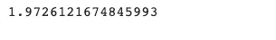

# 线性回归—使用 Numpy 和 Python —适用于 Lazy 2021 的 ML

> 原文：<https://medium.com/analytics-vidhya/linear-regression-using-numpy-and-python-ml-for-lazy-2021-d702915b1eeb?source=collection_archive---------9----------------------->

在文章[线性回归——理论和代码](https://mlforlazy.in/linear-regression/)中，我们学习了线性回归以及线性回归是如何工作的。

我们看到了使用 sci-kit learn 库的概念的简单实现，并且能够通过具有一个输入特征和一个输出特征的数据点找到最佳拟合线。

使用 sci-kit learn，我们学习了上层概念，当我们实现时，我们不知道幕后发生了什么。现在我们已经看到了 LR 的运行，并做了一些预测，是时候了解我们编写的代码的背后细节，并在不使用 sci-kit 库的情况下编写相同的代码了。

许多人知道上层的概念，很少有人知道幕后的概念。**要了解树，不要只吃果实，还要了解树的根。**

在这篇文章中，我们将使用 python、NumPy 和 pandas 编写代码来加载数据。我们可以使用纯 python 读取 CSV 文件，但此时，我们将使用 pandas 并使用 pandas 编写这些文件访问。

# 最简单的回归方程。

我们能得到的最简单的数据是有一个输入变量和一个输出变量的数据。


对于这种数据，我们可以写出的最简单的方程是直线与截距和斜率的方程。

即:-

y = mx + c

其中 m =斜率，c =截距


**现在，当我们谈论线性回归时，整个目标是找到穿过数据的直线，以便该直线非常有效地逼近所有数据点，这意味着找到最佳斜率和最佳截距值。**

## 标量和向量的概念。

在上面的等式中，c 和 m 都是标量。

标量是正常的数字，如 2，3 等。

这里我们用小写字母 X，y 表示定标器，用大写字母 X，y 表示向量。


在机器学习中，我们把上面写的等式写成如下—[方式]

y =θ_ 0+θ_ 1 . x

θnot 和θ与截距和斜率相同，在这种情况下，它们是标量。但是在这里，我们说θnot 是偏差，θ1 是权重。简单来说，θnot 是任意常数值，θ1 是变量 x1，x2 等的常数。

因为我们讨论的是简单的线性方程，所以我们得到的方程是一个变量，可以是这种形式[举例]即 y = 2 + 5x

在上式中，y =输出变量，2 =θnot[某个常数]，5 是 x 的常数，根据上式，它等于θ。

假设我们有 2 个数据点，那么我们将有 2 个等式，每个等式一个。同样的，对于 n 个数据点，我们会有 **n** 个不同θnot 和θ值的方程。在 2 个数据点的例子中，我们可以有-

y_1 = 2 + 3x_1

y2 = 1+6x 2

这里，y1 是第一输入数据点的输出，y2 是第二数据点的输出。


当我们在寻找一条直线的方程时，我们在逼近数据点。权重和偏差不断变化，直到我们得到最佳拟合线。所以机器学习中的学习就是学习这些偏差和权重，得到它们的最优值。

因此，学习=学习最佳权重和偏差。

现在，由于真实数据不仅仅包含一两个数据点，而是包含大量的数据点，我们无法将所有这些数据点表示为单独的方程。在这种情况下，我们使用向量符号来简化我们的任务。直截了当地说，我们使用矩阵。而一维矩阵被称为向量。


你可以从第[页](https://en.wikipedia.org/wiki/Matrix_(mathematics))中了解更多关于标量、向量和矩阵的信息。

# 含有两个或更多变量的方程

真实世界的数据看起来像这样-


上述数据只有一个输入数据列，但实际数据有许多列，即许多影响输出的输入要素

y _ 1 =θ_ 0+θ_ 1x _ 1+θ_ 2x _ 2…

这些**θ**和**θ**可以用与上面相同的方式表示，即向量符号。唯一的区别是，X 现在是一个 m*n 维矩阵，而不是一个列向量。

x 可以表示为-


其中 X1，X2 是单独的列向量

# 数据如何影响输出。

简单方程和多重方程是一样的，不同的是

在简单的线性回归中，只有一个因素影响输出


在线性回归中，多个因素负责输出。


# 方程的向量形式

这种形式的数据是相当庞大的，我们无法一一对其进行操作。所以对于这一点，向量运算来拯救，我们，在机器学习中，使用向量运算。

因此，上述方程的矢量形式可以写成:

y =θ。(点)X

使用 NumPy 点积。NumPy 为我们提供了许多执行数学矩阵运算的函数。

为了得到解决方案，我们必须转置θ，即，用列替换行，然后用特征矩阵点积。这样做是因为矩阵的乘法性质，即第一矩阵的行数应该等于第二矩阵的列数。

# 解决方案

当我们谈论线性回归时，我们试图找到简单直线方程的解。因为我们希望预测尽可能完美，所以我们学习了影响输出的两个常数。

线的方程是— y = mx + c，所以我们试着去学习它们。我们的目标是找到这些常数的值，这样它们就给出了最佳拟合线。

对于 m 和 c，我们有以下等式

m =(y . dot(X)-y . mean()* X . sum())/(X . dot(X)-X . mean()* X . sum())和

c =(y . mean()*(X . dot(X))—X . mean()* y . dot(X))/(X . dot(X)-X . mean()* X . sum())

现在我们需要做的，就是将这些方程用于我们的数据，并找到它们的值。下面的代码做到了这一点。

首先，我们需要导入库并读取数据。

```
import pandas as pd import numpy as np dataset = pd.read_csv("datapath") dataset.head()
```


我们将数据分为输入和输出。X =输入列，y =输出列。通过使用“值”，我们将它们转换成 NumPy 数组。

```
X = dataset[0].values y = dataset[1].values
```


让我们使用 matplotlib 可视化这些数据。

```
import matplotlib.pyplot as plt plt.scatter(X,y)
```


应用我们上面针对 m 和 c 描述的等式

```
# applying the equations we have for A, B denominator = X.dot(X)-X.mean() * X.sum()m = (y.dot(X) - y.mean() * X.sum())/ denominator print(a)c = (y.mean() * (X.dot(X)) - X.mean() * y.dot(X)) / denominator print(b)
```



现在，将 m 和 c 的值放入方程 line-y = MX+c

```
yHat = m*X + c print(yHat) # yhat is the predicted value
```

让我们看看，线是如何找到的。

```
plt.scatter(X, y) plt.plot(X, yHat, 'r')
```


误差计算

```
# calculate the R sqr # yhat - y squared, then sum, then sqt, then divide by difference = yHat-y
```

这里我们发现均方根误差。

```
R = np.square(difference) rms = np.sqrt(R.sum())/len(R) np.sqrt(difference.dot(difference))/len(difference) print(rms)
```


均方根越低，拟合越好。

因此我们得到的直线方程是-

# 结论

希望你了解了简单线性回归的背景，以及它在 numpy 和 python 中的实现。现在，起来喝杯咖啡吧。梳洗一番，自己动手弄脏手。

看之前的帖子。

如果你喜欢这篇文章，请与朋友分享🙂


我是一名来自克什米尔的计算机科学研究生。在这些日子里，我转向传播关于机器学习的信息，这是我的激情和未来的研究。目的是让人们了解和理解机器和深度学习本身的基本概念，这些概念对该领域的进一步成功至关重要。

*原载于 2021 年 5 月 23 日*[*https://mlforlazy . in*](https://mlforlazy.in/linear-regression-using-numpy-and-python/)*。*