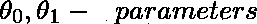
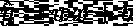

# 一元线性回归

> 原文：<https://medium.com/analytics-vidhya/linear-regression-with-one-variable-b5f59f92ab22?source=collection_archive---------0----------------------->

在监督学习中，我们被给予一个具有特征和结果集的数据集。回归算法用于预测无法按定义的类别分离的连续值输出。房价预测就是回归问题的例子之一。

单变量线性回归是最简单的算法之一，当数据只存在一个特征时，它可以预测结果。

让我们首先用符号来表示这个模型，

x =输入数据/特征

y =输出数据

m =训练数据集中的输入数量

`Training set → Learning Algorithm → h (hypothesis function)`

这个假设函数然后为输入 x 产生一个输出，

它也可以写成这种形式，表示数学中的斜率函数，

其中 y 是预测的输出

w 和 b 是参数

x 是给定的输入数据

**参数决定模型**的输出。当我们用训练数据集训练模型时，模型会学习这些参数。

一个模型不可能 100%准确地预测结果，总会有误差。这些误差是正确输出和预测输出之间的差异。它们可以通过成本或损失函数来计算。

# 成本或损失函数

成本函数用于决定如何选择参数以获得最佳拟合。

这里，使用最小平方损失函数。

成本/损失函数

为了最小化损失函数的误差，我们必须找到引起最小误差的最小参数。

我们将损失或成本函数除以(平均)2m，以降低误差值。这样做不会改变他们之间的关系。为了便于计算梯度下降，平均值减半，因为平方函数的导数项将抵消 1/2 项。这也被称为平方误差函数或均方误差。它是线性回归问题常用的代价函数之一。

为了简化成本函数，我们将假设

损失函数变成了，

当我们考虑参数= 1 时，输入 x 等于输出 y，因此成本函数为 0。

参数=1 时的假设函数，预测输出=实际输出

在这种特殊情况下，损失为零。

现在让我们假设参数= 0.5，那么图表将是这样的，

损失函数将是，

同样的，

当我们不断计算不同的参数值时，我们会得到不同的损失函数值。**最后，我们选择产生最小损失函数的参数值作为参数的值。该参数被称为处于其全局最小值。**

因此，当考虑到这两个参数时，绘图就变成三维的了。损失函数具有最小值的点，即模型考虑的参数值。

# 梯度下降

梯度下降法是寻找使模型损失最小的参数最小值的方法之一。这个方法可以用来最小化任何函数。

让我们假设模型中有两个参数。让我们为参数分配不同的值，并找到相应的损失函数。利用获得的参数值和损耗值，我们绘制一个图(3D)。图表如下所示:

现在，我们可以选择图上的任何一点，并开始朝着将达到最低值的路径移动。采用最初选择的点。向其绘制一条切线，并计算直线的斜率。下一步移动固定在坡度值上。

这个图有两个最小值，它们被称为局部最小值。

数学上，下面的算法可以用来寻找最小点。

> 重复下面的计算直到收敛:

趋同；聚集

在每次迭代中，参数应该同时更新。像这样，

为了更容易理解这个过程，让我们只考虑这个函数的一个参数。

等式是这样的，

> 重复直到收敛:

当我们只考虑一个参数时，函数将是凸的

对于正斜率，我们可以通过下式找到全局最小值

对于负斜率，我们可以通过下式找到全局最小值

谈到参数α，我们可以在每次迭代中调整它的值。如果 alpha 太小，那么梯度下降(从任何一点到最小值的过程)会很慢。如果α太大，梯度下降会超过最小值。它可能无法收敛甚至发散。

即使学习速率α固定，梯度下降也能收敛到局部最小值。当我们接近局部最小值时，梯度下降将自动采取较小的步骤。这是因为损失函数(w.r.t 参数)的偏导数随着其接近最小点而改变(大部分减少)。

对于一个线性回归损失函数(是二次函数)，我们得到的图总是凸的(碗朝上)。在凸图形中，只有一个极小点。因此，最小点既是局部最小值又是全局最小值。

这意味着无论我们从哪里选择一个点开始下降，我们总是到达相同的最小值点。

*注:本文是#30DaysOfData 的一部分，文章内容是我自己从* [*Andrew NG 机器学习课程*](https://www.coursera.org/learn/machine-learning) *中的笔记。*