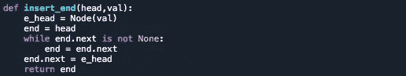

# 数据科学家的链接列表

> 原文：<https://medium.com/analytics-vidhya/linked-list-for-data-scientists-c0a02a3b1f7b?source=collection_archive---------10----------------------->

数据结构对于实现数据科学管道至关重要。很多公司在面试中会问数据结构相关的问题，来判断一个数据科学家的能力。这些问题大多是数据科学家在一对一面试前必须通过的编码测试的一部分。所以，你可能必须学习数据结构来破解数据科学面试。

**链表**

链表是一种数据结构，可以被视为一个节点链，其中每个节点都指向下一个节点。

https://en.wikipedia.org/wiki/Linked_list

每个节点都是一个对象，包含一个值和一个指向下一个节点的指针。例如，在上面的表示中，包含数据 12 的节点指向下一个包含数据 99 的节点。然后 99 指向节点 37，依此类推，直到序列遇到一个空节点。

也有双向链表，其中每个节点包含前一个和下一个节点的地址。

https://en.wikipedia.org/wiki/Linked_list

**用 Python 创建链表**

通过定义一个类来创建节点，可以创建一个链表。

类对象可用于创建多个节点，并将它们连接在一起形成一个链表。

**链表的常见操作**

**A .在开始处插入一个新节点**

元素可以在固定的时间插入链表的开始。这是你可以做到的。

我们只需创建一个 n_head 对象，并将其指针设置为指向链表的前一个头部。

**B .在末尾插入一个新节点**

元素可以在固定的时间插入到链表的末尾。这是你可以做到的。

我们只需创建一个 e_head 对象，并将链表中最后一个元素的指针设置为指向它。

**C .打印链表**

我们迭代地遍历链表，直到遇到结尾或空节点。

**D .反转链表**

可以通过在将指针移动到下一个节点时反转指针方向来反转链表，直到有下一个节点为止。

**结论**

使用链表很有趣，你可以学习这些来提高你的编程技能。

这里是我的 Github 库，你可以在这里找到我的代码。