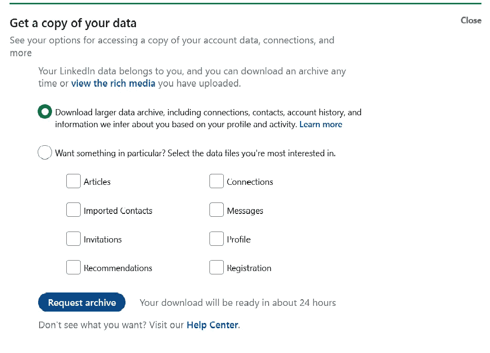
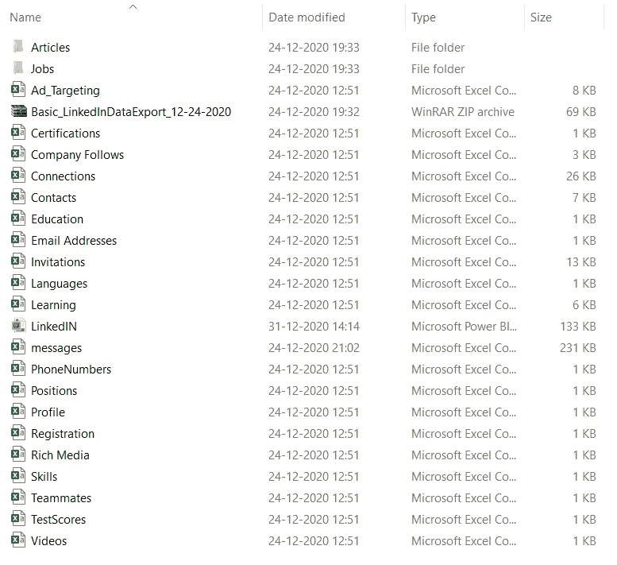
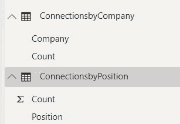
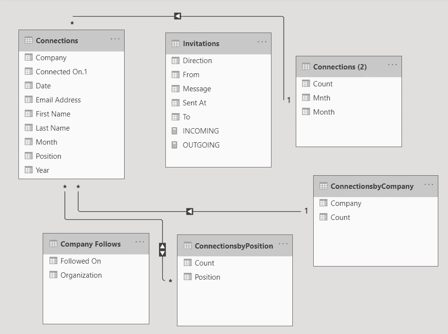
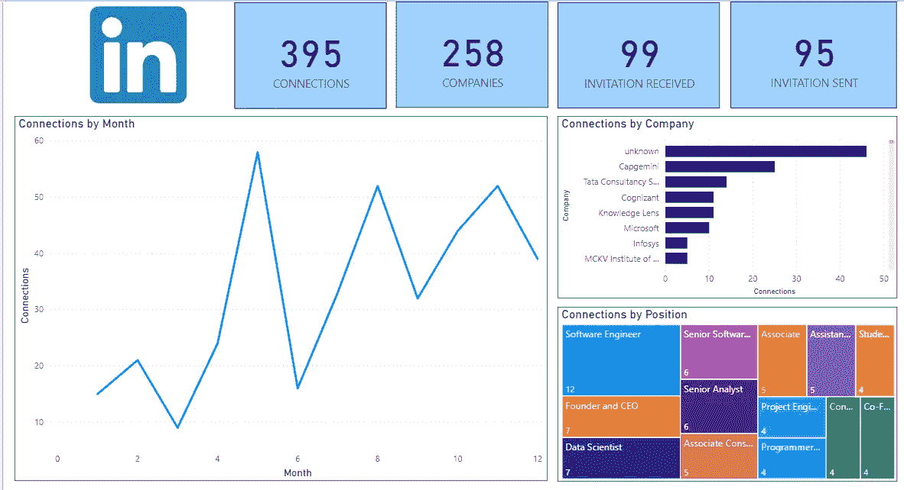

# LinkedIn 数据可视化

> 原文：<https://medium.com/analytics-vidhya/linkedin-data-visualization-54b8fdb0ebca?source=collection_archive---------22----------------------->

嗨伙计们！

今天我将指导你从你的 LinkedIn 个人资料中创建一个非常简单的仪表板。

1.  获取 LinkedIn 个人资料数据。

转到您的 LinkedIn 个人资料->设置和隐私->获取您的数据副本。

选择上面的选项“下载更大的数据档案，包括联系方式、联系人、帐户历史记录以及我们根据您的个人资料和活动推断出的有关您的信息。”并点击“请求存档”。

你的数据文件会在一段时间内由 LinkedIn 邮寄给你。

这是我收到的数据文件。

接下来，我们将直观显示 Power BI 上的数据。

重要的一步——花点时间阅读你的数据，并创建一个你想要构建的视觉效果的思维导图。这是我构建的一个演练。

2.用数据创建一个 Power BI 仪表板。

打开 Power BI Desktop。

导入一些数据文件。我导入的数据文件是:-

邀请、公司关注和关系。

接下来，我复制了两次连接文件。并删除了其中一个复制文件中除公司列和另一个文件中的职位列之外的所有列。因此，创建两个这样的表格-

然后，仅使用日期列再次复制连接。从日期中提取月份。并为表中每个月的出现次数创建了一个计数列。从而得到每个月的连接数。

我将丢失的值替换为未知。

将关系定义如下-

现在，是时候创建一个充满视觉效果的仪表板了。

思考片刻后。我决定在视觉效果中添加四个卡片、一个折线图、一个树形图和一个簇状条形图，并在适当的地方使用过滤器和 DAX 查询，使仪表板看起来有点像这样。

这就是我的视觉效果。请在评论中告诉我你的表现。如果你觉得这个有趣或有帮助，请告诉我。

更多有趣的文章等着你。

感谢阅读。

在 LinkedIn 上关注我—[https://www.linkedin.com/in/sayani-roy-chowdhury-75a480163/](https://www.linkedin.com/in/sayani-roy-chowdhury-75a480163/)