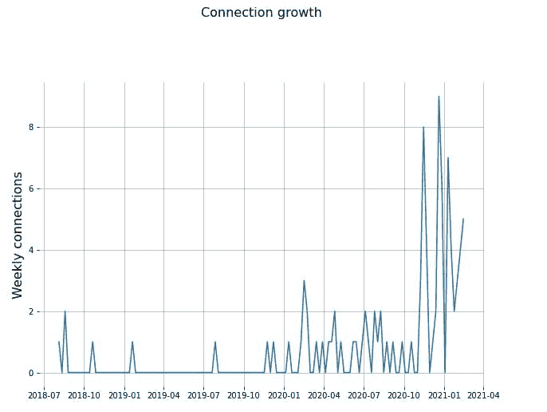
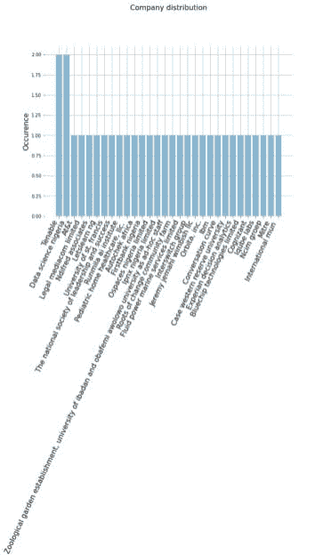
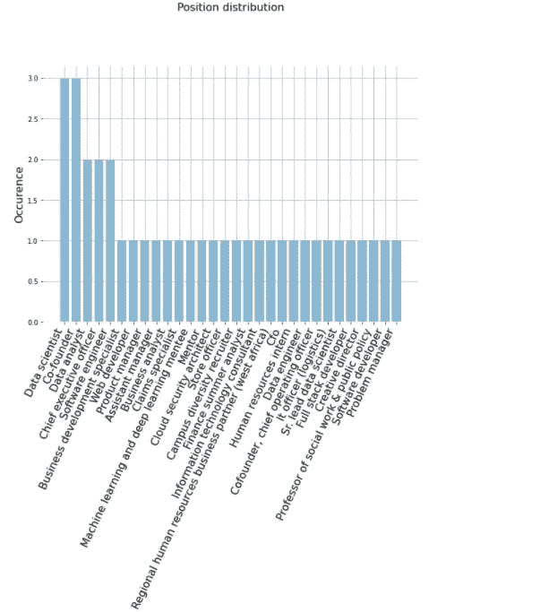
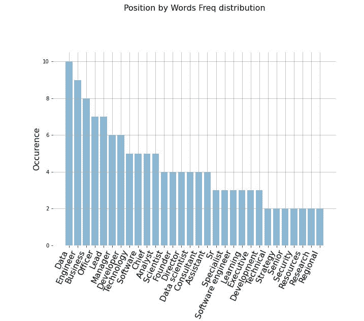

# LinkedIn 增长分析

> 原文：<https://medium.com/analytics-vidhya/linkedin-growth-analysis-c454585a6062?source=collection_archive---------34----------------------->

# 背景:

灵感来自 Upwork 上的一个问题陈述，虽然不是这个。刊登了一则招聘数据科学家的广告，该科学家可以分析一个人的网络中各种连接之间的相互联系。它给了我一个分析我的 LinkedIn 增长的想法，在网上搜索并找到了 Guillaume Chevalier 的这个[回购](https://github.com/guillaume-chevalier/LinkedIn-Connections-Growth-Analysis/blob/master/LinkedIn-Connection-Plots.ipynb)。

# 数据采集:

导航到我的 LinkedIn 个人资料，转到设置，然后隐私设置获取我的数据。过了 13 分钟才通知我准备好了。我拿到的文件在。txt，我不得不使用在线提取器，可能是因为我请求了比我的连接数据集更多的内容。

# 数据预处理:

我按照 Chavalier 的做法，把 connected on 换成 connected，尽管这不是他使用的变量。

然后，我设置我想要显示的图像大小、颜色、字体和星期几，以便查看每天的连接数量。然后我定义了条形图和曲线图应该是什么样子。最后，我使用矢量器来获取与我的连接相关的关键词的频率。

# 数据可视化:

将我加入 LinkedIn 的四年间的联系增长可视化。

根据他们工作的公司可视化我的关系

基于他们在各自公司中的角色/职位进行可视化

最后可视化与之相关的关键词

# 结论:

这是这个迷你项目的[回购](https://github.com/Nwosu-Ihueze/growth_analysis)。你可以在 [LinkedIn](https://www.linkedin.com/in/rosemary-nwosu-ihueze/) 和 [Twitter](https://mobile.twitter.com/adaihueze) 上和我联系。感谢您的阅读。