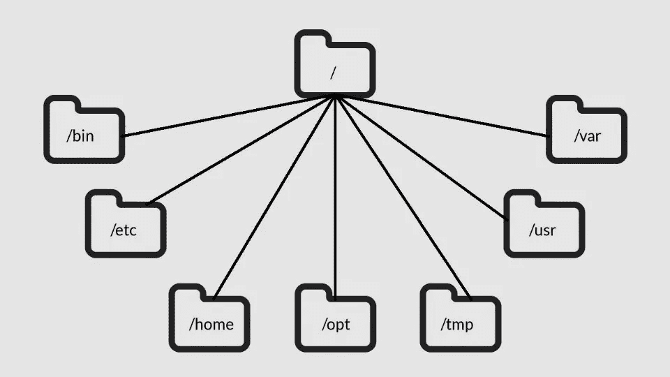
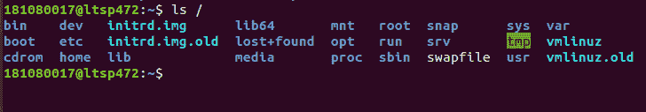

# Linux 目录解释

> 原文：<https://medium.com/analytics-vidhya/linux-directories-explained-75c376173947?source=collection_archive---------15----------------------->

**/root(/:**/root 是系统超级用户(也称为“管理员”)的主目录。Linux 系统中的所有目录都在根目录下，由正斜杠(/)表示。您系统中的所有内容都可以在这个根目录下找到，即使它们存储在不同的虚拟或物理设备中。

**/bin :** /bin 是包含二进制文件的目录，也就是你可以运行的一些应用和程序。

**/boot:**/boot 目录包含启动系统所需的文件。

**/dev :** /dev 包含设备文件。其中许多是在启动时甚至是在运行中生成的。

**/etc :** /etc 是名称开始变得混乱的目录。/etc 的名字来自最早的 Unixes，它的字面意思是“等等”,因为它是系统文件的转储区，管理员不知道还能放在哪里。

**/home :** /home 是一个可以找到你的用户的个人目录的地方。在我的例子中，在/home 下有两个目录:/home/kapil，它包含了我所有的东西；和/home/guest，以防有人要借我的电脑。

**/lib :** /lib 是库居住的地方。它们包含应用程序用来在桌面上绘制窗口、控制外围设备或将文件发送到硬盘的代码片段。它包含了所有重要的内核模块。

**/media:**/media 目录是当您插入外部存储器并尝试访问它时，外部存储器将自动挂载的位置。

**/mnt :** 这是您手动挂载存储设备或分区的地方。

**/opt:**/opt 目录通常是你编译的软件有时会登陆的地方。应用程序将位于/opt/bin 目录中，库位于/opt/lib 目录中。应用程序和库的另一个位置是/usr/local，当软件安装在这里时，也会有/usr/local/bin 和/usr/local/lib 目录。

**/proc :** /proc，和/dev 一样是一个虚拟目录。它包含关于您的计算机的信息，例如关于您的 CPU 和 Linux 系统正在运行的内核的信息。

**/run :** /run 又是一个新目录。系统进程使用它来存储临时数据是出于他们自己的恶意。

**/sbin :** /sbin 类似于/bin，但是它包含了只有超级用户(因此首字母 s)会需要的应用程序。/sbin 通常包含可以安装、删除和格式化东西的工具。您可以使用 sudo 命令来使用这些应用程序，该命令暂时授予您对许多发行版的超级用户权限。

**/usr :** /usr 包含一个目录大杂烩，其中依次包含应用程序、库、文档、壁纸、图标和一长串需要由应用程序和服务共享的其他东西。您还可以在/usr 中找到 bin、sbin 和 lib 目录。最初,/bin 目录(挂在根目录下)包含非常基本的命令，比如 ls、mv 和 RM；但是许多现代 Linux 发行版只是把所有东西都放在/usr/bin 中，并让/bin 指向/usr/bin，以防完全擦除它会破坏某些东西。Ubuntu 和 Mint 仍然保持/bin 和/usr/bin(以及/sbin 和/usr/sbin)分开；

**/SRV:**/SRV 目录包含服务器的数据。如果你从你的 Linux 机器上运行一个 web 服务器，你的站点的 HTML 文件将进入/srv/http(或者/srv/www)。如果您运行的是 FTP 服务器，那么您的文件将进入/srv/ftp。

**/sys :** /sys 是另一个类似于/proc 和/dev 的虚拟目录，也包含来自连接到您计算机的设备的信息。

**/tmp :** /tmp 包含临时文件，通常由您正在运行的应用程序放在那里。文件和目录通常(不总是)包含应用程序现在不需要，但以后可能需要的数据。

**/var :** /var 最初被命名是因为它的内容被认为是可变的，因为它经常改变。今天，这有点用词不当，因为还有许多其他目录也包含经常更改的数据，尤其是虚拟目录。/var 包含类似于/var/log 子目录中的日志之类的东西。日志是记录系统上发生的事件的文件。如果内核中出现问题，它将被记录在/var/log 中的一个文件中。

谢谢你