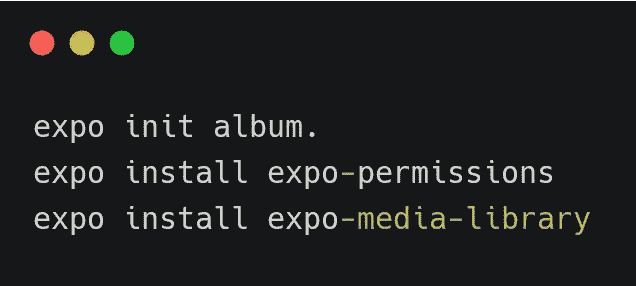
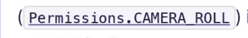
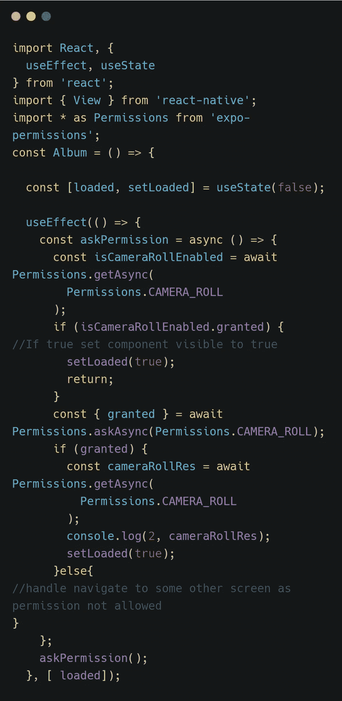
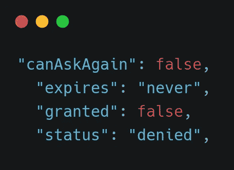
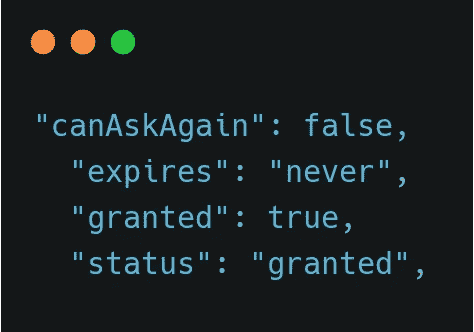
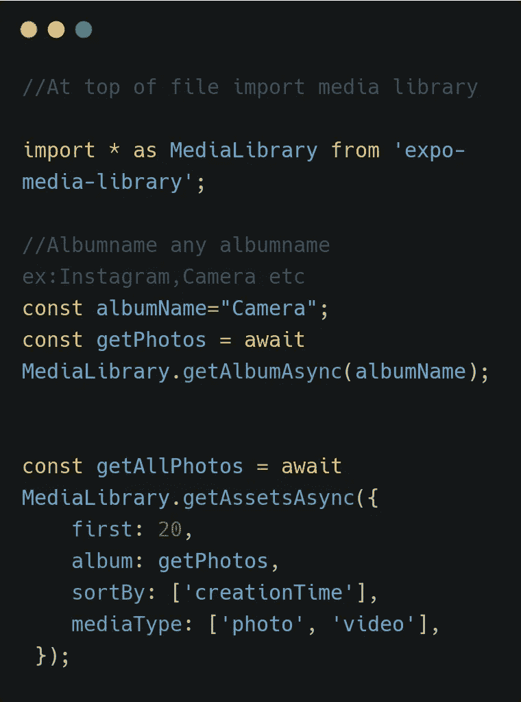
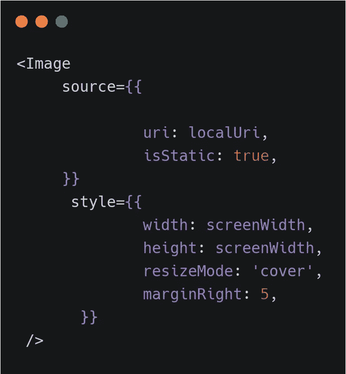

# 列出所选相册的所有图片

> 原文：<https://medium.com/analytics-vidhya/list-all-images-of-selected-album-react-native-expo-b51bef62c4df?source=collection_archive---------2----------------------->

Expo 是一个强大的 React Native 环境，可以帮助您从创建到分发 React Native 应用程序。

这篇文章的主要目的是什么？

有很多文章都是关于如何拍照和存储的。当我在做一个项目时，我在显示相册中的照片列表时遇到了问题。我寻找它的解决方案，但不幸的是找不到它。在阅读和理解文档之后，我终于能够解决这个问题了。我们开始吧。

**先决条件**:你的系统中安装了 expo， *react* 和 *react native* 的基础知识。

***Expo init project name***创建新项目。

***Expo-permission***s 处理权限。

***Expo-media-library***提供对用户媒体库的访问，允许他们从应用程序访问现有的图像和视频，以及保存新的图像和视频。

创建一个组件文件，并将其包含在主文件 app.js 中

在组件文件中，作为第一步，我们需要处理权限。

我们需要哪些权限？

嗯！让我们问问我们的朋友。嘿，文档，我们需要向用户询问什么权限。

所以我们需要*摄像许可*。

我们请求允许摄像。在请求权限之前，我们使用 ***getAsync()*** 方法检查用户是否已经允许权限。如果是，我们将 loaded 改为 true，这样我们就可以显示我们的组件。如果用户不允许权限，我们使用 ***askAsync()*** 方法请求权限。如果用户允许，我们将 loaded 设置为 true 并显示组件，否则我们可以将用户导航到主屏幕。

当用户取消权限时，我们得到以下对象。

如果用户接受许可

***getAsync()*** 和 ***askAsync()*** 根据用户的动作返回上述两个对象中的任意一个。通过使用*授予的*和*状态*属性，我们可以处理 app 的逻辑。

让我们列出所选相册的所有图像。

***getAlbumAsync(名字)***

*name 接受代表 ***专辑名*** 的字符串。如果相册存在，它返回一个对象。该对象包含所选相册的详细信息(id、标题、文件夹名称等)。如果相册不存在，则返回空值 ***。****

*在 ***getAssetAsync()*** 中，我们已经将相册细节( ***getAlbumAsync()*** 方法的结果)传递给相册属性。该方法返回传递给它的相册的项目列表。我们可以传递更多配置给它，比如第一、排序、媒体类型。*

*参考文档了解更多信息:*

* [## 媒体库-世博会文档

### expo-media-library 提供对用户媒体库的访问，允许他们访问他们现有的图像和…

docs.expo.io](https://docs.expo.io/versions/latest/sdk/media-library/#medialibraryaddassetstoalbumasyncassets-album-copyassets) 

将以上两个方法包装在 ***async*** 函数中。

为了列出我们设备中的所有相册，我们使用***getAlbumsAsync()***来列出用户创建的相册。

就是这样。

***【getAlbumsAsync()***-列出所有相册
***getAlbumAsync(album name***)-列出 album name
***getAssetsAsync(options)***-获取一页资产

# 快速笔记显示本地 URI 图像

为了显示本地图像，我们必须添加以下属性

isStatic:true
提及宽度和高度*