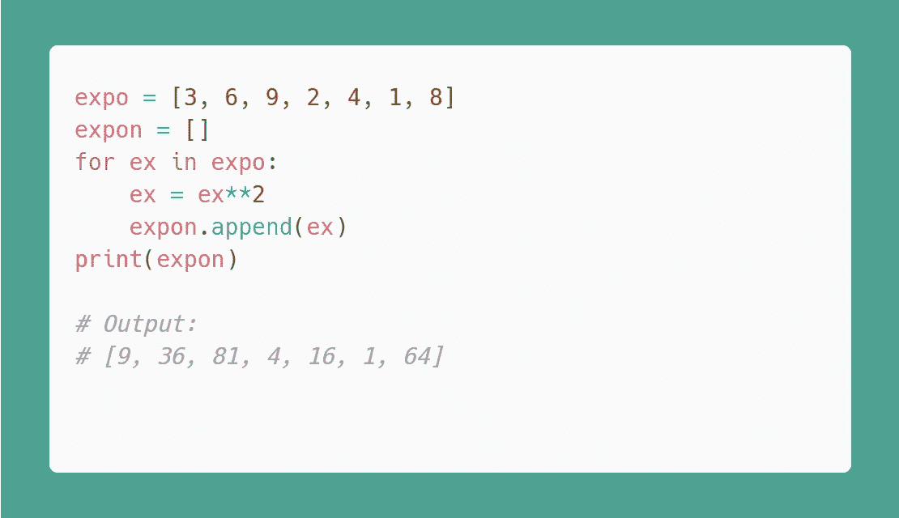
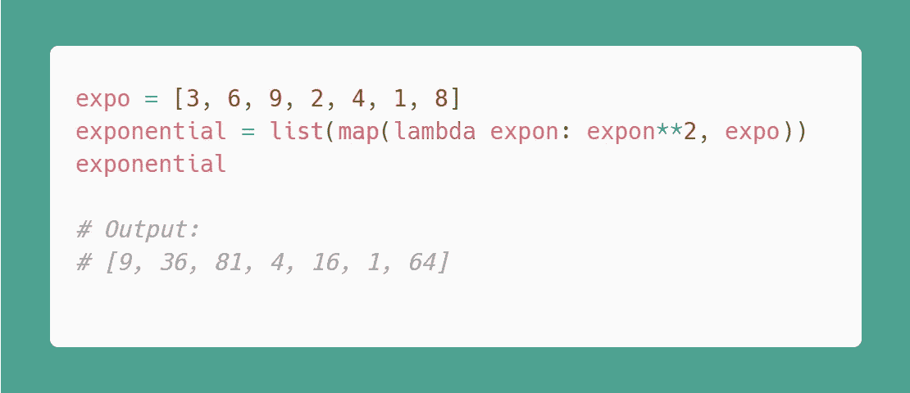
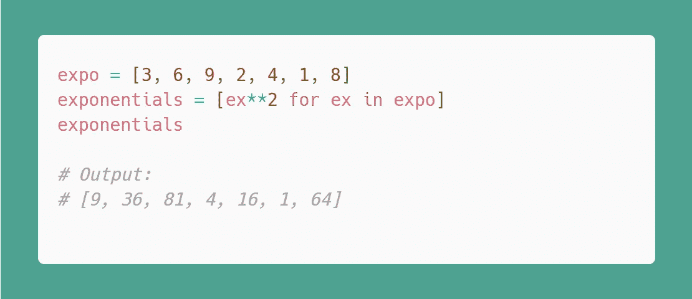
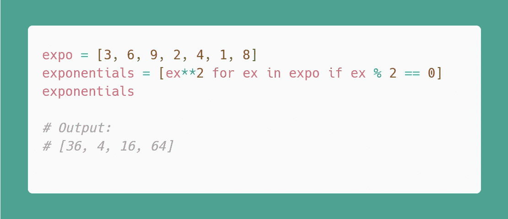
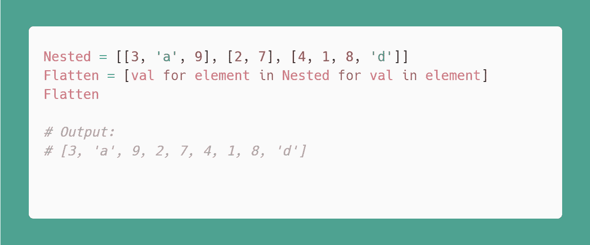
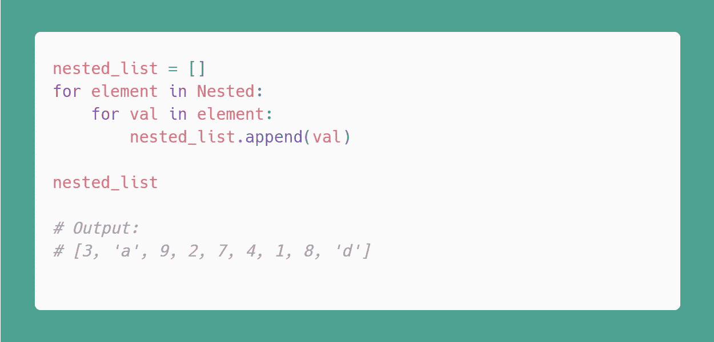
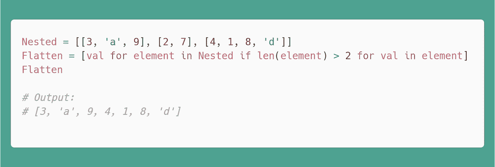

# Python 中的列表理解和嵌套列表理解

> 原文：<https://medium.com/analytics-vidhya/list-comprehensions-and-nested-list-comprehensions-in-python-86520ee16aa5?source=collection_archive---------7----------------------->

理解 Python 中的列表和嵌套列表理解

由[马库斯·温克勒](https://unsplash.com/@markuswinkler?utm_source=medium&utm_medium=referral)在 [Unsplash](https://unsplash.com?utm_source=medium&utm_medium=referral) 上拍摄

**列表**是 Python 中内置的数据结构之一，它是一组相同或不同类型的元素。用 Python 创建一个列表是一件非常繁琐的任务，其中涉及到一个 **for** 循环。

Python 以简单易懂的代码著称。如果你知道语法，那么 Python 非常容易使用。在本教程中，我们将讨论使你的代码更加优雅和可读的`List Comprehensions`。

让我们开始吧。

# 列出理解

Python 最好的特性之一是`List Comprehensions`,它帮助你用一行代码编写代码。

但是首先，我们将在 **for** 循环中看到一个创建指数列表的例子。

让我们看看我们在上面的例子中做了什么。首先，我们创建了一个世博会变量列表。然后，我们创建了一个 expon 变量的空列表，而不是 expo 的 iterable 上的 ex iterate 变量。之后，ex 的指数被创建并存储在 ex 中。现在，我们将 ex 追加到 expon 的空列表中。最后，我们打印列表。

现在，我们将使用 **map()** 函数实现相同的功能，这是使用 **lambda** 函数的替代方法。

你必须在 map 函数之前使用 list，否则，它会给出 map()的地址，而不是你想要的输出。在这里，你不必显式地定义一个函数，lambda 会为你做这件事。

> ****map()****函数采用一个 lambda 函数和一个列表，而****lambda****函数采用一个表达式和任意数量的参数。**

*map 函数将返回一个新列表，其中包含已被 lambda 函数修改的修改值。现在，让我们来谈谈列表理解:*

*List comprehensions 提供了一种简短紧凑的方式来创建列表。让我们看看语法:*

> ***new _ list =[iterable if 条件中项的表达式]***

*   *方括号对于获得列表形式的输出是必要的。*
*   ****表达式*** or 运算，对 iterable 内部的每个值执行，后跟 ***进行*** 循环*
*   *这是一个普通的 ***for*** 循环，用于迭代 iterable 中的每一项。Iterable 可以是列表、集合、字符串等。*
*   ****if*** a 条件可选。*

*这里，新值被创建并存储在另一个列表 new_list 中。旧列表中的值将保持不变。*

*让我们看一个例子:*

**

*在这里，每个数字都将被自身相乘，这意味着我们在对每个变量做指数运算，值存储在一个新的列表中，这个列表叫做指数。*

*在创建新列表时，条件被用作过滤器，以获得定制的精确输出。这里，给定的表达式必须满足特定的标准或指定的条件才能获得新的列表。*

*让我们以一个 if 条件为例:*

**

*这里，在给定条件下被评估为真的值将被执行，并且我们在一个新的列表中得到一个输出。只有偶数进入新列表。如果需要，您可以添加多个条件。*

# *嵌套列表理解*

*嵌套列表理解用于在集合中创建列表的组合。换句话说，嵌套的列表理解是另一个列表理解中的列表理解。*

*让我们通过一些例子来看看我们可以用嵌套列表理解做些什么:*

***我们举一个例子来扁平化一个列表列表:***

**

*你明白什么了吗？不。在这里，第一个 for 循环用于访问外部列表，第二个 for 循环用于访问内部子列表中的值。*

*让我们看看使用 for 循环和 append()方法的同一个例子。*

**

*您也可以对此使用过滤器或条件。让我们看看如何:*

**

*您可以看到子列表的长度应该大于 2 的情况，如果不大于 2，那么该子列表将被丢弃。*

# *结论*

*现在，您已经了解了 Python 中列表理解和嵌套列表理解的基础。它提供了一个优雅简洁的语法来创建基于现有列表或其他可迭代列表的新列表。*

*在 python 中使用太多的列表理解会使你的代码不可读。*

*是的，列表理解对于编写更漂亮、更 pythonic 化的代码非常有用。总是建议在 Python 中使用列表理解，但要保持代码的可读性。列表理解使得代码难以理解，在复杂的情况下，总是建议避免列表压缩。*