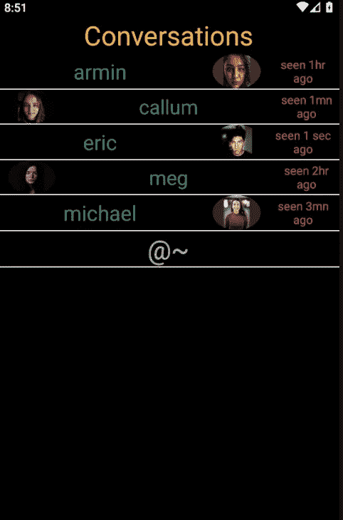
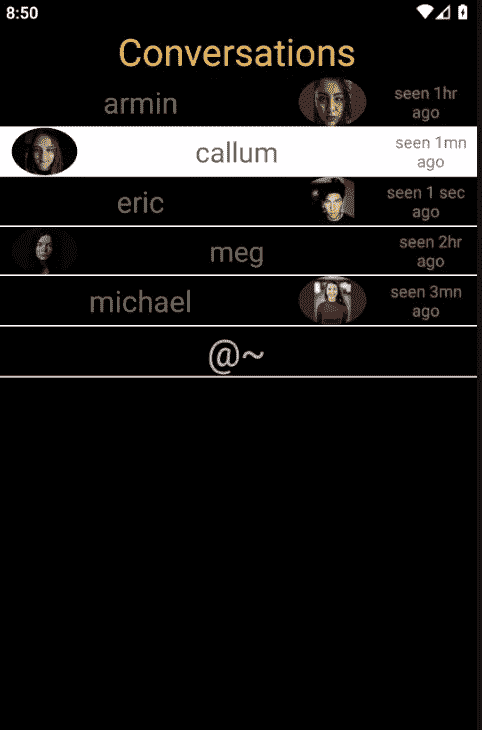
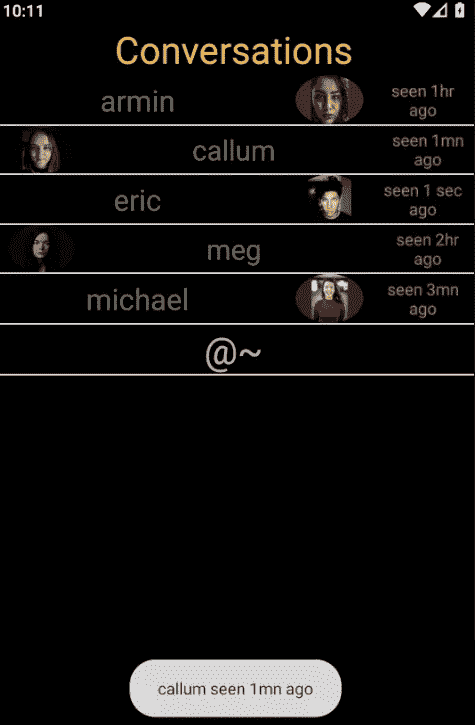

# android 中的 ListView 教程

> 原文：<https://medium.com/analytics-vidhya/listview-in-android-a-tutorial-9b8410e27317?source=collection_archive---------24----------------------->

一个`ListView`是一个视图列表，本教程 ***将展示如何在 android 中*** 实现一个`ListView`。最终产品如下所示。



首先创建应用 ***主活动布局*** 文件，`activity_main.xml`:

```
<!-- activity_main.xml -->

<?xml version="1.0" encoding="utf-8"?>
<FrameLayout xmlns:android="[http://schemas.android.com/apk/res/android](http://schemas.android.com/apk/res/android)"
    xmlns:tools="[http://schemas.android.com/tools](http://schemas.android.com/tools)"
    android:layout_width="match_parent"
    android:layout_height="match_parent"
    tools:context=".MainActivity">

    <ListView
        android:id="@+id/list_view"
        android:layout_width="match_parent"
        android:layout_height="match_parent"
        android:divider="[@android](http://twitter.com/android):color/white"
        android:dividerHeight="1dp"
        android:headerDividersEnabled="false"
        android:footerDividersEnabled="true"
        android:listSelector="[@drawable/lv_item_pressed](http://twitter.com/drawable/lv_item_pressed)"
        android:background="[@android](http://twitter.com/android):color/black" />

</FrameLayout>
```

这个活动的布局是一个`FrameLayout`，一个 ***框架布局将它的*** 子元素一个接一个的堆叠起来，这个布局只有一个子元素，就是`ListView`。

***的大多数属性 se*** *t* 对于`ListView`来说都是自解释的，比如`layout_width`或者`layout_height`。`listSelector`只是一个效果，因为当`ListView`中的一个项目被选中时，在这个例子中会绘制一个 drawable。`divider`是`ListView`中视图之间的分隔线。一个`ListView`可以有一个页眉和一个页脚，`headerDividersEnabled`和`footerDividersEnabled`允许页眉和页脚显示分隔线。

已经为`ListView`指定了布局属性，现在是时候为 `*ListView*`中的项目 ***创建视图了。在本例中，每一个交替行都有自己的视图，因此定义了两个布局，`list_view_item.xml`和`list_view_item_alt.xml`。***

```
<!-- list_view_item.xml -->

<?xml version="1.0" encoding="utf-8"?>
<LinearLayout xmlns:android="[http://schemas.android.com/apk/res/android](http://schemas.android.com/apk/res/android)"
    android:layout_width="match_parent"
    android:layout_height="wrap_content"
    android:orientation="horizontal">

    <TextView
        android:id="@+id/lv_item_name"
        android:layout_width="0dp"
        android:layout_weight="6"
        android:layout_height="wrap_content"
        android:paddingTop="4dp"
        android:paddingBottom="4dp"
        android:textColor="[@color/colorPrimary](http://twitter.com/color/colorPrimary)"
        android:textSize="25sp"
        android:gravity="center_horizontal" />

    <ImageView
        android:id="@+id/lv_item_img"
        android:layout_width="0dp"
        android:layout_weight="2"
        android:layout_height="match_parent" />

    <TextView
        android:id="@+id/lv_item_time"
        android:layout_width="0dp"
        android:layout_weight="2"
        android:layout_height="match_parent"
        android:paddingEnd="4dp"
        android:textColor="[@color/colorAccent](http://twitter.com/color/colorAccent)"
        android:textSize="14sp"
        android:gravity="center" />
</LinearLayout><!-- list_view_item_alt.xml -->

<?xml version="1.0" encoding="utf-8"?>
<LinearLayout xmlns:android="[http://schemas.android.com/apk/res/android](http://schemas.android.com/apk/res/android)"
    android:layout_width="match_parent"
    android:layout_height="wrap_content"
    android:orientation="horizontal">

    <ImageView
        android:id="@+id/lv_item_img"
        android:layout_width="0dp"
        android:layout_weight="2"
        android:layout_height="match_parent" />

    <TextView
        android:id="@+id/lv_item_name"
        android:layout_width="0dp"
        android:layout_weight="6"
        android:layout_height="wrap_content"
        android:paddingTop="4dp"
        android:paddingBottom="4dp"
        android:textColor="[@color/colorPrimary](http://twitter.com/color/colorPrimary)"
        android:textSize="24sp"
        android:gravity="center_horizontal" />

    <TextView
        android:id="@+id/lv_item_time"
        android:layout_width="0dp"
        android:layout_weight="2"
        android:layout_height="match_parent"
        android:paddingStart="4dp"
        android:textColor="[@color/colorAccent](http://twitter.com/color/colorAccent)"
        android:textSize="14sp"
        android:gravity="center" />
</LinearLayout>
```

创建了要在`ListView`中显示的项目布局后，现在是 ***创建控制器的时候了，控制器将由*** 管理`ListView`中每个项目的创建和显示，这是通过扩展`BaseAdapter`类来完成的，如下所示:

```
package com .twiserandom .mobileapps .demo .listview;

import android .content .Context;
import android .view .View;
import android .view .ViewGroup;
import android .widget .BaseAdapter;
import android .widget .ImageView;
import android .widget .TextView;

public class
        ListViewController
            extends BaseAdapter {

    private Context context;

    private String names [ ] = {"armin" , "callum" , "eric" , "meg" , "michael" };
    private int img_ids[ ] = {R .drawable .armin , R .drawable .callum , R .drawable .eric ,
                        R .drawable .meg , R .drawable .michael };
    private String last_seens [ ] = {"seen 1hr ago" , "seen 1mn ago" , "seen 1 sec ago" ,
                            "seen 2hr ago" , "seen 3mn ago"};
    ListViewController
            (Context context ){
        this .context = context; }

    class
            Person {

        String name;
        int img_id;
        String last_seen;

        Person
                (String name , int img_id , String last_seen ){
            this .name = name;
            this .img_id = img_id;
            this .last_seen = last_seen; }}

    [@Override](http://twitter.com/Override)
    public int
            getCount ( ){/*
                Return the number of data
                elements .*/
        return names .length; }

    [@Override](http://twitter.com/Override)
    public Object
            getItem
                (int position ){/* Can return null ,
                    if have nothing to pass on .
                    Data passed here can be gotten ,
                    for example when implementing
                    a click listener for an item
                    in the ListView .*/
        return new Person (names [position ] ,
                           img_ids [position ] ,
                           last_seens [position ] ); }

    [@Override](http://twitter.com/Override)
    public long
            getItemId
                (int position ){/* Can return 0
                    , or -1 , if don't have own
                    generated IDs , or if not 
                    interested in this method .
                    This created id can be used
                    for example , when implementing
                    a click listener for an item in
                    the ListView .*/
        return img_ids[position ]; }

    [@Override](http://twitter.com/Override)
    public View
            getView
                (int position, View convertView , ViewGroup parent ){/* Return a view
                    to be displayed in
                    the ListView .*/

        if (convertView == null ){/* The items in
            the list view are
            recyclable , which means they
            are reusable , so only inflate an
            item in the ListView when
            necessary .*/

            if (position % 2 == 0 )/* If position is 
                even , inflate
                the even list view item .*/
                convertView = View .inflate (context , R .layout .list_view_item , null );
            else /* else inflate the odd list view
                item .*/
                convertView = View .inflate (context , R .layout .list_view_item_alt , null ); }

        /* Set the data to be displayed */
        TextView tv_name = (TextView ) convertView .findViewById (R .id .lv_item_name );
        tv_name .setText (names [position ]);

        TextView tv_date = (TextView ) convertView .findViewById (R .id .lv_item_time );
        tv_date .setText (last_seens [position ]);

        ImageView iv_picture = (ImageView ) convertView .findViewById (R .id .lv_item_img );
        iv_picture .setImageResource (img_ids [position ]);
        return convertView;
        /* Return the view to be displayed */ } }
```

创建了控制器类之后，现在是时候让 ***创建*** `***MainActivity***` ***类*** *，*将`ListView`连接到它的控制器，其中的页眉和页脚也将被添加到`ListView`中。

```
/* MainActivity.java */

package com .twiserandom .mobileapps .demo .delete;

import androidx .appcompat .app .AppCompatActivity;

import android .os .Bundle;
import android .view .View;
import android .view .ViewGroup;
import android .widget .AdapterView;
import android .widget .ListView;
import android .widget .TextView;
import android .widget .Toast;

public class
        MainActivity
            extends AppCompatActivity {

    [@Override](http://twitter.com/Override)
    protected void
            onCreate (Bundle savedInstanceState ){

        super .onCreate (savedInstanceState );
        setContentView (R .layout .activity_main );

        ListView lv = findViewById (R .id .list_view );
        /* Get the ListView */

        View header = View .inflate (this , R .layout .list_view_header , null );
        /* Inflate the header layout , and add it to the list view .*/
        lv .addHeaderView (header );

        View footer = View .inflate(this , R .layout .list_view_footer , null );
        /* Inflate the footer layout , and add it to the list view .*/
        lv .addFooterView (footer );

        lv .setAdapter (new ListViewController (this ) );
        /* Connect the controller to the list view .*/

        lv .setOnItemClickListener (new AdapterView .OnItemClickListener ( ){
            /* Add an item click listener for the list view ,
               other types of listeners exist , such as
               setOnItemLongClickListener .*/

            [@Override](http://twitter.com/Override)
            public void
                    onItemClick
                        (AdapterView  parent , View view , int position , long id ){
                ListViewController .Person person =
                        (ListViewController .Person ) parent .getItemAtPosition (position );
                /* Get the data attached in the getItem method
                   of the controller .*/
                Toast .makeText (MainActivity .this ,
                                 person .name + " " + person .last_seen ,
                                  Toast.LENGTH_LONG)
                        .show ( );/* Show a toast containing
                        the person name , and last seen .*/ } }); }}
```

在前面的代码中，`ListView`中添加了页眉和页脚，所以 ***页眉和页脚*** 必须有布局。这些必须有布局，在`MainActivity`中膨胀，如下所示:

```
<!-- list_view_header.xml -->

<?xml version="1.0" encoding="utf-8"?>
<LinearLayout xmlns:android="[http://schemas.android.com/apk/res/android](http://schemas.android.com/apk/res/android)"
    android:orientation="horizontal"
    android:layout_width="match_parent"
    android:layout_height="match_parent">

    <TextView
        android:layout_width="match_parent"
        android:layout_height="wrap_content"
        android:text="Conversations"
        android:textSize="32sp"
        android:textColor="[@android](http://twitter.com/android):color/holo_orange_light"
        android:gravity="center" />
</LinearLayout><!-- list_view_footer.xml -->

<?xml version="1.0" encoding="utf-8"?>
<LinearLayout xmlns:android="[http://schemas.android.com/apk/res/android](http://schemas.android.com/apk/res/android)"
    android:orientation="horizontal"
    android:layout_width="match_parent"
    android:layout_height="match_parent">

    <TextView
        android:layout_width="match_parent"
        android:layout_height="wrap_content"
        android:text="@~"
        android:textSize="32sp"
        android:gravity="center" />
</LinearLayout>
```

`activity_main.xml` 中指定的`ListView`的`listSelector`为`android:listSelector="@drawable/lv_item_pressed"`，表示可拉伸。 ***可绘制*** 将被按下的项目设置为白色背景，如下图:

```
<!-- lv_item_pressed.xml -->

<?xml version="1.0" encoding="utf-8"?>
<selector xmlns:android="[http://schemas.android.com/apk/res/android](http://schemas.android.com/apk/res/android)">

    <item android:drawable="[@android](http://twitter.com/android):color/white"
        android:state_pressed="true"/>
    <!-- item pressed -->
</selector>
```

*原载于 2021 年 3 月 9 日 https://difyel.com*[](https://difyel.com/android/listview-a-tutorial/)**。**