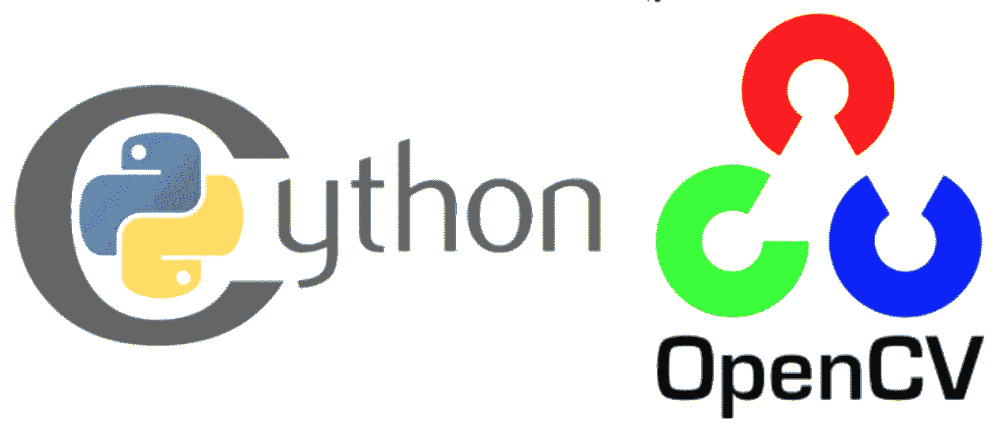

# 使用开放式 cv2 Python 模块的视频直播聊天应用。

> 原文：<https://medium.com/analytics-vidhya/live-video-chat-app-using-open-cv2-python-module-2c6232d88732?source=collection_archive---------4----------------------->

该任务的目的是在服务器和客户端之间进行视频通话，因此为此，我们需要制作一个服务器和客户端。

## **创建服务器端脚本**

首先我们必须导入 **socket** ，cv2， **pickle** ， **struct** 和 **imutils** 库。

> 导入套接字，cv2，pickle，struct，imutils

**现在我们必须创建一个套接字**

> *server _ socket = socket . socket(socket。AF_INET，socket。SOCK _ STREAM)
> host _ name = socket . gethostname()
> host _ IP = socket . gethostbyname(host _ name)
> port = 9999
> socket _ address =(host _ IP，port)*

**捆绑插座**

> server_socket.bind(套接字地址)

**插座监听**

> 虽然正确:
> 
> 客户端套接字，地址=服务器套接字.接受()
> 
> 打印('连接来自:'，地址)
> 
> 如果客户端套接字:
> 
> vid = cv2。视频捕获(0)
> 
> while(vid.isOpened()):
> 
> img，frame = vid.read()
> 
> frame = imutils.resize(frame，width=680)
> 
> a = pickle . dumps(frame)message = struct . pack(" Q "，len(a))+a
> 
> client_socket.sendall(消息)
> 
> cv2.imshow('传输视频'，帧)
> 
> key = cv2.waitKey(1) & 0xFF
> 
> 如果 key ==13 或 key ==113 或 key==81: msg="q "
> 
> client_socket.send(msg.encode()
> 
> client _ 套接字. close()
> 
> cv2.destroyAllWindows()

现在我们已经创建了一个服务器端套接字。

## 创建客户端脚本

所以作为服务器端套接字，我们必须导入 python 库

> 导入套接字，cv2，pickle，struct，imutils

**现在我们可以创建我们的客户端套接字**

> client _ socket = socket . socket(socket。AF_INET，socket。SOCK _ STREAM)
> host _ ip = ' 192 . 168 . 56 . 1 ' #***在这里粘贴你的服务器 IP 地址***
> port = 9999
> client _ socket . connect((host _ IP，port)) # a tuple
> data = b
> 
> while True:
> while len(data)<payload _ size:
> packet = client _ socket . recv(4 * 1024)# 4K
> 如果不是 packet:break
> data+= packed _ msg _ size = data[:payload _ size]
> data = data[payload _ size:]
> msg _ size = struct . unpack(" Q "，packed_msg_size)[0]
> 
> 而 len(data)< msg_size:
> data+= client _ socket . recv(4 * 1024)
> frame _ data = data[:msg _ size]
> data = data[msg _ size:]
> frame = pickle . loads(frame _ data)
> cv2 . im show("接收视频"，frame)
> key = cv2 . wait key(1)&0x ff
> 如果 key ==13 或 key ==113 或 key==81:
> 
> cv2 . destroyallwindows()
> break
> client _ socket . close()

希望这篇文章对你有帮助！！

如有任何疑问，请通过 [Linkedin 个人资料](https://www.linkedin.com/in/akash-babu-mca-2019/)联系我。

对于代码，你可以访问我的 [Git-Hub](https://github.com/babuakash68/CV-2-Task-4.git) Repo

快乐学习: )