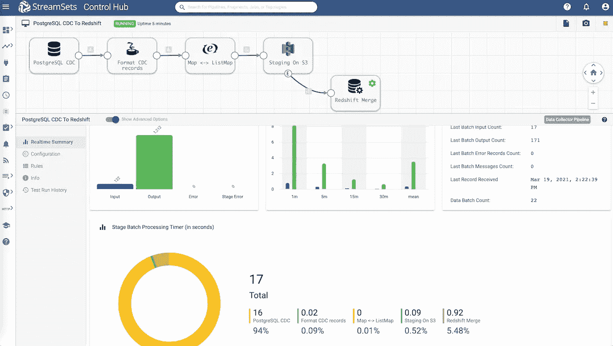

# 从 PostgreSQL 到 Amazon Redshift 的负载变化数据捕获数据

> 原文：<https://medium.com/analytics-vidhya/load-change-data-capture-data-from-postgresql-to-amazon-redshift-56fa6b6cf3f3?source=collection_archive---------14----------------------->

变更数据捕获对于向云迁移变得至关重要。在这篇博客中，我概述了使用 StreamSets Data Collector、[快速数据摄取引擎](https://streamsets.com/products/dataops-platform/data-collector/)将变更数据捕获(CDC)数据从 PostgreSQL 加载到 Amazon Redshift 的详细说明和步骤。

[数据管道](https://streamsets.com/learn/data-pipelines/)首先将 PostgreSQL CDC 数据写入亚马逊 S3，然后执行一组查询来对亚马逊红移执行 upsert 操作。执行的查询集包括亚马逊 S3 复制命令，该命令利用亚马逊红移的大规模并行处理(MPP)架构，从存储在亚马逊 S3 桶中的文件并行读取和加载数据。

# 什么是 upsert 操作？

upsert 操作使您能够在同一事务中插入新记录或更新现有记录。为了确定记录是否已经存在，这组查询依赖于传入记录的主键。

# 先决条件

*   访问[流集数据收集器](https://streamsets.com/getting-started/download-install-data-collector/) (SDC)的实例
*   同时下载 [PostgreSQL](https://jdbc.postgresql.org/download.html) 和[红移](https://docs.aws.amazon.com/redshift/latest/mgmt/configuring-connections.html#connecting-drivers)的 JDBC 驱动。(我用了 *postgresql-42.2.5.jar* 和*redshiftjdbc 42-no-AWS SDK-1 . 2 . 41 . 1065 . jar*)
*   一旦你有了驱动程序，使用[软件包管理器](https://streamsets.com/documentation/datacollector/latest/help/datacollector/UserGuide/Configuration/ExternalLibs.html#task_jng_dkt_bz)在 SDC 安装它们。
*   访问一个[亚马逊红移](https://aws.amazon.com/redshift/)集群
*   访问亚马逊 RDS for PostgreSQL 。(我用的是 11.6 版本)

# 在 AWS RDS 上为 PostgreSQL 启用 CDC

*   ***注意*** :连接到数据库的用户必须拥有*复制*或*超级用户*角色。
*   在 Amazon RDS for PostgreSQL 实例上，确保在相关的参数组***RDS . logical _ replication***中启用(即设置为 1)
*   如果您没有权限编辑现有的参数组，您可以[创建一个新的参数组](https://docs.aws.amazon.com/AmazonRDS/latest/UserGuide/USER_WorkingWithParamGroups.html#USER_WorkingWithParamGroups.Creating)，然后将***RDS . logical _ replication***参数设置为 1，将其他值保留为默认值，并将这个新组添加到 Amazon RDS 实例中。
*   在 PSQL 中，执行以下操作:
*   创建复制插槽。
*   *SELECT pg _ create _ logical _ replication _ slot('****your _ replication _ slot _ name _ goes _ here****'，' wal 2 JSON ')；*
*   创建一个具有 replication 属性的角色供 PostgreSQLReader 使用，并授予它对包含要读取的表的模式的 select 权限。
*   *创建角色****your _ ROLE _ name _ goes _ here****用登录密码****‘your _ PASSWORD _ goes _ here’****；*
*   *将 rds_replication 授予****your _ role _ name _ goes _ here****；*
*   *GRANT SELECT 对模式****your _ SCHEMA _ name _ goes _ here****到****your _ role _ name _ goes _ here****；*

**如果您想继续学习，下面是我在这个例子中使用的 PostgreSQL 和 Amazon 红移表的结构和模式:**

```
#### PostgreSQL CREATE TABLE "companies" ( "id" int4 NOT NULL DEFAULT nextval('companies_id_seq'::regclass), "name" bpchar(60), "type" bpchar(60), "funding" numeric(12,5), PRIMARY KEY ("id") ); #### Amazon Redshift CREATE TABLE companies( id bigint NOT NULL, name varchar(60), type varchar(60), funding decimal(12,5), PRIMARY KEY(id) );
```

# **数据管道概述**

****

# **PostgreSQL CDC 客户端**

*   **读取数据管道中预写日志(WAL)记录的来源是 [PostgreSQL CDC 客户端](https://streamsets.com/documentation/datacollector/latest/help/datacollector/UserGuide/Origins/PostgreSQL.html#concept_cfs_4m4_n2b)。该源为每笔交易生成一条记录。因为每个事务可以包含多个 CRUD 操作，所以它也可以包含一个记录上的多个操作。**
*   **一些重要的配置属性包括:**
*   **模式、表名模式(匹配一组表的表名或模式)、初始更改(从哪里开始读取记录)、操作(要捕获的 CRUD 操作；在我们的例子中是插入和更新)、复制插槽、JDBC 连接字符串(格式为*JDBC:PostgreSQL://<host>:<port>/<dbname>*)和凭证(用于连接数据库。)**

# **Jython 评估器**

*   **在 [Jython Evaluator](https://streamsets.com/documentation/datacollector/latest/help/datacollector/UserGuide/Processors/Jython.html#concept_a1h_lkf_lr) 处理器中，在 GitHub 上添加这个 [Jython 代码，它将重新格式化 WAL 记录，以便于下游处理。](https://github.com/iamontheinet/StreamSets/blob/master/Misc/wal2json_to_sdc_record.py)**

# **表达式评估器**

*   **使用[表达式评估器](https://streamsets.com/documentation/datacollector/latest/help/datacollector/UserGuide/Processors/Expression.html#concept_zm2_pp3_wq)处理器，我们将用一个简单的表达式将新记录从 List 转换为 ListMap，其中**输出字段**被设置为 *'/'* ，它评估为记录根，而**字段表达式**被设置为*$ { record:value '/')}*，它表示整个记录。**

# **亚马逊 S3**

*   **[亚马逊 S3](https://streamsets.com/documentation/datacollector/latest/help/datacollector/UserGuide/Origins/AmazonS3.html#concept_kvs_3hh_ht) 是管道的关键组件之一，不仅因为它是写入转换后的 CDC 数据的地方，还因为写入 S3 使我们能够使用[亚马逊*复制*](https://docs.aws.amazon.com/redshift/latest/dg/t_Loading-data-from-S3.html) 命令以大规模并行处理(MPP)的方式将 PostgreSQL CDC 数据从亚马逊 S3 加载到 Redshift。 *(* ***关于这一点更多的在下面的 JDBC 查询部分。*** *)***
*   **一些重要的配置属性包括:**
*   **产生事件:启用此选项将导致目的地[产生事件](https://streamsets.com/documentation/datacollector/latest/help/datacollector/UserGuide/Destinations/AmazonS3.html#concept_aqq_tt2_px)，我们最感兴趣的是 **S3 对象写入**，它是在一组/一批 CDC 记录被写入 S3 时产生的。当这个事件生成时，JDBC 查询执行器将对 Amazon Redshift 上的那些记录执行一个 upsert 操作。(见下文。)**
*   **数据格式(在我们的例子中设置为 json)、JSON 内容(在我们的例子中设置为多个 JSON 对象)、Bucket、身份验证方法和对象名称后缀(在我们的例子中设置为 JSON)。有关其他配置属性的更多详细信息，[点击此处](https://streamsets.com/documentation/datacollector/latest/help/datacollector/UserGuide/Origins/AmazonS3.html#concept_kvs_3hh_ht)。**

# **JDBC 查询**

*   **[JDBC 查询执行器](https://streamsets.com/documentation/datacollector/latest/help/datacollector/UserGuide/Executors/JDBCQuery.html#concept_j3r_gcv_sx)是[数据管道](https://streamsets.com/learn/data-pipelines/)封装的地方！**
*   **一些重要的配置属性包括:**
*   **JDBC 连接字符串(格式为*JDBC:Redshift://<hostname>:<port>/<dbname>*)和连接到 Amazon Redshift 集群的凭证。**
*   **前置条件设置为 *${record:eventType() == "S3 对象已写入" }***
*   **将 PostgreSQL CDC 数据从亚马逊 S3 加载(特别是插入和更新)到 Redshift 的 SQL 查询作为一个 upsert 操作，包括首先从亚马逊 S3 加载数据的亚马逊复制命令。**

```
BEGIN transaction;

CREATE TABLE ${REDSHIFT_SCHEMA}.t_staging (LIKE ${REDSHIFT_SCHEMA}.${REDSHIFT_TABLE});

COPY ${REDSHIFT_SCHEMA}.t_staging 
FROM '${AWS_BUCKET}'
CREDENTIALS 'aws_access_key_id=${AWS_KEY};aws_secret_access_key=${AWS_SECRET}' 
FORMAT AS JSON 'auto';

UPDATE ${REDSHIFT_SCHEMA}.${REDSHIFT_TABLE}
SET name = s.name, type = s.type, funding = s.funding
FROM ${REDSHIFT_SCHEMA}.t_staging s
WHERE ${REDSHIFT_TABLE}.id = s.id;

INSERT INTO ${REDSHIFT_SCHEMA}.${REDSHIFT_TABLE}
SELECT s.* FROM ${REDSHIFT_SCHEMA}.t_staging s LEFT JOIN ${REDSHIFT_SCHEMA}.${REDSHIFT_TABLE}
ON s.id = ${REDSHIFT_SCHEMA}.${REDSHIFT_TABLE}.id
WHERE ${REDSHIFT_SCHEMA}.${REDSHIFT_TABLE}.id IS NULL;

DROP TABLE ${REDSHIFT_SCHEMA}.t_staging;

END transaction;
```

**下面是上面一组 SQL 查询中发生的情况:**

*   **开始事务—作为一个整体提交的单个逻辑工作单元**
*   **在 Redshift 中创建临时(" ")表，其模式与标识为${ *REDSHIFT_TABLE}* 的主表相同**
*   **使用命令将亚马逊 S3 上以 JSON 格式存储的 PostgreSQL CDC 数据加载到 Redshift 中的临时表(" ")中**
*   **执行查询以更新临时(“t_staging”)表和标识为${ *REDSHIFT_TABLE}* 的主表之间主键匹配的所有记录**
*   **如果临时(“t_staging”)表中的记录主键在标识为${ *REDSHIFT_TABLE}* 的主表中不存在，则执行查询以在主表中插入新记录**
*   **删除临时(" t_staging ")表**
*   **结束事务—提交当前事务**

*****注*** : *上述 SQL 查询中引用的 REDSHIFT_SCHEMA、REDSHIFT_TABLE、AWS_BUCKET、AWS_KEY 和 AWS_SECRET* 被定义为管道参数，[13 个数据工程最佳实践](https://streamsets.com/blog/13-data-engineering-best-practices-at-dnb/)之一，以便使管道可重用(例如，通过[作业模板](https://streamsets.com/documentation/controlhub/latest/help/controlhub/UserGuide/Jobs/JobTemplates.html#concept_bkh_nzb_4fb)用于其他模式和表)，并尽可能保持 SQL 查询集的动态性。**

# **摘要**

**在这篇文章中，我回顾了通过利用和集成像 [StreamSets Data Collector](https://streamsets.com/products/dataops-platform/data-collector/) 和 Amazon Web Services 这样的技术所实现的价值。**

**了解更多关于[用流集](https://streamsets.com/getting-started/building-data-pipelines/)构建数据管道、[如何处理来自 Oracle 19c 数据库的 CDC 信息](https://streamsets.com/blog/oracle-19c-bulk-ingest-and-change-data-capture-into-databricks-delta-lake/)以及[亚马逊 Web 服务的流集](https://streamsets.com/solutions/streamsets-for-aws/)的信息。**

**如果你喜欢这个话题，并希望继续围绕数据工程展开类似的对话，请通过 [LinkedIn](https://www.linkedin.com/in/dash-desai/) 和 [Twitter](https://twitter.com/iamontheinet) 与我联系。**

***原载于 2021 年 4 月 8 日 https://streamsets.com*[](https://streamsets.com/blog/load-change-data-capture-data-from-postgresql-to-amazon-redshift-using-streamsets/)**。****