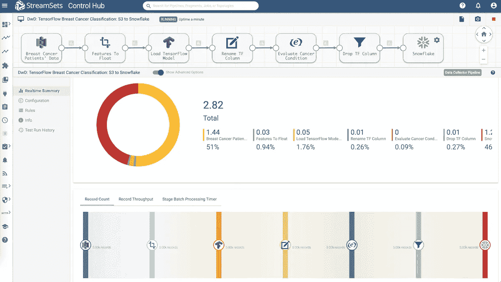
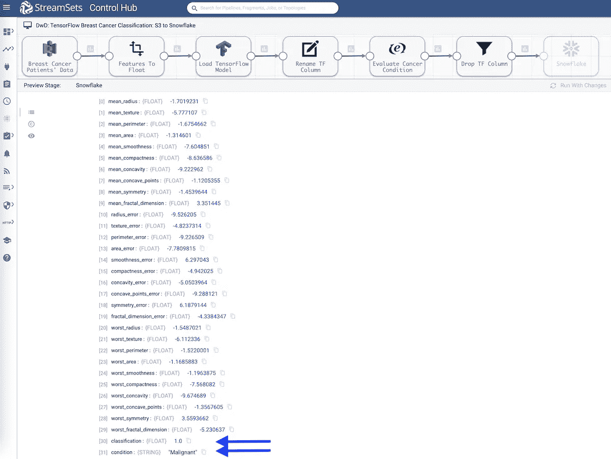
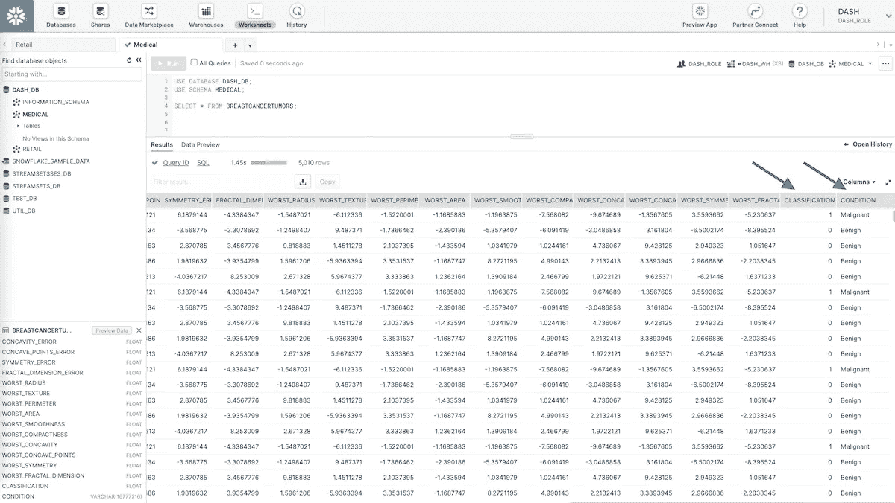
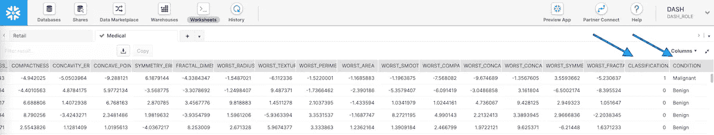

# 将数据从 S3 加载到雪花并使用张量流模型

> 原文：<https://medium.com/analytics-vidhya/load-data-from-s3-to-snowflake-and-use-tensorflow-model-29ccd938cc1b?source=collection_archive---------9----------------------->

了解如何将数据从 S3 加载到雪花，并在 StreamSets 数据收集器、[快速数据摄取引擎](https://streamsets.com/products/dataops-platform/data-collector/)和数据管道中为 TensorFlow 模型提供服务，以便对从 S3 流向雪花的数据进行评分。

数据和分析正在帮助我们更快、更明智地保持健康。云规模的开放数据集和分析是释放准确性的关键，以在医疗领域产生真正的影响。[像雪花这样的数据云](https://streamsets.com/solutions/streamsets-for-snowflake/)是通过自助式数据访问和反映当今数据动态性质的规模来开放分析的主要推动者。一个突出的模式和关键的第一步是将数据从 S3 加载到雪花，以快速获得数据云的价值。然而，如果您不能加载全部的关系和流数据源，您的雪花数据云的价值可能永远不会实现。[智能数据管道](https://streamsets.com/products/dataops-platform/data-collector/)让您可以从企业的各个角落发送和同步数据，并以正确的格式将其放入您的数据云中，为分析做好准备。这意味着您可以为数据科学和机器学习提供生产就绪数据。

# 用例

我们将回顾的用例是将乳腺癌肿瘤分类为 or，并展示我们将使用作为 [scikit-learn](http://scikit-learn.org/stable/modules/generated/sklearn.datasets.load_breast_cancer.html) 的一部分提供的威斯康星州乳腺癌数据集。为了了解我如何用 Python 训练和导出一个简单的 TensorFlow 模型，[在 GitHub](https://github.com/iamontheinet/datascience/blob/master/Breast_Cancer/breast_cancer_training.py) 上检查我的代码。正如您将注意到的，模型架构保持最小化，非常简单，只有几层。代码需要注意的重要方面是如何使用[tensor flow SavedModelBuilder](https://www.tensorflow.org/versions/r1.15/api_docs/python/tf/saved_model/builder)*导出和保存模型。

**注意:要在 Data Collector 中使用 TensorFlow 模型，应使用 TensorFlow SavedModelBuilder 以您选择的支持语言(如 Python)导出/保存它们。*

# 什么是张量流？

TensorFlow 是一个为深度神经网络构建的开源机器学习框架。它是由谷歌大脑团队创造的。TensorFlow 支持在 CPU、GPU 和 TPU 上进行可扩展和可移植的训练。截至今天，它是 GitHub 上最受欢迎和最活跃的机器学习项目。

# 数据管道概述

下面是数据管道的概述。

*   从亚马逊 S3 获取乳腺癌肿瘤数据
*   执行转换
*   使用 TensorFlow 机器学习模型将肿瘤分类为 ***良性*** 或 ***恶性***
*   将乳腺癌肿瘤数据与癌症分类一起存储在雪花中

# 将数据从 S3 加载到雪花

# 亚马逊 S3

*   [origin](https://streamsets.com/documentation/datacollector/latest/help/datacollector/UserGuide/Origins/AmazonS3.html#concept_kvs_3hh_ht) 将加载存储在亚马逊 S3 上的. csv 文件中的乳腺癌肿瘤记录。一些重要的配置包括:
*   AWS 凭据—您可以使用实例配置文件或 AWS 访问密钥进行身份验证
*   亚马逊 S3 存储桶名称
*   包含要从亚马逊 S3 加载的输入数据的对象/文件名或文件名模式。

# 现场转换器

*   这个[处理器](https://streamsets.com/documentation/datacollector/latest/help/datacollector/UserGuide/Processors/FieldTypeConverter.html#concept_is3_zkp_wq)将把所有输入列从 String 转换成 Float。在这种情况下，所有字段都需要包含在列表中，因为它们都是张量流模型将使用的要素。

# 张量流评估器

*   保存的模型路径:要使用的预训练 TF 模型的位置。
*   模型标签:设置为***【serve】***，因为元图(在我们导出的模型中)旨在用于服务。更多详情，请参见 [tag_constants.py](https://github.com/tensorflow/tensorflow/blob/master/tensorflow/python/saved_model/tag_constants.py) 。
*   输入配置:在训练和导出模型期间配置的输入张量信息。(参见[训练模型，并使用 tensor flow SavedModelBuilder](https://github.com/iamontheinet/datascience/blob/master/Breast_Cancer/neural_networks_with_tensorflow-breast-cancer.ipynb)部分保存/导出它。)
*   输出配置:在训练和导出模型期间配置的输出张量信息。(参见[训练模型，并使用 tensor flow SavedModelBuilder](https://github.com/iamontheinet/datascience/blob/master/Breast_Cancer/neural_networks_with_tensorflow-breast-cancer.ipynb)部分保存/导出。)
*   输出字段:我们想要存储分类值的输出记录字段。

# 字段重命名器

*   这个[处理器](https://streamsets.com/documentation/datacollector/latest/help/datacollector/UserGuide/Processors/FieldRenamer.html#concept_vyv_zsg_ht)将使我们能够重命名列，使它们更易于理解。

# 表达式评估器

*   这个[处理器](https://streamsets.com/documentation/datacollector/latest/help/datacollector/UserGuide/Processors/Expression.html#concept_zm2_pp3_wq)会使用表达式*$ { record:value('/class ification ')= = 0？良性':'恶性' }* 评估*'条件'*列值，并根据肿瘤分类创建一个新列，其值为*'良性'*或*'恶性'*。

# 现场清除器

*   这个[处理器](https://streamsets.com/documentation/datacollector/latest/help/datacollector/UserGuide/Processors/FieldRemover.html#concept_jdd_blr_wq)将使我们能够删除不需要存储在雪花中的列。

# 雪花

*   转换后的数据存储在[雪花](https://streamsets.com/documentation/datacollector/latest/help/datacollector/UserGuide/Destinations/Snowflake.html#concept_vxl_zzc_1gb)中。一些重要的配置包括:
*   雪花帐户、用户名、密码、仓库、数据库、模式和表名。 ***注意:*** *如果表格不存在，管道将自动创建表格。所以不需要在雪花*中预先创建。
*   处理新数据时，您可以配置雪花目的地，使用 COPY 命令[将数据加载到雪花表](https://streamsets.com/documentation/datacollector/latest/help/datacollector/UserGuide/Destinations/Snowflake.html#concept_w35_vsq_2gb)。
*   当处理变更数据捕获(CDC)数据时，您可以配置雪花目的地使用 MERGE 命令[将数据加载到雪花表](https://streamsets.com/documentation/datacollector/latest/help/datacollector/UserGuide/Destinations/Snowflake.html#concept_w35_vsq_2gb)。

# 数据管道执行

在执行流水线时，输入的乳腺癌肿瘤记录通过上述数据流水线，包括使用张量流模型的实时评分。发送到雪花数据云的输出记录包括模型用于分类的乳腺癌肿瘤特征、 **0 或 1、**的模型输出值以及各自的肿瘤情况**良性**或**恶性。**见下文。

# 结论

[StreamSets 和 Snowflake](https://streamsets.com/solutions/streamsets-for-snowflake/) 之间的集成使数据工程师能够构建智能数据管道来同步和异步加载数据。同步负载的一个很好的例子是使用[变更数据捕获(CDC)](https://streamsets.com/getting-started/building-data-pipelines/#1591636712645-71b4c920-2f56) 的多表实时复制，对于异步、高吞吐量和纯插入类型的工作负载，数据工程师可以利用流集中的 [Snowpipe 集成](https://streamsets.com/documentation/datacollector/latest/help/datacollector/UserGuide/Destinations/Snowflake.html#concept_nzd_mgj_2gb)。

立即开始，在您选择的云提供商上部署数据收集器[快速数据摄取引擎](https://streamsets.com/products/dataops-platform/data-collector/download/)，或者您也可以下载它用于本地开发。

*原载于 2021 年 3 月 11 日 https://streamsets.com**的* [*。*](https://streamsets.com/blog/load-data-from-s3-to-snowflake-and-use-tensorflow-model/)