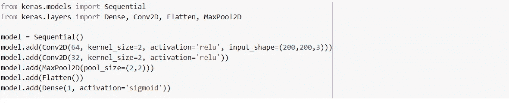
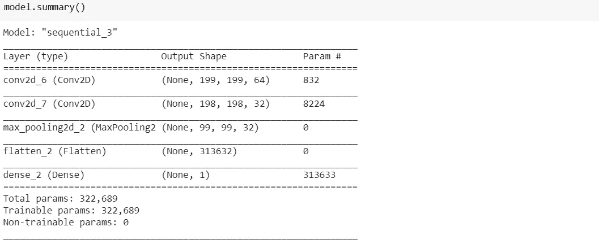
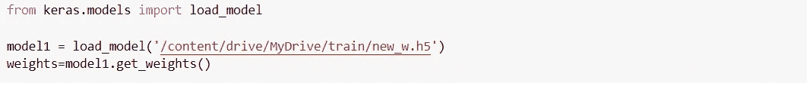
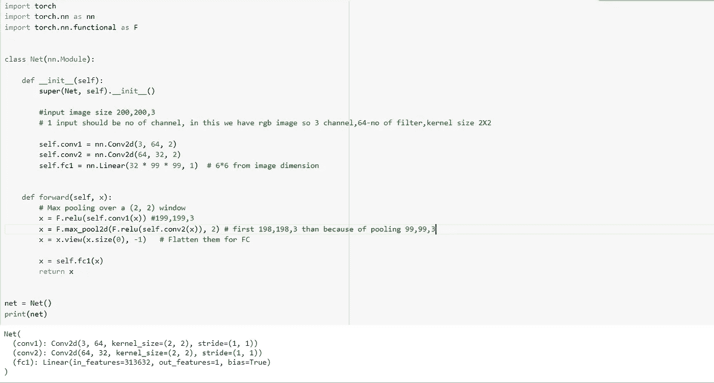
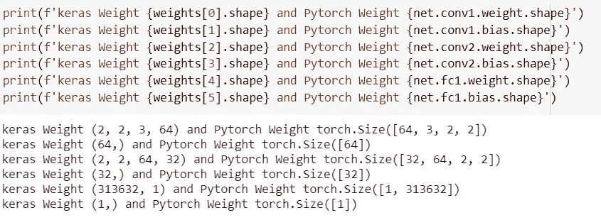
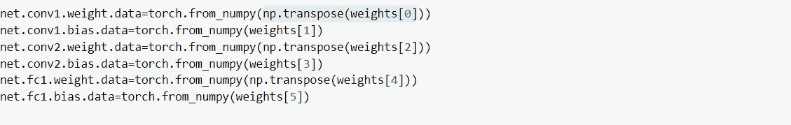

# 将 Keras 的重量加载到 PyTorch，并轻松地将 Keras 架构转换为 PyTorch

> 原文：<https://medium.com/analytics-vidhya/load-keras-weight-to-pytorch-and-transform-keras-architecture-to-pytorch-easily-8ff5dd18b86b?source=collection_archive---------6----------------------->

大多数人已经开始使用 Keras API 建立深度学习模型，这不是最好的，但最容易使用，但 PyTorch 具有非常高的调试能力。其中一个原因是，在 PyTorch 中，我们必须编写每一个步骤，这样我们就可以很好地了解代码，并且可以很容易地调试错误，但在 Keras 中却不是这样。

我在 PyTorch 中实现架构时也遇到了问题，但是记住一些重要的提示，实现起来很容易。

**让我们把模型做成 Keras**

我们做了一个简单的建筑

*   在第一个 conv2D 层中-输入图像(200，200，3)，过滤器数量-64，内核-(2*2)
*   在第二 conv2D 层中-过滤器数量-32，内核-(2*2)
*   MaxPool2D 图层以减少要素的数量
*   最后致密层

模型架构

# 重要的

在加载模型之前，我们必须使用— **save()** 而不是**save _ weights()来保存权重。**

**model . save(' weights _ name . H5 ')**

**原因** - save()将权重和模型结构保存到单个 HDF5 文件中。我相信它还包括优化器状态之类的东西。然后，您可以使用带有 load()的 HDF5 文件来重建整个模型，包括权重。

save_weights()只将权重保存到 HDF5，不保存任何其他内容。您需要额外的代码来从 JSON 文件重建模型。

装载重物

**将 Keras 架构转换为 PyTorch 架构**

## 将 Keras 代码转换为 Pytorch 时的重要事项

*   第一个卷积层的输入形状应该是图像的通道数，在我们的例子中是 3
*   对于第一个完全连接的层，我们需要计算输入形状。就像我们的例子 CONV1D(199，199，3) ->CONV2D (198，198，3) -> MAXPOOL2D(99，99，3)
*   #99*99*3=313632 与 keras 的展平层相同(**输入形状— (kernel_size-1))**

**Keras 和 PyTorch 如何储存体重**

**让我们将 Keras 权重加载到 PyTorch 模型中**

现在，我们可以根据我们的数据进行测试……..

**参考文献**

 [## PyTorch

### 推动自然语言处理和多任务学习的发展。利用 PyTorch 的灵活性有效地研究新的…

pytorch.org](https://pytorch.org/) 

[https://keras.io/](https://keras.io/)

[https://stack overflow . com/questions/42621864/difference-between-keras-model-save-and-model-save-weights](https://stackoverflow.com/questions/42621864/difference-between-keras-model-save-and-model-save-weights)

[https://discuse . py torch . org/t/how-to-convert-keras-model-to-py torch-and-run-inference-in-c-correctly/93451](https://discuss.pytorch.org/t/how-to-convert-keras-model-to-pytorch-and-run-inference-in-c-correctly/93451)