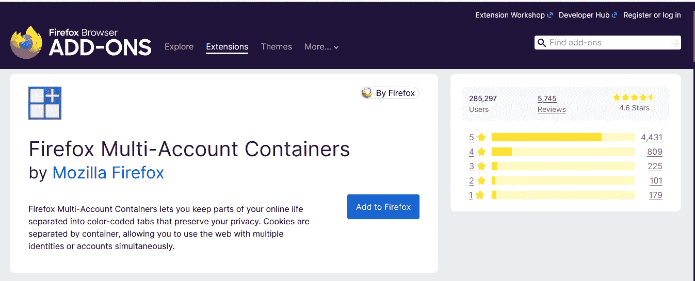
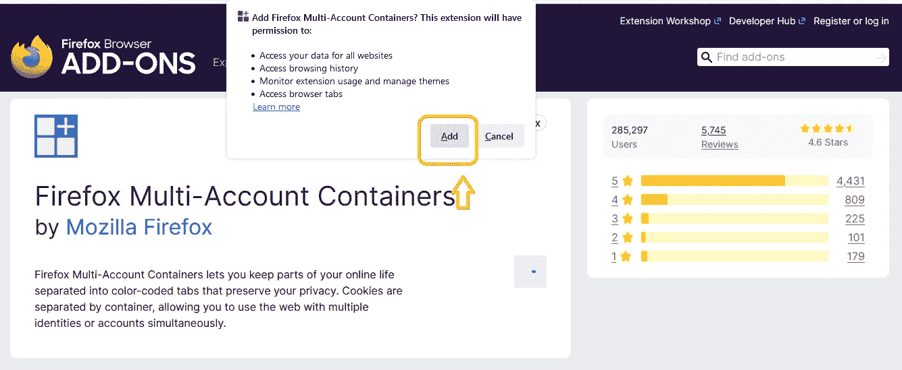
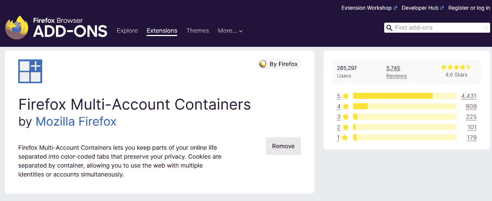
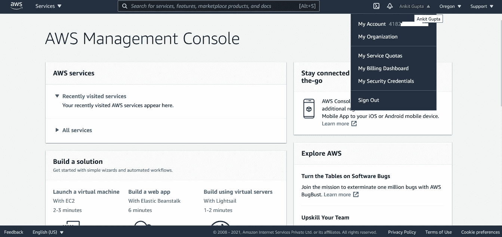
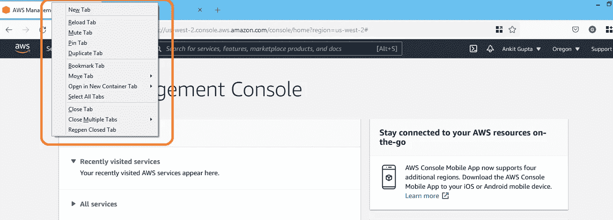
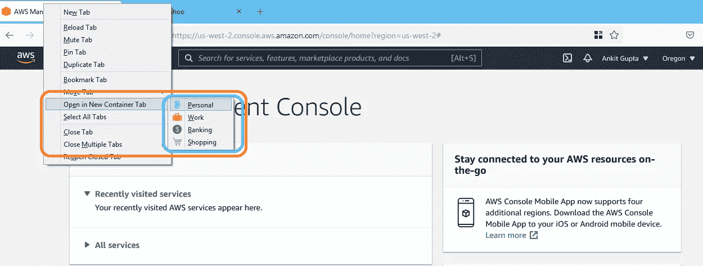
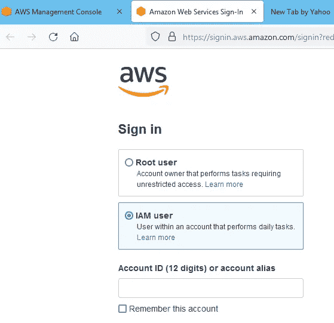
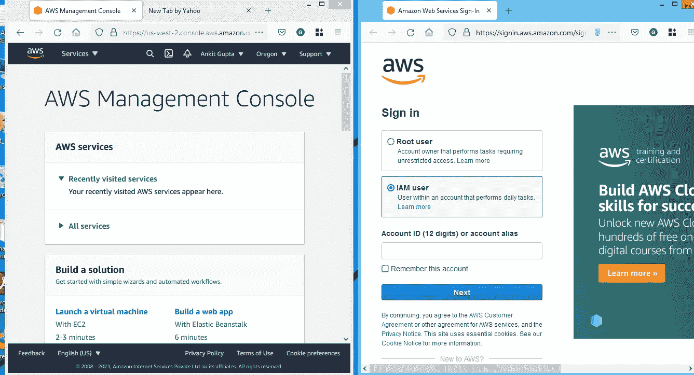
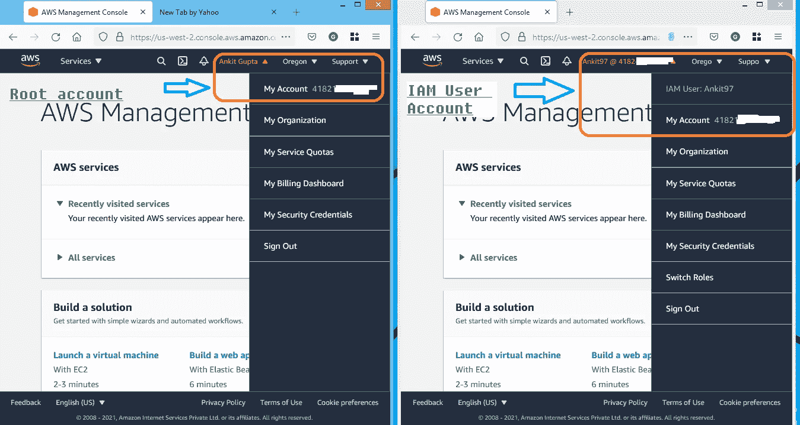

# 一次登录多个 AWS 帐户

> 原文：<https://medium.com/analytics-vidhya/login-to-multiple-aws-accounts-at-once-c78144bd25d9?source=collection_archive---------5----------------------->

## 就凭这一招！

[**点击**](https://marketplace.intel.com/file-asset/a5Q3b0000000PksEAE_a5S3b0000016NlOEAU?isOptimized=false)

在这篇博客中，我将讨论如何在不切换浏览器的情况下同时登录多个不同的 AWS 账户。我们中的许多人必须管理多个不同的 AWS 帐户，所以我们需要定期在它们之间切换，这是我们日常工作的一部分，我们知道每个浏览器只能登录一个帐户，因此我们一直在下载许多不同的多个浏览器。

因此，我们必须设法在一个浏览器中登录多个不同的 AWS 帐户。Firefox 有一个很好的特性，允许我们以最小的摩擦登录多个不同的 AWS 账户。所以这个功能被 Mozilla Firefox 称为 [**Firefox 多账户容器，如果你下载并安装这个插件，它允许你从一个浏览器登录多个不同的 AWS 账户。**](https://addons.mozilla.org/en-US/firefox/addon/multi-account-containers/)

让我们开始一些快速演示:

1.  在 Firefox web 浏览器上搜索或点击此链接 [**Firefox 多帐户容器由 Mozilla Firefox**](https://addons.mozilla.org/en-US/firefox/addon/multi-account-containers/) **。**

图片来源:[安基特·古普塔](/@ankitgupta_974)

2.点击**添加到 Firefox** 然后弹出生成仔细阅读弹出信息点击**添加按钮**。

图片来源:[安基特·古普塔](/@ankitgupta_974)

图片来源:[安基特·古普塔](/@ankitgupta_974)

3.我只用了两个帐号，一个是根用户帐号，另一个是 I am 用户帐号。所以你可以选择两个以上的账户。在 Firefox 浏览器上搜索 [AWS 管理控制台](https://signin.aws.amazon.com/signin?redirect_uri=https%3A%2F%2Fconsole.aws.amazon.com%2Fconsole%2Fhome%3Ffromtb%3Dtrue%26hashArgs%3D%2523%26isauthcode%3Dtrue%26state%3DhashArgsFromTB_us-east-1_b919b3a12f033cba&client_id=arn%3Aaws%3Asignin%3A%3A%3Aconsole%2Fcanvas&forceMobileApp=0&code_challenge=YT4DJ260bSpXQWENhkmjRVWJytnnbtVDpTKGSCBSPEU&code_challenge_method=SHA-256)并使用您的凭证登录。首先，我使用 root 帐户登录。

图片来源:[安基特·古普塔](/@ankitgupta_974)

4.接下来右键单击您的选项卡，然后单击**在新容器选项卡**中打开，并选择其中一个选项，因此我使用我的个人帐户，因此我单击“个人”。

图片来源:[安基特·古普塔](/@ankitgupta_974)

图片来源:[安基特·古普塔](/@ankitgupta_974)

5.在同一浏览器中打开一个新标签。为了便于展示，我拖动了另一个选项卡。

图片来源:[安基特·古普塔](/@ankitgupta_974)

图片来源:[安基特·古普塔](/@ankitgupta_974)

6.通过 IAM 用户凭证第二次登录，登录后如下所示。

图片来源:[安基特·古普塔](/@ankitgupta_974)

通常你会被踢出你的帐户在左手边，但使用容器你可以有两个不同的活动会话，要么作为两个不同的用户在同一时间或在两个不同的 AWS 帐户中，你可以看到这里，如果我们看右上角，我确实是作为 root 用户和 I am 用户在同一个帐户上登录的，你也可以在顶部看到我们在 个人容器选项卡，所以我希望这对那些管理大量 AWS 帐户的人有用。

# 结论

我希望这个博客能帮你节省时间和金钱，这样你就可以和你爱的人一起度过了。保持微笑，展现爱心！

**参考文献:**

[http://D1 . AWS static . com/whites/AWS _ pricing _ overview . pdf](http://d1.awsstatic.com/whitepapers/aws_pricing_overview.pdf)

**作者领英:**

 [## 印度马哈拉施特拉邦 ankit Gupta-Pune |职业简介| LinkedIn

### 我是深度学习爱好者/学习者，正在寻找一个可以贡献和提高技能的机会…

www.linkedin.com](https://www.linkedin.com/in/ankit-gupta2/) 

**其他博客:**

 [## 创建生命周期规则来管理您的 S3 文件

### 大家好。在这篇博客中，我将向您展示如何使用 S3 生命周期规则来自动转换数据…

aws .平原英语. io](https://aws.plainenglish.io/create-lifecycle-rules-to-manage-your-s3-files-a0707a761f4d)  [## 在亚马逊 S3 存储桶之间迁移数据

### 在同一个账户里。

aws .平原英语. io](https://aws.plainenglish.io/migrate-data-between-amazon-s3-buckets-db9c37d81708)  [## 什么是亚马逊 S3 复制？

### 关于 AWS S3 复制，您需要知道的一切:类型、要求、使用、时间控制

aws .平原英语. io](https://aws.plainenglish.io/what-is-amazon-s3-replication-fbb9c45507b3) 

**感谢您的阅读，如果您喜欢，请点击拍手按钮。**

关注我们了解更多内容。

**查看**[***AnalyticsVidhya***](https://medium.com/analytics-vidhya)***了解*更多 AWS 相关内容。**

*更多内容请看*[***AnalyticsVidhya***](https://medium.com/analytics-vidhya)