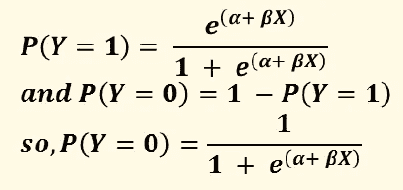
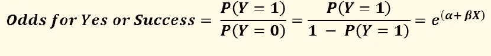
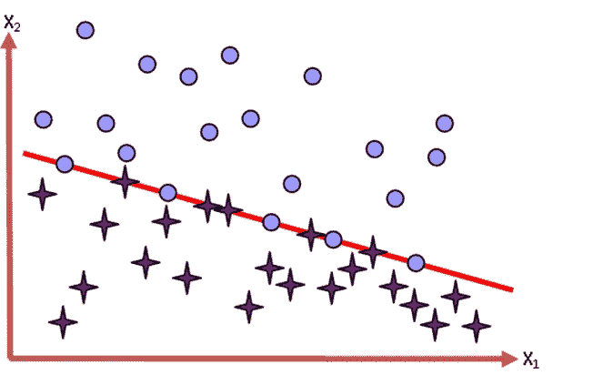

# 逻辑回归

> 原文：<https://medium.com/analytics-vidhya/logistic-regression-27c81e562999?source=collection_archive---------15----------------------->

简而言之，逻辑回归是多元回归，但其结果变量是分类二分法，预测变量是连续变量或分类变量。简单地说，这仅仅意味着我们可以预测一个人可能属于两个类别中的哪一个，给定某些其他信息。

**例如:客户会离开网络吗？**

这个例子和电信行业有关。市场已经饱和。因此，获得新客户是一项艰巨的工作。一项针对欧洲市场的研究表明，获得一个新客户的成本是留住一个现有客户的五倍。在这种情况下，公司需要采取积极措施来维持现有的客户群。使用逻辑回归，我们可以预测哪个客户将离开网络。根据调查结果，公司可以向客户提供一些有利可图的优惠。所有这些都是流失分析的一部分。

**例如:客户会离开网络吗？**

这个例子和电信行业有关。市场已经饱和。因此，获得新客户是一项艰巨的工作。一项针对欧洲市场的研究表明，获得一个新客户的成本是留住一个现有客户的五倍。在这种情况下，公司需要采取积极措施来维持现有的客户群。使用逻辑回归，我们可以预测哪个客户将离开网络。根据调查结果，公司可以向客户提供一些有利可图的优惠。所有这些都是流失分析的一部分。

**举例:借款人会违约吗？**

不良资产是银行的大问题。因此，作为贷款人的银行试图评估借款人履行支付利息和偿还本金承诺的能力。使用逻辑回归模型，经理可以了解潜在客户拖欠付款的情况。所有这些都是信用评分的一部分。

**示例:销售线索会成为客户吗？**

这是销售实践中的一个关键问题。传统的推销员到处追逐每个人。这导致了宝贵资源的浪费，如时间和金钱。使用逻辑回归，我们可以通过找到那些更有可能成为客户的潜在客户来缩小搜索范围。

**举例:员工会离开公司吗？**

留住员工是人力资源经理的一个重要策略。这对公司的可持续发展很重要。但是在一些行业，像信息技术，员工流失率非常高。使用逻辑回归，我们可以建立一些模型来预测一个员工在给定的时间跨度内离开组织的概率，比如一年。这项技术可以应用到现有的员工身上。同样，它也可以应用在招聘过程中。所以，我们基本上是在谈论某件事情发生或不发生的可能性。

**逻辑回归背后的原理**

在简单线性回归中，我们看到结果变量 Y 是从直线方程预测的:Yi = b0 + b1 X1 + εi 其中 b0 是截距，b1 是直线的斜率，X1 是预测变量的值，εi 是残差项。在多重回归中，有几个预测因子，一个相似的方程被推导出来，其中每个预测因子都有自己的系数。

在逻辑回归中，我们不是从预测变量中预测变量 Y 的值，而是在已知预测值的情况下计算 Y = Yes 的概率。逻辑回归方程与线性回归方程有许多相似之处。在其最简单的形式中，当只有一个预测变量时，预测 Y 概率的逻辑回归方程由下式给出:

p(Y = Yes)= 1/[1+exp {—(B0+B1 X1+εI)}]

线性回归的假设之一是变量之间的关系是线性的。当结果变量是二分的，这种假设通常是违反的。上述逻辑回归方程用对数项表示多元线性回归方程，从而克服了违反线性假设的问题。另一方面，等式的结果值是在 0 和 1 之间变化的概率值。接近 0 的值表示 Y 极不可能发生，接近 1 的值表示 Y 极有可能发生。

**为什么我们不能用线性回归？**

线性回归的假设之一是变量之间的关系是线性的。当结果变量是二分的，这种假设通常是违反的。上述逻辑回归方程用对数项表示多元线性回归方程，从而克服了违反线性假设的问题。另一方面，等式的结果值是在 0 和 1 之间变化的概率值。接近 0 的值表示 Y 极不可能发生，接近 1 的值表示 Y 极有可能发生。看看下面图表中的数据点。第一个用于线性回归，第二个用于逻辑回归。

我们如何得到方程式？

在线性回归的情况下，我们使用普通的最小二乘法来生成模型。在逻辑回归中，我们使用一种称为最大似然估计的技术来估计参数。这种方法估计系数的方式使得观察值的概率很高，即获得观察值的概率变得非常高。

**比较:判别分析和逻辑回归**

判别分析处理一个观察值可能属于哪一组的问题。另一方面，逻辑回归通常处理观察值属于每个组的可能性的问题，即，它估计观察值属于特定组的概率。

判别分析更像聚类分析一样是一种分类技术。

**对比:线性概率模型和 Logistic 回归**

最简单的二元选择模型是线性概率模型，顾名思义，事件发生的概率被假定为一组解释变量的线性函数，如下所示:

P(Y = Yes) = b0 + b1 X1 + εi

而逻辑回归方程如下:

p(Y = Yes)= 1/[1+exp {—(B0+B1 X1+εI)}]

你会发现线性回归与线性概率模型有很大的相似之处。从期望理论可以看出，如果你有两个结果，比如是或否，我们对自变量 X 的值进行回归，我们会得到一个 LPM。在这种情况下，我们将 yes 和 no 分别编码为 1 和 0。

**为什么不能用线性概率模型？**

原因是我们不能对上一张幻灯片中讨论的二分输出变量使用线性回归。而且，你可能会发现一些负概率和一些大于 1 的概率！而误差项会让你抓狂。所以我们必须再次研究逻辑回归。没得选！

**数学时间**

如果我们将“是”编码为 1，将“否”编码为 0，则逻辑回归方程可以写成如下形式:

现在，如果我们用“是”的概率除以“否”的概率，那么我们会得到一个新的度量，叫做几率。赔率不应该和概率混淆。几率就是成功概率与失败概率的比值。就像我们可能会说的，印度赢巴基斯坦的几率有多大。然后我们基本上是在比较印度获胜的概率和巴基斯坦获胜的概率。

如果我们对两边取自然对数，我们得到:

这就是为什么逻辑回归也被称为二元 Logit 模型。

**赔率变化**

如果我们将 X 改变一个单位，那么几率的变化由下式给出:

如果我们用第二个关系式除以第一个，我们得到 eβ。所以如果我们把 X 改变 1 个单位，那么几率会改变 eβ的倍数。因此表达式(eβ- 1)* 100%给出了百分比变化。记住这种理解只有在 X 连续的情况下才有效。当 X 是绝对的，我们指的是优势比。

**优势比**

假设我们在比较视力不好的人被车撞的几率和视力好的人被车撞的几率。

假设，事故编码为 1。

设 P(Y =1|视力差)= 0.8

& P(Y =1|良好视力)= 0.4

所以，P(Y = 0|视力差)= 1–0.8 = 0.2

& P(Y =0|良好视力)= 1–0.4 = 0.6

所以，赔率(视力差被车撞)= 0.8 / 0.2 = 4

& Odds(好视力被车撞)= 0.4 / 0.6 = 0.67

所以，优势比= 4/ 0.67 = 6

比值比意味着当我们从视力好的人变成视力差的人时，被车撞的几率变成 6 倍。

**开发模型:模型收敛**

为了估计逻辑回归模型，似然最大化算法必须收敛。术语无限参数指的是当

似然方程没有有限解(或者换句话说，最大似然估计不存在)。logistic 模型的最大似然估计的存在性取决于观测空间中样本点的配置。有三个互斥且详尽的类别:完全分离、准完全分离和重叠。

完全分离:无估计

准分离:无估计

准分离:有估计值

**评估模型**

我们在多元回归中看到，如果我们想要评估一个模型是否符合数据，我们可以通过使用 R2 来比较结果的观察值和预测值。同样，在逻辑回归中，我们可以使用观察值和预测值来评估模型的拟合度。我们使用的方法是对数可能性。

因此，对数似然性是基于与预测和实际结果相关的概率的总和。对数似然统计类似于多重回归中的剩余平方和，因为它表明模型拟合后还有多少未解释的信息。可以计算不同模型的对数似然性，并通过查看它们的对数似然性之间的差异来比较这些模型。这种方法的一个用途是将逻辑回归的状态与某种基线模型进行比较。通常使用的基线模型是只包含常数的模型。如果我们随后向模型添加一个或多个预测值，我们可以如下计算模型的改进:

现在，我们应该怎么处理方程中没有的其他变量。为此，我们有一个统计称为残差卡方统计。这一统计数据告诉我们，不在模型中的变量的系数与零显著不同，换句话说，向模型中添加一个或多个这些变量将显著影响其预测能力。

**单个估计参数的测试**

对单个估计参数或系数的显著性检验类似于多元回归中的检验。在这种情况下，估计系数的重要性基于 Wald 统计。该统计是基于最大似然估计的渐近正态性对逻辑回归系数的显著性进行的检验，估计如下:

如果变量是公制的，Wald 统计量是具有 1 个自由度的卡方分布，如果变量是非公制的，则类别数减 1。

**霍斯默-莱梅休拟合优度检验**

霍斯默和莱梅休拟合优度(GOF)检验是一种评估逻辑回归模型中是否存在拟合不足证据的方法。简而言之，该测试比较由结果的预测概率定义的箱中事件的预期和观察数量。无效假设是数据是由研究人员开发的模型生成的。

Hosmer Lemeshow 测试统计:

其中 Oi 是第 I 个频段的观测频率，Ni 是第 I 个频段的总频率。пI 是第 I 个容器的平均估计概率。

**对数似然相关的统计**

**AIC(赤池信息准则)** **=** -2log L + 2(k + s)，k 为响应水平总数减 1，s 为解释变量数。

**SC (Schwarz 判据)=**-2 log L+(k+s)σj fj，FJ 是第 j 次观测的频率。

**Cox 和 Snell** (1989 年，第 208-209 页)建议将决定系数推广到更一般的线性模型:

其中 n 是样本大小，L(0)是仅截距模型，

所以，

所有这些统计数据都有与线性回归中的 R2 相似的解释。因此，在这一部分，我们试图评估有多少信息是通过模型反映出来的。

**理解观察结果和预测结果之间的关系**

理解观察结果和预测结果之间的关系非常重要。模型的性能可以根据这种关系进行基准测试。

**简单概念**

让我们考虑下表。

在这张表中，我们正在处理独特的观察结果。该模型是为 Y = Yes 而开发的。因此，对于实际结果为“是”的观察，它应该显示高概率，而对于实际结果为“否”的观察，它应该显示低概率。

考虑观察 1 和 2。这里真实的结果分别是肯定和否定，肯定事件的概率大于否定事件的概率。这样的观察值对被称为**一致对。**这与观察结果 1 和 4 相反。这里我们得到否定的概率大于肯定的概率。但是数据是为 P 建模的(Y =是)。这样的一对被称为**不和谐的一对。**现在考虑第一对和第三对。这里的概率值是相等的，尽管我们有相反的结果。这种对子被称为**并列对子。**对于一个好的模型，我们期望一致对的数量相当高。

**相关措施**

设 nc，nd，t 为 N 个观测值的数据集中的一致对，不一致对和唯一观测值的个数。则(t — nc — nd)是系线对的数量。

然后我们有以下统计数据:

在理想情况下，所有“是”事件的概率应该很高，而“否”事件的概率很低，如下图所示。

但现实不知何故就像正确的图表。我们有一些概率很低的是事件和一些概率很高的否事件。

**切点概率水平应该是多少？**

决定分界点概率水平是一个非常主观的问题，分界点概率水平即高于预测结果的概率水平是一个事件，即是。分类表可以帮助研究人员决定截止水平。

分类表有几个关键概念。

**与分类表相关的其他措施**

**接收机工作特性曲线**

受试者工作特征(ROC)曲线对于评估预测的准确性非常有用。在 ROC 曲线中，对参数的不同截止点，灵敏度以 100-特异性的函数绘制。ROC 曲线上的每个点代表对应于特定决策阈值的灵敏度/特异性对。ROC 曲线下的面积(AUC)是参数区分两组的程度的量度。在我们的例子中，参数是事件的概率。

ROC 曲线在 Y 轴上显示灵敏度，在 X 轴上显示 100 分钟特异性。如果预测事件(而不是非事件)是我们的目的，那么在 Y 轴上我们有正确预测占总发生的比例，在 X 轴上我们有不同分界点的不正确预测占总未发生的比例。

如果 ROC 曲线变成红色直线，那么它意味着模型是随机分离病例的。

# 参考

# 学术文献

*   [博什纳科夫，2011 年] G .博什纳科夫。 [*关于随机系数模型的一阶和二阶平稳性*](http://www.maths.manchester.ac.uk/~goran/research-reports/psrr03-2009.pdf) 。线性代数应用 434，415–423。2011.
*   [Breitung，2002 年] [*单位根和协整的非参数检验。*](https://pdfs.semanticscholar.org/e31b/c65824cc156d43d25b6ece0e9613b398233d.pdf) 《计量经济学杂志》，108 卷 2 期，343–363 页。
*   [达尔豪斯，2012 年]达尔豪斯河(2012 年)局部平稳过程。在*统计手册*(第 30 卷，第 351-413 页)。爱思唯尔。
*   【Nason，2006】[Nason，GP](https://research-information.bristol.ac.uk/en/persons/guy-p-nason(c22adede-c5fc-4692-9b91-24afa15868b6).html) 2006，[平稳与非平稳时间序列](https://research-information.bristol.ac.uk/en/publications/stationary-and-nonstationary-time-series(c0005c54-b407-414e-944c-92fca5df2a2b).html)。在 H Mader&SC Coles(eds)*火山学中的统计学。*地质学会，第 129–142 页。
*   [Vogt，2012 年] Vogt，M. (2012 年)。局部平稳时间序列的非参数回归。*统计年鉴*， *40* (5)，2601–2633。
*   古吉拉特语，基本计量经济学，第 5 版，塔塔麦格劳-希尔
*   使用 SPSS 发现统计数据，第二版，Sage 出版物
*   Hair，j .，Anderson，r .，巴宾，b.《多元数据分析》,第 7 版，普伦蒂斯霍尔
*   n . k . malhotra，Dash，s,《营销研究:应用导向》,第 5 版，培生教育
*   Rud，O. P,《数据挖掘食谱:营销、风险和客户关系管理的建模数据》, John Wiley & Sons，2000 年

# 在线参考

*   [特征方程的根与其逆的根互逆](https://stats.stackexchange.com/questions/185200/roots-of-characteristic-equation-reciprocal-to-roots-of-its-inverse)
*   [随机过程特征](https://www.mathworks.com/help/econ/stationary-stochastic-process.html)
*   [趋势平稳与差异平稳过程](https://www.mathworks.com/help/econ/trend-stationary-vs-difference-stationary.html)