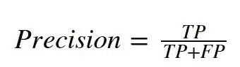
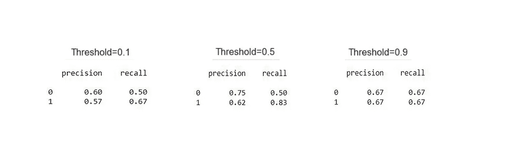

# 逻辑回归

> 原文：<https://medium.com/analytics-vidhya/logistic-regression-9b5aea994ecf?source=collection_archive---------18----------------------->

在我们的日常生活中，我们会遇到许多问题，其中有一些问题是围绕着选择一个类别的，比如通过/失败、赢/输、活着/死了、健康/生病、是/否等等。这就像从两个选择中挑选一个。决策在我们的生活中扮演着重要的角色，做出任何选择都有其后果。

通过阅读上面的内容，你可能会考虑是继续写这篇博客还是跳过它？

***做出选择。***

来吧，让我们开始假设你已经选择了“是”类别。这是个不错的选择。对你来说这是一个简单的任务，但是如果我问你一个和你同龄的随机的人是否可能阅读我的博客呢？你可能已经回答了任何一个问题，但是机器如何解决同样的问题呢？

机器要回答这个问题，需要大量带有标签(结果变量，即是/否)的数据，并从中学习。这种类型的机器学习通常被称为监督学习。在这种情况下，大量的数据与人的年龄和他是否读过博客(是/否)。让我们深入机器的大脑。

逻辑回归是用于分类问题的监督机器学习技术。它用于对问题进行分类，例如

*   ***【二分类(对两类问题进行分类)***——你我是否读过我的博客？(1-将阅读我的博客，0-不阅读我的博客)
*   ***【多类分类(将问题分为两类以上)***——你会给我的博客打几分(满分五分)？(1-非常差，2-差，3-好，4-好，5-非常好)

在这个博客中，让我们处理二元分类问题，以了解逻辑回归是如何工作的。

数据点如下所示。让我们看看逻辑回归是如何预测的。

在预测之前，让我们了解算法是如何工作的。

## **s 形曲线**

Logit 函数是一种 S 形曲线或 Sigmoid 函数，可在 0 和 1 之间调整数值。这就是 Logit 函数在二维空间中的表现。

s 形曲线的形状取决于两个参数，即:

*   ***m——曲线的斜率。***
*   ***c —拦截*** 。

我们可以看到不同的 m & c 值有不同的 sigmoid 曲线。

## 哪条 sigmoid 曲线最适合我们的数据点？

要回答这个问题，我们必须理解成本函数和梯度下降等术语。

**交叉熵损失:**

这一损失告诉我们，我们的模型表现得有多好。下图表示梯度下降。

## **梯度下降:**

上面的梯度下降图显示了交叉熵损失如何最小化并达到全局最小值(可以预测我们的最佳模型)的路径。

*   ***蓝点——代表我们模型的交叉熵损失。*【交叉熵损失最大值】**
*   ***红点——代表全局最小值。(机器可以预测交叉熵损失最小的最佳模型)***

## 如何达到全局最小值？

有时我们可能会像下图所示的非凸曲线一样结束，其中可能有很多局部最小值，但最佳模型是在交叉熵损失最小的全局最小值处找到的。

*   首先计算我们模型的交叉熵损失，然后它开始向全局最小值移动。
*   通过改变我们的模型的参数值，从而减少交叉熵损失，从而开始降低我们的交叉熵损失(达到全局最小值)的路径。

通过重复上述过程，交叉熵损失被最小化，因此获得了全局最小值，如上面的梯度下降图所示。局部最小值并不代表最佳模型，最佳模型只能在全局最小值处找到。

现在让我们看看 sigmoid 曲线如何根据这两个参数变化。

## 1)改变斜率(m ),保持截距(c)恒定。

从图中我们可以看出，保持截距(c)不变，通过改变斜率(m)，S 曲线的斜率发生变化。

在数学上，应用偏微分，保持 c 项为常数，然后减去当前 m 值。

> ***n-(学习率)-它是一个参数，定义了为了达到全局最小值应该采取多大或多小的步长。***

## 1)改变截距(c)保持斜率(m)不变。

从图中我们可以看到，通过改变截距(c)保持斜率(m)不变，***S 曲线在 x 轴上移动。***

在数学上，应用偏微分，保持 m 项为常数，然后减去当前 c 值。

通过这一过程，我们最终可以达到全局最小值，在该处我们的数据集可以实现我们的最佳模型或最佳 S 曲线。

最后，我们找到了最佳的 S 曲线。现在怎么办？

# 什么是门槛，如何找到合适的门槛？

## ***绿色区域*** - **阳性区域(该区域内的所有数据点被归类为阳性类)**

## 红色区域-负区域(该区域中的所有数据点被分类为负类)

为 s 形曲线设置阈值，并假设在 x 轴上画一条垂直线，如上图所示。出现在该线右侧的数据点，算法将其分类为正类，而出现在垂直线左侧的所有数据点，算法将其分类为负类。

阈值是否必须设置为 0.1、0.5、0.9 或其他数字。要找到什么是正确的阈值，首先我们需要知道什么是混淆矩阵。

## 混淆矩阵和分类指标

混淆矩阵是一个表格，帮助您了解基于测试数据的分类模型的性能，因为真实值是已知的。

*   ***【TN(真负值)***—实际值和预测值一样也是负值。
*   ***【FP(假阳性)*** —实际值为负，但预测值为正。这些也被称为第一类错误。
*   ***【假阴性】*** —实际值为正，但预测值为负。这些也被称为第二类错误。
*   ***TP(真正)*** —实际值和预测值一样也是正的。

基于这四个值，计算一些分类度量，但是我们将只考虑其中的两个，即，

*   ***回忆(灵敏度)*** —当实际值为正值时，预测值也为正值的频率。

*   ***精度*** —当预测到一个正值时，预测正确的几率有多大？

现在让我们回过头来试着算出正确的阈值。

下图显示了不同的阈值及其混淆矩阵和分类指标。

从上面的图表中，你可能会看到，无论你设置什么样的阈值，你最终肯定会出现第一类错误或第二类错误。不可能准确无误地对所有的真阳性和假阳性进行分类。几乎所有数据集中都会出现这种情况。一般来说，它被称为精度/召回权衡，因为当误差值发生变化时，它会直接影响精度和召回值。

## 精确度/召回率的权衡

无论何时提高精度，召回值都会降低，反之亦然。精度和召回率是成反比的。

我们需要选择一个阈值，使精度和召回值几乎接近 1。

在某些情况下，考虑到一个分类度量比另一个更重要，我们将阈值设置为最小值或最大值。

## 案例 1:第二类错误比第一类错误更重要

让我们假设 12 个人在去年的某一天去了武汉市场，每个人都有咳嗽的症状，每个人都去看了医生。医生说，在去医院的 12 个人中，有 8 个人发现了某种随机的新病毒。医生的预测如图所示。他说这是一种传染性病毒，他们中的每 8 个人都需要隔离几天。在 8 个人中，医生错误地预测 3 个人患有该随机疾病(I 型错误)。虽然这 3 个人处于自我隔离状态，但这对社会没有任何影响，但医生诊断为阴性的 1 个人恰好是最危险的一个，因为医生说他是阴性，那个人只是正常地做他的日常工作，像往常一样乘坐公共交通工具并与家人在一起。由于医生错误地预测那个人是阴性，那个人引发了病毒的传播，因此病毒具有很强的传染性，它在我们全球化的世界中传播得更快，从而导致疫情扰乱了全球各地的经济和生活。

在这种情况下，你可以看到第二类错误似乎比第一类错误更危险。

## 案例 2:第一类错误比第二类错误更重要

让我们假设有 12 个人正在等待从银行获得贷款。银行使用某种机器学习算法随机只给 6 个人贷款。机器学习算法根据个人细节预测一个人是否会还钱，因此其预测如上图所示。因为银行错误地预测两个人他们不会还钱，但根据他们的财产和工资，他们有能力偿还贷款(第二类错误)。对银行没有太大影响。在另一边，机器学习算法错误地预测两个人会还钱，银行给了两个人贷款。在这种情况下，这两个人没有偿还贷款，因此银行损失了钱。

在这种情况下，你可以看到 I 型错误似乎比 II 型错误更危险。

因此，根据问题的背景，人们可以选择哪个误差比其他误差更好，并可以为预测设置正确的阈值。

[**上面的代码为可视化**](https://github.com/CSKOUSHIK/Logistic-Regression)

就是这样。我认为因为你最终做出了正确的选择，所以你利用了宝贵的时间来研究我的博客。

> 生活是一个选择的问题，你所做的每一个选择都会造就你。约翰·麦克斯韦

***最后做出选择。***

