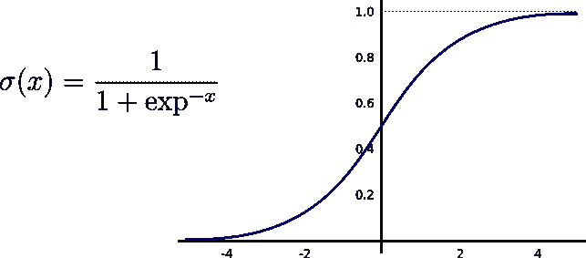
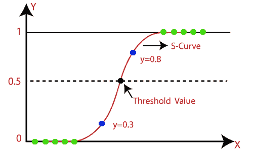
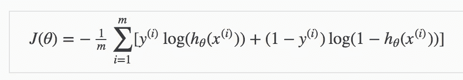
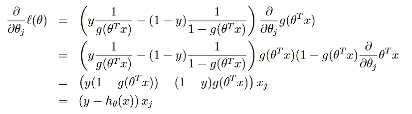

# 逻辑回归:你想知道的一切

> 原文：<https://medium.com/analytics-vidhya/logistic-regression-all-you-wanna-know-e7938f402663?source=collection_archive---------19----------------------->

从头开始完成实施


逻辑回归用于模拟某个类别的概率，以便可以将其赋值为 0 或 1。这是一个统计和监督学习模型。这是二元分类的常用方法。

> 比如你想预测一个人是否有糖尿病！ ***或*** 假设你想从任意数据集 ***或*** 中知道存活率任意邮件是垃圾邮件(1)还是不是(0)。

> 所以基本上这是一种分类技术。这里我们将看到二进制分类。

我们在逻辑回归中使用 **Sigmoid 函数**，因为我们希望我们的值介于 0 和 1 之间，如下图所示。



# 假设函数


将两者结合起来会给我们→


这个函数总是给我们 0 到 1 之间的值，告诉我们这个点的概率。当我们接近预测线时，我们的预测变得不那么有把握(因为它们是混乱的)。我们产生一个判定边界，即如果值大于 0.5，则它是 1，如果小于 0.5，则它是 0 类。



# 对数损失(二元交叉熵)

> 逻辑回归损失



在这里，您可以看到正确值正在乘以预测值。公式的第一部分解释了何时标签为 1 乘以点的置信度为正。类似地，当标签为 0 乘以其为负的置信度时，第二部分成立。

> 我们必须最小化这个损失函数，为此我们将使用线性回归中的梯度下降法。

线性回归博客链接

[](/analytics-vidhya/linear-regression-c6625caf9e8e) [## 线性回归

### 单个和多个因变量

medium.com](/analytics-vidhya/linear-regression-c6625caf9e8e) 

# 梯度下降



在计算上面照片中的导数时，我们没有使用负号，这是线性回归和逻辑回归的梯度下降公式之间的唯一区别。

N 现在我们都准备好开始实施了→

```
def **sigmoid**(x):
    return 1.0/(1.0 + np.exp(-x))def **hypothesis**(X,theta):
    *# X - entire array (m,n+1)
    # theta - np.array(n+1,1)*
    return sigmoid(np.dot(X,theta))def **error**(X,y,theta):
    *"""
    parameters:
    X - (m,n+1)
    Y - (m,1)
    theta - (n+1,1)
    return scalar value of loss
    """*
    hi = hypothesis(X,theta)
    e = -1*np.mean(y*np.log(hi)+(1-y)*np.log(1-hi))
    return edef **gradient**(X,y,theta):
    *"""
    parameters:
    X - (m,n+1)
    Y - (m,1)
    theta - (n+1,1)
    return vector
    """*
    hi = hypothesis(X,theta)
    grad = np.dot(X.T,(y-hi))
    return grad/X.shape[0]def **gradient_descent**(X,y,lr=0.1,max_itr=500):
    n = X.shape[1]
    theta = np.zeros((n,1))

    error_list = []
    for i in range(max_itr):
        err = error(X,y,theta)
        error_list.append(err)

        grad = gradient(X,y,theta)

        theta = theta + lr*grad
    return theta ,error_listdef **predict**(X,theta):
    h = hypothesis(X,theta)
    output = np.zeros(h.shape)
    output[h>=0.5] = 1
    output = output.astype('int')
    return output
```

现在只需将逻辑回归应用于任何二元模型，如糖尿病分类，或者您可以从 sklearn 导入乳腺癌数据集，然后应用它！！