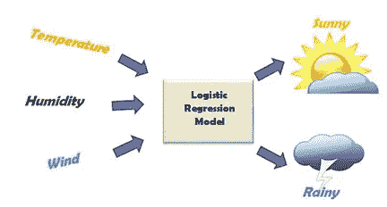
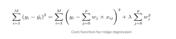

# 逻辑回归。

> 原文：<https://medium.com/analytics-vidhya/logistic-regression-c5a6c047363e?source=collection_archive---------7----------------------->

逻辑回归是一种分类算法，用于将观察值分配给一组离散的类。与输出连续数值的线性回归不同，逻辑回归使用逻辑 sigmoid 函数转换其输出，以返回一个概率值，该概率值可映射到两个或多个离散类。

例如，下面给出了不同的输入变量，如温度、湿度和风，我们的模型可以预测输出。

**与线性回归的比较:**

给出学习时间和考试分数的数据。线性回归和逻辑回归可以预测不同的事情:

**线性回归:**在 0 到 100 的范围内，线性回归可以帮助我们预测学生的考试成绩。线性回归的预测是连续的(一个范围内的数字)。

**逻辑回归:**我们可以用逻辑回归来决定一个学生是否会及格。逻辑回归的预测是离散的(只允许特定的值或类别)。还可以查看支持模型分类的概率分数。

**逻辑回归的类型:**

通常，逻辑回归是指具有二元目标变量的二元逻辑回归，但是可以有两类以上的目标变量可以被它预测。基于这些类别的数量，逻辑回归可以分为以下类型

**二元或二项式**

在这种分类中，因变量只有两种可能的类型，要么是 1，要么是 0。例如，这些变量可能代表成功或失败，是或否，赢或输等。

**多项式**

在这种分类中，因变量可以有 3 个或更多可能的无序类型或没有数量意义的类型。例如，这些变量可能代表“A 型”或“B 型”或“C 型”。

**序数**

在这种分类中，因变量可以有 3 个或更多可能的有序类型或具有数量重要性的类型。例如，这些变量可以表示“差”或“好”、“非常好”、“优秀”，并且每个类别可以具有像 0、1、2、3 这样的分数。

**逻辑回归中的假设:**

逻辑回归没有做出基于普通最小二乘算法的线性回归和一般线性模型的许多关键假设，特别是关于线性、正态性、同方差和测量水平。

1.逻辑回归不需要因变量和自变量之间的线性关系。

2.误差项(残差)不需要正态分布。

3.不需要同质性。

4.逻辑回归中的因变量不是在区间或比率尺度上测量的。

然而，其他一些假设仍然适用。

二元逻辑回归要求因变量是二元的，而有序逻辑回归要求因变量是有序的。

逻辑回归要求观察值相互独立。换句话说，观察值不应该来自重复的测量或匹配的数据。

逻辑回归要求自变量之间很少或没有多重共线性。这意味着独立变量之间的相关性不应该太高。

逻辑回归假设独立变量和对数比值呈线性。尽管该分析不要求因变量和自变量线性相关，但要求自变量与对数概率线性相关。

逻辑回归通常需要大样本量。一般的指导方针是，对于模型中的每个独立变量，至少需要 10 个具有最不频繁结果的案例。

例如，如果你有 5 个独立变量，你最不频繁结果的预期概率是 0.10，那么你需要的最小样本量是 500 (10*5 / .10)。

**不同的回归算法:**

有各种各样的回归技术可以用来做预测。这些技术基于三个指标:自变量的数量、因变量的类型和回归线的形状。

**1。** **线性回归**

**2。** **逻辑回归**

**3。** **岭回归**

**4。** **拉索回归**

**5。** **多项式回归**

6。 **贝叶斯线性回归**

**7。** **逐步回归**

**8。** **弹力网回归**

**9。** **支持向量回归**

**10。** **随机森林回归**

**11。决策树回归**

**线性回归:**

线性回归是一种预测性建模技术，可以发现自变量和因变量(连续变量)之间的关系。

当只有一个输入变量(x)时，该方法被称为简单线性回归。当有多个输入变量时，统计学文献通常将该方法称为多元线性回归。

**逻辑回归:**

逻辑回归是回归分析技术的一种，当因变量为离散变量时使用。逻辑回归是最流行的机器学习算法之一，属于监督学习技术。它用于使用一组给定的独立变量来预测分类因变量。

逻辑回归预测分类因变量的输出。因此，结果必须是分类值或离散值。它可以是是或否，0 或 1，真或假，等等。但是它给出的不是 0 和 1 的精确值，而是介于 0 和 1 之间的概率值。

逻辑回归计算由以下等式给出:

**岭回归:**

岭回归是一种分析多重共线性数据的技术。当多重共线性发生时，最小二乘估计是无偏的，但是它们的方差很大，因此它们可能远离真实值。通过给回归估计增加一定程度的偏差，岭回归减少了标准误差。当自变量高度相关时，使用这种方法。

执行 L2 正则化，即等价于系数大小的平方的惩罚。

最小化目标= LS Obj + α *(系数的平方和)

岭是如此强大的回归方法，其中模型不太容易过度拟合。

**拉索回归:**

LASSO(最小绝对收缩选择算子)，很像岭，减少了因变量的数量，在岭回归的类似情况下，如果惩罚项很大，系数可以减少到零，使特征选择更容易。LASSO 使用 L1 正则化技术。

LASSO 通常在我们拥有大量特征时使用，因为它会自动进行特征选择。结果，系数值变得更接近零，这在岭回归的情况下不会发生。

LASSO 采用了简单的屏蔽(阈值)技术，并选择了一个用于最终模型实现的协变量子集。

下面是代表套索回归方法的等式:

**多项式回归:**

多项式回归，自变量和因变量之间的关系，也就是 X 和 Y，用 n 次表示。

作为估计量，它是一个线性模型。最小均方方法也用于多项式回归。多项式回归中穿过所有数据点的最佳拟合线不是直线，而是曲线，这取决于 X 的幂或 n 的值。

多项式回归可以由下面的等式表示:

**贝叶斯线性回归:**

贝叶斯回归是机器学习中的一种回归类型，它使用贝叶斯定理来找出回归系数的值。在这种回归方法中，确定特征的后验分布，而不是寻找最小二乘法。贝叶斯线性回归类似于线性回归和岭回归，但比简单的线性回归更稳定。

**逐步回归:**

它常用于满足回归模型和自然执行的预测模型。每向前一步，变量就会从一组描述性变量中增加或减少。

前向选择执行连续添加变量以检查性能，并在不需要改进到一定程度时停止。

向后消除包括一次删除变量，直到没有多余的变量被删除而没有相当大的损失。双向消除是上述两种方法的混合。

**弹力网回归:**

当高度相关的预测因子联合出现在模型中时，岭回归和套索回归的混合会产生分组效应。建议在预测值的数量远大于观测值的数量时使用。

**支持向量回归:**

支持向量回归(SVR)使用与 SVM 相同的原理，但用于回归问题。

它试图找到一条线/超平面(在多维空间中)来分隔这两个类。然后，它根据新点是位于超平面的正侧还是负侧来对新点进行分类，这取决于要预测的类别。

**随机森林回归:**

随机森林回归是一种监督学习算法，使用集成学习方法进行回归。集成学习方法是一种结合来自多个机器学习算法的预测来做出比单个模型更准确的预测的技术。

**决策树回归:**

这是一个最好的和最常用的监督学习方法是基于树的算法。它们使预测建模具有更高的准确性、更好的稳定性，并且易于解释。

**逻辑回归的度量:**

在我们完成构建您的模型后，有多个指标将帮助我们评估模型的准确性。

1.混淆矩阵

2.F1 分数

3.增益和提升图表

4.科尔莫戈罗夫·斯米尔诺夫图表

5.AUC-ROC

6.原木损失

7.基尼系数

8.和谐—不和谐比率

9.均方根误差

10.均方根对数误差

11.R 平方/调整的 R 平方

**1。混乱矩阵:**

混淆矩阵是一个 N×N 矩阵，其中 N 是被预测的类的数量。对于手头的问题，我们有 N=2，因此我们得到一个 2×2 矩阵。对于混淆矩阵，您需要记住以下几个定义:

准确性:正确预测总数的比例。

阳性预测值或精确度:被正确识别的阳性病例的比例。

阴性预测值:被正确识别的阴性病例的比例。

敏感性或回忆:被正确识别的实际阳性病例的比例。

特异性:被正确识别的实际阴性病例的比例。

**2。F1 得分:**

这是精度和召回率的调和平均值，并且给出了比精度度量更好的错误分类情况的度量。

我们使用调和平均值，因为它不利于极值。

总结 F1 分数和准确性之间的差异，

当真阳性和真阴性更重要时使用准确度，而当假阴性和假阳性至关重要时使用 F1 分数。

当类别分布相似时，可以使用精确度，而当存在不平衡的类别时，F1-score 是更好的度量，如上例所示。

在大多数现实生活的分类问题中，存在不平衡的类分布，因此 F1-score 是评估我们的模型的更好的度量。

**3。增益和升力图表:**

增益和提升图主要用于检查概率的排序。

以下是构建提升/增益图的步骤:

第一步:计算每次观察的概率。

第二步:按降序排列这些概率。

第三步:建立十分位数，每个组有将近 10%的观察值。

第 4 步:计算好(有响应者)、差(无响应者)和总的每十分位数的响应率

提升/增益图广泛用于活动目标问题。这告诉我们，在特定的活动中，我们可以将目标客户锁定在哪个十分位数。此外，它告诉你有多少反应，你期望从新的目标基地。

**4。科洛莫戈罗夫·斯米尔诺夫图表:**

K-S 或 Kolmogorov-Smirnov 图衡量分类模型的性能。更准确地说，K-S 是正分布和负分布之间分离程度的度量。如果分数将人群分成两个独立的组，其中一组包含所有的阳性，另一组包含所有的阴性，则 K-S 为 100。

另一方面，如果模型不能区分阳性和阴性，那么就好像模型从总体中随机选择病例。K-S 应该是 0。在大多数分类模型中，K-S 将落在 0 和 100 之间，并且该值越高，该模型就越能更好地将阳性病例与阴性病例分开。

**5。ROC 曲线下面积(AUC — ROC):**

使用 ROC 曲线的最大优点是独立于应答者比例的变化。

我们先来了解一下什么是 ROC(受试者工作特性)曲线。如果我们看下面的混淆矩阵，我们观察到对于一个概率模型，我们得到每个度量的不同值。

ROC 曲线是灵敏度和(1-特异性)之间的图。(1-特异性)也称为假阳性率，灵敏度也称为真阳性率。以下是手头案例的 ROC 曲线。

**6。日志丢失:**

AUC ROC 考虑预测的概率来确定我们模型的性能。然而，AUC ROC 有一个问题，它只考虑概率的顺序，因此，它不考虑模型预测样本更可能为正的更高概率的能力。在这种情况下，我们可以使用对数损失，它只不过是每个实例的校正预测概率对数的负平均值。

**7。基尼系数:**

基尼系数有时用于分类问题。基尼系数可以直接从 AUC ROC 数导出。基尼系数只不过是 ROC 曲线和对角线之间的面积与上面三角形的面积之比。以下是使用的公式:

基尼= 2*AUC — 1

**8。和谐-不和谐比率:-**

它是任何分类预测问题的最重要的度量之一。符合率超过 60%就是好模型。在决定目标客户数量时，通常不使用该指标。它主要用于评估模型的预测能力。

**9。均方根误差(RMSE): -**

这是回归问题中最常用的评估指标。它遵循一个假设，即误差是无偏的，并遵循正态分布。

在 RMSE 有几个关键点需要考虑:

“平方根”的力量使这一指标能够显示大量偏差。

该度量的平方性质有助于提供更稳健的结果，从而防止抵消正负误差值。

它避免了使用绝对误差值，这在数学计算中是非常不希望的。

与平均绝对误差相比，RMSE 给出更高的权重并惩罚大的误差。

RMSE 误差可以计算如下:

其中，N 是观察总数。

**10。均方根对数误差:-**

为了计算这个，我们取预测值和实际值的对数。当预测值和真实值都是巨大的数字时，如果我们不想惩罚预测值和实际值之间的巨大差异，通常会使用 RMSLE。

如果预测值和实际值都很小，那么 RMSE 和 RMSLE 是相同的。

如果预测值或实际值大:RMSE > RMSLE。

如果预测值和实际值都很大:RMSE > RMSLE。

**11。r 平方:-**

在分类问题的情况下，如果模型的精确度为 0.8，我们将衡量我们的模型相对于随机模型的精确度为 0.5。因此，随机模型可以作为一个基准。在 RMSE 指标中，我们没有可以比较的基准。

R 的平方可以计算如下:

MSE(模型):预测值与实际值的均方误差。

MSE(基线):平均预测值与实际值的均方误差。

**参考资料:** [分析报告](https://www.analyticssteps.com/blogs/7-types-regression-technique-you-should-know-machine-learning)，[升级报告](https://www.upgrad.com/blog/types-of-regression-models-in-machine-learning/)，[统计报告](https://www.statisticssolutions.com/assumptions-of-logistic-regression/)。