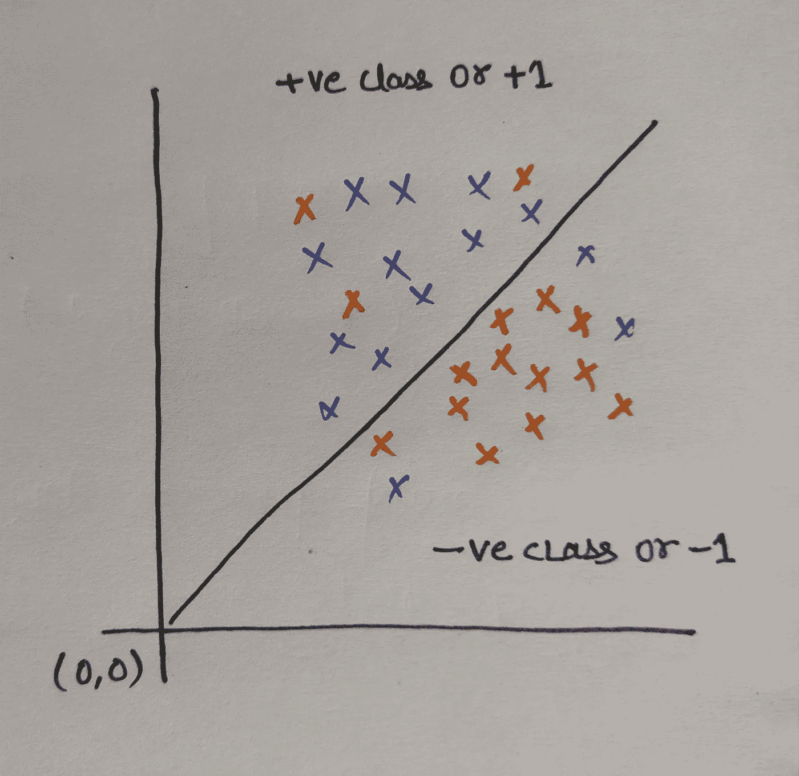
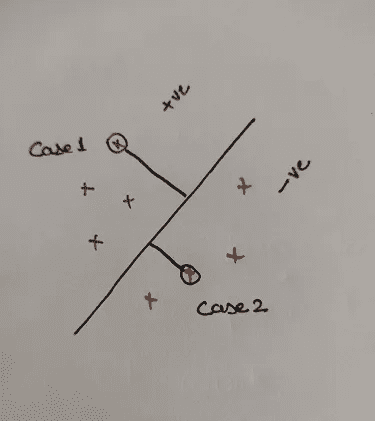
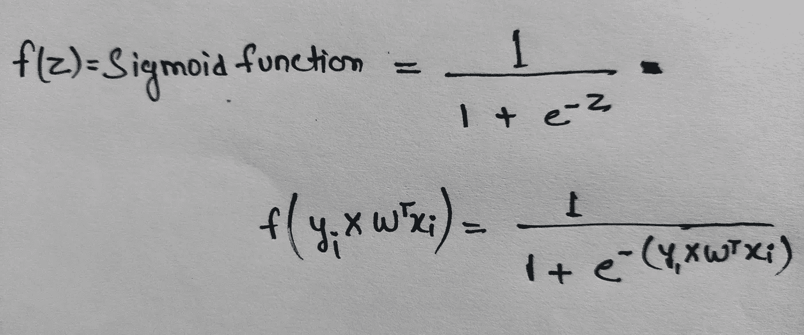
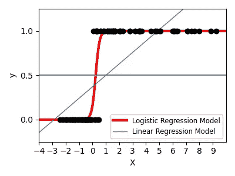
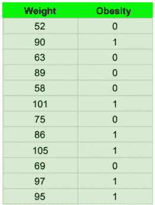

# 逻辑回归|详细解释

> 原文：<https://medium.com/analytics-vidhya/logistic-regression-detailed-explanation-3f1724314739?source=collection_archive---------18----------------------->

图 1:逻辑回归(来源:[https://www . knowledge hut . com/blog/data-science/Logistic-Regression-for-machine-learning](https://www.knowledgehut.com/blog/data-science/logistic-regression-for-machine-learning))

逻辑回归是一种统计方法，通过使用逻辑函数测量分类因变量和自变量之间的关系来进行分类。然而，它可以用于多类分类。这对于线性可分的数据很有用。

**逻辑回归的用例**:

*   邮件是垃圾邮件(1)还是垃圾邮件(0)。
*   肿瘤是恶性的(1)还是非恶性的(0)。

# **为什么是逻辑回归**

[线性回归](https://adityatiwari13.medium.com/linear-regression-48ede7a95ee9)无法很好地执行二元分类，因为当数据中存在大量异常值时，最佳拟合线会发生偏离。模型得到的输出大部分时间大于 1 小于 0。

# **基本假设**

*   逻辑回归假设独立变量和对数比值为线性，即 log(p/(1-p))，其中 p 是成功的概率。
*   逻辑回归要求自变量之间很少或没有多重共线性。这意味着独立变量之间的相关性不应该太高。

# 赞成的意见

*   它需要较少的训练，容易理解。
*   逻辑回归不太倾向于过度拟合，但它可能在高维数据集中过度拟合。(为了避免这种情况，可以使用 L1 和 L2 正则化)
*   它没有对特征空间中类的分布做任何假设。
*   它可以很容易地扩展到多个类和类预测的自然概率视图。

**缺点**

*   需要特征工程。
*   相关特征会影响模型的性能。
*   主要的限制是因变量和自变量之间的线性假设。
*   非线性问题不能用逻辑回归来解决

# 逻辑回归背后的数学

图 1:线性可分的类

让我们以线性可分的类为例。

直线方程是:

*   **y = mx+c**

其中， **m** =斜率， **c** =截距

或者我们可以重写上面的等式

*   Y = w'x +b (等式。— 1)

其中，**w '**= b/w 点与平原的距离

在图 1 中，超平面通过原点，因此 **b** =0

*   我们可以将等式 1 写成**Y = w’x**

正确分类。这里可能有两种情况:

图二。数据点与直线之间的距离。

**案例 1。Y = +1 w'x > 0**

当我们计算 **Y** 和**w’x**的乘积时，它将是一个正值。

**Y * w'x > 0**

**案例二。Y = -1 w'x < 0**

当我们计算 **Y** 和**w’x**的乘积时，它将是正值。两个负数乘积变成正数。

**Y * w'x > 0**

因此，如果 **Y** 和**w’x**的乘积大于 0，则分数被正确分类为 **+ve** 和 **-ve** 类。

为了分类不正确的数据点， **Y** 和**w’x**的乘积将小于 0 或-ve。

**案例三。Y = -1 w'x > 0**

这里 **Y * w'x < 0** 。因此它被错误地分类了。

这意味着逻辑回归的成本函数是:

图三。价值函数

因此，如果我们得到最佳拟合线的所有给定点的最大和，那么它可以对两个数据进行线性分类。

# 那它为什么使用 sigmoid 函数呢？

假设数据中存在任何异常值，那么在某些情况下，最佳拟合线看起来不错，但是由于异常值，成本函数给出的值较小，偏离了最佳拟合线。在某些情况下，最佳拟合线看起来并不好，但它给出了最大值。

为了防止异常值对最佳拟合线的影响，引入了 sigmoid 函数。

图 4。Sigmoid 函数

通过应用 sigmoid 函数，它将消除离群值的影响，并在 0 到 1 之间改变权重。

图 5。对 0 和 1 中的点进行分类

**实际实施**

让我们举一个人体重列表的例子来确定他们是否肥胖。

图 6 重量列表

上面的代码是逻辑函数的简单表示。这个代码根据体重预测一个人的肥胖程度。

在这篇博客中，我为初学者介绍了逻辑回归的各个方面，这样他们可以很容易地理解这个算法。

 [## TPOT 汽车公司

### 自动机器学习(AutoML)是一个热门的新领域，其目标是使选择机器学习变得容易

adityatiwari13.medium.com](https://adityatiwari13.medium.com/automl-tpot-9a83509e021f)