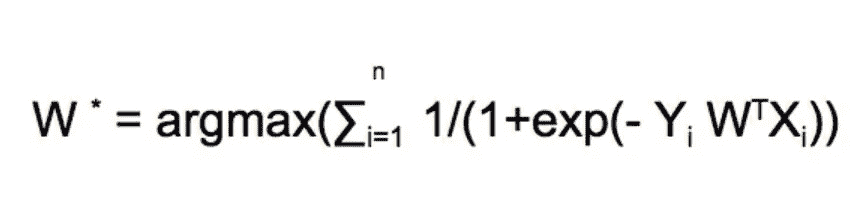

# 逻辑回归:几何解释

> 原文：<https://medium.com/analytics-vidhya/logistic-regression-geometric-interpretation-80942d0286b6?source=collection_archive---------5----------------------->

## 一个强大模型的简单解释

**逻辑回归(LR)** 是用于解决分类问题的最流行的机器学习算法之一。我们可以通过**基于几何、概率和损失函数的解释**来理解逻辑回归。这三者将为我们提供相同的逻辑回归解决方案。本文将使用几何解释来理解逻辑回归，因为我相信它更直观、更容易理解。

逻辑回归只是一种分类技术，其任务是找到一个**超平面(n 维)或线(2 维)**来最好地分离类别。LR 中的平面或超平面被称为决策面，因为它将类别分开。想象一下，给我们一组如下图所示的两个类，正点分别用‘x’表示，负点用‘o’表示。因此，任务是找到最好的线或平面，最好地将积极点与消极点分开。LR 基于一个**假设**即类是完全或几乎完全线性可分的。

y(类别标签)= +1:正点数，-1:负点数

xᵢ ∈ Rᵈ

从平面的任何一点到 xi 的距离(𝜋): di=wTxi/||w||

在整篇文章中，为了简单起见，我们假设 w 是一个单位向量||w|| =1。

因此，di= wTxi

**当 w 和 xi 同向时，即 wTxi > 0，**

**那么 y= +1**

**同样，当 w 和 xj 指向相反方向时，即 wTxj < 0**

**那么 y = -1**

再次查看上面的图表，看是否有任何混淆

> **基本上，与 w 同方向的每一点都是正点，反方向的每一点都是负点。这就是分类器的工作原理。**

正如我们上面所讨论的，LR 的任务是找到一个能最好地分离这两个类别的平面。但是你可能会问，我们如何找到那架飞机？

为此，让我们先看一些案例:

## **案例 1:**

我们被赋予真正的类标签 yi=+1，即正的点

并且 wTxi>0，即分类器指示它是一个正点

然后 **yiwTxi > 0** 表示该平面正在正确分类该点。

## **案例二:**

我们被给予真实的类标签 yi=-1，即负的点

wTxi <0 i.e. classifier indicating its a negative point

Then **yiwTxi > 0** 表示该平面正在正确分类该点。

## **案例三:**

我们被赋予真正的类标签 yi=+1，即正的点

并且 wTxi<0，即分类器指示它是一个负点

然后 **yiwTxi < 0** 表示该平面没有正确分类该点。

## **案例四:**

我们被给予真实的类标签 yi=-1，即负的点

并且 wTxi>0，即分类器指示它是一个正点

然后 **yiwTxi < 0** 这意味着飞机没有正确分类该点。

查看这些案例，我们可以发现，当 **yiwTxi > 0，**时，我们对点进行了正确分类，而当 **yiwTxi < 0** 时，我们对点进行了错误分类。

为了使分类器表现良好，我们需要最大化正确分类的点，最小化错误分类的点。简而言之，我们需要拥有尽可能多的点数才能拥有 **yiwTxi > 0。**

这就是我们需要实现的，为了做到这一点，我们需要找到最优的 w，这将解决这个最大化问题，因为 y 和 x 都是固定的。所以这是一个我们已经解决的数学问题，我们称之为**‘最优化问题’。**

有几个超平面，对于每个平面，都有一个唯一的‘w’。因此，我们需要找到最佳的 w，即最大值，w 会给我们最好的平面，这就是我们的决策面。

## 此功能的问题

到目前为止，我们所看到的是基本的优化问题，这将为我们找到最佳的 w，即有助于分离正负点的最佳超平面。现在让我们看看与之相关的问题。

首先，我们再来看看术语: **yiwTxi/||w||。**该术语被称为**符号距离。**再次使用我们上面的假设，即 **||w|| =1，**所以我们将只考虑 **yiwTxi。**我们知道 **wTxi** 是从到平面的距离，yi 不是+1 就是-1。最大化带符号距离的总和不容易出现异常值，并且会受到异常值的影响。在某些情况下，即使是一个孤立点也会产生很大的影响，导致模型表现不佳。

在上面的示例中，我们看到对于π₁，我们有 10 个正确分类的点和一个错误分类的点，但是带符号距离的总和也是-80。(+1(*5) +1(*5)- 88(-1) ).谈到π₂，我们可以看到，它只正确地分类了 6 个点，但给出的带符号距离之和为 1(1+1+2+3+4-1–2–3–4)。尽管π₁由于一个极端的异常值给出了更多正确分类的点，我们的优化问题说π₂更好。

为了处理这个问题，我们需要通过应用一种叫做**挤压**的技术来修改优化方程。挤压背后的想法是，如果一个点到平面的距离很小，那么我们就按原样使用它，但是如果距离很大，那么就把它转换成一个小值。

我们将通过对方程应用 sigmoid 函数来实现这一点，这将有助于我们处理异常值问题。它会将任意范围(-无穷大，+无穷大)内的有符号距离转换为[0，1]

图片来源:中

应用 sigmoid 函数后，我们的等式将如下所示:

## 但你一定想知道为什么 sigmoid 函数？原因是:

*   它很容易微分。
*   它提供了一种概率解释。
*   当 xi 值较小时，它提供线性行为，而当 xi 值较大时，它提供锥形行为。

第一点和第二点有助于解决优化问题。

这是一个阈值为 0.5 的分类器

如果 sigmoid(wT.x)>0.5，那么在这种情况下，类标签= 1。
如果 sigmoid(wT.x) < 0.5，那么在这种情况下 class label = 0。

点是否被正确分类取决于 y*(wT.x)
的符号如果 y*(wT.x) = +ve，则该点被正确分类。
若 y*(wT.x) = -ve，则该点分类错误。

## **优化方程的进一步变换:**

我们可以通过使用 Log 和其他一些数学性质来转换这个方程，以得到一个更简化的版本来解决优化问题。

## 问题又来了，**为什么要日志？**

*   Log 函数是 apt 函数，因为它在控制有符号值的突然爆发时从 0 变化到无穷大。
*   它还处理出现的数值计算问题，而不会实际影响优化的目标。
*   最后，我们将使用几何学获得的目标函数转换成与使用概率和损失最小化方法推导逻辑回归获得的相同的格式

## 了解 w

我们试图通过最优化问题找到的最优 w 被称为‘权向量’。权重向量是一个 d 维向量，就像 xi 的一样。

假设我们有 d 个特征，我们有一个与之相关的权重。这就是为什么它被称为权重向量。让我们举一个例子，给我们一个特征‘I ’,它的权重为 wi。

## **情况 1:wi 为+ve 时:**

wi 乘以 xqi(给定数据点)wi*xqi

所以当 xqi 增加时(这里 xqi 增加意味着远离超平面)

wi.xqi 增加，σwi . xqi(LR 中的决策表面)

σ(wi.xqi)增加

P(yq = +1)增加

## **情况二:**当 wi 为-ve 时:

所以当 xqi 增加且 wi 为-ve 时，

wi.xqi 减小，σwi . xqi 也减小

σ(wi.xqi)降低

P(yq = +1)下降

P(yq = -1)增加

## 这个优化问题的问题——过拟合和欠拟合，这引入了正则化

让我们再次看看我们得到的最终优化问题:

让 zᵢ = yᵢ wᵀ xᵢ

exp(-zi)将始终为正，因为 exp(-xi)始终为正，如下所示:

图片来源:谷歌

σlog(1+exp(-zᵢ))≥0

因此，当 zi 为所有 I 的+无穷大时，σlog(1+exp(-zᵢ)的最小值将为 0。当 zi = + **∞** ，exp(-zi) = 0 时

同样，当 zi = + **∞** 时，所有点将被正确分类为 zᵢ = yᵢ wᵀ xᵢ，而当 yᵢ wᵀ xᵢ >为 0 时，该点被正确分类。

看上面的等式，为了得到这个，我们需要以这样的方式最小化 w，使得 zi 是+无穷大，并且所有的点都被正确分类。这将是我们最好的 w。

**但是有一个问题，如果我们以一种方式**选择 w，使得 zi 是+无穷大，并且所有的点都被正确分类，这将导致**过拟合**。过度拟合基本上是在训练数据上做得很好，但在测试数据上却没有。让我们通过一幅图像来看看过度拟合、欠拟合和最佳拟合(在现实世界中很难看到):

图片来源:[https://machine learning medium . com/2017/09/08/over fitting-and-regulatory/](https://machinelearningmedium.com/2017/09/08/overfitting-and-regularization/)

解决这个问题的方法来了，即**正则化**，这将有助于防止过拟合和欠拟合。我们将使用它来修改优化问题，并找到最佳的 w。有不同类型的正则化，他们都有相同的目标，但让我们看看 L2 正则化在这里。

arg min(w)(σI = 1 到 n log(1 + exp(-yiwTxi)))是损失项

λ W^T W 是正则化项

这被称为 l2 正则化，因为我们使用 W 的 L2 范数来正则化

这里λ是一个超参数，我们可以修改它。

因此，基本上我们的目标是找到最佳的λ和 W，使损失更少，但不是非常接近于零，因为如果它等于零，那么，我们的模型可能会过拟合。同样，如果λ非常高，那么我们的模型会欠拟合。这就是**偏差-方差权衡。**

简而言之，正则项是避免 w 为+无穷大或-无穷大。

> **平衡至关重要:无论是机器学习还是生活**

图片来源:[https://realwealth.com/work-life-balance-quotes/](https://realwealth.com/work-life-balance-quotes/)

损失项&正则化之间发生**拔河**避免 zi 走向正负无穷大。最终，它们会遇到一个损失项和正则项都很小的最佳点。

> 在一天结束的时候**机器学习都是关于最小化损失函数+调整**

恭喜你，现在你已经用几何解释理解了逻辑回归的概念。