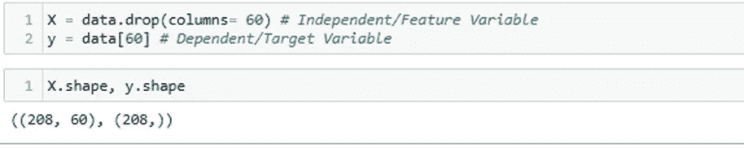

# 机器学习中的逻辑回归

> 原文：<https://medium.com/analytics-vidhya/logistic-regression-in-machine-learning-f3a90c13bb41?source=collection_archive---------3----------------------->

线性回归与逻辑回归

1.  两者都是由**监督的**学习模型，并利用**标记的数据**进行预测。
2.  **线性回归**用于**回归(预测)**问题，而**逻辑回归**可用于**分类和回归问题**，但广泛用作分类算法。

逻辑回归使用预测建模的概念作为回归；因此，它被称为逻辑回归，但用于分类样本；因此，它属于分类算法。


来源:[数据营](https://www.datacamp.com/)

**3。逻辑回归**用于因变量为**二进制时，如**是否点击给定的广告链接，垃圾邮件检测。糖尿病预测，客户是否购买，员工是否离职，而**线性回归**用于因变量为**连续**的情况，如价格、年龄、工资等

4.线性回归使用**普通最小二乘法(OLS)** 即距离最小化近似值，而逻辑回归使用**最大似然估计(MLE)** 方法，即确定最大似然产生期望输出的参数(均值和方差)。

# 逻辑回归的类型:

根据因变量，逻辑回归可以分为三种类型:

1.  **二项式:**因变量只能有两种可能的类型，如 0 或 1，通过或失败，购买或不购买，高或矮，胖或瘦，岩石或矿山等。
2.  **多项式:**可能有 3 个或更多可能的**无序**因变量类型，如苹果、香蕉、橙子或猫、狗、山羊、绵羊或德里、孟买、班加罗尔、加尔各答。
3.  **序数:**在序数逻辑回归中，可以有 3 个或更多可能的**有序的**因变量类型，如高、中、低，或从 1 到 5 的餐馆评级或灯光强度，或 5 分的李克特量表等

# 线性回归方程:


其中 y 是因变量，X1、X2 和 Xn 是自变量

1.随着更多的离群值，最佳拟合线将偏离，这将降低系统的精度，因此线性回归对离群值非常敏感。

2.它不适合输出超过 0 到 1 限制的数据点。

为了克服这些缺点，使用了逻辑回归。

# 机器学习中的逻辑回归；

1.  逻辑回归使用 sigmoid 或 logit 函数来压缩最佳拟合直线，该直线将映射任何值，包括从 0 到 1 范围内的超出值。所以形成了一个“S”形曲线。
2.  Sigmoid fun 去除了离群点的影响，使输出在 0 到 1 之间。


在线性回归中应用 Sigmoid 函数


# Scikit 中的模型构建-了解:

让我们建立一个模型，使用船只的声纳传统来分类探测到的物体是一块岩石还是一英里。这是一个二元分类问题。

你可以使用以下链接从 Kaggle 下载数据集:[https://www.kaggle.com/mattcarter865/mines-vs-rocks](https://www.kaggle.com/mattcarter865/mines-vs-rocks)

你可以跟随我的 [Github 库中的 Jupyter 笔记本。](https://github.com/krantiw/Logistic-Regression)

## 1.加载必要的库和数据


分析因变量:数据包含 111 个矿山和 97 个岩石。


## 2.功能选择:

将给定的 61 列分为两种类型:

1 自变量或特征变量 2。因变量或目标变量



绘制散点图，以可视化岩石或骡子特征变量的分布。


## 3.拆分数据

将数据集拆分为训练集和测试集，以了解模型性能。

这里，数据集以 80:20 的比例分成两部分。这意味着 80%的数据将用于模型训练，20%用于模型测试。

分层= y 根据因变量平均分割数据，以避免数据不平衡。


## 4.部署模型

导入类—逻辑回归，使用 Logistic Regression()函数实例化模型。

然后，使用 fit()在训练集上拟合您的模型，并使用 predict()在测试集上执行预测。


计算训练和测试数据集的准确度分数


```
Accuracy scores of Training dataset : 0.8192771084337349
Accuracy scores of Testing dataset : 0.8809523809523809
```

## 5.使用混淆矩阵的模型评估

*   混淆矩阵是一个 2X2(模型是二进制分类)表
*   它用于评估分类模型的性能。
*   它是正确的和不正确的分类预测的总和。(岩石和矿山)


*   有两类岩石和矿山。
*   对角线元素(20，17)代表准确的预测。
*   而非对角线元素(2，3)表示不准确的预测。

## 使用热图可视化混淆矩阵


计算矩阵的准确度分数


```
Accuracy of Confusion Matrix:0.8809523809523809
```

## 6.使用输入数据的模型评估

创建一个函数，该函数采用输出数据的所有特征，将行转换为数组，将数据整形为一行，其特征列为
，并预测数据类别-岩石或英里。


检查输入数据的模型。

第 101 排属于“英里”类，第 1 排属于“岩石”类


我们得到了正确的输出。因此，我们的模型准确地分类了它的因变量。

# 优势

*   高效
*   不需要很高的计算能力
*   易于实现，易于解释
*   它不需要缩放特征。
*   逻辑回归为观察值提供了一个概率得分。

# 不足之处

*   逻辑回归不能处理大量的分类特征/变量。
*   它容易过度拟合。
*   它不能用逻辑回归解决非线性问题，这就是为什么它需要非线性特征的变换。
*   对于与目标变量不相关且彼此非常相似或相关的独立变量，逻辑回归表现不佳。