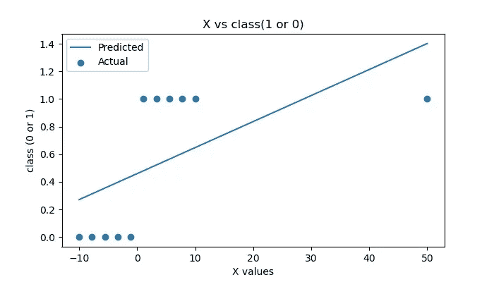

# 逻辑回归(逻辑回归背后的数学和直觉)

> 原文：<https://medium.com/analytics-vidhya/logistic-regression-mathematics-and-intuition-behind-logistic-regression-8ca864286bff?source=collection_archive---------12----------------------->

了解关于**逻辑回归**的一切。


[Unsplash](https://unsplash.com?utm_source=medium&utm_medium=referral) 上 [AltumCode](https://unsplash.com/@altumcode?utm_source=medium&utm_medium=referral) 的照片

## **目录:**

**∘** [**简介:**](#39a2) **∘**[**线性回归**](#a0fb) **∘**[**逻辑回归**](#273c) **∘**[**代价函数:**](#6e45) **∘**[**梯度下降算法:【T44**](#22df)

## 简介:

*   **逻辑回归**是用于**二元分类**的监督学习算法。
*   例如(真或假，是或否，1 或 0)。
*   也可用于**多类分类**。
*   但是对于**多类分类**我们必须做些别的事情，有一些概念叫做**一个对一个，一个对所有的**。我们将在接下来的文章中看到这些。

让我们用例子来理解**逻辑回归**

看一下下面的 python 代码…
我们采用随机数据并绘制图表来理解这个概念。

```
# creating random data points 
x =  np.linspace(-10, 10, 10)
y = np.array([0, 0, 0, 0, 0, 1, 1, 1, 1, 1])plt.figure(figsize=(7, 4), dpi=100)
plt.title('X vs class(1 or 0)')
plt.xlabel('X values')
plt.ylabel('class (0 or 1)')
plt.scatter(x, y)
plt.savefig('logistic_regression.jpg')
plt.show()output:
```


图 1.1

*   我们看到，如果 X 值大于 0，class 为 **1** ，如果 X 值小于 0，class 为 **0。**
*   想到的第一个问题是，我们能用**线性回归、**解决这个问题吗，答案是**是的**，我们能用**线性回归**解决这个问题。

[***点击这里*** 查看我关于**线性回归**](/analytics-vidhya/linear-regression-38f0cd6856f5) **的文章。**

首先，我们看看如何用线性回归来解决这个问题，然后我们将使用逻辑回归来解决它。

让我们开始吧…

## [线性回归](/analytics-vidhya/linear-regression-38f0cd6856f5)

让我们用线性回归来理解这个问题。

以下代码用于使用**线性回归**预测值并绘制图表。

```
from sklearn.linear_model import LinearRegressionlr = LinearRegression()
lr.fit(x.reshape(-1,1), y)
pred = lr.predict(x.reshape(-1,1))print(y, pred, sep='\n')plt.figure(figsize=(7, 4), dpi=100)
plt.title('X vs class(1 or 0)')
plt.xlabel('X values')
plt.ylabel('class (0 or 1)')plt.scatter(x, y, label="Actual")
plt.plot(x, pred, label="Predicted")plt.legend(loc='upper left')
plt.savefig('logistic_regression_1.jpg')
plt.show()
```


图 1.2

现在，如果预测值大于 0.5，那么我们认为类是 1，如果小于 0.5，那么类是 0。

**线性回归优于逻辑回归或分类问题:**

1.  错误率非常高。
2.  对异常值非常敏感。
3.  大多数情况下，我们会得到大于 1 小于 0 的预测值。

下图显示了最佳拟合线如何受到异常值的影响…



图 1.3

现在是时候了解一下**逻辑回归**了。

## **逻辑回归**

*   **逻辑回归**使用 **sigmoid 函数**，该函数创建一条类似于 **S 形的最佳拟合线。**


图 2.1 sigmoid 函数

*   现在想到的问题是，这个函数从何而来。所以让我们先了解…
    我们知道线性回归的函数 **y=mx+c.** 我们只是把这个函数转换成假设形式。


图 2.2 线性方程

*   但是正如我们看到的，当我们使用线性回归来解决二元分类问题时，一些预测值大于 1 且小于 0。但是我们需要范围在 0 和 1 之间的输出值**。我们如何做到这一点？？**
*   我们需要将上面的等式修改如下...


图 2.3 sigmoid 函数

*   上面的函数是我们最后的 **Sigmod 函数。**

**让我们看看如何使用这个 sigmoid 函数预测值…**

当θ =1 时，我们将使用 sigmoid 函数预测 X 值。

```
def sigmoid(x, theta=1):
    # Activation function used to map any real value between 0 and 1
    return 1 / (1 + np.exp(-np.dot(x, theta)))y_pred = sigmoid(x, 1)
y_predoutput:array([4.53978687e-05, 4.18766684e-04, 3.85103236e-03, 3.44451957e-02,2.47663801e-01, 7.52336199e-01, 9.65554804e-01, 9.96148968e-01,9.99581233e-01, 9.99954602e-01])
```

现在我们将通过绘制简单的图表来比较实际值和预测值。

```
plt.figure(figsize=(7, 4), dpi=100)plt.ylabel('class (0 or 1)')plt.scatter(x, y, label="Actual")
plt.scatter(x, y_pred, label="Predicted")
plt.plot(x, y_pred, linestyle='-.')plt.legend()
plt.savefig('logistic_regression_12.jpg')
plt.show()
```


图 2.4 实际与预测

## 成本函数:

*   成本函数用于检查实际值和预测值之间的误差。
*   但是在逻辑回归中我们不使用 MSE 函数。
*   在逻辑回归中， **y** 是一个**非线性函数**，如果我们将这个成本函数放入 **MSE** 方程中，它将给出一条**非凸曲线**，如下图 2.5 所示。
*   当我们试图使用梯度下降来优化值时，它会使寻找全局最小值变得复杂。
*   在逻辑回归中，**对数损失**函数被用作**成本函数。**


图 2.5 非凸曲线

让我们来理解一下**成本函数** …

下面是逻辑回归的成本函数。


图 2.6 成本函数

**简化成本函数……**


图 2.7 简化的成本函数

**如果 y = 1 那么:**


这与图 2.6 中 y=1 时的情况相同

**如果 y = 0，则:**


这与图 2.6 中 y=0 时的情况相同

毕竟，我们已经得到了下面最终的**成本函数**


图 2.8 最终成本函数

以下是成本函数的 python 代码:

```
def cost_function(x, y, t): # t= theta value
    m = len(x)
    total_cost = -(1 / m) * np.sum(
        y * np.log(sigmoid(x, t)) + 
        (1 - y) * np.log(1 - sigmoid(x, t)))
    return total_costcost_function(x, y, 1)output:
0.06478942360607087
```

现在我们将绘制不同θ值的图表

```
# ploting graph for diffrent values of m vs cost functionplt.figure(figsize=(10,5))T = np.linspace(-1, 1,10)
error = []
i= 0for t in T:

    error.append(cost_function(x,y, t)) 
    print(f'for t = {t} error is {error[i]}')
    i+=1plt.plot(T, error)plt.scatter(T, error)
plt.ylabel("cost function")
plt.xlabel("t")
plt.title("Error vs t")
plt.savefig('costfunc.jpg')
plt.show()
```


图 2.9 误差与温度的关系

## 梯度下降算法:


图 3.1 梯度下降

*   **梯度下降**算法与我们在[线性回归文章](/analytics-vidhya/linear-regression-38f0cd6856f5#8d01)中看到的算法相同。
*   这里唯一的区别是图 2.3 所示的**假设函数**
*   [点击此处](/analytics-vidhya/linear-regression-38f0cd6856f5#8d01)了解梯度下降。

**现在是实施线性回归的时候了。**

## 实施:

```
from sklearn.linear_model import LogisticRegressionlr = LogisticRegression()
lr.fit(x.reshape(-1,1), y)
pred = lr.predict(x.reshape(-1,1))
prob = lr.predict_proba(x.reshape(-1,1))
print(y, np.round(np.array(pred), 2), sep='\n')output:
[0 0 0 0 0 1 1 1 1 1]
[0 0 0 0 0 1 1 1 1 1]
```

*   **θ**的值:

```
lr.coef_output:
array([[0.93587902]])
```

*   **截距**的值:

```
lr.intercept_output:
array([-6.3343145e-17])
```

*   最终**分数:**

```
lr.score(x.reshape(-1, 1), y)output:
1.0
```

*   绘制实际与预测的图表

```
plt.figure(figsize=(7, 4), dpi=100)
plt.title('X vs class(1 or 0)')
plt.xlabel('X values')
plt.ylabel('class (0 or 1)')plt.scatter(x, y, label="actual")
plt.plot(x, pred, label="predicted", color='red')plt.legend(loc='upper left')
plt.savefig('logistic_regression.jpg')
plt.show()
```


图 4.1

[**点击这里**](https://github.com/sbswapnil/Data-Science/blob/main/Logistic%20Regression.ipynb) **获取我关于逻辑回归的完整 Jupyter 笔记本。**

## 总结:

*   我们讨论**逻辑回归、成本函数、**和**梯度下降算法。**
*   我们已经理解了**逻辑回归**背后的**直觉**。