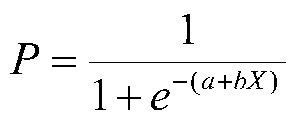
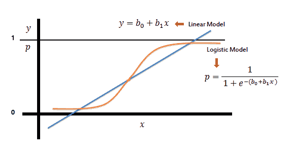

# 逻辑回归:背后的数学，它是如何工作的，以及一个例子

> 原文：<https://medium.com/analytics-vidhya/logistic-regression-the-maths-behind-it-how-it-works-and-an-example-7d50b778183?source=collection_archive---------20----------------------->

当第一次进入监督机器学习时，人们通常在学习线性回归之后很早就与逻辑回归进行交互。有一个很好的理由，那就是，逻辑回归无论是二元的还是多元的，都非常类似于线性回归。逻辑回归用于预测任何特定值属于两个类别之一或多个类别之一的概率。因此，线性回归和逻辑回归之间的最大区别是:线性回归假设数据具有线性变异性、正态性和同方差性。简而言之，数据包含连续的值。而逻辑回归处理分类数据，尤其擅长二元分类。

现在让我们从数学部分开始——只是为了在我们透露更多的世俗问题之前把有趣的部分去掉。

从数学的角度来看，如上所示，逻辑回归方程是通过对线性回归应用 sigmoid 函数来实现的。我们为什么要这样做？我们不是创建一个超平面，而是将它变成一条 S 形曲线，因此所有的值将返回一个介于 0 和 1 之间的输出。

接下来，让我们将等式分解成易于理解的部分:

*   **P :** 是变量对任一类的预测概率。
*   **1 + e-(a+hX) :** 应用于线性回归的 sigmoid 函数
*   **a + hX** :直线型。

现在让我们看看 sigmoid 函数将线性回归线/超平面转换成什么。

看看逻辑回归(橙色)和线性回归(蓝色)有什么不同，这让我们可以做一些被称为决策边界的事情。任何小于 0.5 的值将等于 0，大于 0.5 的整数将等于 1。

逻辑回归有多种类型:二元逻辑回归旨在预测两个类别中的一个，多项式逻辑回归不是预测两个类别中的一个，而是预测两个以上的类别，最后是有序逻辑回归，根据序数值而不是以前对分类值进行的预测来预测从属值。

与线性回归一样，有一个成本函数来找出我们模型中的误差。逻辑回归使用一种叫做交叉熵的东西，或者不太为人所知的对数损失。交叉熵找出受基础线性模型中权重影响的预测值和实际值之间的平均误差。现在我们如何将损失降至最低？有什么猜测吗？如果你猜的是梯度下降，那么你就猜对了。

在此之后，有必要评估我们的模型，以了解我们的模型有多适合。除了成本函数，我们还可以使用测试数据的准确性。我们将正确预测值的总和与真实值的总和进行比较。