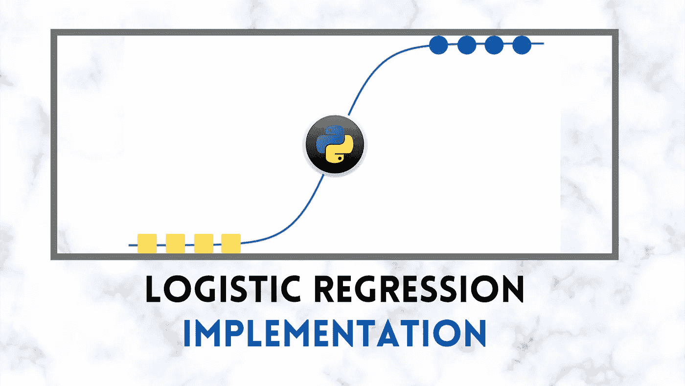
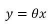
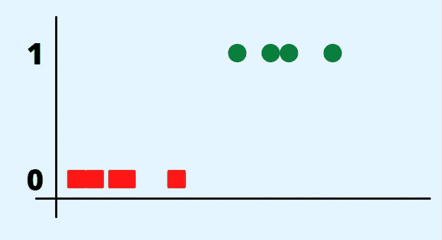
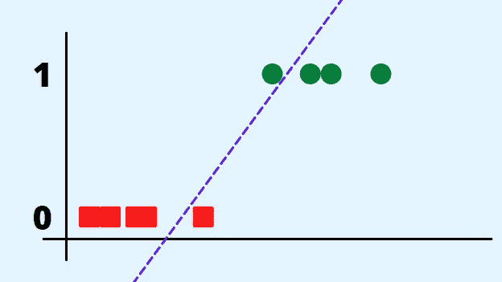
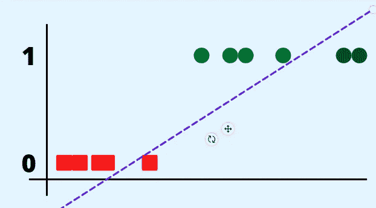
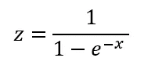
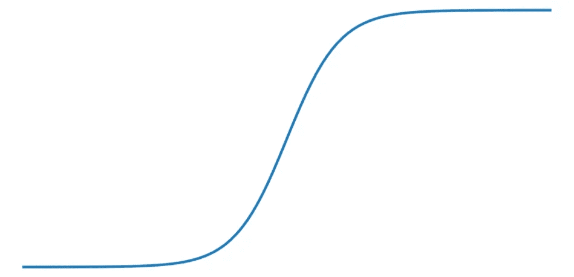
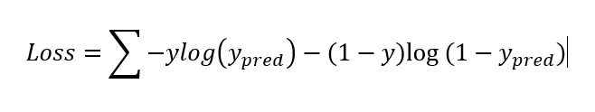
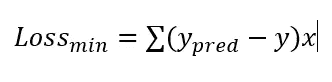
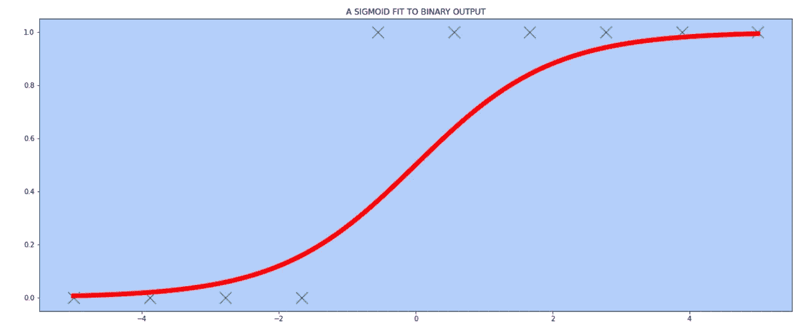

# 从零开始理解和实现逻辑回归(第 1 部分)| Python |机器学习

> 原文：<https://medium.com/analytics-vidhya/logistic-regression-understanding-and-implementation-from-scratch-part-1-python-machine-a8cf9e459f10?source=collection_archive---------6----------------------->

这是一个由两部分组成的系列。第 1 部分(这一部分)将是关于逻辑回归算法的理论理解。 [***第二部分***](https://writersbyte.com/programming/understanding-and-implementing-logistic-regression-algorithm-part-1-python-machine-learning/) ***将覆盖编码部分，这里我们将在 PYTHON 中实现 LOGISTIC 回归****

我在以前的博客中讨论过很多机器学习文章，但大多数都是*回归算法*，即预测连续数字。这一次我们稍微改变一下思路，转而预测离散类。

这次我们将讨论 ***逻辑回归*** 算法的工作原理。

回归算法预测连续数据，例如来自一组给定特征的特定商品的价格，而逻辑回归给出基于类别的预测，例如 ***某个人是否肥胖或是否患有糖尿病*** 。

这种算法可以被训练来从给定的数据中预测多个类别。然而，为了简单起见，我们将在本教程中讨论二进制数据分类。

# 算法:

逻辑回归与线性回归非常接近。如果你不熟悉线性回归，可以在这里了解一下[。](https://writersbyte.com/implementing-multi-variable-linear-regression-algorithm-in-python/)

线性回归就是*拟合直线。* **逻辑回归**，然而，事情有点弯曲(双关语😉，过一会儿你就明白了😅).

初始计算与线性回归的计算相同，我们有一组由 **X** 表示的输入特征和一些与之相关的随机初始化权重，这里是 **θ** 。

上述两个量的点积形成一条直线的方程。我们仍然可以用这条直线来拟合我们的二进制类，下面是它的样子。

来自训练数据的二进制输出标签

因为我们只有两个类，用 **0 & 1** ( **记住！！** *计算机不理解文本，所以所有的字符串输入都必须以数字格式编码*)，这就是我们的输出。如果我们在这里做线性回归，拟合一条直线，我们可能会得到合理的结果。

对这样的数据拟合直线

这看起来足够好了，线左边的任何数据点都是 0(红色)，右边的任何数据点都是 1(绿色)，当然有边际误差。但是等等！！如果我们的数据分布不均匀，如果我们有异常值怎么办？让我们看看这会有什么影响。

现在我们有一个问题。由于类 1 中的数据位置较远，线更加向右倾斜，因此类 1 中的许多点现在被错误分类。

好消息是，这是有解决办法的。为了正确分类这些数据，我们要做的就是…

😁

因此，我们必须添加某种变换，将这条直线变成一条更…..柔韧的。一个。这就是我们引入 sigmoid 函数的地方。数学上，sigmoid 函数由以下等式表示:

sigmoid 函数的数学表达式

该函数具有以下形状:

s 形曲线

这个函数被限制在 0 和 1 之间，直观地说，它更倾向于适合我们的二进制数据。线性回归和逻辑回归之间的唯一区别是增加了 sigmoid 转换这一额外步骤。所以现在我们的数据会经历以下几个步骤；

最终的输出变量 **z** 是我们的模型将预测的。

像每一个机器学习模型一样，我们将使用随机权重初始化我们的模型，因此为了使曲线合适，我们将执行与线性回归相同的步骤；

1.  **计算产量。**
2.  **使用各自的损失函数计算损失(衡量我们的预测输出与实际输出的差距)。**
3.  **使用更新等式更新权重，以最小化损失。**
4.  **重复步骤 1-3，直到完成设定的迭代次数。**

让我们看看这个损失函数和更新方程。

对于线性回归，我们使用了良好的均方误差函数，但它不适合这里，因为我们的 sigmoid 函数在系统中引入了非线性，并且均方误差不会达到全局最小值。

我将跳过实际损失函数的本质细节，直接跳到等式。

逻辑回归的损失函数

为了找到这个损失函数的最小值，我们取这个函数对给定重量的导数。令人惊讶的是，导数结果与线性回归函数的导数完全相同。

最小化损失

对于我们模型中使用的所有权重，更新方程保持不变。

在此之后，我们所要做的就是重复上述步骤，直到我们有一个合理的拟合。

针对二元类的 sigmoid 曲线

这个看起来好多了。对于这样的拟合，我们可以简单地设置规则，比如对于大于 0.5 的**值，我们给它一个值 1，对于小于 0.5 的，给它 0。**

就是它，这就是完整的逻辑回归算法解释。

本教程的第 2 部分是关于逻辑回归的 python 实现。

[在这里阅读第二部分](https://writersbyte.com/programming/understanding-and-implementing-logistic-regression-algorithm-part-1-python-machine-learning/)。

## 更像这样:

 [## 实现 K 意味着用 K Means++初始化| Python 进行聚类。- WritersByte

### K-Means 聚类是一种无监督的机器学习算法。无人监管意味着它不需要标签或…

writersbyte.com](https://writersbyte.com/datascience/implementing-k-means-clustering-with-k-means-initialization-in-python/)  [## 人工智能初学者:人工智能基础- WritersByte

### 你正在浏览你的脸书页面。你看到一则广告“我们的人工智能解决方案将改变你的…

writersbyte.com](https://writersbyte.com/datascience/ai-for-beginners/)  [## 每个初学者都必须知道的 4 个关键 Python 数据结构。- WritersByte

### 最近几年，Python 已经成为最受编程新手欢迎的语言，因为它易于使用，而且…

writersbyte.com](https://writersbyte.com/programming/4-key-python-data-structures-e-very-beginner-must-know/)