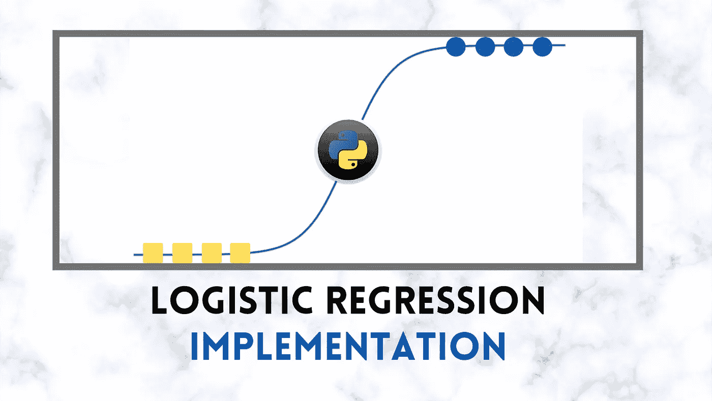
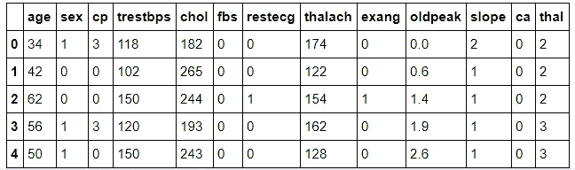

# 从零开始理解和实现逻辑回归(第 2 部分)| Python |机器学习

> 原文：<https://medium.com/analytics-vidhya/logistic-regression-understanding-and-implementation-from-scratch-part-2-python-machine-4fe70100bc90?source=collection_archive---------2----------------------->



*   这是一个由两部分组成的系列。 [***第一部分***](https://writersbyte.com/programming/logistic-regression-understanding-and-implementation-from-scratch-part-1-python-machine-learning/) ***将是所有关于逻辑回归算法的理论理解。第 2 部分(这一部分)将涵盖编码部分，我们将在这里用 PYTHON**** 实现逻辑回归

如果你对逻辑回归算法 的 ***理论工作感到困惑，你可以在这里阅读第一部分[。](https://writersbyte.com/programming/logistic-regression-understanding-and-implementation-from-scratch-part-1-python-machine-learning/)***

本教程中使用的全部代码可以在这里找到。

因为我们有密切相关的逻辑回归和线性回归，我建议你也阅读一下线性回归，以便更好地理解这些算法。你可以在这里阅读[。](https://writersbyte.com/datascience/implementing-multi-variable-linear-regression-algorithm-in-python/)

因为我们已经在第 1 部分中介绍了这个理论，这里我们将直接进入代码。

[](https://writersbyte.com/windows/chocolatey-package-manager-a-sweet-way-to-install-software-on-windows/) [## Chocolatey 软件包管理器:在 Windows 上安装软件的好方法

### 自从 Windows 问世以来，在 Windows 上安装软件的传统方式是打开浏览器，搜索…

writersbyte.com](https://writersbyte.com/windows/chocolatey-package-manager-a-sweet-way-to-install-software-on-windows/) 

# Python 实现。

我们将从导入所有重要的库开始。我们不会使用来自任何库的逻辑回归，因为那将违背本文的目的。

让我们首先探索一下我们将使用的数据集。

由于我们使用逻辑回归预测离散类，我们将使用心血管疾病可能性的数据集。数据集是开源的，可以在这里找到。



我们的输入功能概述| heart.csv

从上面的概述中，我们看到我们共有 12 个输入特征存储在变量 **sample_x.** 中

我们的输出是一系列的 1 和 0，其中 1 表示支持心血管疾病的可能性，0 表示拒绝。

我们总共有大约 300 个样本。我们分离出前 250 个样本作为训练数据，剩下的 50 个将用于测试。

# 算法

1.  使用随机初始化的权重计算输出。
2.  计算原始产量和预测产量之间的损失。
3.  使用梯度下降更新权重。
4.  重复，直到达到最大迭代次数或损失显著减少。

从上面的步骤中，我们可以分离出我们需要的函数。让我们开始编码吧。

*   **乙状结肠**:

```
**def** get_sigmoid(inp):

    *#simply returning sigmoid our values*
    **return** (1/(1+np.exp(-inp))) - 0.00000001
```

*   **损失:**

*   **体重更新:**

现在，剩下要做的就是编写一个例程，以我们上面讨论的算法方式使用这些函数。

您将注意到的一件事是，我们上述例程的第一步是数据的最小-最大缩放。这样做是为了规范化数据集。由于每个输入要素覆盖不同的数值范围，算法在学习模式时会遇到困难。

剩下的例行程序和我们讨论的一样。

因为我们有一个小的数据集，我们可以运行它大量的时期。我们让我们的运行为默认值；10000.

```
%%time
weights, out = train_logistic_regression(sample_x,sample_y)
```

跑步结束后，我们就有了最终更新的重量。

是时候构建一些额外的函数来帮助我们的测试了。

*   **预测功能:**

*   **精度:**

使用上面的辅助函数，我们看到我们的模型给出了 75%的**准确率。**

这个数字可以通过调整超参数来提高，但这取决于您。

# 结论:

经过长途跋涉，我们终于到达了这次学习之旅的终点。在这个由 2 部分组成的系列中，我们学习了逻辑回归的数学知识，并将这些知识应用到一个真实的数据集。我们取得的结果还算可以接受，但是如果你调整一下学习速度和纪元数量，结果还会更好。

*别忘了在这里阅读第 1 部分*

*   如果你有任何建议/问题，请写在评论里*

## 更像这样:

[](https://writersbyte.com/datascience/chest-x-ray-pneumonia-classification-using-deep-neural-networks-with-keras/) [## 胸部 x 光肺炎检测使用深度卷积神经网络与 Keras | Python …

### 深度学习(DL)已经兴起很长一段时间了，它已被证明是一个巨大的帮助人们在一个…

writersbyte.com](https://writersbyte.com/datascience/chest-x-ray-pneumonia-classification-using-deep-neural-networks-with-keras/) [](https://writersbyte.com/programming/dbscan-clustering/) [## 从头开始实现 DBSCAN 聚类算法| Python - WritersByte

### 世界上最有价值的资源不再是石油，但数据可能听起来令人惊讶，它是…

writersbyte.com](https://writersbyte.com/programming/dbscan-clustering/) [](https://writersbyte.com/programming/knn-implementation-from-scratch-96-6-accuracy-python-machine-learning/) [## KNN 分类器 Python 从头实现(96.6%准确率)|机器学习- WritersByte

### 对于初学者来说，“机器学习”这个术语似乎非常复杂和困难。毫无疑问…

writersbyte.com](https://writersbyte.com/programming/knn-implementation-from-scratch-96-6-accuracy-python-machine-learning/)