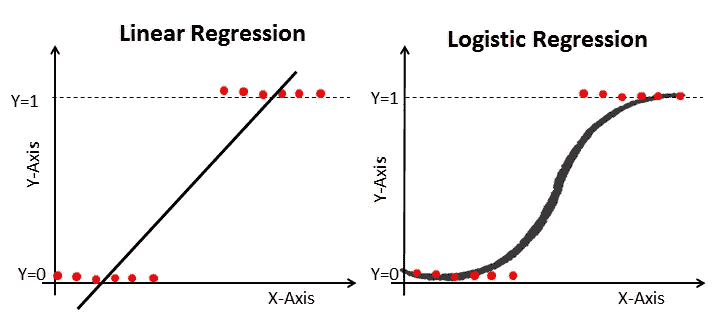

# 使用 Python 进行逻辑回归

> 原文：<https://medium.com/analytics-vidhya/logistic-regression-using-python-a5044843a504?source=collection_archive---------0----------------------->

线性回归和逻辑回归

# 介绍

在有监督的机器学习世界中，有两种类型的算法任务经常被执行。一个叫回归(预测连续值)，一个叫分类(预测离散值)。在这篇博客中，我展示了一个叫做“二元逻辑回归”的二元分类算法的例子，它属于带有 logit 链接函数的二项式家族。二元逻辑回归用于预测二元类。例如，在您想要预测是/否、赢/输、负/正、真/假等等的情况下。为生产和研究出版物训练/拟合模型之间存在相当大的差异。这个博客将引导你通过一个以研究为导向的建模和解释的实践概述，也就是说，一个人如何能够建模一个二元逻辑回归并解释它，以便在期刊/文章中发表。

s 形曲线

# 内容大纲

*   数据背景
*   建模的目的
*   数据加载
*   基本探索性分析
*   数据准备
*   模型拟合/培训
*   模型摘要的解释
*   测试数据集上的模型评估
*   参考

# 数据背景

在这个例子中，我们将使用从机器学习数据库的 UCI 储存库中获得的 [***皮马印度糖尿病 2***](https://github.com/nadeemoffl/Medium-Blogs/tree/main/Logistic%20Regression%20Using%20Python) 数据集( ***纽曼等人 1998*** )。

该数据集最初来自国家糖尿病、消化和肾脏疾病研究所。数据集的目的是基于数据集中包含的某些诊断测量结果，诊断性地预测患者是否患有糖尿病。从一个较大的数据库中选择这些实例有几个限制。特别是，这里的所有患者都是至少 21 岁的皮马印第安血统的女性。

Pima Indian Diabetes 2 数据集是 Pima Indian Diabetes 数据的细化版本(所有 NA 或缺失值均被移除)。数据集包含以下自变量和因变量。

***自变量(符号:I)***

*   I1: ***怀孕*** :怀孕次数
*   I2: ***葡萄糖*** :血浆葡萄糖浓度(葡萄糖耐量试验)
*   I3: ***压力*** :舒张压(毫米汞柱)
*   I4: ***三头肌*** :三头肌皮褶厚度(mm)
*   I5: ***胰岛素*** : 2 小时血清胰岛素(μU/ml)
*   I6: ***质量*** :身体质量指数(体重 kg/(身高 m)\)
*   I7: ***谱系*** :糖尿病谱系功能
*   I8: ***年龄*** :年龄(年)

***【因变量(符号:D)***

*   D1: ***糖尿病*** :糖尿病病例(阳性/阴性)

# 建模的目的

本博客的目的是拟合一个二元逻辑回归机器学习模型，该模型可以准确预测数据集中的患者是否患有糖尿病，然后了解真正影响他们的重要因素的影响。接下来，在看不见的数据集上测试训练模型的泛化(模型评估)强度。

# 加载库和数据集

***第一步:*** 第一步是加载相关的库，比如熊猫(数据加载和操纵)，以及 **matplotlib、**和 **seaborn** (绘图)。

***第二步:*** 下一步是使用 pandas***read _ CSV()***函数从本地存储中读取数据，并保存在一个名为 **diabetes** 的变量中。

# 探索性数据分析

***步骤 1:*** 数据加载后，下一个重要步骤是执行探索性数据分析，这有助于熟悉数据。使用 ***head( )*** 函数查看前五行数据。

***第二步:*** 了解列数据类型以及是否有数据缺失往往是必不可少的。 ***。info( )*** 方法有助于识别数据类型和缺失值的存在。

下表显示**糖尿病**数据集包括 **392 个观察值**和 **9 个列/变量**。自变量包括整数 64 和浮点 64 数据类型，而因变量/响应变量(糖尿病)是字符串(负数/正数)数据类型，也称为**对象**。

***第三步*** :我们可以使用 seaborn 的 ***regplot( )*** 函数初步拟合一条逻辑回归直线，以可视化患糖尿病的概率如何随谱系标签而变化。使用 ***regplot( )*** 将“**谱系**”绘制在 x 轴上，将“**糖尿病**”绘制在 y 轴上。以类似的方式，我们可以检查其他变量的逻辑回归图。只有在使用单个独立变量拟合逻辑回归时，这种类型的图才是可能的。当前图让您直观地了解逻辑模型如何拟合“S”曲线，以及概率如何随着观察值从 0 变化到 1。在即将到来的模型拟合中，我们将训练/拟合包括多个独立变量的多元逻辑回归模型。

# 数据准备

在进行模型拟合之前，通常有必要确保数据类型与您将要使用的库/包一致。在糖尿病中，数据集因变量(糖尿病)由字符串/字符组成，即 ***neg/pos*** ，需要使用 ***映射 **neg: 0** 和 **pos: 1** 将其转换为整数。*地图()**方法。

现在可以看到因变量“ ***糖尿病*** ”从**对象**转换为**整数 64** 类型。

下一步是使用**获得关于基本数据汇总统计的知识。describe( )** 方法，计算计数、平均值、标准差、最小值、最大值和百分位(第 25、50 和 75)值。这有助于您检测数据集中的任何异常。例如具有高方差的变量或极度扭曲的数据。

# 模型拟合(二元逻辑回归)

下一步是使用***sk learn . model _ selection***模块的 **train_test_split** 将糖尿病数据集拆分为训练和测试拆分，并使用 **statsmodels** 包/库拟合逻辑回归模型。

# 训练和测试分割

整个数据集通常分为 80%训练数据集和 20%测试数据集(一般经验法则)。80%的训练数据用于模型训练，而剩余的 20%用于检查模型如何在看不见的数据集上推广。

# 拟合逻辑回归

为了拟合逻辑回归模型，首先需要安装 ***statsmodels*** 包/库，然后需要从***stats models formula . API***中导入 ***statsmodels.api*** 作为 ***sm*** 和 ***logit 函数***

这里，我们将使用以下公式符号来拟合模型:

> *公式=(' dep _ variable ~ ind _ variable 1+ind _ variable 2+……。如此类推)*

使用 ***logit( )*** 函数拟合模型，同样可以使用 ***glm( )*** 实现。这里，使用 ***logit( )*** 函数，因为这提供了附加的模型拟合统计，例如**伪 R 平方**值。

# 模型摘要的解释

模型拟合后，下一步是生成模型汇总表并解释模型系数。模型摘要包括两个部分。第一部分提供模型拟合统计，第二部分提供模型系数、其显著性和 95%置信区间值。在出版物或文章写作中，你经常需要从汇总表中解释变量的系数。

模型拟合统计显示，模型是使用 [**最大似然估计**](https://towardsdatascience.com/understanding-maximum-likelihood-estimation-mle-7e184d3444bd)(***MLE***)技术拟合的。模型已正确收敛，显示没有错误。 ***麦克法登伪 R 平方*** 值为 0.327，表明模型拟合良好。

此外，该表还提供了一个 ***对数似然比检验*** 。似然比检验(通常称为 LR 检验)是一种用于比较两个模型的拟合优度检验；零模型和最终模型。测试显示，当模型仅拟合截距(零模型)时，对数似然为-198.29，当拟合所有独立变量时，其显著改善(对数似然= -133.48)。合身性改善也很显著(p 值< 0.05)。

系数表显示，只有葡萄糖和系谱标签具有显著影响(p 值< 0.05) on diabetes. The coefficients are in log-odds terms. The interpretation of the model coefficients could be as follows:
)葡萄糖的每一个单位变化将增加患糖尿病的对数几率 0.038，其 p 值表明其在确定糖尿病方面具有显著性。类似地，家系中每增加一个单位，患糖尿病的对数几率增加 1.231，p 值也很显著。
如果您需要在文章或出版物中报告，对数优势项中系数的解释没有多大意义。这就是为什么比值比的概念被引入。

# 让步比

几率是事件发生的概率与事件不发生的概率之比。当我们取两个这样的比值时，它被称为比值比。

在数学上，我们可以通过估计系数的指数来计算比值比。例如，在下面的比值比表中，您可以观察到谱系的比值比是 3.427，这表明谱系标签中每增加一个单位，患糖尿病的几率就增加 3.427 倍。

# 边际效应计算

边际效应是一种替代性的度量，可以用来描述预测因子对结果变量的影响。边际效应可以描述为在模型中所有其他变量保持不变的情况下，作为治疗(或感兴趣的独立变量)变化的函数的结果变化。在线性回归中，估计的回归系数是边际效应，更容易解释。

研究人员报道的边际效应有三种类型:**在代表值处的边际效应**(MERs)**在均值处的边际效应** (MEMs)，以及**在 x 的每个观测值处的平均边际效应**以及跨结果的平均值(AMEs)，( ***Leeper，2017*** )。对于分类变量，计算与参考水平相对应的每个离散变化的平均边际效应。

**statsmodels** 库提供以下**边际效应**计算:

在 STEM 研究领域，平均边际效应是非常流行的，并且经常被研究人员报道。在我们的例子中，我们已经使用 ***估计了预测变量的 AMEs。*get _ marge ff()**函数并打印报告摘要。

平均边际效应表报告了 AMEs、标准误差、z 值、p 值和 95%置信区间。AMEs 的解释类似于线性模型。例如，系谱的 AME 值是 0.1677，这可以解释为系谱值增加一个单位，患糖尿病的概率增加 16.77%。

# 测试数据集上的模型评估

在拟合二元逻辑回归模型后，下一步是检查拟合的模型在看不见的数据(即 20%的测试数据)上表现如何。

因此，下一步是预测测试数据集中的类，并生成混淆矩阵。这些步骤包括以下内容:

*   第一步将 **NumPy** 库导入为 **np** 并导入**分类 _ 报告** 和 ***准确性 _ 得分***from***sk learn . metrics .***
*   接下来使用***model . predict()***函数预测糖尿病概率
*   设定一个 ***截止值*** (0.5 为二元分类)。低于 0.5 的概率将糖尿病治疗为阴性(0)，高于阳性(1)
*   使用 pandas***crosstab()***创建实际(负:0，位置:1)和预测(负:0，位置:1)之间的混淆矩阵

# 混淆矩阵

混淆矩阵揭示了测试数据集具有 52 个阴性(0)和 27 个阳性(1)的样本情况。训练的模型准确地分类了 44 个阴性(阴性:0)和 16 个阳性(阳性:1)类。

# 分类准确度

分类精度可以计算如下:

使用***accuracy _ score()***函数可以估算出相同的精度。结果表明，该分类器对未知数据的分类准确率约为 76%。

# 分类报告

分类报告用于衡量分类算法的预测质量。有多少预测是真的，有多少是假的。分类报告在生成分类报告时使用真阳性、真阴性、假阳性和假阴性。

1.  **TP /真阳性:**当实际观察结果为阳性且模型预测也为阳性时
2.  **TN /真负值:**当实际观察值为负值且模型预测值也为负值时
3.  **FP /假阳性:**当实际观察结果为阴性但模型预测为阳性时
4.  **FN /假阴性:**当实际观察为阳性，但模型预测为阴性时

分类报告提供了关于精确度、召回率和 F1 分数的信息。

我们已经计算了分类精度，那么明显的问题是，对精度、召回率和 F1 值的需求是什么？ ***答案是当数据集*** 中存在类别不平衡时，准确性不是一个好的衡量标准。如果因变量包括大约相等比例的两个类别(在二进制分类情况下)，则称数据集是平衡的。例如，如果糖尿病数据集包括 50%的糖尿病患者样本和 50%的非糖尿病患者样本，那么数据集被认为是平衡的，在这种情况下，我们可以使用准确性作为评估指标。但在现实世界中，实际情况往往并非如此。

让我们用一个例子使它更具体。假设您收集了一个有 1000 个样本的糖尿病数据集。您将数据集传递给训练好的模型，模型预测所有样本都是非糖尿病患者。但是后来当你浏览你的数据集时，你在 1000 个样本数据中观察到 3 名患者患有糖尿病。因此，我们的模型错误地将 3 名患者分类为非糖尿病患者(假阴性)。即使在 3 次错误分类之后，如果我们计算预测精度，那么我们仍然得到 99.7%的高精度。

但是实际上，该模型没有达到目的，即，不能准确地对糖尿病患者进行分类，因此对于不平衡的数据集，准确性不是一个好的评估度量。

为了解决这个问题，引入了精确度和召回率的概念。

**精度:**决定正面预测的准确性。

**回忆**:确定正确识别的阳性率。

**F1 得分**是精度和召回的加权调和平均值，最佳得分为 1，最差得分为 0。F1 分数传达了精确度和召回率之间的平衡。

分类报告显示 F1 分数的微观平均值约为 0.72，这表明训练的模型具有 72%的分类强度。

二元逻辑回归仍然是 STEM 研究领域中非常流行的 ML 算法(用于二元分类)。与许多复杂的黑盒模型相比，它仍然非常容易训练和解释。

# 数据集和代码

[*点击此处查看糖尿病数据和代码*](https://github.com/nadeemoffl/Medium-Blogs/tree/main/Logistic%20Regression%20Using%20Python)