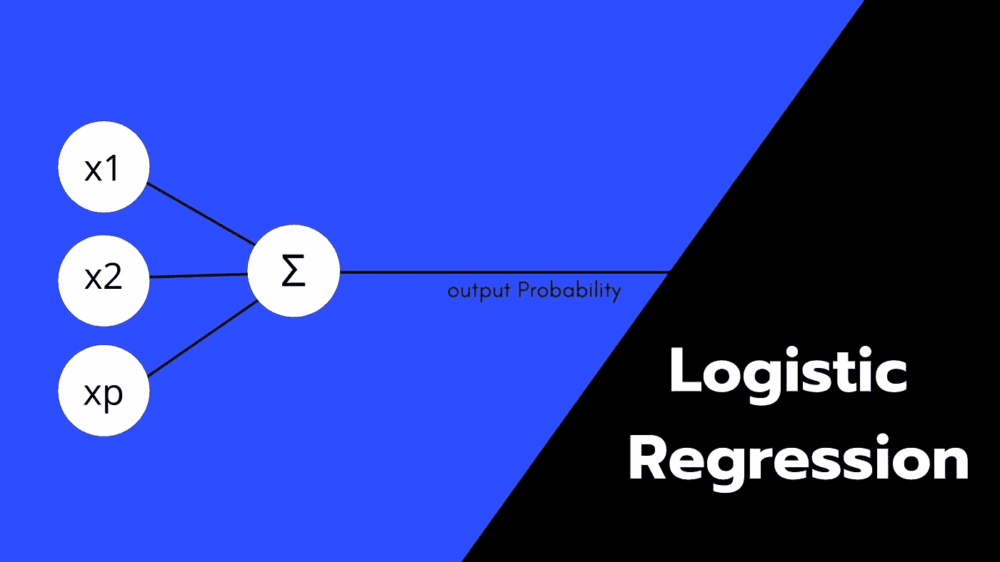
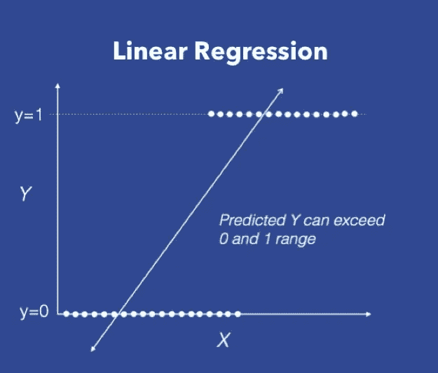
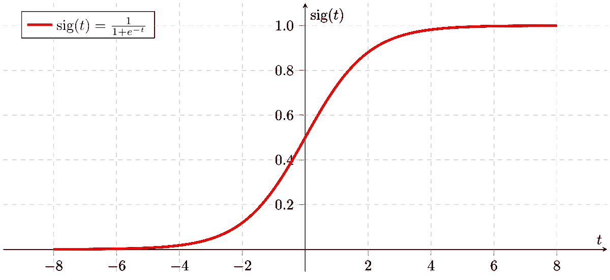
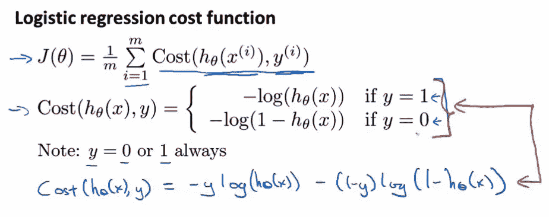
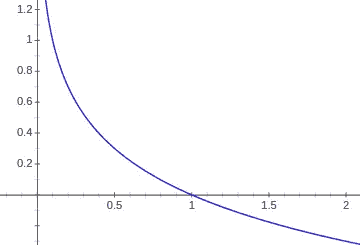
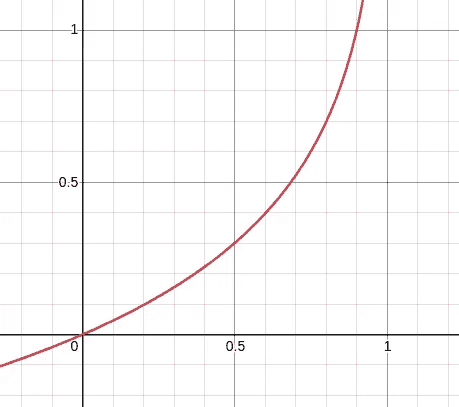
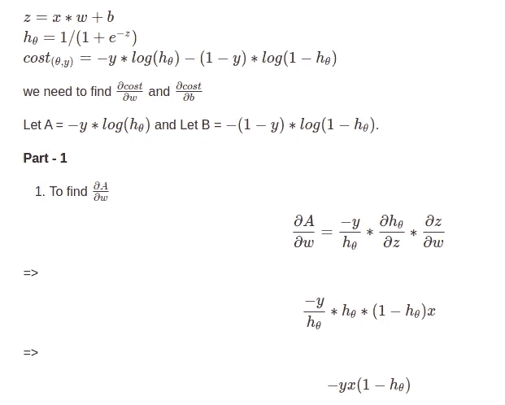
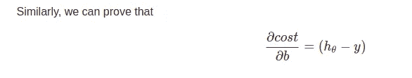

# 梯度下降逻辑回归解释|机器学习

> 原文：<https://medium.com/analytics-vidhya/logistic-regression-with-gradient-descent-explained-machine-learning-a9a12b38d710?source=collection_archive---------0----------------------->

## 什么是逻辑回归？为什么用于分类？

# 什么是分类问题？

一般来说，监督学习包括两种类型的问题设置。

*   **回归**:这是一类问题，数据科学家使用合适的模型对自变量和**连续因变量**之间的关系进行建模，并使用该模型对未来输入数据进行准确预测。
    例如，
    在给定温度的情况下，预测某一天的冰淇淋销量。
    在这里，冰淇淋的销售额是一个连续变量，这意味着它可以取任何值。
    *例如:500，100，10000，52，123，931…等等。*
*   **分类:**这是一类问题，数据科学家必须找到自变量和**离散**因变量之间的关系，并使用它来给出准确的未来预测。
    例如，
    根据温度和湿度读数预测是否会下雨。如果下雨，输出将是 1。如果没有，它将是 0。
    这里，要预测的值只能取某些值。在上述情况下，下雨或不下雨(0 或 1)。

在继续下一步之前，参考[带梯度下降的线性回归](/analytics-vidhya/linear-regression-with-gradient-descent-derivation-c10685ddf0f4)了解线性回归如何工作，以及一种称为梯度下降的算法如何成为线性回归工作的关键。同样的梯度下降算法是我们将在逻辑回归中使用的算法，很多东西将与上面提到的帖子类似。所以，先读一下这个会让你对逻辑回归有更好的理解。

# 线性回归方法也适用于分类吗？

图 1.1

让我们考虑一个问题陈述。鉴于肿瘤的大小，我们需要预测它是恶性的还是良性的。*(良性 y=0，恶性 y=1)。* 将肿瘤的大小与肿瘤的类型相对照，给了我们左图。

在回归设置中，我们可以拟合最佳拟合线，并预测线上高于特定阈值的点是恶性的，低于该点的点是良性的。

这种方法存在一些问题:

*   Y 的值可以超过 1 并低于 0。但是，我们需要一个输出，作为预期输出发生的概率。有了这个概率，我们就应该能够对输出进行分类了。
*   杠杆点可能会极大地影响这条线。

# Sigmoid 函数和预测

sigmoid 函数是一个神奇的函数，它能让我们得到期望的概率作为输出。
它通过压缩 0 到 1 之间的任何值来实现这一点。

图 2.1

图 2.1 表示 s 形函数。它的数学公式是 sigmoid(x) = 1/(1+e^(-x)).

类似于线性回归，我们也有权重和偏差。我们首先将输入乘以这些权重，然后加上偏差。最终结果将进入 sigmoid 函数，给出 0 到 1 之间的概率。

*   z = x*w + b
    其中 w 是权重，b 是偏差。
*   h_theta = sigmoid(z)

这些权重和偏差最初是随机选择的。但是，梯度下降算法将确保这些参数被更新，以很好地完成分类任务。

在这个 sigmoid 函数的帮助下，我们可以根据概率成功地预测输出

# 逻辑回归成本函数背后的直觉

由于梯度下降是正在使用的算法，第一步是定义一个**成本函数**或**损失函数。** 这个函数应该以这样一种方式来定义，它应该能够告诉我们我们的模型的预测与最初的结果偏离了多少。

那么，我们如何定义这样一个函数呢？

图 3.1(吴宇森的讲座)

在图 3.1 中，Cost(h_theta(x)，y)是我们一直在寻找的函数。但是，这个函数是如何工作的呢？为了理解这一点，我们需要将函数分成两部分。一部分解释实际输出为 1 时的功能，另一部分解释实际输出为 0 时的功能。
简而言之，当实际已知目标为 1 时，我们希望模型的预测尽可能接近 1，否则接近 0。

在 J(theta)的等式中， *Y* 代表实际目标值， *h_theta* 是我们模型的输出。*h _θ*将在下面解释。但是，让我们假设我们的模型已经有一种方法来进行预测，并且我们有一个定义好的 h_theta。这些预测将介于 0 和 1 之间。所以，我们会得到一个概率作为输出。

## 第 1 部分:当 Y = 1 时

当实际目标是 1 时，我们希望我们的模型的预测尽可能接近 1。因此，我们的成本函数应该随着我们的模型的预测远离 1 而趋向 0 而增加惩罚。我们的模型的惩罚应该减少，因为它的预测越来越接近 1。因此，我们现在的目标是为此定义一个函数
，这个函数就是:- log(x)

图 3.2: -对数 x 图

在图 3.2 中，认为 y 轴是成本，x 轴是模型的预测。*注意:我们模型的预测不会超过 1，也不会低于 0。所以，这部分不在我们的担心范围之内。*

当模型的预测更接近 1 时，惩罚更接近 0。随着它从 1 进一步向 0 移动，罚值增加。Sol，实际目标为 1 时可以使用此功能。

## 第 2 部分:当 Y = 0 时

同样，当 Y 等于 0 时，我们不希望模型的预测尽可能接近 0。这意味着更接近 0 的值的惩罚更低，而远离 0 且接近 1 的值的惩罚更高。因此，合适的函数是-log(1-h_theta(x))

图 3.3(成本函数的第二部分)

图 3.3 表示成本函数的第二部分。即-log(1-h_theta(x))。

假设 X 轴是我们的模型预测的值，Y 轴是模型得到的惩罚，假设原始目标是 0。

准备成本函数的两个部分。为了确保当 y=1 时第一部分激活，并且第二部分不干扰，并且当 y=0 并且第一部分不干扰时第二部分激活，我们将 *y* 和 *(1-y)* 项添加到成本函数中。
最后，我们得到了图 2.1 中用蓝色突出显示的成本函数。

# 梯度下降和成本函数导数

现在，我们已经定义了一个成本函数，目标是找到最优的 *w* 和 *b* ，使得我们的数据集的成本函数最小化。这就是梯度下降的用武之地。通过这样做，模型学习参数，以减少它的惩罚，从而做出更准确的预测。

*梯度下降的算法就不再解释了。这在上面提到的链接*中有解释

我们希望找到成本相对于 w 和 b 是如何变化的，以便慢慢地改变原始的 w 和 b 来获得最优参数。
逻辑回归成本函数梯度的推导如下图所示

图 4.1

图 4.2

图 4.3

找到梯度后，我们需要用原始的 w 和 b 减去梯度。我们进行减法，以便将梯度的值向斜率的相反方向移动，从而确保成本下降。

成本函数是一个函数，它告诉我们我们的模型与我们能够创建的最理想的模型偏离了多少。因此，确保参数以降低该成本函数的方式被优化，将确保我们得到一个好的分类器，假设点是线性可分的，并且一些其他次要因素。

# 结论

与线性回归相似，我们定义了一个成本函数，用于估计模型预测与原始目标之间的偏差，并通过更新原始 w 和 b，使用梯度下降法将其最小化。
这确保了我们可以使用这些 w 和 b 来使用模型进行未来分类。使用 sigmoid 函数将连续输出转换为概率输出。

因此，逻辑回归和线性回归之间的唯一 2 个区别是逻辑回归中的成本函数和 sigmoid 函数，这使其适合于分类问题设置。