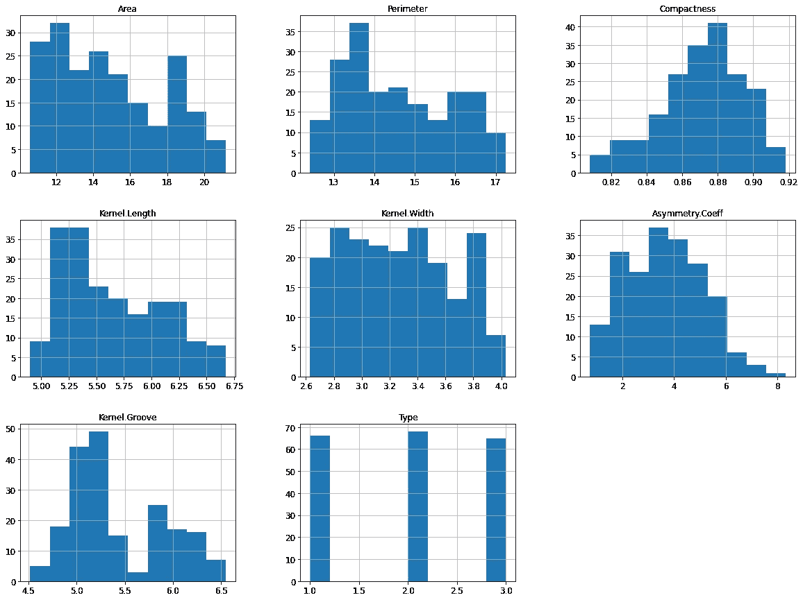
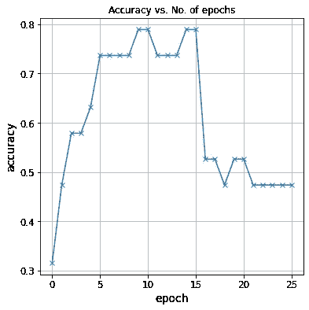

# PyTorch 逻辑回归—初学者指南

> 原文：<https://medium.com/analytics-vidhya/logistic-regression-with-pytorch-a-beginner-guide-33c2266ad129?source=collection_archive---------7----------------------->

## 基于数据集——小麦种子种类预测


Evi Radauscher 在 [Unsplash](https://unsplash.com?utm_source=medium&utm_medium=referral) 上拍摄的照片

如果您想开始使用 PyTorch，但又不确定从哪个数据集开始，那么您来对地方了。我们看到 PyTorch 在经典机器学习到深度神经网络中的实现。我等不及要开始了，但是在我们开始之前，让我们先回答几个基本问题——

1.  **py torch 是什么？PyTorch 是由脸书人工智能研究小组开发的开源、社区驱动的深度学习框架。PyTorch 广泛用于一些深度学习应用，如自然语言处理、计算机视觉应用、图像分类、迁移学习等。**
2.  **py torch 中的张量是什么？** 张量是 n 维矩阵。张量是 PyTorch 库的核心，用于深度学习中的高效计算。零阶张量是一个数。一阶张量是一组数字，即一个向量。二阶张量是一组向量，或称矩阵。与 NumPy 数组不同，我们也可以在 GPU 上使用张量，这为我们带来了更快计算速度的优势。

# 关于数据集

小麦种子数据集对于 PyTorch 基础知识的入门非常简单。
小麦种子数据集涉及给定来自不同小麦品种的种子测量值的物种预测。

# 目录

1.  [简介](#4e59)
2.  [数据预处理](#7050)
    2.1 [加载所需库](#4c45)
    2.2 [获取数据](#e760)
3.  [特征分析](#e652)
    3.1 [面积 vs 内核长度](#45d4)
    3.2 [面积 vs 内核宽度](#6064)
    3.3 [绘图槽 vs 周长](#75c7)
    3.4 [面积 vs 内核槽](#646a)
4.  [建立 PyTorch 模型](#65d5)
    4.1 [预处理和创建数据加载器](#d2f5)
    4.2 [模型创建](#ae3e)
    4.3 [训练模型](#c67b)
    4.4 [绘制损耗和精度](#94b3)
5.  [总结](#2cbe)
6.  [未来工作](#d9a7)
7.  [参考文献](#29ca)

# 介绍

小麦种子种类的预测是一个分类问题。每一类的观察数量是平衡的。有 199 个观察值，7 个输入变量和 1 个输出变量。变量名如下:

1.  面积。
2.  周界。
3.  紧凑性。
4.  内核长度。
5.  内核的宽度。
6.  不对称系数。
7.  内核凹槽长度。
8.  类(1，2，3)。

# 数据预处理

## 加载所需的库

让我们加载处理这个数据集时需要的标准库列表。我通常更喜欢一次性加载它们🆒

## 检索数据

数据集可以从 [GitHub](https://raw.githubusercontent.com/hargurjeet/MachineLearning/Wheat-Seeds/seeds.csv) 或 [Kaggle](https://www.kaggle.com/jmcaro/wheat-seedsuci) 下载。我已经从 GitHub 下载了数据集。

# 特征分析

现在数据集已经下载完毕，让我们来研究一下数据集，以获得对功能的深入了解。



从上图来看，物种和特征之间的关系不是很清楚。因此，我运行下面的代码来理解特性之间的相关性。

以下是我的观察

*   籽粒长度和宽度似乎与面积有很大关系。
*   内核的长度和宽度似乎与周长有很大的关系。
*   面积和周长与凹槽密切相关。
*   凹槽与类型非常接近于零(0.03)，因此确认没有线性关系。

我现在为每一种类型画出上述所有要点。每种类型的绘图面积和内核长度。

## 面积与内核长度

## 面积与内核宽度

每种类型的绘图面积和内核宽度。

我观察到类型 1 和类型 2 之间的数据重叠，以及与类型 3 的最小重叠。因此，我得出结论，虽然类型 1 和类型 2 的种子可能在宽度上相似，但类型 3 的种子肯定在尺寸上更大。

## 绘制凹槽与周长

## 面积与内核凹槽

类型 1 和类型 2 的内核凹槽长度似乎落在相同的范围内。而类型 3 似乎具有更长的凹槽长度。

# 使用 PyTorch 构建模型

因为这是一个分类问题。我在这里建立一个逻辑回归模型。需要注意的几个要点

*   一个**逻辑回归**模型几乎等同于一个线性回归模型。它包含权重和偏差矩阵，使用简单的矩阵运算(`pred = x @ w.t() + b`)获得输出。
*   我们使用`nn.Linear`来创建模型。
*   输出是大小为 3 的向量，每个元素表示特定目标标签的概率(即，0 到 2)。一个小麦品种的预测标签就是概率最高的那个。

## 预处理和创建数据加载器

首先，需要将数据转换成张量。

要设置自定义数据集，您需要使用数据加载器。torch 库中提供了 DataLoader 方法。您可以按如下方式使用数据加载器。数据在测试和验证集中被分割

在建立模型之前，我们需要了解输入大小和输出大小。在当前数据集中，我们有 7 个特征(面积、周长、紧密度、内核。长度，内核。宽度，不对称。Coeff，内核。凹槽)。因此，输入大小将是 7。在输出类别(即类型)中，我们有 3 种不同的分类。因此，我们的输出大小将是 3

## 模型创建

在我们建立模型之前，让我们先了解一下**什么是逻辑回归**？
在统计学中，**逻辑模型**(或**逻辑模型**)用于模拟某一类或某一事件存在的概率，如通过/失败、赢/输、活着/死了或健康/生病。这可以扩展到建模几类事件，如确定图像是否包含猫、狗、狮子等。图像中被检测的每个对象将被分配 0 到 1 之间的概率，总和为 1。

这是模型的样子。坦率地说，您可能必须熟悉 python 的面向对象概念。你不必真的掌握它。基础知识将足以在构建 PyTorch 模型时一帆风顺。

基本的前馈网络将会是这样的

我们在上面看到，模型接受 7 个输入，提供 3 个输出。基于最大概率，我们将从 3 个输出中选择 1 个输出。

在下一步中，我将包括培训和验证步骤以及损失和优化器。

此外，了解**评估指标**也很重要。

**评估指标** 我们需要一种方法来评估我们的模型表现如何。一种自然的方法是找出被正确预测的标签的百分比。我们通过下面的函数来计算

`==`操作符对两个形状相同的张量进行元素比较，并返回一个形状相同的张量，包含不相等元素的`True`和相等元素的`False`。将结果传递给`torch.sum`会返回正确预测的标签数量。最后，我们除以特征的总数来得到准确度。

在我们训练该模型之前，让我们看看该模型在具有初始随机初始化权重和偏差集的验证集上的表现。

初始精度约为 31%，这可能是随机初始化模型的预期值。(因为通过随机猜测，它有 1/3 的机会猜对一个标签)

## 训练模型

现在我们已经定义了数据加载器，模型，我们准备训练模型。
这里是训练和验证阶段的伪代码。

```
for epoch in range(num_epochs):
    # Training phase
    for batch in train_loader:
        # Generate predictions
        # Calculate loss
        # Compute gradients
        # Update weights
        # Reset gradients

    # Validation phase
    for batch in val_loader:
        # Generate predictions
        # Calculate loss
        # Calculate metrics (accuracy etc.)
    # Calculate average validation loss & metrics

    # Log epoch, loss & metrics for inspection
```

训练循环的某些部分特定于我们正在解决的特定问题(例如，损失函数、指标等)。)而其他的是通用的，可以应用于任何深度学习问题。

我们将在一个名为`fit`的函数中包含与问题无关的部分，该函数将用于训练模型。特定于问题的部分将通过向`nn.Module`类添加新方法来实现。

`fit`函数记录每个时期的验证损失和度量。它返回训练的历史，对调试&可视化很有用。

我们现在准备训练模型。让我们训练五个纪元，看看结果。

## 绘制损耗和精度图

虽然随着我们训练更多的历元，准确度会继续增加，但是随着每个历元的增加，改进会变得更小。让我们用一个线形图来形象化地展示这一点。



从上面的图片中可以很清楚地看到，即使经过非常长时间的训练，该模型也很可能不会越过 80%的准确率阈值。一个可能的原因是学习率可能太高。模型的参数可以在最低损失的最佳参数集附近“跳动”。我们可以尝试降低学习率，多训练几个纪元，看看有没有帮助。

更有可能的原因是这个模型不够强大。有各种各样的技术来提高模型的性能，但这可能超出了本笔记本的范围。

# 摘要

下面是本文的简要总结，以及我们在构建 PyTorch 逻辑回归模型时遵循的一步一步的过程。

1.  我们简要了解了 PyTorch 框架和张量。
2.  下载数据集并执行特征分析。
3.  按照以下步骤构建模型
    i .设置数据加载器，并在训练和验证集中拆分数据。
    二。建立一个具有训练、测试、损耗和优化器的前馈网络。
    三世。定义了捕捉模型准确性的评估指标。
    四。我们开发了一个独立于问题的函数`fit`,它可以捕捉每个时期的验证损失和准确性。然后，我们以不同的学习速率训练该模型。六。最后，我们根据我们在培训期间运行的纪元，在捕获的`val_acc`上构建一个可视化。

# 未来的工作

下面是一些可以扩展 project 的方法:

1.  尝试更新模型参数以进一步提高精确度。
2.  建立多层前馈网络以验证模型性能。
3.  尝试实现经典的机器学习模型，如 SVM，因为他们特别擅长集群，并评估其性能。

# 参考

1.  访问或执行完整的笔记本-[https://jovian . ai/hargurjeet/wheat-seeds-analysis-py torch-blogs](https://jovian.ai/hargurjeet/wheat-seeds-analysis-pytorch-blogs)
2.  [https://pytorch.org/](https://pytorch.org/)
3.  [https://py torch . org/docs/stable/generated/torch . nn . crossentropyloss . html](https://pytorch.org/docs/stable/generated/torch.nn.CrossEntropyLoss.html)
4.  [https://jovian . ai/learn/deep-learning-with-py torch-zero-to-gans](https://jovian.ai/learn/deep-learning-with-pytorch-zero-to-gans)

我真的希望你们能从这篇文章中学到一些东西。请随意给一个👏如果你喜欢你所学的。这让我保持动力。

感谢阅读这篇文章。快乐学习😃