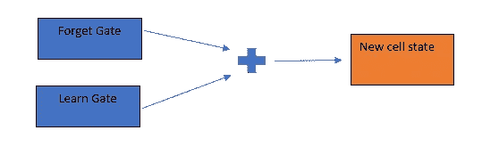

# 长短期记忆网络

> 原文：<https://medium.com/analytics-vidhya/long-short-term-memory-networks-23119598b66b?source=collection_archive---------3----------------------->

# 介绍

神经网络旨在模仿人类大脑的行为，理解数据中的各种关系。这些网络有能力理解复杂的非线性关系，可以帮助我们做出更明智的决定。神经网络用于图像处理、自然语言处理等领域。，并能优于传统的机器学习算法。但是传统神经网络的一个基本缺点是它不能记忆东西。

比方说，我们正在玩一个游戏，我们需要一个模型来预测玩家的下一步行动。这在很大程度上取决于前面的移动，传统的神经网络在这里不会表现得很好。在这种情况下，我们需要一些模型，可以记住以前的事件，并相应地做出明智的决定。这就是递归神经网络(RNN)出现的原因。rnn 可以存储先前的状态信息。然后它可以用它来预测下一个事件，在这种情况下，就是玩家的下一步行动。

在上图的左侧，您可以看到有一个输入 Xt 和输出 ht。循环表示这个网络重复了 t 次，如右图所示。神经网络 A 在时间 t = 0 获取输入 X，并产生输出 h0。现在，来自 A 在 t=0 和输入 X1 的信息被传递到下一个时间戳 t=1，以生成输出 h1。似乎是记忆问题的完整解决方案。

RNNs 已经被用于许多序列建模任务，如图像字幕、机器翻译、语音识别等。

# RNN 的缺点

正如我们所见，rnn 越来越受欢迎，并被用于大多数序列相关的任务。但是这种模式也有一些缺点。

## 消失渐变

通过时间的反向传播来训练 rnn(BPTT)。像反向传播一样，神经网络的权重也通过梯度得到更新。但是在 RNN，我们可以穿越时间和层面。如果序列非常大(许多时间步长)，并且如果神经网络有一个以上的隐藏层，那么当我们反向传播时，梯度很可能会变得越来越小。这最终会导致渐变消失的问题。一旦出现这个问题，权重会更新的非常慢，阻止网络学习。消失梯度问题也可能发生在深度神经网络中。但这种效应在 RNN 非常普遍，甚至更糟，因为这里我们也需要穿越时间。

## 处理长期依赖关系

RNNs 可以利用先前的状态来预测下一个事件。这在 NLP 中非常有用，在 NLP 中，特定单词的预测依赖于上下文或先前的单词。考虑一下“苹果是一种水果”这句话。现在假设我们通过 RNN 网络预测每个单词。为了预测单词“水果”，我们需要上下文单词“苹果”。因为上下文单词就在事件之前。所以，在这种情况下，RNNs 会表现的很好。

但是考虑一下“我在法国长大，我说一口流利的法语”这句话。这里预测“法国”这个词，上下文词是“法国”。这些被称为长期依赖，在语言模型中非常常见。发现 rnn 处理长期依赖性很差。RNNs 的性能会随着事件和上下文之间的差距的增加而下降。

# LSTM 简介

长短期记忆网络是专门为克服 RNN 的缺点而设计的。与 RNN 相比，LSTMs 可以将信息保存更长时间。LSTMs 还可以解决消失梯度问题。让我们看看 LSTM 如何实现这些目标。

当我们考虑 RNN 时，它有一个神经网络层或一个重复 t 时间步的模块。在这个模块中，RNN 有一个带有简单激活层的神经网络。激活层可以是 tanh 或 sigmoid 或任何其他函数。从下图中可以更好地理解这一点。

然而，在 LSTMS 中，架构并不那么简单。考虑下图所示的 LSTM 网络架构。

不要过度紧张。在下节课中，我们将尝试逐一理解这些单元。

现在让我们回到预测博弈下一步的第一个例子。下一步可以被认为是我们需要预测的事件。显然，这一事件有各种长期和短期的相关性。你可以将这些依赖视为上下文，或者在这种情况下，我们从以前的关卡收集的工具和配件，或者游戏中发生的以前的事件等。

假设我们有一个正在发生的事件，我们需要预测游戏中的下一个事件。我们还有在比赛中收集的长期和短期信息。长期记忆是从很久以前收集的记忆，而短期记忆是从几个时间戳以前收集的信息。显然，为了预测下一个事件，我们需要当前事件。但是只有一些长期和短期的记忆会有用。我们怎么得到这个？

在 LSTMs 中，我们将使用这个长时记忆和短时记忆，以及当前事件，来生成一个新的经过修改的长时记忆。这样做的时候，我们只会记住那些有用的东西，我们会丢弃所有不相关的信息。同样，我们会通过使用一些信息和丢弃其他信息来更新短时记忆。简而言之，在每个时间步，我们将过滤需要传递到下一个时间步的内存。这个修改的信息用于预测下一个事件。一旦你经历了下一个阶段，这将会变得更加清晰。

# LSTM 建筑

现在，让我们深入 LSTM 模型架构，并尝试理解它将如何处理长期和短期的依赖关系。考虑下图。

您可以看到一个 LSTM 单元有两个输出。Ct 和 ht。如果你记得在 RNN 我们只有一个输出，那就是 ht。隐藏状态 ht 是从之前的步骤中获得的短期记忆。现在，LSTM 的额外产出是多少？向量 Ct 被称为单元状态。

现在 LSTM 中的细胞状态负责储存长期记忆事件。LSTMs 将利用一种称为 gates 的机制在该单元状态中添加和删除某些信息。让我们试着详细理解这一点。

## 忘记大门

正如我们前面讨论的，我们可以使用 gates 向单元状态添加和移除信息。下图只不过是“遗忘之门”,它只过滤需要的信息，去掉其余的。这是如何实现的？

在该图中，来自前一时间步的细胞状态或长期记忆乘以函数 ft 以获得新的过滤记忆，其中 ft 是遗忘因子。遗忘因子的计算公式如下所示。

来自先前时间戳和当前事件的短期记忆或 ht-1 用于计算遗忘因子。短期记忆和当前事件连接在一起，并在该向量的顶部应用一个 sigmoid 层。sigmoid 函数将产生范围从 0 到 1 的输出，该输出将与先前单元状态中的每个值相乘。值 0 表示信息将被完全丢弃，值 1 表示信息保持原样。

## 学习门

现在我们知道了丢弃什么信息，我们的下一个目标是找到我们需要添加什么新信息。这是通过学习门完成的。现在学习门有两个部分

1.之前的短时记忆和当前事件串联起来，然后经过一个 tan h 层。这将产生新的值 c~t，这是新的信息。这里我们也不需要全新的信息。我们如何忽略这其中的一部分？

2.每一个新的候选人得到多少更新是由另一个遗忘门决定的。来自遗忘门的输出将与我们的新信息相乘，并生成最终输出

现在，为什么我们在一些地方使用 tanh 激活函数？Tanh 激活函数将输出以 0 为中心的向量(在-1 到 1 的范围内)。这将很好地分布梯度，并允许单元状态运行更长时间。这将最终解决消失或爆炸梯度的问题。

## **记门**

既然我们知道了什么该保留，什么该丢弃，那么我们就该更新新的细胞状态或长期记忆了。我们如何做到这一点？我们只是从遗忘门和学习门获取输出，然后将它们相加。

我们快到了。现在剩下的唯一一步是计算输出。

## 输出门

输出是单元状态的过滤版本。来自记忆门的单元状态值乘以双曲正切激活函数。tanh 的输出将介于-1 和 1 之间。然后，我们再次将输出乘以 sigmoid 函数，以忘记一些值。

就是这样！我们已经完成了架构。

# LSTM 建筑的其他变体

除了上述架构之外，还有一些其他网络也可以很好地处理序列数据。其中一些是

[门控循环单元(GRU)](https://en.wikipedia.org/wiki/Gated_recurrent_unit)

[窥视孔 LSTMs](https://www.tensorflow.org/api_docs/python/tf/keras/experimental/PeepholeLSTMCell)

[深度门控 RNNs](https://arxiv.org/abs/1508.03790)

[发条 RNNs](https://arxiv.org/abs/1402.3511)

我不会深入这些模型的细节。但是你可以在上面的链接中读到它们。

# 最后的想法

LSTM 是自然语言处理和序列模型领域的一个伟大的里程碑。但是像所有其他模型一样，LSTMs 也不是完美的。训练次数较长，内存需求大，无法并行训练等。是 LSTMs 的一些缺点。新的改进模型和技术被开发出来，一个流行的方法是注意力。让我们希望越来越多有趣的工作将围绕 RNNs 和序列数据出现。

我希望你喜欢这个博客。如有任何疑问或澄清，请随时通过我的 [LinkedIn](https://www.linkedin.com/in/vinitha-v-n-5a0560179/) 联系