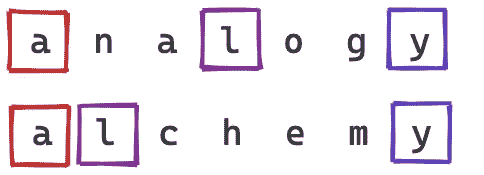
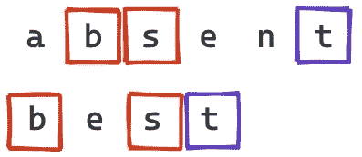
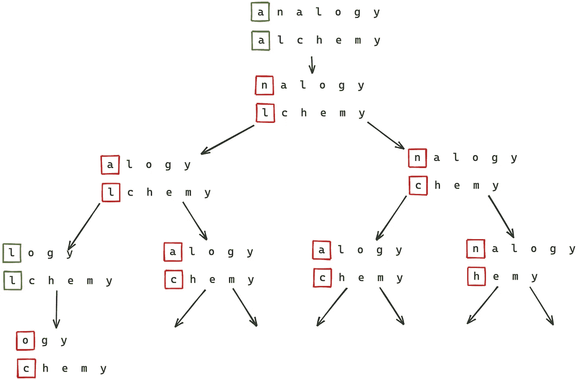
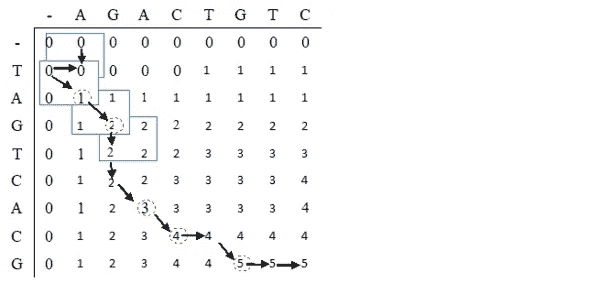

# 最长公共子序列

> 原文：<https://medium.com/analytics-vidhya/longest-common-subsequence-2f4f830be14f?source=collection_archive---------20----------------------->


由 [Markus Spiske](https://unsplash.com/@markusspiske?utm_source=medium&utm_medium=referral) 在 [Unsplash](https://unsplash.com?utm_source=medium&utm_medium=referral) 上拍摄的照片

> 写一个函数，找出两个序列之间的**最长公共子序列**的长度。
> 
> 例如，给定字符串“serendipitous”和“deposition ”,最长的公共子序列是“reipito ”,其长度是 7。

***递归方法*** →

1.  从 0 开始创建两个计数器`idx1`和`idx2`。我们的递归函数将计算`seq1[idx1:]`和`seq2[idx2:]`的 LCS
2.  如果`seq1[idx1]`和`seq2[idx2]`相等，那么这个人物属于`seq1[idx1:]`和`seq2[idx2:]`的 LCS(为什么？).更进一步的长度这就是 LCS 比`seq1[idx1+1:]`和`seq2[idx2+1:]`的 LCS 多一个



3.如果不是，则`seq1[idx1:]`和`seq2[idx2:]`的 LCS 是`seq1[idx1+1:], seq2[idx2:]`的 LCS 和`seq1[idx1:]`、`seq2[idx2+1:]`的 LCS 中较长的一个



4.如果`seq1[idx1:]`或`seq2[idx2:]`为空，则它们的 LCS 为空。

下面是递归调用树的样子:



```
def lcs_recursive(seq1, seq2, idx1=0, idx2=0):
    if idx1 == len(seq1) or idx2 == len(seq2):
        return 0
    elif seq1[idx1] == seq2[idx2]:
       return 1 + lcs_recursive(seq1, seq2, idx1+1, idx2+1)
    else:
       option1 = lcs_recursive(seq1, seq2, idx1+1, idx2)
       option2 = lcs_recursive(seq1, seq2, idx1, idx2+1)
       return max(option1, option2)
```

***算法复杂低效→***

最坏的情况发生在每次我们必须尝试 2 个子问题时，即当序列没有公共元素时。

时间复杂性是 O(2^(m+n)).

它通过使用一种叫做*记忆*(即记忆)的技术来克服。它用于存储中间重复结果，以备将来参考。

```
def lcs_memo(seq1, seq2):
    memo = {}
    def recurse(idx1=0, idx2=0):
        key = (idx1, idx2)
        if key in memo:
            return memo[key]
        elif idx1 == len(seq1) or idx2 == len(seq2):
            memo[key] = 0
        elif seq1[idx1] == seq2[idx2]:
            memo[key] = return 1 + recurse(idx1+1, idx2+1)
        else:
            memo[key] = max(recurse(idx1+1, idx2), recurse(idx1, idx2+1))
        return memo[key]
    return recurse(0, 0)
```

但是，递归的使用增加了空间复杂度，因为对于每个调用，需要分配空间，并且该过程继续。因此，该问题的解决方案是*迭代方法，*可通过以下方式实现:

***动态编程→***

1.  创建一个用 0 初始化的大小为`(n1+1) * (n2+1)`的表，其中`n1`和`n2`是序列的长度。`table[i][j]`代表`seq1[:i]`和`seq2[:j]`的最长公共子序列。下面是表格的样子(来源:Kevin Mavani，Medium)。



2.如果`seq1[i]`和`seq2[j]`相等，则`table[i+1][j+1] = 1 + table[i][j]`

3.如果`seq1[i]`和`seq2[j]`相等，则`table[i+1][j+1] = max(table[i][j+1], table[i+1][j])`

```
def lcs_dp(seq1, seq2):
    n1, n2 = len(seq1), len(seq2)
    table = [[0 for x in range(n2)] for x in range(n1)]
    for idx1 in range(n1):
        for idx2 in range(n2):
            if seq1[idx1] == seq2[idx2]:
                table[i+1][j+1] = 1 + table[i][j]
            else:
                table[i+1][j+1] = max(table[i][j+1], table[i+1][j])
    return table[-1][-1]
```

对于这种方法…时间复杂度是 O(N1 * N2)。