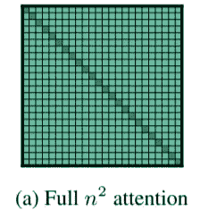
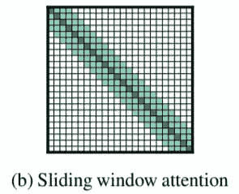
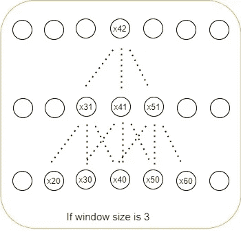
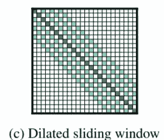
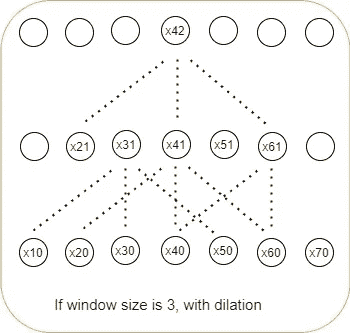
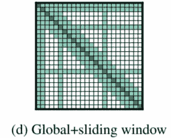

# Longformer:长格式文档的转换器

> 原文：<https://medium.com/analytics-vidhya/longformer-a-transformer-for-long-form-documents-e2145da6a58b?source=collection_archive---------6----------------------->

*   ***与较长表单文档上的普通变压器相关的问题:***

1.  对具有远距离连接的较长段落的上下文进行编码不够健壮。一种方法是将段落分成几个块，然后分别对每个块进行编码。但是这样做并不能确保来自一个组块的标记和来自其他组块的标记之间的任何联系，因为一个组块中的标记并不关注其他组块中的标记。因此，我们需要找到一种方法，这样我们就可以将整个文档传递给模型，这样即使在较长的距离上，信息也可以保持连接。
2.  就存储器需求和复杂性而言，自我注意本质上是二次的，O(n)是因为每个令牌都参与前一层中的所有令牌。随着 n 值的增加，内存需求将呈二次方增加。

*   ***如何解决这些问题？***

我们必须开始考虑将内存需求降低到线性复杂度的可能性。从 CNN(使用过滤器/内核，并在输入数据上滑动，以线性复杂度提取信息)汲取灵感，[论文](https://arxiv.org/pdf/2004.05150.pdf)的作者提出了用滑动窗口注意力模式(本文稍后解释)取代这种昂贵的注意力模式的想法。这也将有助于对整个长格式文档进行编码，从而保留整个文档中的上下文。Longformer 中使用的注意模式还有两种:扩大的滑动窗口&全局+滑动窗口。我们现在将了解这些注意力模式如何在该架构中发挥作用，但在此之前，我将带您了解这些不同类型的注意力模式及其优势:

> 1.**二次关注:**

这是 Vanilla Transformer 所遵循的注意模式，其中每个令牌都关注其他令牌。如果我们认为这个注意域的长度和宽度等于 n(即，令牌的数量)，那么每个单个令牌将每隔一个令牌出现，导致 O(n)个存储器需求。

> 2.**滑动窗口注意:**

这是 Longformer 架构中采用的注意力模式。这涉及在序列长度 n 上滑动的大小为(= w)的窗口，每个标记将关注其自身以及前一层中该窗口内的其他标记，并且将滑动直到序列的末尾，线性复杂度为 O(w*n) = O(n)，上层中的标记能够掌握更长的上下文信息。窗口(w)的大小是最初在[论文](https://arxiv.org/pdf/2004.05150.pdf)中讨论的 512。但是为了便于理解，我们在本文中假设了更小的窗口大小。

在上图中可以看到，当窗口大小=3 时，第一个隐藏层的令牌 **x41** 正在参加上一层窗口大小=3 内的令牌( **x30，x40，x50** )。类似地，第二隐藏层中的记号 **x42** 参与来自前一隐藏层(即，第一隐藏层)的窗口内的记号，前一隐藏层本身参与记号 **x20、x30、x40、x50、x60** ，这表明上层记号能够从输入中学习更长的上下文，这就是 hack！！因此，如果我们继续增加层的数量，那么变换器的最后一层中的令牌将参与到具有线性复杂度的存储器需求的非常长的上下文中。

这种注意模式对于在窗口内对来自输入层的本地信息进行编码是有用的。我们希望收集直接来自输入的每一个信息，因此在 transformer 的初始层使用滑动窗口注意模式来提取所有局部信息是明智的。

> 3.**放大滑动窗口注意:**

在扩大的滑动窗口注意模式中，transformer 层中的每个标记都关注自身，并关注前一层中的更多标记，从而留下一个一致的间隙(在右图中，间隙=1)。第一个隐藏层的令牌 **x41** 正在参加令牌: **x40** 、 **x20** 、 **x60** ，遗漏令牌 **x30** 、 **x50** 。这种注意模式用于在相对较长的上下文中掌握大范围的信息，因此，用于长格式转换程序的上层或下层。

> 4.**全局+滑动窗口注意:**

这种注意模式使用全局注意和滑动窗口注意的混合，全局注意是在一些特殊的标记上计算的，如通过序列长度 **n.** 参与全局信息的【CLS】标记

## **可利用 Longformer 执行:**

*   ***【自回归建模(从左到右上下文学习):***

对于自回归语言建模，随着层数的增加，滑动注意窗口的大小也增加。如前所述，较低的层使用滑动窗口注意模式，而后面的层使用扩展窗口注意模式来学习远处的信息，而不损害本地上下文。以此为目标的培训分 5 个阶段进行。每一阶段，输入序列长度增加，学习速率减半。第一阶段从序列长度为 2048 开始，到最后阶段的序列长度为 23，040。

在评估模型时，数据集被分割成每个长度为 32，256 的序列，在该序列上以 512 的步长评估模型。

*   ***使用 MLM(掩蔽语言建模)的预训练目标*** *:*

预训练 Longformer 非常昂贵，因此论文[的作者建议从预训练 RoBERTa 的检查点开始，然后是 Longformer。这里使用的位置嵌入是预训练的 RoBERTa 的绝对位置嵌入，唯一的区别是我们必须通过多次复制来增加位置嵌入的长度，直到达到序列的长度。使用 MLM(掩蔽语言模型)目标进行预训练，设置与 RoBERTa 中的设置相同(包括权重、层数等。).注意窗口的长度保持为 512。](https://arxiv.org/pdf/2004.05150.pdf)

*   ***微调:***

这些模型在几个任务上得到了很好的调整，比如文档分类、共指消解、问答任务。由于这篇文章越来越长，我建议参考原[论文](https://arxiv.org/pdf/2004.05150.pdf)。

*   ***【龙前编码器解码器(LED)】***

这需要在 Longformer 编码器的顶部添加一个解码器，它可以对生成任务(如摘要)进行预测。回想一下 BART 总结程序，它能够总结不太长的段落。为生成任务预先训练一个 Longformer 可能非常昂贵，所以我们用 BART 的检查点用类似的设置(包括层数和权重)初始化 Longformer。唯一的区别是，我们必须将 BART 的位置嵌入大小从 1K 增加到 16K。这个摘要器在长文档摘要任务上的表现优于所有其他模型，如 BigBird 模型。

我已经解释了该架构的机制，以及为什么这种想法对较长形式的文档有用，但是如果您对获得的结果中的确切数字以及用于训练和测试的数据集感兴趣，我会建议您参考这篇[论文](https://arxiv.org/pdf/2004.05150.pdf)。这将帮助你获得更多的见解，一旦你完成这篇文章，最初的[论文](https://arxiv.org/pdf/2004.05150.pdf)将看起来更容易理解。我试图从我的角度清晰地解释它，希望它能帮助你，我感谢你的耐心。祝你旅途愉快，下次再见！