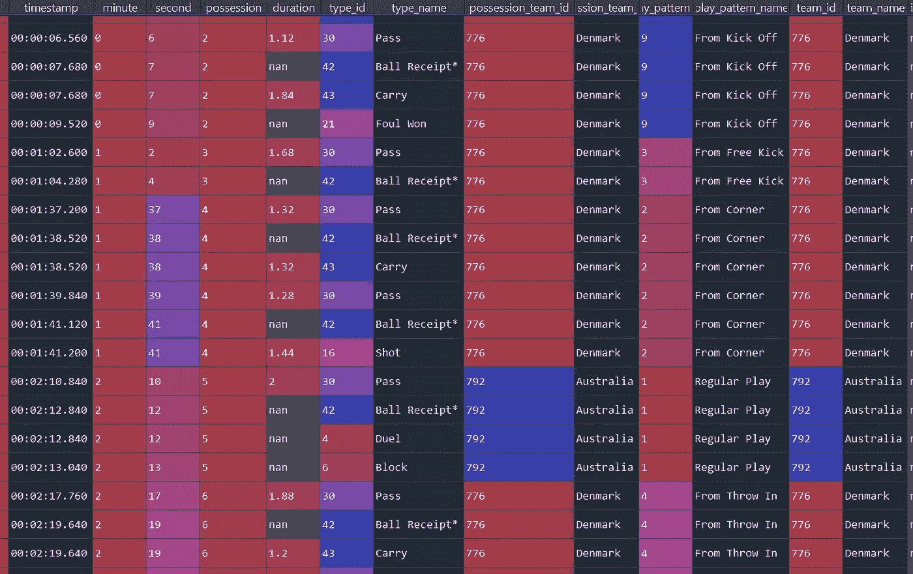
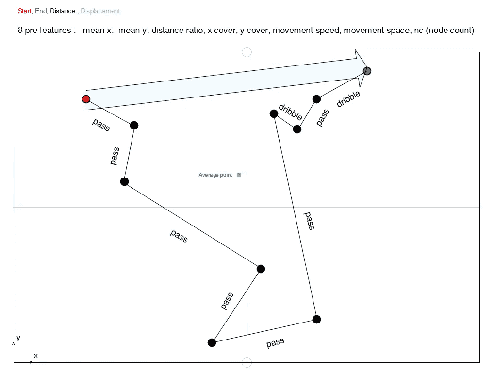
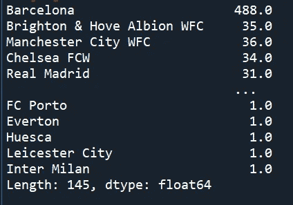
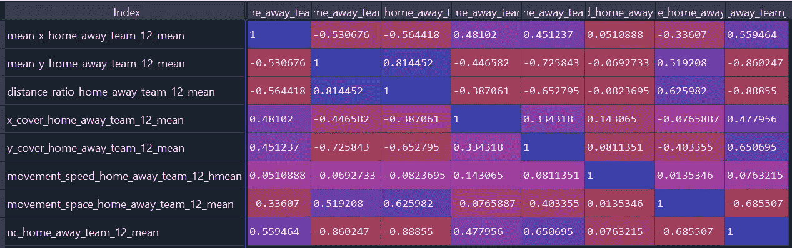
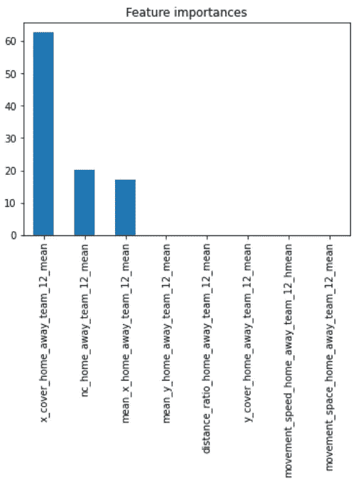
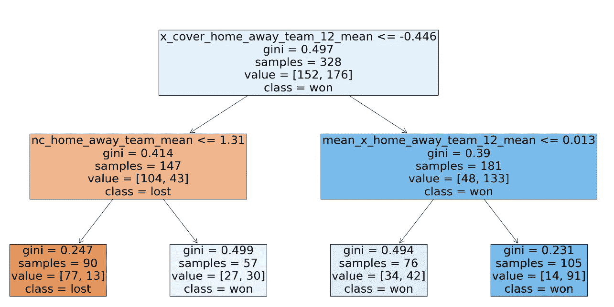

# 从 Statsbomb 的事件流数据看控球率对比赛获胜的影响

> 原文：<https://medium.com/analytics-vidhya/looking-into-some-of-on-ball-possession-natures-effects-on-match-winning-with-statsbombs-event-59d06d764c72?source=collection_archive---------21----------------------->

在这次探索中，我使用的是 Stasbomb 的*事件流数据*，它跟踪只与球直接相关的动作**，这不同于跟踪无球队员位置等其他动作的*跟踪数据*。**

数据结构由一个 **competitions.json** 列表竞赛名称(例如 Laliga)和季节名称(例如 2016/2017)，它将我们链接到列出该比赛和赛季的比赛的**比赛 json** ，将我们链接到每场比赛的**阵容 json** 和**赛事 json** 。

每个匹配的事件流数据收集动作名称(例如传球，运球，接球，..)，动作开始和结束位置为 x y 坐标，当前队在控球，谁的动作，半场时间，时间戳

事件 jsons 之一的数据帧的一些列

通过一些 for 循环，我提取了 890 个事件 jsons 中的每一个，并将它们编译成具有 7 个特征和 1 个目标值的数据帧。win)进行预测和其他一些功能。

这 8 个特征是

1.  '均值 _x_home_away_team_12_mean '

:主队在一场比赛中所有控球时间减去客队控球时间的平均值(x/球场长度)

> **球队控球率的差距**

2.' mean_y_home_away_team_12_mean '

:主队在一场比赛中所有控球率的平均值[(y-球场宽度/2 )/(球场宽度/2)]减去客队的控球率

> **球队控球距离边线的差距**

3.'距离 _ 比率 _ 主场 _ 客场 _ 团队 _ 12 _ 平均'

:主队在一场比赛中所有控球的平均位移/距离减去客队的位移/距离

> **球队控球直接性的差异**

4.' x_cover_home_away_team_12_mean '

:主队所有控球时间的起点和终点 x 坐标差减去客队控球时间的平均值

> **球队运球方式的不同**

**5。y _ cover _ home _ away _ team _ 12 _ mean '**

:主队所有控球时间的起点和终点 y 坐标差的绝对值减去客队控球时间的平均值

> **球队带球穿越场地的方式不同**

6.'运动 _ 速度 _ 主场 _ 客场 _ 团队 _12 场 _hmean '

:主队所有控球时间的距离/持续时间的调和平均值减去客队的

> **球运动速度的差异**

7.'运动 _ 空间 _ 主场 _ 客场 _ 团队 _ 12 _ 均值'

:主队所有控球的平均距离/动作数减去客队的距离/动作数

> **控球动作稀疏程度的差异**

8.' nc_home_away_team_12_mean '

:主队所有控球的平均动作数减去客队的动作数

> **控球次数的差异(巴塞罗那的一些比赛中控球次数非常多)**

所以每个参数都试图解释每个附体的形状

> **给出更清晰的解释**
> 
> 这是一个占有的例子

> 如您所见，该数据也具有接近 0.5 的较低平均值 X，平均值 y 约为 0 至 0.5，移动速度取决于总持续时间，移动空间约为 10 米，假设该数据中的场为 120 米 X 80 米，节点计数为 10(查看节点)。
> 
> 然后我们找出平均值，然后找出主队和客场队的差异，并如上所述进行编译。

这里的重点是看到这些特征对比赛胜利的影响，因此我们忽略了比赛结果受主队或客场队影响的事实。此外，这里收集的一些比赛没有像 FIFA 世界杯比赛那样真正的主客场球队。

我们删除了“结果”为“绘制”的行。

然后我们发现了一个主要的问题，这个问题来自于数据来源的偏差，在总共 879 场比赛中，有 488 场和巴塞罗那有关。

我选择删除所有的巴塞罗那比赛；然而，绝对有更好的出路。

现在我们还剩 390 根火柴。

然后，我们删除了“结果”为“绘制”的行。现在还剩 328 根火柴。

然后我们检查我们的目标有多不平衡。

我们总共得到了 390 行，其中有 176 个 wons 和 152 个 losts。挺平衡的。

我们将数据分为 X 和 Y，并将 Y 编码为(0 表示“输”，1 表示“赢”)。

为了可解释性，我们使用逻辑回归和决策树来解决这个二元分类问题。

***逻辑回归***

首先用相关矩阵检查多重共线性假设

看到‘mean _ y _ home _ away _ team _ 12 _ mean’和‘distance _ ratio _ home _ away _ team _ 12 _ mean’是问题所在，我们把它们去掉。

> 过程

首次使用的管道包括 MinMaxScaler 和带 GridSearchCV 的逻辑回归，用于调整最大 F1 分数的超参数。

*我们使用 F1 成绩，因为数据有点不平衡*

这是结果

F1 得分:0.767719

最佳超参数:{'C': 1，' penalty': 'l2 '，' solver': 'lbfgs'}

系数:

[ 2.19420349，3.17594568，0.10340008，-1.52067565，0.2217352，
2.50146193]

指数系数:

[ 8.9728512，23.94945769，1.10893499，0.21856416，1.2482408，
12.20031694]

> 解释

指数系数告诉我们得到正结果的几率，在这种情况下是 1 或获胜。

*你赢的几率等于 2:1 意味着你有 2/2+1 = 0.67 的机会赢*

获胜的积极因素:

我们可以看到，如果**团队如何将球向前移动的比例差异**增加 1 个单位(我们的数据从(-17，15)缩放到(-1，1)的范围，因此 1 个单位大约是 0.0625 米)，我们可以说获胜的几率增加了 23.95。

如果**在 a 占有**中涉及的多少次行动之间的比例差异增加 1 个单位(我们的数据从(-35 次行动，34 次行动)缩放到(-1，1)的范围，所以 1 个单位大约是 0.03 次行动)，我们可以说获胜的几率增加了 12.20

如果**球队控球率的比例差异**增加 1 个单位(我们的数据从(-0.25 球场长度，0.31 球场长度)扩大到(-1，1)的范围，所以 1 个单位大约是 3.57 球场长度)，我们可以说获胜的几率增加了 8.97

***决策树***

> 过程

第一次使用的管道包括 MinMaxScaler 和带有 [Optuna](https://optuna.org/) 的逻辑回归，用于调整最大 F1 分数的超参数。

这是结果

F1 分数:0.749921

最佳超参数:

{ 'criterion': 'gini '，' max_depth': 2，' min_samples_leaf': 34，【T13]' min _ samples _ split ':16 }

功能重要性:

树:

*如果节点中的条件为真，则沿着左边的路径。*

> 一、解释

查看根节点，我们可以看到，如果**团队如何将球向前移动的差异**低于-0.446 米，则团队很可能会输掉 70.7%的比赛，或者只查看树左侧的橙色。

而如果**球队如何将球向前推进的差距**大于 0.446 米，球队获胜的可能性为 73.5%

看左边，有一个例外，当**在 a 占有**所涉及的多少个动作之间的差大于 1.31 个动作时，它有均等的机会赢或输。

看根节点的右侧，有一个例外，当**球队控球高度的差异**小于 0.013 个节距长度时，这是一个几乎均等的输赢机会。

# 结论

老实说，这些解释对我们来说已经很直观了

**1。在很多情况下，在比赛中轻松控球似乎是更好的球队，所以这可能与球队的能力或其他我们没有在功能中收集的变量有关。**

**2。你需要把球向前推才能进球，所以向前推更多的球和获胜的机会是高度相关的。**

**3。比赛场地高得多的球队可能会赢，尽管也有例外，比如被反击击中。**

*警告:*

1.  *这些解释是基于收集到的特征的平均值，所以它们在实际比赛中如何相互作用是另一个故事。*
2.  *不要把相关性理解为因果关系。*