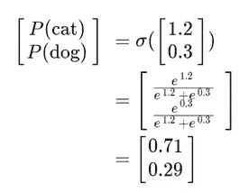
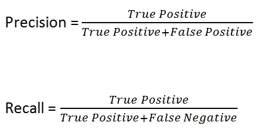
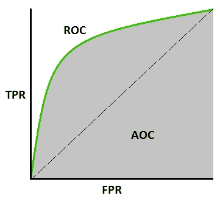

# 想开始一个 ML 模型构建项目吗？这个一站式指南是你所需要的！(包括代码)

> 原文：<https://medium.com/analytics-vidhya/looking-to-start-a-ml-model-building-project-23b08444d8b3?source=collection_archive---------13----------------------->

## 为数据科学领域的任何人理解重要的 ML 算法以及模型构建和实际使用案例的足智多谋和简洁的指南。

> 本文将重点理解四种广泛使用的 ML 算法，以及它们的性能指标和超参数调整，这是模型构建的一个组成部分。这个想法是用简化的例子和简洁的描述使这个学习过程变得清晰。但是，假设你对机器学习中使用的术语有基本的了解。
> 
> 这篇文章可能看起来比平时长了一点，但是请耐心听我说，我已经尝试广泛地涵盖每个主题，所以它绝对值得一读。欢迎随时加入，关于我如何改进我的内容的任何建议和评论。

# **机器学习算法:**

## 1.随机森林和决策树

我们通常会听到很多关于决策树(DT)和随机森林(RF)的说法。简单来说，决策树是随机森林的子集。您可以将它们称为“***”***，这意味着 DT 从以行和列的形式提供给它的数据子集中学习，并转换成 RF。

RF 通常由一系列 ***行采样(行)+特征采样(列)*** 组成，这些采样被提供给每个 DT 用于训练目的。

[](https://www.analyticsvidhya.com/blog/2020/05/decision-tree-vs-random-forest-algorithm/)

用于数据分类的 3 个 DT 的多数票

现在，当测试数据被提供给它进行测试时， ***各种 DT 的多数投票被检查并被分类*** 为输出属于哪一类。

关于 DT 的一个重要事实是，它们中的每一个都具有 ***低偏差和*** 高方差。这意味着，当我们创建 DT 到其完整深度时，由于使用的树的数量，它给我们一个最小的训练误差(即低偏差)。在高方差的情况下，当引入一个测试数据时，容易给出更多的误差。

*但是现在当你把这些 DT 组合在一起的时候* ***高方差>低方差*** *由于多数票是从多个 DT 中考虑的。*

> 综上所述，您认为数据的任何变化/减少都会影响 RF 模型的准确性吗？

肯定不会，因为由于训练发生在如此多的 DT 上，RF 模型变成了理解记录细微差别的专家，因此给出了非常低的准确度方差误差 wrt。

## 2.神经网络

如果你完全是 ML 的新手，这个主题是巨大的，有点复杂，但是当你深入研究它的时候会非常有趣。很可能，我和大多数数据科学家最喜欢的建模算法仅仅是因为它的多样性。我将在这里链接一篇文章[，这篇文章极大地帮助了我深入理解这个话题。](https://towardsdatascience.com/neural-networks-for-beginners-by-beginners-6bfc002e13a2)

在这里，我的目标是为您简化这个过程，以便明确关键概念。

我们经常听说**人工神经网络(安的)**是人脑的复制品。就像人脑有神经元一样，人工神经网络也由神经元组成，这显然是人工的。它包含三个明显的特征:

1.输入(例如:图像、文本、视频、音频)

2.隐藏层(用于映射目的)

3.输出(对数据进行分类)

当一个输入被提供给网络的节点时，它们被乘以一个权重函数' *w'* ，该权重函数用于训练输入并从提供给它的数据中学习。

神经网络中的 ***激活函数(AF)*** 取输入*‘x’*乘以权重*‘w’*。偏置允许您通过在输入中添加一个常数(即给定的偏置)来改变激活函数。神经网络中的偏差与线性函数中常数的作用是同义的。

现在激活函数基本上就是在 **0 和 1 *之间转换 O/P 数据的函数。***

[](https://deepai.org/machine-learning-glossary-and-terms/weight-artificial-neural-network)

所有神经网络的基本方程

*例如:当你把一个热的物体放在你的手掌上时，大脑中的神经元被激活，并向你的大脑发送信号，之后你对刺激做出反应。*

激活函数通过计算加权和并进一步加上偏差来决定是否激活一个神经元。激活函数的目的是将非线性(学习和执行复杂任务的能力)引入神经元的输出。

现在，有三个主要的房颤应该被认识到。

[](https://medium.com/@kanchansarkar/relu-not-a-differentiable-function-why-used-in-gradient-based-optimization-7fef3a4cecec)

**我*。整流线性单元*** :为输入(+ve)提供正值，否则为 0。基本上，它消除了所有的负面影响，也解决了消失梯度(VG)的问题。

*如果你对 VG 不熟悉，那么我在这里* *附上一个链接* [*。*](https://towardsdatascience.com/the-vanishing-gradient-problem-69bf08b15484)

[](https://medium.com/@gabriel.mayers/sigmoid-function-explained-in-less-than-5-minutes-ca156eb3049a)

Sigmoid 函数和公式

**二**。 ***Sigmoid*** :它是深度学习中最常用的 AF 之一，通常用于二进制分类，因为输出值绑定在 0-1 之间，这使每个神经元的输出标准化。

Sigmoid 的一些缺点包括，在梯度下降的情况下，它们容易出现 VG 问题&函数输出不是以零为中心的(即，更多的计算时间，这意味着更多的时间达到全局最小值)。 ***其中 x: wx+b(输入)***

[](https://developer.apple.com/documentation/accelerate/bnns/activationfunction/softmax)

SoftMax 函数

[](https://deepai.org/machine-learning-glossary-and-terms/softmax-layer)

分类示例

**三世*。SoftMax*** :当你的输出层有两个以上的类别(多类别分类)时，使用 SoftMax 功能。它基本上给出了每个类的概率列表，这样，无论哪个概率最高，都将成为 o/p 类。

SoftMax 和 Sigmoid AF 都用于神经网络的最后一层。

***在这种情况下，输出属于猫类，因为概率为 0.71。***

## **权重初始化技术**

权重只负责学习和归纳与给予神经元的各种输入特征不同的东西，以进一步执行复杂的任务。因此，在为神经网络选择权重时，有各种各样的特征。

*砝码尺寸应较小。(如果太小，可能会出现 VG 问题。)*

*权重不应相同*

*他们应该有一个好的方差*。

***~ Xavier/Glorot:Xavier-Normal 或 Xavier-Uniform，*** 配合 Sigmoid 或 SoftMax AF 效果最佳。

***~均匀分布:*** 与乙状结肠 AF 配合良好。

***~ He 初始化:He-Uniform 或 He-Normal*** 通常与 Relu AF 一起使用，以获得所需的结果。

## 优化者

这个主题本身就是一篇文章，如果我说我会涵盖你需要知道的关于优化器的一切，这是不公平的，但显然不是。

首先，需要优化器来减少在输出端获得的损失函数。当使用反向传播更新权重时，会计算新的权重，因此在特定时期后损失会减少。

[](https://towardsai.net/p/machine-learning/improving-artificial-neural-network-with-regularization-and-optimization)

权重更新公式

*其中 n =学习率，E=均方误差。*

[](https://towardsdatascience.com/machine-learning-for-beginners-an-introduction-to-neural-networks-d49f22d238f9)

如果你想知道这些术语的实际含义，我会在这里链接一篇解释这些术语的文章[](https://towardsdatascience.com/gradient-descent-explained-9b953fc0d2c)**，所以不用担心。**

*我们将讨论每个 ML 工程师应该辨别的 3 个最重要的优化器，即—*

## *a.梯度下降算法:*

*正如我前面提到的，这个过程从正向传播开始，包括使用激活函数计算预测值，从而计算误差。反向传播是一种通过使用上述公式更新权重来减少损失/误差的算法。*

**是计算导数的过程，梯度下降是通过梯度下降的过程，即通过损失函数调整模型的参数向下。**

*[](https://wiki.tum.de/display/lfdv/Adaptive+Learning+Rate+Method)

权重试图达到 GD 中的局部最小值* *[](https://datascience.stackexchange.com/questions/44703/how-does-gradient-descent-and-backpropagation-work-together)

正向和反向传播传播* 

**在 GD 中需要记住的一个事实是，整个数据集都经过了前向和后向传播处理(即经过了“x”个历元)*。因此，在经过一定数量的时期后，损失函数减小。*

## *b.随机梯度下降；*

*这个优化器的工作方式与 GD 完全相同，只是有一点小小的不同，那就是传递的记录数量。这里，前后传播一次只传递一条记录来更新权重参数**。***

*例如:如果你有 10，000 条记录，时段 1 将有 10，000 次前后传播迭代。*

*这意味着需要更多的计算时间来达到全局最小值(收敛点)。*

*[](https://xzz201920.medium.com/gradient-descent-stochastic-vs-mini-batch-vs-batch-vs-adagrad-vs-rmsprop-vs-adam-3aa652318b0d)

噪声存在时到达收敛点的路径。* 

*为了解决这个问题，推出了小批量 SGD 。*

*这仅意味着数据以**小批量**传递，以便更快地到达汇聚点，但由于存在噪音，到达汇聚点的路线可能不太顺畅。(因为取批量)。尽管 Mini SGD 已经被证明使用较少的资源并且在计算上是最便宜的。*

## *c.Adam 优化器:*

*迄今为止最有效的发明之一，ADAM 是自适应矩估计的首字母缩写。结合使用两个优化器，即动量和均方根道具。*

****动量>用于平滑到汇聚点的路线。****

****RMS Prop >平滑高效地改变学习率。****

*结合 RMS Prop 和动量平滑的优点，形成了 Adam 优化器。*

*还有一些其他的优化器，比如 SGD with Momentum，Adagrad，Adadelta 和 RMS Prop，我在这里没有介绍，但是如果你想深入阅读，我会放一个链接。*

*[](https://towardsdatascience.com/optimizers-for-training-neural-network-59450d71caf6) [## 训练神经网络的各种优化算法

### 正确的优化算法可以成倍地减少训练时间。

towardsdatascience.com](https://towardsdatascience.com/optimizers-for-training-neural-network-59450d71caf6) 

## 3.k-最近邻(KNN 分类)

这是一种监督学习算法，主要基于 K 值。*(注意:K 值为奇数时效果最佳，因为如果取偶数，则两边的类别数量相等)。*


作者图片:KNN K = 3 分类

无论哪一个类别在该附近具有最大数量的邻居，数据点都属于通过称为 [***欧几里得***](/@kunal_gohrani/different-types-of-distance-metrics-used-in-machine-learning-e9928c5e26c7) ***或曼哈顿*** 距离的度量来计算的那个类别。

在回归用例中，取所有最近邻的平均值来给数据点赋值。(*适用于大多数算法*)

KNN 的主要缺点包括离群值的存在，这可能会极大地影响分类用例。不平衡的数据集也可能对您的数据集构成威胁，但可以使用采样技术来应对。

## *4。K-均值聚类*

该算法用于无监督的机器学习问题，以利用数据点之间的相似性形成聚类。“K”值或质心取决于所形成的簇。(如果 k=2，即 2 个质心/簇)

*   *随机初始化质心，并使用欧几里德/曼哈顿距离计算数据点之间的距离。*
*   *形成一组数据点，并计算各组的平均值。*
*   *基于平均值，数据点被移动到质心。*
*   *同样，该过程继续进行，直到数据点中没有移动，并且形成固定的组/簇。这意味着您有两个不同的集群/组。*


作者图片

> 如果你想知道 K=2 的值是如何出现在图片中的，这里是它是如何出现的..

> K 值是用这种叫做**‘肘法’**(字面意思)的方法测量的


作者提供的图片:WCSS 计算方法和肘形曲线的图示

*   *假设从 K=1 到 20 运行一个循环，同时执行 K 均值聚类过程。*
*   随机初始化一个质心。
*   *现在，质心和所有数据点之间的距离是使用一个称为****‘聚类平方和内’或 WCSS*** *的度量来计算的。*
*   现在要知道的一个主要事实是，对于 K=1，WCSS 的值会非常非常高，因为只有一个质心。
*   随着 K 值的增加，WCSS 会减小。这会给你肘部曲线。

**从这里你可以推断出，K 的值是图表经历突然/突然减少的值。**

# 分类问题中的性能度量

> 在从事任何 ML 项目时，我们经常不断地听到这些度量术语。所以我宁愿向您展示实现代码，而不是解释每一个术语。然而，我在这里链接了一篇文章[，这篇文章会让你对这些术语有一个全面的了解。](/@MohammedS/performance-metrics-for-classification-problems-in-machine-learning-part-i-b085d432082b)

## 混淆矩阵:

[](https://towardsdatascience.com/understanding-confusion-matrix-a9ad42dcfd62)

混乱

它是一个 2 x 2 矩阵，由顶部的实际值和左侧的预测值组成。

它有 4 个符号或字段:

***真阳性、假阳性、假阴性、真阴性。***

在任何分类用例中应该减少的两类错误:

*   类型 1 错误:假阳性率(FPR) ***其中 FPR: FP/(FP+TN)***
*   第二类错误:假阴性率(FNR) ***其中 FNR: FN/(FN+TP)***

## 精确度:

平衡数据集的理想选择。原因如下..

[](https://medium.com/@erika.dauria/accuracy-recall-precision-80a5b6cbd28d)

在不平衡数据集(80-20 比率)的情况下，仅使用精度来验证模型会使花费在模型构建上的所有努力白费，因为它会误导模型性能，因此精度和召回是必需的。

## 精确度和召回率:

[](https://towardsdatascience.com/accuracy-precision-recall-or-f1-331fb37c5cb9)

**Precision** 表示，在做出的所有正面预测中，有多少比例被您的分类器正确预测。又称为 ***正预测值。***

著名的垃圾邮件检测用例是理解这一措施的最佳方式。

**回想一下**简单来说就是，实际正值中有多少百分比被您的分类器正确分类为正值。回忆也称为 ***真阳性率/灵敏度。***

以今天的情况为例，如果一名患者的 Covid 测试结果为阴性，但实际上他/她是 Covid 阳性。这是一个灾难性的想法，但却是理解回忆的一个很好的例子。

## F1 分数:

[](https://towardsdatascience.com/confusion-matrix-for-your-multi-class-machine-learning-model-ff9aa3bf7826)

在问题陈述中，需要精确和回忆的功能，使用 F1 分数。这就是精度和召回的'*调和平均值*。这种方法适用于不平衡的数据集。

F1 分数中的“1”来自于:


因为 FP 和 FN 在你的用例中都扮演着重要的角色。

在您的假阳性(第一类错误)比假阴性(第二类错误)影响更大的情况下，您的 beta 值在 0-1 之间减少(通常为 0.5)。

同样，如果假阴性起了更大的作用，β值会增加(在 2-10 之间)。

## ROC 曲线和 AUC 曲线:

这些曲线是模型的证明，反映了模型对提供给它的数据的表现。 **ROC 曲线** ( **接收器操作特性曲线**)是显示分类模型在所有分类阈值的性能的图表。该曲线绘制了两个参数:

*   真实阳性率
*   假阳性率

**AUC** 代表“**ROC 曲线下面积**”也就是说，AUC 测量从(0，0)到(1，1)的整个 ROC 曲线下的整个二维面积。

[](https://towardsdatascience.com/understanding-auc-roc-curve-68b2303cc9c)

ROC 和 AUC 曲线

AUC 应该至少直到中间的虚线，否则模型性能被认为是非常低的。

**AUC 越大，模型性能越好！！**

当访问 ROC 曲线时，通常需要更高的 TPR。因此，这取决于你选择什么样的阈值，以及模型实际需要什么样的 AUC。

# 超参数调谐

从我们对超参数的了解来看，它们是最佳参数数量的*字典*，往往最适合模型，目的是实现高模型精度和性能。

优化超级参数可以通过多种方式完成，但通常对我有用的是基于这两个从`sklearn.model_selection`导入的库，称为 [**网格搜索 CV** 或**随机搜索 CV**](/@senapati.dipak97/grid-search-vs-random-search-d34c92946318) 。虽然随机 CV 被证明是两者中更快的技术。

## I)随机森林:

该模型使用随机森林回归器，基于某些独立特征从 [*车辆数据集*](https://www.kaggle.com/nehalbirla/vehicle-dataset-from-cardekho) 中预测汽车销售价格，使用随机搜索 CV 选择超参数。

```
from sklearn.ensemble import **RandomForestRegressor**
regressor=RandomForestRegressor()n_estimators = [int(x) for x in np.linspace(start = 100, stop = 1200, num = 12)]
print(n_estimators)Output**:[100, 200, 300, 400, 500, 600, 700, 800, 900, 1000, 1100, 1200]**from sklearn.model_selection import **RandomizedSearchCV***# Number of trees in random forest*
n_estimators = [int(x) for x in np.linspace(start = 100, stop = 1200, num = 12)]
*# Number of features to consider at every split*
max_features = [‘auto’, ‘sqrt’]
*# Maximum number of levels in tree*
max_depth = [int(x) **for** x **in** np.linspace(5, 30, num = 6)]
*# max_depth.append(None)*
*# Minimum number of samples required to split a node*
min_samples_split = [2, 5, 10, 15, 100]
*# Minimum number of samples required at each leaf node*
min_samples_leaf = [1, 2, 5, 10]
```

在下面的代码中，`random_grid`被用作所有超参数组合的框架，之后，通过运行`best_params_.`来决定最终的参数列表

```
*# Create the random grid*
random_grid = {'n_estimators': n_estimators,
               'max_features': max_features,
               'max_depth': max_depth,
               'min_samples_split': min_samples_split,
               'min_samples_leaf': min_samples_leaf}
print(random_grid)Output: **{'n_estimators': [100, 200, 300, 400, 500, 600, 700, 800, 900, 1000, 1100, 1200], 'max_features': ['auto', 'sqrt'], 'max_depth': [5, 10, 15, 20, 25, 30], 'min_samples_split': [2, 5, 10, 15, 100], 'min_samples_leaf': [1, 2, 5, 10]}**
```

`scoring` : ' *负均方误差*'和'*平均绝对误差*'在回归用例验证模型的情况下用作性能度量。

`cv=5`:交叉验证分割比率

`verbose=2`:提供运行时间和代码运行时间的描述，同时生成程序代码的所有细节。

`random_state=42`:用于多次运行一个代码时检查和验证数据。将`random_state`设置为固定值将保证每次运行代码时生成相同的随机数序列。除非在这个过程中存在一些其他的随机性，否则产生的结果总是一样的。这有助于验证输出。

`n_jobs`:这是你的机器中为了实现你的代码而必须运行的所有 CPU 核心的指示。

此外，`rf_random`网格适合于训练数据( *X_train* ， *y_train* )，以便他们从中学习和概括，然后`predictions` ( *y_pred* )发生在 *X_test* 数据上，然后这些数据对照诸如准确性、以( *y_pred，y_test* 形式的分类报告等性能度量进行测试。

```
*# Use the random grid to search for best hyperparameters*
*# First create the base model to tune*
rf = RandomForestRegressor()*# Random search of parameters, using 3 fold cross validation,* 
*# search across 100 different combinations*
rf_random = RandomizedSearchCV(estimator = rf, param_distributions = random_grid,scoring='neg_mean_squared_error', n_iter = 10, cv = 5, verbose=2, random_state=42, n_jobs = 1)rf_random.fit(X_train,y_train)Output**: RandomizedSearchCV(cv=5, estimator=RandomForestRegressor(), n_jobs=1 param_distributions={'max_depth': [5, 10, 15, 20, 25, 30], 'max_features': ['auto', 'sqrt'], 'min_samples_leaf': [1, 2, 5, 10],
'min_samples_split': [2, 5, 10, 15,100],'n_estimators': [100, 200, 300, 400,500, 600, 700, 800,900, 1000, 1100,1200]}, random_state=42, scoring='neg_mean_squared_error',verbose=2)**rf_random.best_params_**{'n_estimators': 1000,
 'min_samples_split': 2,
 'min_samples_leaf': 1,
 'max_features': 'sqrt',
 'max_depth': 25}**rf_random.best_score_**-3.983773356232129**predictions=rf_random.predict(X_test)**#Performance Metrics for Regression Use case**from sklearn import metrics
print('MAE:', metrics.mean_absolute_error(y_test, predictions))
print('MSE:', metrics.mean_squared_error(y_test, predictions))
print('RMSE:', np.sqrt(metrics.mean_squared_error(y_test, predictions)))Output:**MAE: 0.8849978021977988
MSE: 3.9544237722813156
RMSE: 1.9885733007061408****#Performance Metrics for Classification Use Case**from sklearn.ensemble import RandomForestClassifier
rf = RandomForestClassifier(n_estimators=500, random_state=101)
rf.fit(X_train,y_train)
y_pred= rf.predict(X_test)
print(accuracy_score(y_test,y_pred))
print(confusion_matrix(y_test,y_pred))
print(classification_report(y_test,y_pred))**Output: 
0.9506974337261543
[[  251   786    10]
 [  271 39763   266]
 [   10   753   403]]
              precision    recall  f1-score   support** **1 - High       0.47      0.24      0.32      1047
  2 - Medium       0.96      0.99      0.97     40300
     3 - Low       0.59      0.35      0.44      1166** **accuracy                           0.95     42513
   macro avg       0.68      0.52      0.58     42513
weighted avg       0.94      0.95      0.94     42513**
```

## ii)神经网络:

在这段代码中，我对一个 [*客户流失建模*](https://www.kaggle.com/shrutimechlearn/churn-modelling?select=Churn_Modelling.csv) 数据集使用了一个序列模型，该数据集预测了未来可能离开银行的客户。该模型使用一个`enumerate`函数，该函数在 3 个隐藏的`layers`和两个激活函数`sigmoid`和`relu.`之间计数。`param_grid`就像是一个你想要包含的所有参数的框架，用来描述你的模型，并且通常在*键:值*对中给出。

该模型运行 30 个时期，最后 GridSearch CV 的`'best_score_'`和`'best_params_'`为我们提供了优化模型的参数。最后，计算混淆矩阵和准确度分数等性能度量来验证模型。

```
#Importing necessary libraries
from keras.wrappers.scikit_learn import KerasClassifer
from sklearn,model_selection import GridSearchCV
from keras.models import Sequentialfrom keras.layers import Dense, Activation,Dropout
from keras.activations import relu, sigmoid#Creating a Neural Model
def create_model(layers, activation): 
model = Sequential()    
for i, nodes in enumerate(layers):      
 if i==0:            model.add(Dense(nodes,input_dim=X_train.shape[1])) #1st input layer 
model.add(Activation(activation))          
model.add(Dropout(0.3)) #Specifying the ratio of how many neurons to be dropped out to avoid overfitting     
 else:           
model.add(Dense(nodes))           
model.add(Activation(activation))            
model.add(Dropout(0.3))               
 model.add(Dense(units = 1, kernel_initializer= 'glorot_uniform', activation = 'sigmoid'))# Note: no activation beyond this point model.compile(optimizer='adam', loss='binary_crossentropy',metrics=['accuracy'])

return modelmodel = KerasClassifier(build_fn=create_model, verbose=0) layers = [[20], [40, 20], [45, 30, 15]]
activations = ['sigmoid', 'relu']
param_grid = dict(layers=layers, activation=activations, batch_size = [128, 256], epochs=[30])grid = GridSearchCV(estimator=model, param_grid=param_grid,cv=5)
grid_result = grid.fit(X_train, y_train)[grid_result.best_score_,grid_result.best_params_]**[0.8387499995157123]** **{'activation': 'relu',
  'batch_size': 256,
  'epochs': 30,
  'layers': [45, 30, 15]}**pred_y = grid.predict(X_test) #Performance Metric Calculation
from sklearn.metrics import confusion_matrix
cm = confusion_matrix(y_test, y_pred)**array([[1595,    0],
       [ 405,    0]], dtype=int64)**from sklearn.metrics import accuracy_score
score=accuracy_score(y_test,y_pred)**0.7975**
```

## iii) K-最近邻:

该模型使用事件影响预测问题陈述将影响分为 3 类。“k”的最佳值是通过使用调谐从 2–50 以 3 的步长运行一个循环找到的。导入 KNN 分类器`from sklearn.neighbors import KNeighborsClassifier as KNC`后，对 k=3 进行分类，并基于该邻域中最近邻类别的最大值进行分类。

从下面的代码可以看出，`training accuracy: 0.975 and test accuracy: 0.96667`是用最优值`'k' as 9`实现的。

```
#Classification for 3 neighbors
knn = KNC(n_neighbors= 3)
knn.fit(predictor, y_train.values.ravel())
y_train_pred= knn.predict(predictor)
knn.score(predictor, y_train) # 89.4%
print(confusion_matrix(y_train, y_train_pred))
print(classification_report(y_train, y_train_pred)) # accuracy = 89%# fit test data
y_test_pred = knn.predict(pred_test)
print(confusion_matrix(y_test, y_test_pred)) 
print(classification_report(y_test, y_test_pred))  # accuracy = 79%# getting optimal "k" value
a= []
for i in range (2,50,3):
    knn = KNC(n_neighbors=i)
    knn.fit(predictor, y_train.values.ravel())
    train_acc = knn.score(predictor, y_train)
    test_acc = knn.score(pred_test, y_test)
    a.append([train_acc,test_acc])
```

输出:

```
[[105923     80     72]
 [  2299  83959   2577]
 [    72    109 105485]]
              precision    recall  f1-score   support

           0       0.98      1.00      0.99    106075
           1       1.00      0.95      0.97     88835
           2       0.98      1.00      0.99    105666

    accuracy                           0.98    300576
   macro avg       0.98      0.98      0.98    300576
weighted avg       0.98      0.98      0.98    300576[[26367    42    31]
 [ 1077 20078  1061]
 [   27    49 26412]]
              precision    recall  f1-score   support

           0       0.96      1.00      0.98     26440
           1       1.00      0.90      0.95     22216
           2       0.96      1.00      0.98     26488

    accuracy                           0.97     75144
   macro avg       0.97      0.97      0.97     75144
weighted avg       0.97      0.97      0.97     75144
``` 

*谢谢你看到这篇文章的结尾。这是我作为一名刚毕业的工科学生的第一篇文章，来自我在从事学术/实践项目时所掌握的一点点知识。我将很快发表这篇文章的第 2 部分，关于 Flask 上模型的部署。所以，敬请关注！！如果对这篇文章有任何疑问，请告诉我。*

*联系我:rushanbhag@gmail.com。*